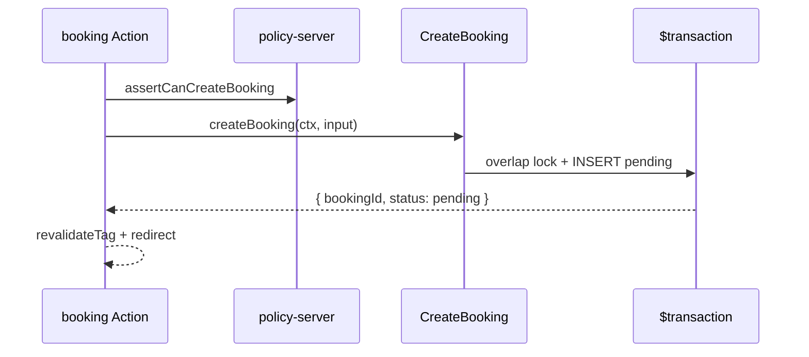

# 02 — Booking Lifecycle: слои и поток данных

**Тип:** Guide  
**Статус:** Canonical  
**Версия:** 1.0  
**Дата:** 2026-05-23  
**Волна:** W13  
**Зависит от:** [`booking_lifecycle_contract.md`](../implementation/mvp/contracts/booking_lifecycle_contract.md), [`data_access_patterns.md`](../prds/03_data_model/data_access_patterns.md), [`schedule_slots_contract.md`](../implementation/mvp/contracts/schedule_slots_contract.md)  
**Связанные документы:** [`01_architecture_overview.md`](./01_architecture_overview.md), [`monorepo_boundaries_contract.md`](../implementation/mvp/contracts/monorepo_boundaries_contract.md)

---

## Purpose

Пошаговый **learning pack** для AI-агентов и разработчиков: как мутации booking (`CreateBooking`, `ConfirmBooking`, `CompleteBooking`, `CancelBooking`) проходят через слои monorepo Pulse — от Server Action до Neon. Детали контракта, FM и SQL — в [`booking_lifecycle_contract.md`](../implementation/mvp/contracts/booking_lifecycle_contract.md); здесь только **карта слоёв** и типовые touchpoints.

**Runtime (Context7, Next.js 16.2):** Server Actions — `'use server'`; `cookies()` / `headers()` — **async**; cache invalidation — `revalidateTag('…', 'max')` после успешной мутации.

---

## Scope / Out of scope

**In scope:** слои для booking mutations MVP; read path wizard (slots); policy gates; transaction boundary; cache tags.

**Out of scope:** UI wizard steps (→ [`booking_wizard_spec.md`](../implementation/mvp/specs/booking_wizard_spec.md)); Stripe/Daily.co; email E-06 (post-MVP); полный overlap SQL (→ [`schedule_slots_contract.md`](../implementation/mvp/contracts/schedule_slots_contract.md)).

---

## Definitions

| Layer | Package / path | Booking responsibility |
|-------|----------------|------------------------|
| **UI adapter** | `apps/web` | Server Actions, `useActionState`, toast, redirect |
| **Route gate** | `apps/web/src/proxy.ts` | JWT role only — **без DB** |
| **Policy** | `@pulse/policy-server` | `assertCanCreateBooking`, ownership, role |
| **Domain** | `@pulse/domain` | State machine, validation, `MutationResult` |
| **Data** | `@pulse/db` | Prisma `$transaction`, overlap SELECT, audit |

Enum `BookingStatus`: `pending` → `confirmed` → `completed` | `cancelled` — [`lifecycle_models.md`](../prds/02_domain_model/lifecycle_models.md).

---

## Layer stack (reference)

```mermaid
flowchart TB
  subgraph apps_web["apps/web"]
    SA[Server Action]
    Auth[auth → PolicySessionContext]
  end
  subgraph packages["packages"]
    Pol[@pulse/policy-server]
    Dom[@pulse/domain]
    Db[@pulse/db]
  end
  Neon[(Neon PostgreSQL)]

  SA --> Auth
  SA --> Pol
  Pol --> Dom
  Dom --> Db
  Db --> Neon
  SA -.->|revalidateTag| Cache[Next.js cache]
```

**MUST NOT:** `proxy.ts` → `policy-server`; domain → Prisma; business rules в `apps/web`.

---

## Happy path — CreateBooking

**Actor:** client после выбора слота в wizard.  
**Preconditions:** trainer `approved`; service active; slot свободен.

| Step | Layer | What happens |
|------|-------|--------------|
| 1 | `proxy.ts` | Session JWT; role `client`; path `/book/*` allowed |
| 2 | Server Action | Parse FormData → `CreateBookingInput`; `await auth()` |
| 3 | `apps/web` mapper | `Session` → `PolicySessionContext` |
| 4 | `policy-server` | `assertCanCreateBooking(ctx, input)` — role client, not self-book |
| 5 | `@pulse/domain` | `createBooking(ctx, input)` — validate slot not past |
| 6 | `@pulse/db` | `$transaction`: verify trainer approved → overlap `FOR UPDATE` → INSERT `pending` + service snapshot → `audit_log` |
| 7 | `apps/web` | `revalidateTag('bookings:…', 'max')`; `toast.success`; redirect `/client/bookings/[id]` |

**Postconditions:** `status = pending` (ADR-005); price/duration snapshotted (INV-07).



---

## Happy path — ConfirmBooking (trainer)

| Step | Layer | What happens |
|------|-------|--------------|
| 1 | `proxy.ts` | Role `trainer`; path `/trainer/*` |
| 2 | Server Action | `bookingId` from trusted form hidden field |
| 3 | `policy-server` | `assertCanConfirmBooking` — booking belongs to trainer profile |
| 4 | `@pulse/domain` | `confirmBooking` — expect `status = pending` |
| 5 | `@pulse/db` | `updateMany({ where: { id, status: 'pending' } })` — count must be 1 |
| 6 | `apps/web` | Toast on same page; revalidate client + trainer booking lists |

**Post-MVP hook (P06):** after commit, enqueue E-03 — **не** в request path; см. [`04_email_jobs_layers.md`](./04_email_jobs_layers.md).

---

## Happy path — CompleteBooking / CancelBooking

**CompleteBooking (trainer):** policy `assertCanCompleteBooking` → domain expects `confirmed` → set `completed_at`, `completed_by_id`.

**CancelBooking (client/trainer/admin):** policy checks actor + 24h window for client (INV-08, FM-002); admin bypasses window; conditional update on current status.

---

## Read path — slots before create

Wizard **read** не проходит domain mutation, но тот же layering:

| Step | Layer | What happens |
|------|-------|--------------|
| 1 | RSC / loader | `GenerateAvailableSlots(trainerId, range)` |
| 2 | `@pulse/domain` | Slot math from weekly intervals + exceptions + existing bookings |
| 3 | `@pulse/db` | Bundle read: profile `timezone`, intervals, exceptions, non-cancelled bookings — см. [`data_access_patterns.md`](../prds/03_data_model/data_access_patterns.md) §Schedule |
| 4 | UI | `SlotDto[]` with `startsAtUtc` — client posts ISO back to Action |

**Invariant:** `TrainerProfile.timezone` — единственный IANA для генерации (ADR-004, INV-01).

---

## Suggested module map (P03)

| Concern | Suggested path |
|---------|----------------|
| Server Action | `apps/web/src/app/book/[trainerId]/actions/create-booking.ts` |
| Policy asserts | `packages/policy/server/src/booking/assert-can-create-booking.ts` |
| Use-case | `packages/domain/src/booking/create-booking.ts` |
| Repository | `packages/db/src/booking/create-booking-transaction.ts` |
| Overlap helper | `packages/db/src/booking/overlap-query.ts` |
| Messages | `apps/web/src/lib/messages/booking.ts` |

Имена indicative; **MUST** соблюдать границы [`monorepo_boundaries_contract.md`](../implementation/mvp/contracts/monorepo_boundaries_contract.md).

---

## Negative paths (by layer)

| Failure | First layer to reject | Code / FM |
|---------|----------------------|-----------|
| Guest creates booking | `proxy.ts` or Action (no session) | redirect login |
| Trainer creates as client on own profile | `policy-server` | FM-005 |
| Unapproved trainer | `domain` / transaction precheck | FM-003, `TRAINER_NOT_BOOKABLE` |
| Slot taken | `db` transaction | FM-001, `SLOT_UNAVAILABLE` |
| Client cancel &lt; 24h | `domain` | FM-002, `CANCELLATION_WINDOW_CLOSED` |
| Confirm stale booking | `db` count 0 | FM-015, `BOOKING_STATE_CONFLICT` |
| Tampered price in body | `domain` ignores; snapshot from DB | ADR-005 |

**UX:** map `messageKey` → `@/lib/messages`; `toast.error` on mutation failure — ui-toast-mutations.

---

## Security paths

| Threat | Layer | MUST |
|--------|-------|------|
| IDOR read `/client/bookings/[id]` | `policy-server` before repo | FM-004 — deny or 404 |
| Confirm another trainer's booking | `assertCanConfirmBooking` | ownership by `trainerProfileId` |
| Client confirms booking | `policy-server` | role deny |
| Price tampering | `domain` | snapshot from `trainer_service` row |
| Direct Prisma in Action | lint / review | forbidden — PKG-01 |

`proxy.ts` — **только** JWT role/path; object ACL — **policy-server** (Context7 auth guide: DB checks at data layer, not in proxy).

---

## Concurrency & idempotency

| Scenario | Layer | Resolution |
|----------|-------|------------|
| Two clients, same slot | `db` transaction | FM-001 — overlap + serializable/isolation |
| Confirm vs cancel race | `db` conditional `updateMany` | FM-015 — loser gets conflict |
| Double-submit wizard | `apps/web` UI | `disabled` + `aria-busy` — not idempotent create |

Детали SQL — [`schedule_slots_contract.md`](../implementation/mvp/contracts/schedule_slots_contract.md); не дублировать здесь.

---

## Drift & consistency notes

| Risk | Guard |
|------|-------|
| Status update in Action | Ban `prisma.booking.update` in apps/web |
| Auto-confirm on create | Test expects `pending` after create |
| Copy says «confirmed» after wizard | Microcopy — request sent semantics |
| Cache shows stale slot | `revalidateTag` on create/cancel per [`cache_revalidation_policy.md`](../prds/05_runtime/cache_revalidation_policy.md) |
| Server TZ for slots | Golden tests with fixed trainer IANA |

---

## Policy & layer touchpoints (summary)

| Use-case | proxy.ts | policy-server | domain | db transaction |
|----------|:--------:|:-------------:|:------:|:--------------:|
| `CreateBooking` | client gate | ✅ | ✅ | ✅ |
| `ConfirmBooking` | trainer gate | ✅ | ✅ | ✅ |
| `CompleteBooking` | trainer gate | ✅ | ✅ | ✅ |
| `CancelBooking` | role gate | ✅ | ✅ | ✅ |
| `GetAvailableSlots` | public/auth read | optional | ✅ compute | ✅ read bundle |

---

## Acceptance criteria

- [ ] All four mutations traced through 4 layers
- [ ] CreateBooking ends `pending` without payment
- [ ] Read path for slots documented separately from write
- [ ] FM-001, FM-002, FM-003, FM-015 referenced, not re-specified
- [ ] Security: IDOR + role + price tampering at correct layer
- [ ] Links to booking_lifecycle_contract and data_access_patterns
- [ ] Context7: async cookies, revalidateTag in Action noted

---

## Related documents

| Document | Relationship |
|----------|--------------|
| [`01_architecture_overview.md`](./01_architecture_overview.md) | Pack entry |
| [`booking_lifecycle_contract.md`](../implementation/mvp/contracts/booking_lifecycle_contract.md) | Contract canon |
| [`schedule_slots_contract.md`](../implementation/mvp/contracts/schedule_slots_contract.md) | Overlap / slots |
| [`data_access_patterns.md`](../prds/03_data_model/data_access_patterns.md) | Prisma patterns |
| [`booking_wizard_spec.md`](../implementation/mvp/specs/booking_wizard_spec.md) | Wizard UX |
| [`lifecycle_models.md`](../prds/02_domain_model/lifecycle_models.md) | State machine |
| [`failure_modes_catalog.md`](../prds/02_domain_model/failure_modes_catalog.md) | FM index |

**Registry:** [`documentation_creation_registry.md`](../meta/documentation_creation_registry.md) — wave W13-01

---

## Agent notes

- Первая **полная** vertical slice для P03 — использовать как шаблон для других flows.
- Не вызывать Resend или писать `delivery_log` на create — FM-020.
- Wizard redirect + toast: query param pattern если toast теряется при redirect — ui-toast-mutations.
- Phase reading: [`P03_phase_description.md`](../implementation/mvp/phases_tasks_descriptions/P03_phase_description.md).

---

## Change log

| Date | Change |
|------|--------|
| 2026-05-23 | v1.0 — booking lifecycle layers learning pack |
