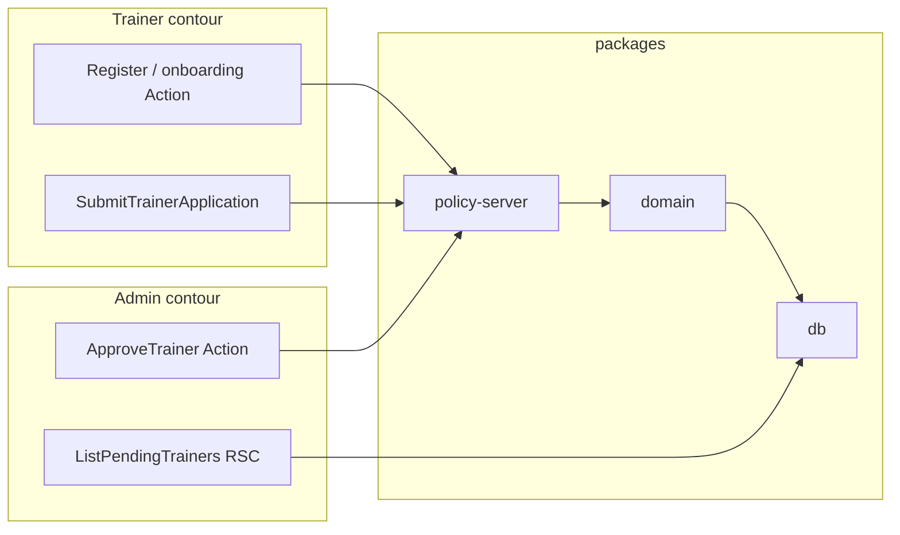
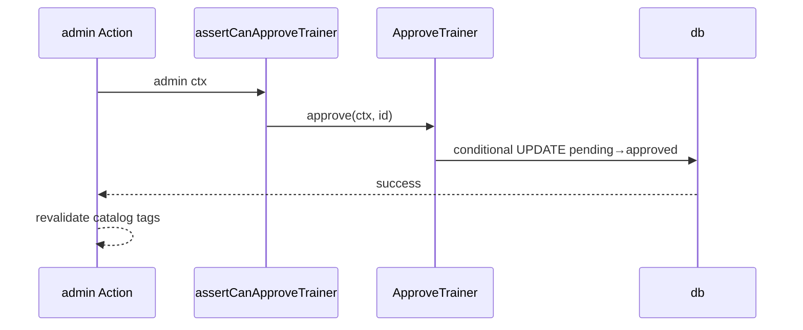
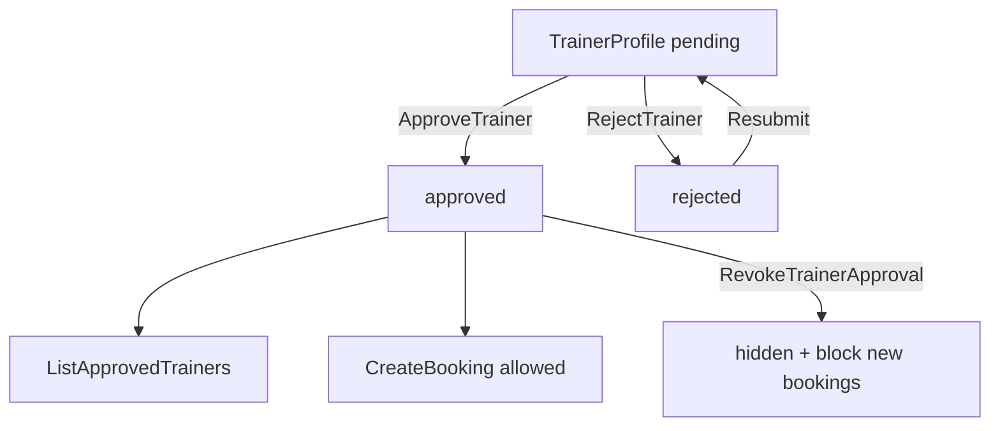

# 03 — Trainer Verification: слои и поток данных

**Тип:** Guide  
**Статус:** Canonical  
**Версия:** 1.0  
**Дата:** 2026-05-23  
**Волна:** W13  
**Зависит от:** [`trainer_verification_contract.md`](../implementation/mvp/contracts/trainer_verification_contract.md)  
**Связанные документы:** [`01_architecture_overview.md`](./01_architecture_overview.md), [`file_upload_contract.md`](../implementation/mvp/contracts/file_upload_contract.md)

---

## Purpose

Learning pack: как **модерация тренеров** (submit → admin approve/reject → optional revoke) проходит через слои Pulse. Канон правил — [`trainer_verification_contract.md`](../implementation/mvp/contracts/trainer_verification_contract.md); здесь — **кто что делает** на каждом уровне и как связаны catalog visibility и booking gates.

---

## Scope / Out of scope

**In scope:** `SubmitTrainerApplication`, `ResubmitTrainerApplication`, `ApproveTrainer`, `RejectTrainer`, `RevokeTrainerApproval`, admin queue reads, catalog filter.

**Out of scope:** Onboarding UI steps (→ [`trainer_onboarding_spec.md`](../implementation/mvp/specs/trainer_onboarding_spec.md)); email E-01/E-02 (post-MVP); ML verification.

---

## Definitions

| TrainerProfile.status | Public catalog | CreateBooking allowed |
|----------------------|----------------|---------------------|
| `pending` | hidden | no (FM-003) |
| `approved` | visible | yes |
| `rejected` | hidden | no |

| Layer | Verification responsibility |
|-------|----------------------------|
| `proxy.ts` | Role gates: `/trainer/*`, `/admin/trainers/*` |
| `policy-server` | Admin-only approve/reject; trainer self-profile mutate |
| `@pulse/domain` | Status transitions, doc completeness, FM-014 revoke guard |
| `@pulse/db` | Conditional updates, `reviewed_by_id`, audit |

---

## Layer stack

Public catalog reads **bypass** admin mutations but **MUST** filter `status = approved` at repository layer (INV-03, INV-04).

---

## Happy path — Submit (trainer onboarding)

**Actor:** new trainer completing application.

| Step | Layer | What happens |
|------|-------|--------------|
| 1 | Auth register | `auth_runtime_spec` — user + `trainer_profile` `pending` in one transaction |
| 2 | Onboarding Actions | Update bio, services, schedule — `assertCanMutateTrainerProfile` |
| 3 | File upload | `InitiateUpload` / `ConfirmUpload` — [`file_upload_contract.md`](../implementation/mvp/contracts/file_upload_contract.md) |
| 4 | `SubmitTrainerApplication` | Domain sets `submitted_at`; validates required docs `file_asset.uploadStatus = ready` |
| 5 | `db` | UPDATE status remains `pending`; audit `trainer.application_submitted` |
| 6 | UI | Toast; trainer dashboard shows «awaiting review» |

Trainer **MUST NOT** set `status = approved` directly — FM-005.

---

## Happy path — Admin approve

**Actor:** admin on `/admin/trainers/[id]`.

| Step | Layer | What happens |
|------|-------|--------------|
| 1 | `proxy.ts` | Role `admin` |
| 2 | RSC detail | Load pending profile + linked docs — admin-only repo method |
| 3 | Server Action | `ApproveTrainer(trainerProfileId)` |
| 4 | `policy-server` | `assertCanApproveTrainer` — admin ctx |
| 5 | `@pulse/domain` | Preconditions: `status = pending`, docs complete |
| 6 | `@pulse/db` | `updateMany({ where: { id, status: 'pending' }, data: { status: 'approved', reviewed_at, reviewed_by_id } })` |
| 7 | `apps/web` | `toast.success`; `revalidateTag('trainers')`, `revalidateTag('trainer:{id}')` |

**Side effect:** trainer appears in `ListApprovedTrainers`; `CreateBooking` precheck passes.

---

## Happy path — Reject & resubmit

**RejectTrainer:** admin Action → domain requires `rejectionReason` → `status = rejected` + audit.

**ResubmitTrainerApplication:** trainer Action after reject → `rejected` → `pending`; clears rejection fields; new queue sort by `submitted_at`.

---

## Happy path — Admin queue read

| Step | Layer | What happens |
|------|-------|--------------|
| 1 | RSC `/admin/trainers` | `ListPendingTrainers` |
| 2 | `policy-server` | Verify admin role (or rely on proxy + defense in depth) |
| 3 | `@pulse/db` | `findMany({ where: { status: 'pending' }, orderBy: { submittedAt: 'asc' } })` |
| 4 | UI | Table with empty/loading/error states — [`admin_verification_spec.md`](../implementation/mvp/specs/admin_verification_spec.md) |

Badge count on admin nav — separate `count()` with same filter (DAP pattern).

---

## Suggested module map (P04 / P05)

| Concern | Suggested path |
|---------|----------------|
| Approve Action | `apps/web/src/app/admin/trainers/[id]/actions/approve-trainer.ts` |
| Policy | `packages/policy/server/src/trainer/assert-can-approve-trainer.ts` |
| Use-cases | `packages/domain/src/trainer/approve-trainer.ts` |
| Catalog filter | `packages/db/src/catalog/list-approved-trainers.ts` |
| Pending queue | `packages/db/src/trainer/list-pending-trainers.ts` |

---

## Negative paths (by layer)

| Failure | Layer | Code / FM |
|---------|-------|-----------|
| Trainer self-approve | `policy-server` | FM-005, `FORBIDDEN` |
| Approve incomplete docs | `domain` | `APPLICATION_INCOMPLETE` |
| Approve already processed | `db` count 0 | FM-010, `ALREADY_PROCESSED` |
| Revoke with future bookings | `domain` | FM-014, `TRAINER_HAS_ACTIVE_BOOKINGS` |
| Guest sees pending profile URL | public read repo | `null` → 404, FM-003 |
| Pending in catalog query | `db` where clause | empty — integration test |

---

## Security paths

| Threat | Layer | MUST |
|--------|-------|------|
| Trainer approves self | `policy-server` | deny |
| Client calls approve Action | `policy-server` | deny |
| Guest downloads pending certificate | `policy-server` + asset ACL | deny |
| Catalog API leaks pending | `db` public methods | `status: approved` only |
| IDOR admin detail | verify admin before load by id | 404 if not admin |

Certificate files: link only when `uploadStatus = ready` (FM-012) — upload contract.

---

## Concurrency & idempotency

**FM-010 — dual admin:** two admins approve same pending profile — second `updateMany` returns count 0 → UI refresh queue + error toast.

**FM-014 — revoke:** domain counts future `pending`/`confirmed` bookings before `approved` → `revoked` transition; deny if any.

No idempotent «approve twice» success — second attempt is error, not silent ok.

---

## Drift & consistency notes

| Risk | Guard |
|------|-------|
| Pending trainer in `/trainers` | Contract test on `ListApprovedTrainers` |
| Approve without docs | Admin UI checklist + domain validator |
| Booking allowed for pending | `CreateBooking` trainer status check — FM-003 |
| Cache stale after approve | revalidate trainer + catalog tags |
| Email on approve (MVP) | No enqueue — FM-020 |

---

## Cross-flow: verification → booking

Слой booking precheck — [`02_booking_lifecycle_layers.md`](./02_booking_lifecycle_layers.md) step 6 CreateBooking transaction.

---

## Policy & layer touchpoints (summary)

| Use-case | proxy.ts | policy-server | domain | db |
|----------|:--------:|:-------------:|:------:|:--:|
| `SubmitTrainerApplication` | trainer | ✅ | ✅ | ✅ |
| `ApproveTrainer` / `Reject` | admin | ✅ | ✅ | ✅ |
| `RevokeTrainerApproval` | admin | ✅ | ✅ | ✅ |
| `ListPendingTrainers` | admin | ✅ | — | read |
| `ListApprovedTrainers` | public | — | filter | read |

---

## Acceptance criteria

- [ ] Submit → approve traced through layers
- [ ] Catalog visibility tied to `approved` at db read layer
- [ ] FM-003, FM-010, FM-014 referenced
- [ ] Security: self-approve + pending leak prevented
- [ ] File upload gate mentioned for doc readiness
- [ ] Links to trainer_verification_contract + specs

---

## Related documents

| Document | Relationship |
|----------|--------------|
| [`01_architecture_overview.md`](./01_architecture_overview.md) | Pack entry |
| [`trainer_verification_contract.md`](../implementation/mvp/contracts/trainer_verification_contract.md) | Contract canon |
| [`file_upload_contract.md`](../implementation/mvp/contracts/file_upload_contract.md) | Certificate assets |
| [`02_booking_lifecycle_layers.md`](./02_booking_lifecycle_layers.md) | FM-003 booking gate |
| [`admin_verification_spec.md`](../implementation/mvp/specs/admin_verification_spec.md) | Admin UX |
| [`trainer_onboarding_spec.md`](../implementation/mvp/specs/trainer_onboarding_spec.md) | Trainer UX |
| [`authorization_matrix.md`](../prds/04_authorization_privacy/authorization_matrix.md) | Role × resource |

**Registry:** [`documentation_creation_registry.md`](../meta/documentation_creation_registry.md) — wave W13-02

---

## Agent notes

- Вторая vertical slice после booking — тот же layering template.
- Register flow creates `pending` profile — не откладывать на отдельный submit если PRD phase says otherwise; resubmit для rejected.
- P05 admin phase: читать этот doc + contract перед первым admin Action.
- Post-MVP: enqueue E-01/E-02 only from worker hook — см. [`04_email_jobs_layers.md`](./04_email_jobs_layers.md).

---

## Change log

| Date | Change |
|------|--------|
| 2026-05-23 | v1.0 — trainer verification layers learning pack |
