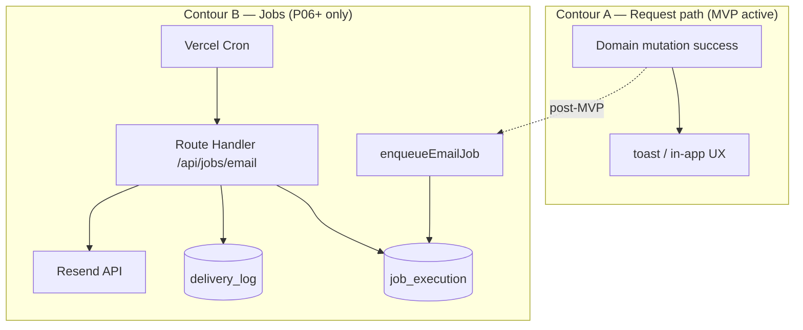
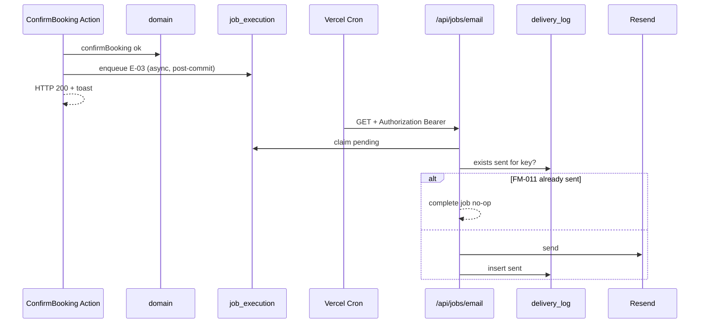

# 04 — Email Jobs: слои и контуры (MVP schema-ready / post-MVP runtime)

**Тип:** Guide  
**Статус:** Canonical  
**Версия:** 1.0  
**Дата:** 2026-05-23  
**Волна:** W13  
**Зависит от:** [`email_notifications_contract.md`](../implementation/mvp/contracts/email_notifications_contract.md), [`cron_jobs_registry.md`](../prds/06_operations/cron_jobs_registry.md)  
**Связанные документы:** [`01_architecture_overview.md`](./01_architecture_overview.md), [`adr_006_idempotent_email_delivery.md`](../prds/07_governance/adr_006_idempotent_email_delivery.md)

---

## Purpose

Learning pack для **двухконтурной** доставки email Pulse: mutation path (web) vs jobs path (Cron/worker). На MVP таблицы `job_execution` и `delivery_log` существуют, но **runtime отключён** (INV-12, FM-020). Post-MVP (P06) — enqueue после domain success, send только из Cron handler.

**Runtime (Context7, Vercel Cron):** `vercel.json` `crons[]`; Vercel шлёт `Authorization: Bearer ${CRON_SECRET}`; handler **MUST** сверять header с env до любой DB/Resend работы.

---

## Scope / Out of scope

**In scope:** layer boundaries MVP vs P06+; enqueue vs worker; idempotency; event mapping E-01–E-09 at layer level; FM-011 overlap.

**Out of scope:** Resend HTML templates; Resend account setup (→ [`cron_jobs_setup_guide.md`](../implementation/mvp/guides/cron_jobs_setup_guide.md)); MVP toast substitutes (→ [`email_notifications_matrix.md`](../prds/01_product_scope/email_notifications_matrix.md)).

---

## Definitions

| Contour | Entry | Allowed writes |
|---------|-------|----------------|
| **A — Web mutation** | Server Action after domain ok | Domain tables only; **no** `delivery_log`, **no** Resend |
| **B — Jobs worker** | `/api/jobs/*` + Cron | `job_execution`, `delivery_log`, Resend API |

| Table | Layer that writes (post-MVP) |
|-------|------------------------------|
| `job_execution` | `apps/web` enqueue helper **or** worker scanner (J-02) |
| `delivery_log` | **only** worker (`apps/workers` or `apps/web/api/jobs`) |

---

## Architecture — two contours

**MUST NOT** on MVP: dashed path from mutation to enqueue; Cron in `vercel.json`; `import 'resend'` in `apps/web` Server Actions.

---

## Happy path — post-MVP ConfirmBooking + E-03

**Actor:** system after trainer confirms booking.

| Step | Layer | What happens |
|------|-------|--------------|
| 1 | Server Action | `ConfirmBooking` — layers per [`02_booking_lifecycle_layers.md`](./02_booking_lifecycle_layers.md) |
| 2 | `@pulse/domain` | Transaction commits `confirmed` |
| 3 | `apps/web` adapter | **After** commit: `enqueueEmailJob({ jobType: 'booking_confirmed', idempotencyKey: 'booking_confirmed:{id}', payload: { bookingId } })` |
| 4 | `@pulse/db` | `INSERT job_execution` ON CONFLICT `idempotency_key` DO NOTHING |
| 5 | HTTP response | Returns to user **without** awaiting Resend |
| 6 | Cron J-01 | Every 5 min hits `/api/jobs/email` with Bearer secret |
| 7 | Worker handler | Claim pending rows; for each key check `delivery_log` sent (FM-011) |
| 8 | Worker | Resolve recipient from DB by `bookingId` → user email |
| 9 | Resend | `emails.send` |
| 10 | `@pulse/db` | INSERT `delivery_log` status `sent`; mark job `completed` |

---

## Happy path — J-02 reminder scanner (E-07)

| Step | Layer | What happens |
|------|-------|--------------|
| 1 | Cron `/api/jobs/reminders` | Auth secret first |
| 2 | Worker | Query bookings T-24h using **trainer timezone** (ADR-004) |
| 3 | Worker | Enqueue rows `reminder_24h:{bookingId}` |
| 4 | J-01 email processor | Sends via same pipeline as E-03 |

Reminder **scan** lives in jobs contour; **never** in Server Action request path.

---

## MVP boundary — what each layer does today (P01–P05)

| Layer | MVP behavior |
|-------|--------------|
| `apps/web` Server Actions | Toast only for E-06 substitute; no job writes |
| `@pulse/domain` | No email ports required on MVP |
| `@pulse/policy-server` | Unchanged |
| `@pulse/db` | Schema migrates empty tables |
| `apps/workers` / `/api/jobs` | Routes **not deployed** |
| `vercel.json` | No `crons` array |

**FM-020 guard:** CI/review grep for `resend`, `delivery_log.create`, `job_execution.create` under `apps/web` mutation paths.

---

## Suggested module map (P06)

| Concern | Suggested path |
|---------|----------------|
| Enqueue helper | `apps/workers/src/email/enqueue-email-job.ts` or `packages/db/src/jobs/enqueue.ts` |
| Email worker | `apps/web/src/app/api/jobs/email/route.ts` |
| Reminder scanner | `apps/web/src/app/api/jobs/reminders/route.ts` |
| Send service | `apps/workers/src/email/send-transactional.ts` |
| Domain hook | Optional port `EmailJobPort` in `@pulse/domain` — impl in adapter only |

**MUST NOT** — `import resend` in `@pulse/domain` or `@pulse/policy-server`.

---

## Negative paths (by layer)

| Failure | Layer | Expected |
|---------|-------|----------|
| Enqueue before DB commit | design bug | Forbidden — enqueue post-transaction |
| Duplicate enqueue same event | `db` UNIQUE | Treat conflict as success |
| Resend 5xx | worker | `delivery_log.failed`; retry policy — [`cron_jobs_registry.md`](../prds/06_operations/cron_jobs_registry.md) |
| Cron without secret | Route Handler | 401; no side effects |
| MVP accidental send | review | Reject PR — FM-020 |
| Missing user in payload | worker | Job `failed`; log; no send |
| Client POST to `/api/jobs/email` | handler | 401 without Bearer |

---

## Security paths

| Threat | Layer | MUST |
|--------|-------|------|
| Public cron abuse | Route Handler | Verify `Authorization: Bearer ${CRON_SECRET}` (Context7 Vercel docs) |
| Client-triggered email | architecture | No public enqueue endpoint |
| PII in `payload_json` | enqueue | Store IDs only; resolve email in worker |
| Wrong recipient | worker | Load user by FK from domain ids, not client body |
| JWT on cron routes | design | Cron uses secret, not user session |

`proxy.ts` **MUST NOT** treat `/api/jobs/*` as public — auth inside handler.

---

## Concurrency & idempotency

| Scenario | Layer | Resolution |
|----------|-------|------------|
| Duplicate enqueue | `job_execution.idempotency_key` UNIQUE | No-op success |
| Cron overlap FM-011 | worker pre-send | SELECT `delivery_log` sent → skip Resend |
| Parallel cron instances | worker claim | `UPDATE … WHERE status='pending'` |
| Worker crash after send | retry | Idempotency key prevents duplicate |

Deterministic keys — [`email_notifications_contract.md`](../implementation/mvp/contracts/email_notifications_contract.md) §Key determinism.

---

## Event → layer mapping (summary)

| Event | Domain trigger | Enqueue layer (P06+) | Processed by |
|-------|----------------|----------------------|--------------|
| E-01 | `ApproveTrainer` | web adapter post-commit | J-01 |
| E-02 | `RejectTrainer` | web adapter | J-01 |
| E-03 | `ConfirmBooking` | web adapter | J-01 |
| E-04 | `CancelBooking` | web adapter | J-01 |
| E-05 | `CompleteBooking` | web adapter | J-01 |
| E-06 | `CreateBooking` | **MVP: none** (toast) | — |
| E-07 | Cron scanner | worker J-02 | J-01 |
| E-08 | `CloseComplaint` | web adapter | J-01 |
| E-09 | Password reset | auth adapter | J-01 |

Full matrix — [`email_notifications_matrix.md`](../prds/01_product_scope/email_notifications_matrix.md).

---

## Drift & consistency notes

| Risk | Guard |
|------|-------|
| `await resend` in Server Action | ADR-006 — forbidden |
| MVP cron in vercel.json | Phase DoD P01–P05 |
| E-07 wrong local time | J-02 uses trainer IANA |
| Booking UX implies email sent | Copy + contract — toast only on MVP |
| lampto AWS cron patterns | Pulse uses Vercel Cron until new ADR |

---

## Policy & layer touchpoints

| Operation | domain | apps/web | worker | db tables |
|-----------|:------:|:--------:|:------:|-----------|
| MVP mutation | ✅ | toast | — | domain only |
| Post-MVP enqueue | ✅ commit first | enqueue call | — | `job_execution` |
| Send email | — | — | ✅ | `delivery_log` |
| Cron auth | — | — | ✅ | — |

---

## Acceptance criteria

- [ ] Two contours (web vs jobs) clearly separated
- [ ] MVP explicit: no enqueue, no Resend, no crons
- [ ] Post-MVP happy path ConfirmBooking → E-03 documented
- [ ] FM-011 and FM-020 referenced
- [ ] Cron Bearer auth pattern (Context7 verified)
- [ ] Links to email contract + cron registry + ADR-006

---

## Related documents

| Document | Relationship |
|----------|--------------|
| [`01_architecture_overview.md`](./01_architecture_overview.md) | Two-contour overview §2 |
| [`email_notifications_contract.md`](../implementation/mvp/contracts/email_notifications_contract.md) | Contract canon |
| [`cron_jobs_registry.md`](../prds/06_operations/cron_jobs_registry.md) | J-01, J-02 schedules |
| [`adr_006_idempotent_email_delivery.md`](../prds/07_governance/adr_006_idempotent_email_delivery.md) | ADR |
| [`02_booking_lifecycle_layers.md`](./02_booking_lifecycle_layers.md) | ConfirmBooking hook point |
| [`03_trainer_verification_layers.md`](./03_trainer_verification_layers.md) | ApproveTrainer hook point |
| [`P06_phase_description.md`](../implementation/mvp/phases_tasks_descriptions/P06_phase_description.md) | Enable phase |
| [`cron_jobs_setup_guide.md`](../implementation/mvp/guides/cron_jobs_setup_guide.md) | Ops setup |

**Registry:** [`documentation_creation_registry.md`](../meta/documentation_creation_registry.md) — wave W13-03

---

## Agent notes

- Default agent sessions (P01–P05): **не добавлять** crons или Resend — только schema + этот doc как reference.
- Enqueue — **не** Server Action `await` на Resend; HTTP UX independent of send latency.
- When enabling P06: J-01 before J-02; env `CRON_SECRET`, `RESEND_API_KEY`.
- Password reset E-09 post-MVP — [`password_reset_spec.md`](../implementation/mvp/specs/password_reset_spec.md).

---

## Change log

| Date | Change |
|------|--------|
| 2026-05-23 | v1.0 — email jobs layers learning pack |
