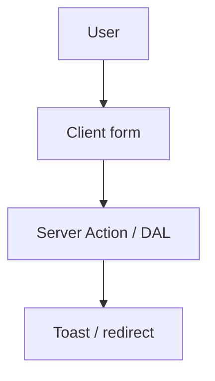

# Form handling pattern — Pulse

Client forms: **`Field`** / **`Label`** / **`Input`** from `@/components/ui`, **`sonner`** for feedback, **Server Actions** for mutations. Prefer **`useActionState`** when server returns validation state; otherwise **`useTransition`** + toast. **Busy UI** while in flight — §4.

**Methodology:** [`docs/meta/ai_first_project_methodology.md`](../../meta/ai_first_project_methodology.md)  
**Stack:** Next.js **16.2.6**, React 19, `@pulse/domain` `MutationResult`  
**Cursor rules:** **ui-mutation-pending**, **ui-toast-mutations**



---

## 1. Server Action

```ts
'use server'

import { redirect } from 'next/navigation'
import type { MutationResult } from '@pulse/domain'

export async function createBooking(
  _prev: MutationResult<{ id: string }> | null,
  formData: FormData
): Promise<MutationResult<{ id: string }>> {
  const slotId = String(formData.get('slotId') ?? '').trim()
  if (!slotId) return { ok: false, code: 'VALIDATION', message: '…' } // from @/lib/messages in product code
  // … DAL + policy
  redirect('/client/bookings/…')
}
```

Mutations live in **`apps/web/src/data/**`**; actions stay thin. See [ai_nextjs_db_data_handle.md](../nextjs/ai_nextjs_db_data_handle.md).

---

## 2. Client form with `useActionState`

```tsx
'use client'

import { useActionState } from 'react'
import { createBooking } from '@/actions/booking'
import { Field, FieldLabel, FieldError } from '@/components/ui/field'
import { Input } from '@/components/ui/input'
import { Button } from '@/components/ui/button'
import { MESSAGES } from '@/lib/messages'

export const BookingForm = () => {
  const [state, formAction, pending] = useActionState(createBooking, null)

  return (
    <form action={formAction} aria-busy={pending}>
      <Field data-invalid={state && !state.ok}>
        <FieldLabel htmlFor="slotId">{MESSAGES.booking.slotLabel}</FieldLabel>
        <Input id="slotId" name="slotId" required disabled={pending} />
        {state && !state.ok ? <FieldError>{state.message}</FieldError> : null}
      </Field>
      <Button type="submit" disabled={pending} aria-busy={pending}>
        {pending ? MESSAGES.booking.submitting : MESSAGES.booking.submit}
      </Button>
    </form>
  )
}
```

---

## 3. Controlled field + `useTransition` + toast

Use when calling imperative APIs or Route Handlers without `ActionState`.

---

## 4. Mutation pending (busy) UI

Applies to **any server mutation**. Distinct from route **`loading.tsx`** — see [ai_loading_patterns.md](../nextjs/ai_loading_patterns.md).

### Required

1. **`pending`** from `useActionState`, `useFormStatus`, or `useTransition`
2. **`disabled={pending}`** on submit (and inputs if form locked)
3. **`aria-busy={pending}`** on submit or `<form>`
4. **Label change** — gerund from **`@/lib/messages`**

### Recommended

- Inline **`Loader2Icon`** on primary submit (`aria-hidden` with visible text)

### Relation to toasts

- Busy until settle; then **ui-toast-mutations** (`PRODUCT_TOAST_DURATION_MS`)

---

## 5. Optimistic actions (not forms)

Wishlist toggle, service active — **`useOptimistic`** — see [`ai_optimistic_ui_pattern.md`](./ai_optimistic_ui_pattern.md) and §7 in lampto reference.

---

## 6. Dates and timezone

- Display/booking times use **`TrainerProfile.timezone`** — never server default alone.
- Store UTC in DB; format with **`date-fns`** + explicit locale.
- See user flows and [database_schema_v1.md](../../prds/03_data_model/database_schema_v1.md).

---

## Checklist

1. **`'use client'`** on interactive forms
2. **Labels** + **`FieldError`** / `aria-invalid`
3. **Pending:** `disabled` + `aria-busy` + messages
4. **Toasts** after completion (**ui-toast-mutations**)
5. **Cache:** `updateTag` / `revalidatePath` in action after mutation (ADR-002)

**Reference:** lampto [`ai_form_handling_pattern.md`](../../examples/lampto/docs/guidelines/react/ai_form_handling_pattern.md)
