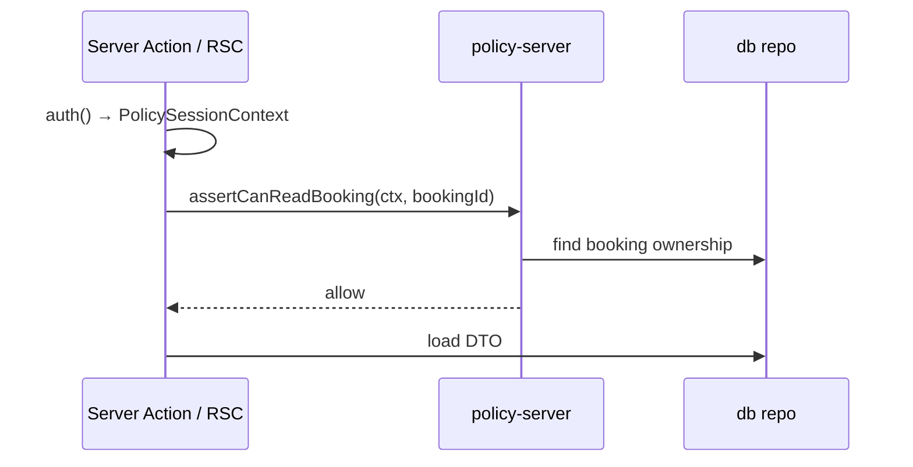

# Authorization Policy Contract — Pulse MVP

**Тип:** Contract  
**Статус:** Canonical  
**Версия:** 1.0  
**Дата:** 2026-05-23  
**Волна:** W8  
**Зависит от:** [`policy_enforcement_contract.md`](../../../prds/04_authorization_privacy/policy_enforcement_contract.md), [`auth_runtime_spec.md`](../../../prds/05_runtime/auth_runtime_spec.md), [`authorization_matrix.md`](../../../prds/04_authorization_privacy/authorization_matrix.md), [`adr_003_auth_credentials_jwt_rbac.md`](../../../prds/07_governance/adr_003_auth_credentials_jwt_rbac.md)  
**Связанные документы:** [`monorepo_boundaries_contract.md`](./monorepo_boundaries_contract.md)

**Context7 verified:** Auth.js v5 — JWT `callbacks.jwt` / `callbacks.session` persist `role`; split `auth.config.ts` (proxy-safe) vs `auth.ts` (Prisma Credentials).

---

## Purpose

Контракт **именованных policy-функций** `@pulse/policy-server` и helpers `@pulse/policy-edge`: inputs, deny behavior, error codes. Реализует строки [`authorization_matrix.md`](../../../prds/04_authorization_privacy/authorization_matrix.md) без дублирования полной матрицы.

---

## Scope / Out of scope

**In scope:** MVP `assertCan*` / `assertCanRead*` API surface, `PolicySessionContext`, edge path classification, deny → domain error mapping.

**Out of scope:** UI 403 pages, OAuth, Stripe admin, full matrix prose (→ authorization_matrix).

---

## Definitions

```typescript
// packages/policy/server — conceptual
type PolicySessionContext = {
  userId: string;
  role: "client" | "trainer" | "admin";
  email?: string;
};

type PolicyDenyCode =
  | "UNAUTHORIZED"
  | "FORBIDDEN"
  | "NOT_FOUND";

// Pure functions — throw PolicyError or return void
```

**MUST** — map `auth()` session in `apps/web` only; packages never import `Session` from `next-auth`.

---

## Happy path

**Actor:** client reading own booking detail.

**Preconditions:** Valid JWT `role=client`; booking owned by user.

**Sequence:**



**Postconditions:** No data returned if deny before query (IDOR-safe).

---

## Negative paths (business)

| Function | Business deny | Code |
|----------|---------------|------|
| `assertCanCreateBooking` | Trainer not approved / service inactive | `TRAINER_NOT_BOOKABLE` |
| `assertCanCancelBooking` | Client inside 24h window | `CANCELLATION_WINDOW_CLOSED` |
| `assertCanPublishReview` | Booking not `completed` | `BOOKING_NOT_REVIEWABLE` |
| `assertCanLinkFileAsset` | Asset not `ready` | `INVALID_UPLOAD_STATE` |
| `assertCanRevokeTrainer` | Future confirmed bookings exist | `TRAINER_HAS_ACTIVE_BOOKINGS` |

Policy **MUST** throw/return before domain when role insufficient; domain handles business rules after allow.

---

## Security paths

| Function | Scenario | MUST | FM |
|----------|----------|------|-----|
| `assertCanReadBooking` | Client B reads Client A booking | Deny `NOT_FOUND` | FM-004 |
| `assertCanMutateTrainerService` | Trainer A edits B's service | Deny `FORBIDDEN` | FM-016 |
| `assertCanApproveTrainer` | Non-admin | Deny `FORBIDDEN` | FM-005 |
| `assertCanReadVerificationDoc` | Non admin/trainer owner | Deny | FM-005 |
| `assertCanToggleWishlist` | Non-client | Deny `FORBIDDEN` | — |
| `classifyPath` (edge) | Client on `/trainer/*` | Redirect role home | FM-005 |

**MUST NOT** — trust `userId`, `clientId`, `role` from request body or query for authorization.

### Planned API index (`@pulse/policy-server`)

| Function | Matrix resource |
|----------|-----------------|
| `assertCanCreateBooking` | Booking create |
| `assertCanReadBooking` | Booking read |
| `assertCanConfirmBooking` | Booking confirm |
| `assertCanCompleteBooking` | Booking complete |
| `assertCanCancelBooking` | Booking cancel |
| `assertCanMutateTrainerProfile` | Trainer profile update |
| `assertCanMutateTrainerService` | Services CRUD |
| `assertCanMutateSchedule` | Weekly + exceptions |
| `assertCanToggleWishlist` | Wishlist |
| `assertCanPublishReview` | Review publish |
| `assertCanModerateReview` | Review hide/delete |
| `assertCanApproveTrainer` | Admin approve/reject/revoke |
| `assertCanInitiateUpload` | File asset |
| `assertCanReadPrivateDoc` | Verification doc |
| `assertCanManageComplaint` | Admin complaints |
| `assertCanProcessRefund` | Admin refunds |

### Edge helpers (`@pulse/policy-edge`)

| Function | Purpose |
|----------|---------|
| `classifyPath(pathname)` | `public` \| `client` \| `trainer` \| `admin` |
| `getRequiredRoleForPath(pathname)` | For proxy matcher |
| `isRoleAllowedForPath(role, pathname)` | JWT compare without DB |

---

## Concurrency & idempotency

**MUST** — admin transitions (`assertCanApproveTrainer`, refund) re-read entity `status` inside same transaction as domain write — implements [`FM-010`](../../../prds/02_domain_model/failure_modes_catalog.md#fm-010), [`FM-013`](../../../prds/02_domain_model/failure_modes_catalog.md#fm-013).

Policy read-only checks are idempotent; double-submit protection is domain layer.

---

## Drift & consistency notes

| Risk | Guard |
|------|-------|
| New Action without policy call | Grep `use server` + checklist |
| Matrix row without `assertCan*` | Block merge until function added |
| policy-server uses `redirect()` | Forbidden — throw PolicyError |
| 403 vs 404 inconsistency | Booking IDOR → `NOT_FOUND`; admin shell → `FORBIDDEN` |

---

## Policy & layer touchpoints

| Layer | Package | Calls |
|-------|---------|-------|
| 1 — proxy | policy-edge | `classifyPath`, JWT role |
| 3 — Action/RSC | apps/web | `auth()` → ctx → policy-server |
| 4 — policy-server | policy-server | Prisma ownership reads |
| 5 — domain | domain | After all asserts pass |

**Forbidden:** policy-server in proxy; db in policy-edge.

---

## Requirements

1. **MUST** — every mutating use-case in [`use_cases_index.md`](../../../prds/02_domain_model/use_cases_index.md) have matching assert (or nested assert in composite).
2. **MUST** — `PolicySessionContext` built only in apps/web.
3. **MUST** — implements FM-004, FM-005, FM-016.
4. **MUST NOT** — duplicate full authorization matrix in this file.
5. **SHOULD** — unit tests per assert with fixture users.

---

## Acceptance criteria

- [ ] Happy path for booking read documented
- [ ] API index covers MVP matrix rows
- [ ] Security: IDOR + role escalation + body tampering
- [ ] Concurrency notes for admin approve
- [ ] Edge vs server split clear
- [ ] Auth.js JWT role pattern cited (Context7)

---

## Related documents

| Document | Relationship |
|----------|--------------|
| [`authorization_matrix.md`](../../../prds/04_authorization_privacy/authorization_matrix.md) | Permission canon |
| [`policy_enforcement_contract.md`](../../../prds/04_authorization_privacy/policy_enforcement_contract.md) | Layers |
| [`adr_003_auth_credentials_jwt_rbac.md`](../../../prds/07_governance/adr_003_auth_credentials_jwt_rbac.md) | JWT RBAC |
| [`auth_runtime_spec.md`](../../../prds/05_runtime/auth_runtime_spec.md) | Auth flows |
| [`failure_modes_catalog.md`](../../../prds/02_domain_model/failure_modes_catalog.md) | FM-004, FM-005, FM-016 |
| [`.cursor/rules/policy-packages.mdc`](../../../../.cursor/rules/policy-packages.mdc) | Enforcement |

**Registry:** [`documentation_creation_registry.md`](../../../meta/documentation_creation_registry.md) — wave W8-02

---

## Agent notes

- Prefer `assertCanReadBooking` before `findUnique` — not after leak.
- Admin read all bookings: separate `assertCanReadBookingAsAdmin` or role branch inside assert.
- Do not add OAuth-specific asserts on MVP.

---

## Change log

| Date | Change |
|------|--------|
| 2026-05-23 | v1.0 — policy function API contract |
