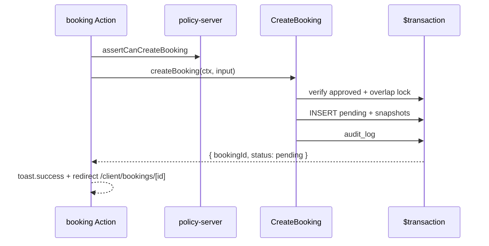

# Booking Lifecycle Contract — Pulse MVP

**Тип:** Contract  
**Статус:** Canonical  
**Версия:** 1.0  
**Дата:** 2026-05-23  
**Волна:** W8  
**Зависит от:** [`lifecycle_models.md`](../../../prds/02_domain_model/lifecycle_models.md), [`adr_005_mvp_booking_without_payment.md`](../../../prds/07_governance/adr_005_mvp_booking_without_payment.md), [`schedule_slots_contract.md`](./schedule_slots_contract.md)  
**Связанные документы:** [`authorization_policy_contract.md`](./authorization_policy_contract.md)

---

## Purpose

Контракт **мутаций booking** MVP: `CreateBooking`, `ConfirmBooking`, `CompleteBooking`, `CancelBooking` — inputs, outputs, errors, transactions, side effects. Без оплаты ([ADR-005](../../../prds/07_governance/adr_005_mvp_booking_without_payment.md)). Implements FM-001, FM-002, FM-003, FM-015.

---

## Scope / Out of scope

**In scope:** Status machine MVP, service snapshot, cancellation policy, audit, cache tags.

**Out of scope:** Stripe, Daily.co room, email E-06 (post-MVP), auto-confirm.

---

## Definitions

| Status | MVP meaning |
|--------|-------------|
| `pending` | Created; awaits trainer confirm |
| `confirmed` | Trainer accepted |
| `completed` | Session done; review eligible |
| `cancelled` | Terminal |

```typescript
type CreateBookingInput = {
  trainerProfileId: string;
  trainerServiceId: string;
  startsAtUtc: string; // ISO from SlotDto
};

type MutationResult<T> =
  | { ok: true; data: T }
  | { ok: false; code: string; messageKey: string };
```

---

## Happy path

**Actor:** client completing booking wizard.

**Preconditions:** Approved trainer; active service; slot still available.

**Sequence:**



**Postconditions:** `status=pending`; price/duration snapshotted (**INV-07**); no Stripe fields written.

**Side effects:** `revalidateTag` catalog/trainer/bookings per cache policy.

---

## Negative paths (business)

| Use-case | Condition | Code | FM |
|----------|-----------|------|-----|
| `CreateBooking` | Slot taken | `SLOT_UNAVAILABLE` | FM-001 |
| `CreateBooking` | Trainer not approved | `TRAINER_NOT_BOOKABLE` | FM-003 |
| `CreateBooking` | Service inactive | `SERVICE_INACTIVE` | — |
| `CreateBooking` | Past slot | `SLOT_IN_PAST` | — |
| `CancelBooking` | Client &lt; 24h to start | `CANCELLATION_WINDOW_CLOSED` | FM-002 |
| `ConfirmBooking` | Not `pending` | `INVALID_STATUS_TRANSITION` | — |
| `CompleteBooking` | Not `confirmed` | `INVALID_STATUS_TRANSITION` | — |
| `*` | Terminal state | `BOOKING_TERMINAL` | — |

**MUST** — map codes to `@/lib/messages` keys in apps/web only.

---

## Security paths

| Scenario | MUST | FM |
|----------|------|-----|
| Create as trainer/admin | Deny at policy | FM-005 |
| Confirm by non-owner trainer | Deny | FM-016 |
| Read/update foreign booking | Deny / 404 | FM-004 |
| Tamper `price_cents` in body | Ignore; snapshot from DB service | ADR-005 |

---

## Concurrency & idempotency

### FM-001 — overlap

See [`schedule_slots_contract.md`](./schedule_slots_contract.md): Serializable transaction + overlap SELECT + INSERT.

### FM-015 — confirm vs cancel

**MUST** — conditional update:

```typescript
updateMany({
  where: { id, status: "pending" }, // or expectedFrom
  data: { status: "confirmed", ... },
});
// count === 0 → BOOKING_STATE_CONFLICT
```

Losing actor gets conflict; UI refresh + optional toast.error.

**MUST NOT** — idempotent double-create (two bookings) — only one row per successful create; double-submit same payload may create two if different slots — UI disables submit.

---

## Drift & consistency notes

| Risk | Guard |
|------|-------|
| Auto-confirm on create | Lifecycle test requires trainer action |
| Stripe columns written | grep + INV-14 |
| Copy «confirmed» vs `pending` | W7 microcopy — status honest |
| Direct prisma status update | Ban outside domain — INV-05 |

---

## Policy & layer touchpoints

| Use-case | Assert | Domain | Db transaction |
|----------|--------|--------|----------------|
| `CreateBooking` | `assertCanCreateBooking` | validate + snapshot | yes |
| `ConfirmBooking` | `assertCanConfirmBooking` | transition | yes |
| `CompleteBooking` | `assertCanCompleteBooking` | transition | yes |
| `CancelBooking` | `assertCanCancelBooking` | window + transition | yes |

---

## Use-case outputs

| Use-case | Success data | Audit action |
|----------|--------------|--------------|
| `CreateBooking` | `{ id, status: "pending" }` | `booking.created` |
| `ConfirmBooking` | `{ id, status: "confirmed" }` | `booking.confirmed` |
| `CompleteBooking` | `{ id, status: "completed" }` | `booking.completed` |
| `CancelBooking` | `{ id, status: "cancelled" }` | `booking.cancelled` |

**MUST** set `cancelled_at`, `cancelled_by_id` on cancel; `completed_at`, `completed_by_id` on complete.

---

## Requirements

1. **MUST** — initial status always `pending` (ADR-005).
2. **MUST** — snapshot service fields on create (INV-07).
3. **MUST** — client cancel window INV-08 / FM-002.
4. **MUST** — transitions only via named use-cases (INV-05).
5. **MUST NOT** — write `stripe_*` or send email on MVP.

---

## Acceptance criteria

- [ ] All four mutations documented with codes
- [ ] FM-001, FM-002, FM-003, FM-015 referenced
- [ ] Happy path ends `pending` without payment
- [ ] Security: IDOR + role + price tampering
- [ ] Conditional update for races
- [ ] Links to schedule_slots_contract

---

## Related documents

| Document | Relationship |
|----------|--------------|
| [`lifecycle_models.md`](../../../prds/02_domain_model/lifecycle_models.md) | State machine |
| [`adr_005_mvp_booking_without_payment.md`](../../../prds/07_governance/adr_005_mvp_booking_without_payment.md) | No payment |
| [`schedule_slots_contract.md`](./schedule_slots_contract.md) | Overlap |
| [`domain_invariants.md`](../../../prds/02_domain_model/domain_invariants.md) | INV-05–08 |
| [`failure_modes_catalog.md`](../../../prds/02_domain_model/failure_modes_catalog.md) | FM index |
| [`../specs/booking_wizard_spec.md`](../specs/booking_wizard_spec.md) | Wizard UX (W9) |
| [`../../architecture_learning_pack/02_booking_lifecycle_layers.md`](../../architecture_learning_pack/02_booking_lifecycle_layers.md) | Layer walkthrough (W13) |

**Registry:** [`documentation_creation_registry.md`](../../../meta/documentation_creation_registry.md) — wave W8-04

---

## Agent notes

- **UI phase P07:** booking wizard — no payment UI (ADR-005). Components: [`ui_component_phase_matrix.md`](../ui_component_phase_matrix.md) P07 row.
- Wizard success toast = «request sent» semantics until trainer confirms — not status hack.
- Admin cancel bypasses 24h client window.
- `CompleteBooking` before `starts_at` allowed on MVP per lifecycle_models agent note.

---

## Change log

| Date | Change |
|------|--------|
| 2026-05-23 | v1.0 — booking lifecycle contract |
