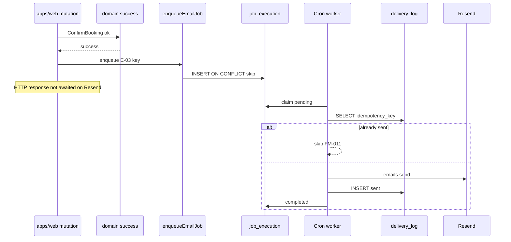

# Email Notifications Contract — Pulse MVP (Schema-Ready / Post-MVP Runtime)

**Тип:** Contract  
**Статус:** Canonical  
**Версия:** 1.0  
**Дата:** 2026-05-23  
**Волна:** W8  
**Зависит от:** [`email_notifications_matrix.md`](../../../prds/01_product_scope/email_notifications_matrix.md), [`adr_006_idempotent_email_delivery.md`](../../../prds/07_governance/adr_006_idempotent_email_delivery.md)  
**Связанные документы:** [`booking_lifecycle_contract.md`](./booking_lifecycle_contract.md)

---

## Purpose

Контракт **асинхронной доставки email** (post-MVP runtime): enqueue, worker execution, idempotency, event mapping E-01–E-09. На MVP **запрещает** runtime отправку — implements **INV-12**, [**FM-020**](../../../prds/02_domain_model/failure_modes_catalog.md#fm-020), [**FM-011**](../../../prds/02_domain_model/failure_modes_catalog.md#fm-011) (when enabled).

---

## Scope / Out of scope

**In scope:** Job enqueue API, worker contour, `idempotency_key` rules, MVP boundary, mapping to matrix events.

**Out of scope:** HTML templates design, Resend account setup (→ W12 guides), MVP toast substitutes (→ matrix MVP UX column).

---

## Definitions

| Table | Role |
|-------|------|
| `job_execution` | Queue: `job_type`, `payload_json`, `idempotency_key`, run status |
| `delivery_log` | Per-send audit: template, recipient, provider id, status |

**MVP:** tables exist; **zero app writes** from `apps/web` request path.

---

## Happy path (post-MVP)

**Actor:** system after successful `ConfirmBooking`.

**Preconditions:** Email phase enabled (P06+); `RESEND_API_KEY` set; domain mutation committed.

**Sequence:**



**Postconditions:** At most one Resend send per `idempotency_key`.

---

## Negative paths (business)

| Condition | Behavior |
|-----------|----------|
| Enqueue duplicate event | UNIQUE `job_execution.idempotency_key` → no-op success |
| Resend API failure | `delivery_log.status=failed`; job retry policy per ops runbook |
| Invalid payload (missing user) | Job fails; no send |
| Event disabled in matrix | No enqueue from domain hook |
| **MVP:** any enqueue/send | **Reject in code review** — FM-020 |

**MVP substitute:** in-app toast/banner per [`email_notifications_matrix.md`](../../../prds/01_product_scope/email_notifications_matrix.md) — e.g. E-06 → booking create toast only.

---

## Security paths

| Scenario | MUST |
|----------|------|
| Public `/api/jobs/*` | Cron secret / Vercel auth — no user JWT |
| PII in logs | Mask email addresses |
| Client triggers send | **Forbidden** — server domain events only |
| Password reset token in job payload | Minimize; prefer token id reference |
| Wrong recipient from tampered body | Resolve user_id from domain event, not client input |

---

## Concurrency & idempotency

### FM-011 — cron overlap

**MUST** before Resend call:

```sql
SELECT 1 FROM delivery_log WHERE idempotency_key = $1 AND status = 'sent'
```

If exists → skip send; mark job completed.

### Parallel workers

**SHOULD** — claim job: `UPDATE job_execution SET status='running' WHERE id=? AND status='pending'`.

### Key determinism

Same domain event → same key (examples from matrix):

| Event | Pattern |
|-------|---------|
| E-03 booking confirmed | `booking_confirmed:{bookingId}` |
| E-07 reminder | `reminder_24h:{bookingId}` |
| E-09 password reset | `reset:{tokenId}` |

**MUST NOT** — random UUID per retry for same logical event.

---

## Drift & consistency notes

| Risk | Guard |
|------|-------|
| FM-020 MVP Resend | CI grep `resend`, `delivery_log.create` in apps/web |
| `await resend` in Server Action | Forbidden ADR-006 |
| E-07 wrong TZ | Use ADR-004 trainer TZ for T-24h window |
| Matrix event without key | PR updates matrix + this contract |

---

## Policy & layer touchpoints

| Layer | MVP | Post-MVP |
|-------|-----|----------|
| `apps/web` mutation | No email SDK | Enqueue only (async) |
| `packages/domain` | No Resend | MAY emit domain event port |
| `apps/workers` / `/api/jobs` | Not deployed | Resend + delivery_log writes |
| `packages/db` | Schema only | Repos for job tables |

**MUST NOT** — import `resend` in `@pulse/domain` or `@pulse/policy-server`.

---

## Event mapping (implements matrix)

| ID | Trigger use-case | job_type (suggested) | MVP allowed |
|----|------------------|----------------------|-------------|
| E-01 | `ApproveTrainer` | `trainer_approved` | ❌ enqueue |
| E-02 | `RejectTrainer` | `trainer_rejected` | ❌ |
| E-03 | `ConfirmBooking` | `booking_confirmed` | ❌ |
| E-04 | `CancelBooking` | `booking_cancelled` | ❌ |
| E-05 | `CompleteBooking` | `session_completed` | ❌ |
| E-06 | `CreateBooking` | `booking_created` | ❌ — toast only |
| E-07 | Cron reminder | `booking_reminder_24h` | ❌ |
| E-08 | `CloseComplaint` | `complaint_closed` | ❌ |
| E-09 | Password reset | `password_reset` | ❌ |

Full recipient/template detail — [`email_notifications_matrix.md`](../../../prds/01_product_scope/email_notifications_matrix.md).

---

## Requirements

1. **MUST** — INV-12: MVP app never writes `delivery_log` or calls Resend.
2. **MUST** — post-MVP: INV-13 UNIQUE `idempotency_key` on enqueue and delivery.
3. **MUST** — separate jobs contour from request path (ADR-006).
4. **MUST NOT** — `unstable_after` for email (ADR-002).
5. **SHOULD** — enqueue function `enqueueEmailJob({ jobType, idempotencyKey, payload })` in workers adapter only.

---

## Acceptance criteria

- [ ] MVP boundary explicit (FM-020, INV-12)
- [ ] Post-MVP happy path sequence
- [ ] FM-011 skip-before-send documented
- [ ] E-01–E-09 mapped to matrix
- [ ] Security: cron auth, no client trigger
- [ ] ADR-006 alignment

---

## Related documents

| Document | Relationship |
|----------|--------------|
| [`email_notifications_matrix.md`](../../../prds/01_product_scope/email_notifications_matrix.md) | Event catalog |
| [`adr_006_idempotent_email_delivery.md`](../../../prds/07_governance/adr_006_idempotent_email_delivery.md) | ADR |
| [`domain_invariants.md`](../../../prds/02_domain_model/domain_invariants.md) | INV-12, INV-13 |
| [`mvp_scope.md`](../../../prds/01_product_scope/mvp_scope.md) | MVP MUST NOT |
| [`failure_modes_catalog.md`](../../../prds/02_domain_model/failure_modes_catalog.md) | FM-011, FM-020 |
| [`../../../prds/06_operations/cron_jobs_registry.md`](../../../prds/06_operations/cron_jobs_registry.md) | W12 job catalog |
| [`../../architecture_learning_pack/04_email_jobs_layers.md`](../../architecture_learning_pack/04_email_jobs_layers.md) | Layer walkthrough (W13) |

**Registry:** [`documentation_creation_registry.md`](../../../meta/documentation_creation_registry.md) — wave W8-09

---

## Agent notes

- P01–P05: tables migrate empty — expected.
- Booking contract success UX must not imply email sent.
- When enabling P06, add env `RESEND_API_KEY` — not in MVP `.env.example`.

---

## Change log

| Date | Change |
|------|--------|
| 2026-05-23 | v1.0 — email notifications contract (schema-ready) |
