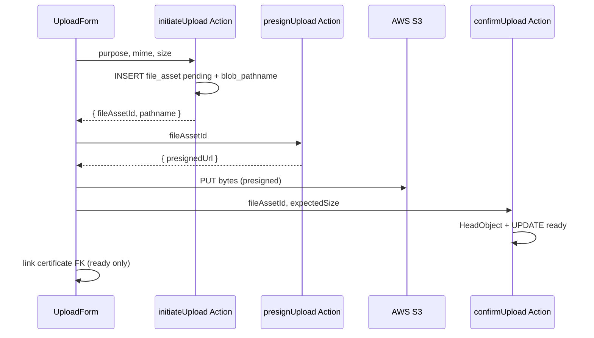

# File Upload Contract — Pulse MVP

**Тип:** Contract  
**Статус:** Canonical  
**Версия:** 1.1  
**Дата:** 2026-05-24  
**Волна:** W8  
**Зависит от:** [`adr_007_file_asset_blob_lifecycle.md`](../../../prds/07_governance/adr_007_file_asset_blob_lifecycle.md), [`authorization_matrix.md`](../../../prds/04_authorization_privacy/authorization_matrix.md)  
**Связанные документы:** [`trainer_verification_contract.md`](./trainer_verification_contract.md)

**Storage:** AWS S3 presigned PUT/GET — [`s3-upload-agent-instruction.md`](../../../guidelines/nextjs/s3-upload-agent-instruction.md).

---

## Purpose

Контракт **загрузки файлов** через `file_asset` + **AWS S3**: initiate → presigned PUT → client upload → HeadObject confirm → link FK. Implements **INV-11**, [`FM-012`](../../../prds/02_domain_model/failure_modes_catalog.md#fm-012).

---

## Scope / Out of scope

**In scope:** Profile photo, trainer certificates (public read), verification documents (private), presigned upload flow via Server Actions.

**Out of scope:** Virus scan, image CDN transforms, orphan GC cron (post-MVP).

---

## Definitions

| `upload_status` | Meaning |
|-----------------|---------|
| `pending` | Row created; bytes not confirmed |
| `ready` | S3 object verified; FK allowed |
| `failed` | Error/timeout |

| `purpose` | Access | Max size |
|---------|--------|----------|
| `profile_photo` | public read (presigned GET) | 5 MB |
| `certificate` | public read (presigned GET) | 10 MB |
| `verification_doc` | private (presigned GET + policy) | 10 MB |

MIME allowlist: `image/jpeg`, `image/png`, `image/webp`, `application/pdf` (purpose-specific subset) — `@pulse/domain` → `validateUploadRequest`.

### S3 object key

| Constant | Value | Location |
|----------|-------|----------|
| `FILE_UPLOAD_OBJECT_KEY_PREFIX` | `pulse/` | `@pulse/domain` |

Pattern: `{prefix}{ownerUserId}/{purpose}/{uuid}` — built server-side via `buildFileUploadObjectKey()`. Stored in `file_asset.blob_pathname`.

---

## Happy path

**Actor:** trainer uploading certificate during onboarding.

**Preconditions:** Authenticated trainer; policy allow.

**Sequence:**

**Postconditions:** `upload_status=ready`; `blob_pathname` canonical S3 key with `pulse/` prefix.

**Side effects:** `revalidatePath` trainer profile routes.

---

## Negative paths (business)

| Condition | Code |
|-----------|------|
| MIME not allowed | `INVALID_MIME` |
| Size exceeded | `FILE_TOO_LARGE` |
| Confirm without S3 object | `UPLOAD_NOT_FOUND` |
| Link FK while `pending` | `INVALID_UPLOAD_STATE` |
| Confirm twice | Idempotent → still `ready` |
| Object key without prefix | Reject at confirm/read |

---

## Security paths

| Scenario | MUST |
|----------|------|
| Initiate without auth | Deny `UNAUTHORIZED` |
| Presign for another user's asset | Owner match + `pending` state |
| Client sets pathname/objectKey | **Ignore** — server generates via `buildFileUploadObjectKey()` |
| Read private verification doc | Presigned GET or authenticated proxy Route + policy |
| Public bucket ACL for verification doc | **Forbidden** — private bucket |
| AWS credentials in client bundle | **Forbidden** |
| Presigned URL in DB as canonical | **Forbidden** — store `blob_pathname` only |

---

## Concurrency & idempotency

- Double confirm same asset: idempotent UPDATE `ready`.
- Two parallel uploads same purpose: both may succeed; UI picks latest; orphan `pending` acceptable MVP.
- Link certificate: transaction checks `upload_status === 'ready'` before FK INSERT — FM-012.

---

## Drift & consistency notes

| Risk | Guard |
|------|-------|
| FM-012 pending FK | Domain validator on link use-cases |
| Expiring signed URL as canonical | Store `blob_pathname` (S3 object key) |
| Vercel Blob SDK in new code | grep `@vercel/blob` |
| Inline prefix `"pulse/"` | Use `FILE_UPLOAD_OBJECT_KEY_PREFIX` |
| Missing pending UI | ui-mutation-pending on upload button |

---

## Policy & layer touchpoints

| Step | Policy | Storage |
|------|--------|---------|
| `InitiateUpload` | `assertCanInitiateUpload(ctx, purpose)` | INSERT pending |
| `PresignUpload` | Owner match + `pending` | Presigned PUT TTL 300s |
| `ConfirmUpload` | Owner match + `isFileUploadObjectKey()` | HeadObject → UPDATE ready |
| `LinkCertificate` | trainer owner + ready asset | FK insert |
| Admin read doc | `assertCanReadPrivateDoc` | Presigned GET or stream via handler |

**MUST NOT** — import `@aws-sdk/*` or `@vercel/blob` in `@pulse/domain`.

---

## Domain / API surface

| Function | Layer | Returns |
|----------|-------|---------|
| `initiateUpload` | composition | `{ fileAssetId, pathname }` |
| `createPresignedPutUrl` | data (server) | `{ presignedUrl }` |
| `confirmUpload` | domain + db | `{ uploadStatus: 'ready' }` |
| `failUpload` | domain + db | `{ uploadStatus: 'failed' }` |
| `validateAssetReadyForLink` | domain | void \| throw `INVALID_UPLOAD_STATE` |
| `buildFileUploadObjectKey` | domain | S3 object key string |
| `isFileUploadObjectKey` | domain | boolean guard |

---

## Requirements

1. **MUST** — single `file_asset` registry (ADR-007).
2. **MUST** — INV-11: FK only when `ready`.
3. **MUST** — server-generated object key with `FILE_UPLOAD_OBJECT_KEY_PREFIX`.
4. **MUST** — AWS credentials never `NEXT_PUBLIC_*`.
5. **SHOULD** — verify magic bytes on confirm.
6. **MUST** — HeadObject before marking `ready`.

---

## Acceptance criteria

- [x] Three-phase lifecycle documented (initiate → PUT → confirm)
- [x] S3 presigned pattern referenced
- [x] FM-012 enforced at link
- [x] Security: auth, private docs, object key prefix
- [x] MIME/size table present
- [x] Link to adr_007 and s3 guideline
- [x] `FILE_UPLOAD_OBJECT_KEY_PREFIX` in domain

---

## Related documents

| Document | Relationship |
|----------|--------------|
| [`adr_007_file_asset_blob_lifecycle.md`](../../../prds/07_governance/adr_007_file_asset_blob_lifecycle.md) | ADR |
| [`s3-upload-agent-instruction.md`](../../../guidelines/nextjs/s3-upload-agent-instruction.md) | Agent guide |
| [`trainer_verification_contract.md`](./trainer_verification_contract.md) | Doc linkage |
| [`domain_invariants.md`](../../../prds/02_domain_model/domain_invariants.md) | INV-11 |
| [`.cursor/rules/s3-file-asset-uploads.mdc`](../../../../.cursor/rules/s3-file-asset-uploads.mdc) | Cursor rule |

**Registry:** [`documentation_creation_registry.md`](../../../meta/documentation_creation_registry.md) — wave W8-07

---

## Agent notes

- **UI phases P10–P11:** `PhotoSlot`, `FileUploadZone` — see [`ui_component_phase_matrix.md`](../ui_component_phase_matrix.md) P10/P11 rows.
- Create DB row **before** S3 bytes upload.
- Profile `photo_url` may mirror ready asset URL — still keep `file_asset` row.
- Post-MVP: cron deletes stale `pending` &gt; 24h; S3 Lifecycle on `pulse/` prefix.
- Legacy `/api/upload` (Vercel Blob) removed — S3 presigned flow via Server Actions + `/api/files/[fileAssetId]` read proxy.

---

## Change log

| Date | Change |
|------|--------|
| 2026-05-23 | v1.0 — file upload contract (Vercel Blob) |
| 2026-05-24 | v1.1 — **S3** presigned flow; `FILE_UPLOAD_OBJECT_KEY_PREFIX`; Blob deprecated |
