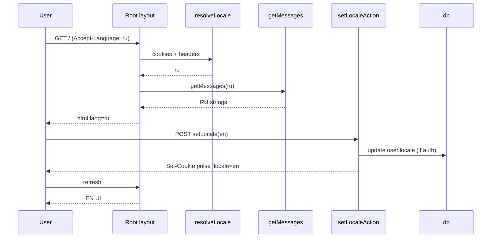

# i18n Runtime Spec — Pulse (P17)

**Тип:** Contract  
**Статус:** Canonical  
**Версия:** 1.1  
**Дата:** 2026-05-25  
**Amend:** 2026-08-11 — P22 Instant Navigations: root layout locale without `auth()` (I18N-MUST-2 exception / MUST-12)  
**Волна:** W24  
**Зависит от:** [`adr_009_ui_locale_strategy.md`](../../../prds/07_governance/adr_009_ui_locale_strategy.md), [`adr_002_next162_vercel_runtime_policy.md`](../../../prds/07_governance/adr_002_next162_vercel_runtime_policy.md), [`database_schema_v1.md`](../../../prds/03_data_model/database_schema_v1.md) §1.2  
**Связанные документы:** [`P17_phase_description.md`](../phases_tasks_descriptions/P17_phase_description.md), [`copy_and_messages.md`](../../../guidelines/react/copy_and_messages.md), [`content_and_microcopy_contract.md`](../../../design/content_and_microcopy_contract.md) §C8

---

## Purpose

Runtime-контракт **UI internationalization** Pulse: supported locales, resolution priority, cookie/query API, messages access, formatters, SEO hooks. Implementation phase **P17**. Samples — in P17 tasks; здесь — behavior contract.

---

## Scope / Out of scope

**In scope:** `en` \| `ru` UI locale; cookie + query override; `Accept-Language` detection; `@/lib/messages` dual files; Intl/date-fns formatting; profile persist to `user.locale`; dynamic `<html lang>`.

**Out of scope:** URL prefix routing; email templates (P21); UGC translation; RTL; third locales; hreflang sitemap.

---

## Definitions

| Term | Value |
|------|-------|
| **`AppLocale`** | `"en"` \| `"ru"` |
| **`DEFAULT_LOCALE`** | `"en"` |
| **`SUPPORTED_LOCALES`** | `["en", "ru"]` as const |
| **`pulse_locale` cookie** | Client persist for active UI locale |
| **`UI locale`** | Language of labels, errors, toasts, metadata |
| **`Trainer timezone`** | IANA zone on `TrainerProfile` — **independent** of UI locale (ADR-004) |
| **`Messages`** | Typed nested object tree; keys English identifiers |

### Intl mapping

| `AppLocale` | `getIntlLocale()` | OG / JSON-LD |
|-------------|-------------------|--------------|
| `en` | `en-US` | `en_US` |
| `ru` | `ru-RU` | `ru_RU` |

---

## Requirements

### I18N-MUST-1 — Supported locales only

Resolver **MUST** return only `en` or `ru`. Any other input **MUST** be ignored or mapped per §3.4.

### I18N-MUST-2 — Resolution priority

Active locale **MUST** be resolved in this order (first match wins):

1. **Query param** `lang` — if value ∈ `SUPPORTED_LOCALES` → use, set cookie, strip query from URL
2. **Cookie** `pulse_locale` — if valid
3. **Authenticated session** — `user.locale` from JWT/session if ∈ `SUPPORTED_LOCALES`
4. **`Accept-Language`** header — per §3.4
5. **`DEFAULT_LOCALE`** (`en`)

**P22 Instant Navigations exception (root layout):** `RootLayoutContent` **MUST NOT** call `auth()` / Auth.js session for step 3. Auth.js uses sync `crypto.getRandomValues()` and triggers `blocking-prerender-crypto`, which blocks a reusable App Shell under `partialPrefetching`. Root resolve = **cookie → Accept-Language / proxy locale header → default** (`resolveLocale()` without `sessionLocale`).

Session `user.locale` remains authoritative for profile/switcher mutations: login, register, and `LocaleSwitcher` **MUST** keep **cookie in sync** with `user.locale` (I18N-MUST-5), so step 3 is satisfied via cookie on subsequent requests without reading JWT in the root layout.
### I18N-MUST-3 — Cookie attributes

| Attribute | Value |
|-----------|-------|
| Name | `pulse_locale` |
| Value | `en` \| `ru` |
| Path | `/` |
| Max-Age | 31536000 (1 year) |
| SameSite | `Lax` |
| Secure | `true` in production |
| HttpOnly | **false** (client switcher MAY read for optimistic UI — optional) |

### I18N-MUST-4 — Query param contract

| Param | Allowed | Behavior |
|-------|---------|----------|
| `lang` | `en`, `ru` | Set cookie; navigate to same path without `lang` (and without other mutation query conflicts) |

Documented in [`canonical_routes.md`](../../../design/canonical_routes.md) §Locale query.

**MUST NOT** treat `lang` as Open Redirect vector — only same-origin path after strip.

### I18N-MUST-5 — Accept-Language mapping

Parse first acceptable language tag (quality-sorted):

| Condition | Resolved locale |
|-----------|-----------------|
| Tag starts with `ru` | `ru` |
| Tag starts with `uk` or `be` | `ru` *(product: Cyrillic-market fallback)* |
| Tag starts with `en` | `en` |
| Other / missing | `en` |

On first anonymous visit when cookie absent, **SHOULD** set `pulse_locale` to resolved value (sticky preference).

### I18N-MUST-6 — Login vs cookie (D6)

When user is authenticated:

- If valid `pulse_locale` cookie present → **cookie wins** for UI (do not overwrite cookie from DB on login)
- If cookie absent → use `user.locale` from session; **SHOULD** write cookie to match
- Profile / switcher change → update **both** cookie and `user.locale`

### I18N-MUST-7 — Registration

On successful `RegisterClient` / `RegisterTrainer` → persist `user.locale` = active locale at signup time.

### I18N-MUST-8 — Messages API

| Context | API |
|---------|-----|
| Server Component / Action / DAL | `const messages = await getMessages()` — locale from `resolveLocale()` |
| Client Component | `useMessages()` via `LocaleProvider` — seeded from server |
| Type export | `import type { Messages } from "@/lib/messages/types"` |

Locale files **MUST** use `satisfies Messages` for parity.

**MUST NOT** duplicate user-visible strings outside `@/lib/messages` (**ui-messages-and-copy**).

### I18N-MUST-9 — Formatters

All user-visible **dates, times, money, relative** strings **MUST** go through `@/lib/i18n/format.ts` with explicit `AppLocale`.

**MUST NOT** hardcode `"ru-RU"` or import `date-fns/locale/ru` outside format module.

Booking slot display **MUST** pass trainer IANA timezone to formatter; UI locale affects month names / 24h vs AM/PM policy per design system.

### I18N-MUST-10 — HTML and metadata

- Root layout: `<html lang={locale}>` where `locale` is `en` or `ru`
- Page `metadata` title/description from `messages.site` (or namespace) for active locale
- Open Graph / JSON-LD: `locale` / `inLanguage` per mapping table

### I18N-MUST-11 — Locale switch UX

- `setLocaleAction(locale)` — validate; set cookie; update DB if authenticated; `revalidatePath` or `router.refresh()`
- **Error:** `toast.error` always on failure (**ui-toast-mutations**)
- **Success:** toast optional (visual switch sufficient)
- Control: `disabled` + `aria-busy` while pending (**ui-mutation-pending**)
- Segmented switcher: `aria-pressed` on active locale

### I18N-MUST-12 — Proxy boundary

Locale resolution **MUST NOT** require `@pulse/policy-server` or Prisma in `proxy.ts`.

Resolve in **Server Components** (root layout) via `cookies()`, `headers()`. **Do not** call `auth()` in root layout content for locale (P22 Instant Navigations — see I18N-MUST-2 exception). Session locale reaches the layout through the **cookie** after login/switcher sync.

**MAY** add lightweight `Accept-Language` → cookie set in layout on first visit — not in proxy.
---

## Happy path

### Anonymous first visit (Russian browser)

1. GET `/` — no cookie.
2. Layout reads `Accept-Language: ru-RU,ru;q=0.9`.
3. Resolver → `ru`; sets cookie `pulse_locale=ru`.
4. `getMessages("ru")`; `<html lang="ru">`; RU copy.

### Explicit switch

1. User taps **EN** on `LocaleSwitcher`.
2. `setLocaleAction("en")` → cookie + refresh.
3. All visible copy and formatters use EN.

### Deep link with query

1. GET `/trainers?lang=en`.
2. Set cookie `pulse_locale=en`.
3. Redirect/replace to `/trainers`.
4. Catalog in English.



---

## Negative paths

| Scenario | Behavior |
|----------|----------|
| `?lang=fr` | Ignore; fall through resolver |
| Invalid cookie value | Treat as absent |
| `user.locale` invalid in DB | Fallback `en`; migration/fix script out of band |
| `setLocaleAction` unauthorized tampering | Zod validate `en`\|`ru` only |
| Missing translation key | Prevented by TypeScript `satisfies Messages` |

---

## Security paths

| Scenario | MUST |
|----------|------|
| `?lang=` redirect | Same path only; no external `callbackUrl` pattern |
| Locale in JWT (optional future) | Must match allowlist; no role escalation |
| Server Action locale param | Validate against `SUPPORTED_LOCALES` |

---

## Concurrency & races

| Scenario | Resolution |
|----------|------------|
| Double-click switcher | Idempotent set same locale; pending UI prevents duplicate POST |
| Tab A EN / Tab B RU | Last write wins on cookie; acceptable MVP |
| Register + cookie race | Transaction: create user with resolved locale |

---

## Drift & consistency notes

| Risk | Guard |
|------|-------|
| `ru.ts` only updated | CI: both files `satisfies Messages` |
| Hardcoded RU in TSX | Grep gate in P17_tasks Wave B |
| UI locale vs trainer TZ confused | Code review + ADR-004 cross-link |
| P16 landing adds RU strings | Use `getMessages()` from start |
| DB default `en` vs old RU-only UI | P17 aligns product to DDL |

---

## File layout (target)

```
apps/web/src/lib/
  i18n/
    constants.ts
    resolve-locale.ts
    cookie.ts
    format.ts
  messages/
    types.ts
    en.ts
    ru.ts
    index.ts
  components/i18n/
    LocaleSwitcher.client.tsx
    LocaleProvider.client.tsx
    LocaleSettingsRow.tsx
```

---

## Acceptance criteria

- [ ] Resolver implements I18N-MUST-2 priority exactly
- [ ] Cookie matches I18N-MUST-3
- [ ] `en.ts` / `ru.ts` key parity enforced by types
- [ ] No product `"ru-RU"` outside `format.ts`
- [ ] `<html lang>` dynamic
- [ ] Profile + switcher persist per I18N-MUST-6/7
- [ ] Smoke paths in [`P17_tasks.md`](../tasks/P17_tasks.md) Wave E

---

## Related documents

| Document | Relationship |
|----------|--------------|
| [`adr_009_ui_locale_strategy.md`](../../../prds/07_governance/adr_009_ui_locale_strategy.md) | Strategic decisions |
| [`P17_phase_description.md`](../phases_tasks_descriptions/P17_phase_description.md) | Phase scope |
| [`canonical_routes.md`](../../../design/canonical_routes.md) | `?lang=` inventory |
| [ADR-002](../../../prds/07_governance/adr_002_next162_vercel_runtime_policy.md) §5.1 | Instant Navigations — why root layout avoids `auth()` for locale |

**Registry:** W24

---

## Change log

| Date | Change |
|------|--------|
| 2026-08-11 | v1.1 — document P22 exception: root layout resolveLocale without Auth.js (cookie sync covers session locale) |
| 2026-05-25 | v1.0 — P17 i18n runtime contract |