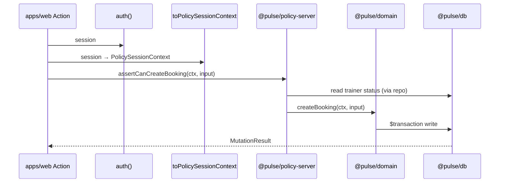

# Monorepo Boundaries Contract — Pulse MVP

**Тип:** Contract  
**Статус:** Canonical  
**Версия:** 1.0  
**Дата:** 2026-05-23  
**Волна:** W8  
**Зависит от:** [`monorepo_packages.md`](../../../prds/05_runtime/monorepo_packages.md), [`domain_invariants.md`](../../../prds/02_domain_model/domain_invariants.md), [`policy_enforcement_contract.md`](../../../prds/04_authorization_privacy/policy_enforcement_contract.md)  
**Связанные документы:** [`AGENTS.md`](../../../../AGENTS.md), [`authorization_policy_contract.md`](./authorization_policy_contract.md)

---

## Purpose

Контракт **границ monorepo Pulse** для P01–P03: allowed/forbidden imports, runtime constraints, ESLint enforcement, и touchpoints между `apps/*` и `packages/*`. Читают AI-агенты при scaffold первых packages и code review.

**Context7 verified:** Next.js 16.2 — `proxy.ts` export `function proxy(request: NextRequest)`, **nodejs runtime only** (Edge не поддерживается в proxy).

---

## Scope / Out of scope

**In scope:** `@pulse/domain`, `@pulse/policy-edge`, `@pulse/policy-server`, `@pulse/db`, `apps/web`, planned `apps/workers`.

**Out of scope:** CI pipeline YAML, npm publish, Turborepo (optional later), детали `assertCan*` (→ [`authorization_policy_contract.md`](./authorization_policy_contract.md)).

---

## Definitions

| Symbol | Meaning |
|--------|---------|
| **PKG-01** | `domain` MUST NOT import Next.js, Prisma, Vercel SDK |
| **PKG-02** | `policy-server` / `db` MUST NOT import from `proxy.ts` or client bundles |
| **PKG-03** | Packages MUST NOT import `next-auth` `Session`; use `PolicySessionContext` |
| **Thin adapter** | `apps/web` handler: auth → policy → domain → db, ≤ orchestration |

---

## Happy path

**Actor:** developer implementing `CreateBooking` Server Action.

**Preconditions:** workspaces configured; packages scaffolded per [`monorepo_packages.md`](../../../prds/05_runtime/monorepo_packages.md).

**Sequence:**

**Postconditions:** No business rule in `apps/web` beyond mapping; typecheck passes at root.

**Side effects:** None at package boundary level.

---

## Negative paths (business)

| Condition | Layer | Response |
|-----------|-------|----------|
| Import `@pulse/db` in `'use client'` component | build | Fail — server-only |
| Domain throws raw Prisma error | apps/web | Map to `MutationResult` / toast |
| Missing workspace in root `package.json` | npm | Install/link fail |
| Deep relative import `../../../packages/domain` | lint | Use `@pulse/domain` alias |

---

## Security paths

| Scenario | MUST behavior |
|----------|---------------|
| `@pulse/policy-server` in `proxy.ts` | **Forbidden** — ESLint PKG-02 |
| `@pulse/db` in `@pulse/policy-edge` | **Forbidden** |
| Secrets in `packages/*` | **Forbidden** — env only in `apps/*` |
| policy-server bundled to client | **Forbidden** — `import "server-only"` on db/policy-server entries |

**N/A:** N/A for end-user auth — see [`authorization_policy_contract.md`](./authorization_policy_contract.md).

---

## Concurrency & idempotency

Package boundaries **do not** replace DB transactions. Domain + db own race resolution ([`FM-001`](../../../prds/02_domain_model/failure_modes_catalog.md#fm-001), [`FM-015`](../../../prds/02_domain_model/failure_modes_catalog.md#fm-015)).

**MUST** — workers and web share same domain/db packages; no duplicated booking logic in `apps/workers`.

---

## Drift & consistency notes

| Risk | Guard |
|------|-------|
| PKG-03: `Session` in packages | ESLint + typescript-monorepo-types rule |
| FM-017 enum drift | Same PR: schema + `@pulse/domain` literals |
| `middleware.ts` new logic | Migrate to `proxy.ts` per ADR-002 |
| Lampto `@bsfy/*` names copied | Use `@pulse/*` only |
| Business logic only in apps | PR review — extract to domain before P03 merge |

**MUST** — first package PR adds: workspace entry, `transpilePackages`, ESLint boundary rules together.

---

## Policy & layer touchpoints

### Allowed dependency graph

| From | To | Notes |
|------|-----|-------|
| `apps/web` | all `@pulse/*` | Thin adapters |
| `apps/workers` | domain, db, policy-server | No React |
| `@pulse/policy-server` | domain, db | Object ACL |
| `@pulse/policy-edge` | domain only | JWT/path |
| `@pulse/db` | domain (types) | Prisma repos |
| `@pulse/domain` | — | Pure TS + TZ lib |

### Forbidden (hard)

| Pattern | Rule |
|---------|------|
| `packages/*` → `apps/*` | PKG |
| `domain` → `db` / `next` / `@vercel/blob` | PKG-01 |
| `policy-edge` → `db` | No DB at edge |
| Full `auth.ts` in `proxy.ts` | auth.config only |
| Prisma in `apps/web` directly | Via domain + db package |

### File placement (target)

| Concern | Location |
|---------|----------|
| Use-cases | `packages/domain/src/**` |
| Repositories | `packages/db/src/**` |
| `assertCan*` | `packages/policy/server/src/**` |
| Path/JWT helpers | `packages/policy/edge/src/**` |
| Composition wiring | `apps/web/src/server/**/composition.ts` |
| User strings | `apps/web/src/lib/messages/**` |

---

## Requirements

1. **MUST** — enforce PKG-01…PKG-03 via ESLint in same PR as package scaffold.
2. **MUST** — root `npm run typecheck` covers all workspaces.
3. **MUST** — `import "server-only"` in `@pulse/db` and `@pulse/policy-server` entrypoints.
4. **MUST NOT** — implement domain use-cases inline in `page.tsx` beyond one-off P01 shell.
5. **SHOULD** — one composition module per bounded context (booking, trainer, admin).

---

## Acceptance criteria

- [ ] Happy path sequence shows apps → policy → domain → db
- [ ] PKG-01…PKG-03 documented with forbidden imports
- [ ] Security: policy-server not in proxy/client
- [ ] Drift guards reference FM-017
- [ ] Links to monorepo_packages and AGENTS.md
- [ ] Context7 proxy nodejs runtime noted

---

## Related documents

| Document | Relationship |
|----------|--------------|
| [`monorepo_packages.md`](../../../prds/05_runtime/monorepo_packages.md) | PRD layout |
| [`domain_invariants.md`](../../../prds/02_domain_model/domain_invariants.md) | PKG rules |
| [`policy_enforcement_contract.md`](../../../prds/04_authorization_privacy/policy_enforcement_contract.md) | Layer model |
| [`authorization_policy_contract.md`](./authorization_policy_contract.md) | policy-server API |
| [`AGENTS.md`](../../../../AGENTS.md) | Monorepo entry |

**Registry:** [`documentation_creation_registry.md`](../../../meta/documentation_creation_registry.md) — wave W8-01

---

## Agent notes

- P01 may scaffold packages empty; this contract applies before first domain PR merges.
- Do not create `packages/integrations` without ADR.
- Reference lampto monorepo pattern — Pulse product rules from PRD only.

---

## Change log

| Date | Change |
|------|--------|
| 2026-05-23 | v1.0 — monorepo boundaries contract |
