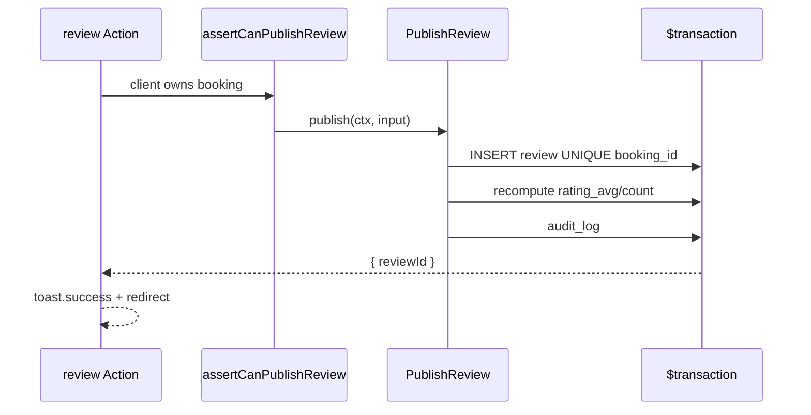

# Review Moderation Contract — Pulse MVP

**Тип:** Contract  
**Статус:** Canonical  
**Версия:** 1.0  
**Дата:** 2026-05-23  
**Волна:** W8  
**Зависит от:** [`lifecycle_models.md`](../../../prds/02_domain_model/lifecycle_models.md), [`authorization_matrix.md`](../../../prds/04_authorization_privacy/authorization_matrix.md)  
**Связанные документы:** [`booking_lifecycle_contract.md`](./booking_lifecycle_contract.md), [`authorization_policy_contract.md`](./authorization_policy_contract.md)

---

## Purpose

Контракт **отзывов и модерации**: client publish (once), admin hide/delete, rating denormalization. Implements [`FM-006`](../../../prds/02_domain_model/failure_modes_catalog.md#fm-006), INV-09, INV-10.

---

## Scope / Out of scope

**In scope:** `PublishReview`, `HideReview`, `UnhideReview` (optional MVP), `DeleteReview`, public read filters.

**Out of scope:** Client edit after publish, trainer replies, ML toxicity (post-MVP).

---

## Definitions

```typescript
type PublishReviewInput = {
  bookingId: string;
  rating: 1 | 2 | 3 | 4 | 5;
  body: string; // 20–500 chars per schema CHECK
};
```

| Visibility | Condition |
|------------|-----------|
| Public | `is_hidden = false` |
| Hidden | admin `HideReview` |
| Removed | `DeleteReview` hard delete MVP |

---

## Happy path

**Actor:** client after completed booking.

**Preconditions:** Booking `status=completed`; booking owned by client; no existing review.

**Sequence:**



**Postconditions:** One review per booking; trainer rating updated.

**Side effects:** `revalidateTag` trainer profile + reviews.

---

## Negative paths (business)

| Condition | Code | FM |
|-----------|------|-----|
| Booking not `completed` | `BOOKING_NOT_REVIEWABLE` | — |
| Review already exists | `REVIEW_ALREADY_EXISTS` | FM-006 |
| Rating out of range | `VALIDATION_ERROR` | — |
| Body length invalid | `VALIDATION_ERROR` | — |
| Client hide own review | `FORBIDDEN` | — |
| Hide already deleted | `NOT_FOUND` | — |

**FM-006 UX:** second submit → graceful message + redirect to existing review (no stack trace).

---

## Security paths

| Scenario | MUST | FM |
|----------|------|-----|
| Publish on others' booking | Deny | FM-004 |
| Trainer publishes review | Deny | FM-005 |
| Admin hide | `assertCanModerateReview` | FM-005 |
| Read hidden review on public profile | Exclude from query | — |

---

## Concurrency & idempotency

### FM-006 — double submit

**MUST:**

- DB UNIQUE on `booking_id`
- Catch `P2002` → return `{ ok: false, code: 'REVIEW_ALREADY_EXISTS' }` or fetch existing id

**MUST** — rating recalc in **same transaction** as insert (INV-09):

```typescript
await prisma.$transaction(async (tx) => {
  await tx.review.create({ ... });
  const agg = await tx.review.aggregate({ where: { trainerProfileId, isHidden: false } });
  await tx.trainerProfile.update({ data: { ratingAvg, ratingCount } });
});
```

---

## Drift & consistency notes

| Risk | Guard |
|------|-------|
| Client update endpoint | No use-case exported |
| Hidden reviews in aggregate | Recalc excludes `isHidden: true` |
| N+1 rating updates | Single aggregate query |

---

## Policy & layer touchpoints

| Use-case | Policy |
|----------|--------|
| `PublishReview` | `assertCanPublishReview` — client + completed + owner |
| `HideReview` / `DeleteReview` | `assertCanModerateReview` — admin |
| `ListVisibleReviews` | public — `isHidden: false` |

---

## Requirements

1. **MUST** — one review per booking (INV-09).
2. **MUST NOT** — client edit after publish (INV-10).
3. **MUST** — admin-only hide/delete.
4. **MUST** — rating 1–5, body 20–500 chars.
5. **SHOULD** — audit_log on admin moderation actions.

---

## Acceptance criteria

- [ ] Publish happy path with transaction
- [ ] FM-006 UNIQUE handling
- [ ] Security: ownership + admin only hide
- [ ] Negative: non-completed booking
- [ ] Rating denormalization in same tx
- [ ] Links lifecycle_models + booking contract

---

## Related documents

| Document | Relationship |
|----------|--------------|
| [`lifecycle_models.md`](../../../prds/02_domain_model/lifecycle_models.md) | Review SM |
| [`booking_lifecycle_contract.md`](./booking_lifecycle_contract.md) | completed gate |
| [`authorization_matrix.md`](../../../prds/04_authorization_privacy/authorization_matrix.md) | Review rows |
| [`domain_invariants.md`](../../../prds/02_domain_model/domain_invariants.md) | INV-09, INV-10 |
| [`failure_modes_catalog.md`](../../../prds/02_domain_model/failure_modes_catalog.md) | FM-006 |
| [`../specs/catalog_discovery_spec.md`](../specs/catalog_discovery_spec.md) | Public reviews tab (W9) |

**Registry:** [`documentation_creation_registry.md`](../../../meta/documentation_creation_registry.md) — wave W8-08

---

## Agent notes

- Review prompt in-app after complete — no email MVP.
- `UnhideReview` optional; if omitted, admin can delete + client republish policy TBD — MVP: support unhide for mistakes.
- Do not allow review on `cancelled` bookings.

---

## Change log

| Date | Change |
|------|--------|
| 2026-05-23 | v1.0 — review moderation contract |
