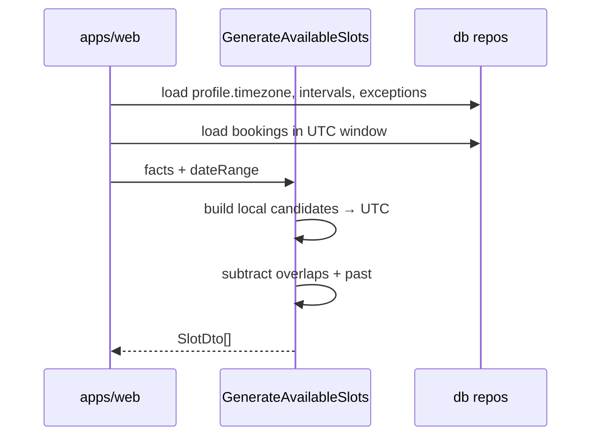

# Schedule & Slots Contract — Pulse MVP

**Тип:** Contract  
**Статус:** Canonical  
**Версия:** 1.0  
**Дата:** 2026-05-23  
**Волна:** W8  
**Зависит от:** [`adr_004_timezone_scheduling_model.md`](../../../prds/07_governance/adr_004_timezone_scheduling_model.md), [`lifecycle_models.md`](../../../prds/02_domain_model/lifecycle_models.md), [`data_access_patterns.md`](../../../prds/03_data_model/data_access_patterns.md)  
**Связанные документы:** [`booking_lifecycle_contract.md`](./booking_lifecycle_contract.md)

**Context7 verified:** Prisma interactive `$transaction` with optional `isolationLevel: Serializable`; retry on `P2034` for write conflicts.

---

## Purpose

Контракт **генерации слотов и расписания** между `@pulse/domain`, `@pulse/db` и UI: inputs/outputs, TZ rules, overlap inputs, error codes. Implements [`FM-001`](../../../prds/02_domain_model/failure_modes_catalog.md#fm-001), [`FM-009`](../../../prds/02_domain_model/failure_modes_catalog.md#fm-009).

---

## Scope / Out of scope

**In scope:** `GenerateAvailableSlots`, `UpsertWeeklyIntervals`, `UpsertScheduleException`, slot DTO, overlap fact queries.

**Out of scope:** Booking state transitions (→ booking_lifecycle_contract), UI calendar widgets (→ W9 specs), post-MVP reminder cron.

---

## Definitions

| Term | Type / rule |
|------|-------------|
| `SlotDto` | `{ startsAtUtc: string (ISO), durationMinutes: number, localLabel: string }` |
| `DateRange` | `{ fromLocalDate: string, toLocalDate: string }` in trainer calendar |
| `WeeklyIntervalInput` | `{ dayOfWeek: 0–6, startTime: HH:mm, endTime: HH:mm }` local |
| `ScheduleExceptionInput` | `{ exceptionDate: YYYY-MM-DD local, isBlocked: boolean }` |

**MUST** — `dayOfWeek` 0 = Monday per schema and ADR-004.

---

## Happy path

**Actor:** client on `/book/[trainerId]` selecting a date.

**Preconditions:** Trainer `approved`; weekly intervals configured; service active.

**Sequence:**



**Postconditions:** All returned `startsAtUtc` are bookable at generation time (re-validated on create).

---

## Negative paths (business)

| Condition | Code | UX (spec layer) |
|-----------|------|-----------------|
| Trainer not approved | `TRAINER_NOT_BOOKABLE` | 404 / not in wizard |
| No weekly intervals | `SCHEDULE_NOT_CONFIGURED` | Empty slot state + trainer message |
| Date fully blocked | `[]` slots | Empty day — not error |
| Invalid IANA timezone | `INVALID_TIMEZONE` | Profile save error |
| `endTime <= startTime` | `INVALID_INTERVAL` | Form validation |
| Range > 90 days | `RANGE_TOO_LARGE` | Clamp in UI |

---

## Security paths

| Scenario | MUST |
|----------|------|
| Client POST arbitrary `startsAtUtc` on create | Server validates against freshly generated allowlist or regenerates + match |
| Read slots for pending trainer | Return empty / deny profile — [`FM-003`](../../../prds/02_domain_model/failure_modes_catalog.md#fm-003) |
| Trainer edits another's schedule | policy `assertCanMutateSchedule` — [`FM-016`](../../../prds/02_domain_model/failure_modes_catalog.md#fm-016) |

---

## Concurrency & idempotency

### FM-001 — double book same slot

**MUST** inside `CreateBooking` transaction (see booking contract):

1. Load overlapping non-`cancelled` bookings with row lock (`FOR UPDATE` via `$queryRaw` or serializable transaction).
2. If overlap exists → `SLOT_UNAVAILABLE`.
3. Else INSERT booking.

**Prisma pattern (Context7):**

```typescript
await prisma.$transaction(
  async (tx) => {
    // overlap check + insert
  },
  {
    isolationLevel: Prisma.TransactionIsolationLevel.Serializable,
    maxWait: 5000,
    timeout: 10000,
  },
);
// Retry up to N times on error.code === "P2034"
```

**Owner:** implements [`FM-001`](../../../prds/02_domain_model/failure_modes_catalog.md#fm-001).

### Schedule edits during booking

Trainer `UpsertWeeklyIntervals` concurrent with client book — booking transaction uses **current** DB facts; loser gets `SLOT_UNAVAILABLE` or success independently.

---

## Drift & consistency notes

| Risk | Guard |
|------|-------|
| FM-009 server TZ slot math | All generation in `@pulse/domain`; ban in apps |
| Mixed date-fns + Temporal | One library per ADR-004 |
| Weekly `time` stored as UTC | Schema uses local `time` — never convert wrong |
| Cache stale slots | Short TTL or revalidate on schedule mutation tags |

DST: **MUST** unit-test one spring-forward and fall-back week for default seed TZ.

---

## Policy & layer touchpoints

| Use-case | Policy | Domain | Db |
|----------|--------|--------|-----|
| `GenerateAvailableSlots` | Public read approved only | Pure compute | Facts loader |
| `UpsertWeeklyIntervals` | `assertCanMutateSchedule` | Validate intervals | Transaction replace |
| `UpsertScheduleException` | `assertCanMutateSchedule` | Validate dates | Upsert row |

Apps/web **MUST NOT** compute slot lists locally.

---

## Domain API (target)

| Export | Input | Output |
|--------|-------|--------|
| `generateAvailableSlots` | `{ timezone, intervals, exceptions, bookings, range, slotDurationMinutes }` | `SlotDto[]` |
| `validateWeeklyIntervals` | intervals[] | `void` \| throw |
| `localDateToUtcInstant` | local datetime + IANA | UTC Date |

---

## Requirements

1. **MUST** — INV-01: trainer IANA timezone only.
2. **MUST** — exclude past instants (`startsAt <= now()`).
3. **MUST** — overlap uses non-`cancelled` bookings only.
4. **MUST** — slot duration from selected `trainer_service.duration_minutes`.
5. **MUST NOT** — accept client-local timezone for slot generation.

---

## Acceptance criteria

- [ ] Happy path sequence domain-centric
- [ ] FM-001 transaction + Serializable/retry documented
- [ ] FM-009 drift guards listed
- [ ] Negative: empty schedule, invalid TZ
- [ ] Security: tampered instant rejected at create
- [ ] Prisma Context7 pattern referenced

---

## Related documents

| Document | Relationship |
|----------|--------------|
| [`adr_004_timezone_scheduling_model.md`](../../../prds/07_governance/adr_004_timezone_scheduling_model.md) | TZ ADR |
| [`lifecycle_models.md`](../../../prds/02_domain_model/lifecycle_models.md) | Schedule derived state |
| [`data_access_patterns.md`](../../../prds/03_data_model/data_access_patterns.md) | Query patterns |
| [`booking_lifecycle_contract.md`](./booking_lifecycle_contract.md) | Create overlap |
| [`failure_modes_catalog.md`](../../../prds/02_domain_model/failure_modes_catalog.md) | FM-001, FM-009 |

**Registry:** [`documentation_creation_registry.md`](../../../meta/documentation_creation_registry.md) — wave W8-03

---

## Agent notes

- Display `localLabel` using trainer TZ; client list may format separately per ADR-004.
- Do not cache slot lists across users without trainerId + range key.
- Overlap SQL lives in one db module — see data_access_patterns.

---

## Change log

| Date | Change |
|------|--------|
| 2026-05-23 | v1.0 — schedule and slots contract |
