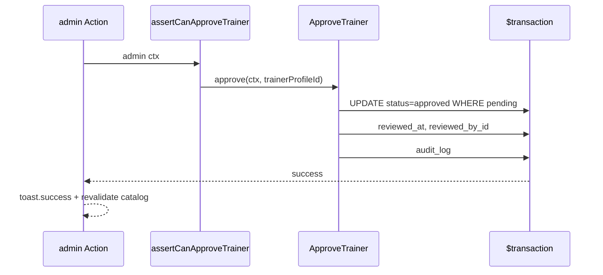

# Trainer Verification Contract — Pulse MVP

**Тип:** Contract  
**Статус:** Canonical  
**Версия:** 1.0  
**Дата:** 2026-05-23  
**Волна:** W8  
**Зависит от:** [`lifecycle_models.md`](../../../prds/02_domain_model/lifecycle_models.md), [`authorization_matrix.md`](../../../prds/04_authorization_privacy/authorization_matrix.md), [`file_upload_contract.md`](./file_upload_contract.md)  
**Связанные документы:** [`authorization_policy_contract.md`](./authorization_policy_contract.md)

---

## Purpose

Контракт **модерации тренеров**: submit/resubmit, admin approve/reject/revoke, validation gates, catalog visibility. Implements FM-003, FM-010, FM-014.

---

## Scope / Out of scope

**In scope:** `SubmitTrainerApplication`, `ResubmitTrainerApplication`, `ApproveTrainer`, `RejectTrainer`, `RevokeTrainerApproval`, admin queue reads.

**Out of scope:** Automated ML verification, email E-01/E-02 (post-MVP), trainer onboarding UI steps (→ W9 spec).

---

## Definitions

| Status | Catalog | Bookable |
|--------|---------|----------|
| `pending` | hidden | no |
| `approved` | visible | yes |
| `rejected` | hidden | no |

```typescript
type RejectTrainerInput = {
  trainerProfileId: string;
  rejectionReason: string; // SHOULD required, min length
};
```

---

## Happy path

**Actor:** admin approving pending trainer.

**Preconditions:** Profile `status=pending`; required docs linked (`file_asset.ready`).

**Sequence:**



**Postconditions:** Trainer in public catalog; bookings enabled.

**Side effects:** Cache tags `trainers`, `trainer:{id}` invalidated.

---

## Negative paths (business)

| Use-case | Condition | Code | FM |
|----------|-----------|------|-----|
| `ApproveTrainer` | Not `pending` | `INVALID_STATUS_TRANSITION` | FM-010 |
| `ApproveTrainer` | Missing required docs | `APPLICATION_INCOMPLETE` | — |
| `RejectTrainer` | Missing reason | `VALIDATION_ERROR` | — |
| `RevokeTrainerApproval` | Future confirmed bookings | `TRAINER_HAS_ACTIVE_BOOKINGS` | FM-014 |
| `SubmitTrainerApplication` | Already `approved` | `ALREADY_APPROVED` | — |
| Trainer self-approve | — | `FORBIDDEN` | FM-005 |

**Resubmit:** `rejected` → `pending` via `ResubmitTrainerApplication`; clears rejection fields; new queue position by `submitted_at`.

---

## Security paths

| Scenario | MUST | FM |
|----------|------|-----|
| Trainer approves self | Deny | FM-005 |
| Client calls approve | Deny | FM-005 |
| Read pending docs as guest | Deny | — |
| Public API lists pending trainer | Filter `approved` only | FM-003 |

---

## Concurrency & idempotency

### FM-010 — dual admin approve/reject

**MUST:**

```typescript
updateMany({
  where: { id, status: "pending" },
  data: { status: "approved", ... },
});
// count === 0 → ALREADY_PROCESSED or STALE_STATE
```

Second admin gets error + UI refresh queue.

### FM-014 — revoke with active bookings

**MVP lock:** count future `confirmed`/`pending` bookings with `starts_at > now()`; if &gt; 0 → deny revoke.

---

## Drift & consistency notes

| Risk | Guard |
|------|-------|
| Pending in catalog | Integration test ListApprovedTrainers |
| Approve without docs | Domain validator + admin UI checklist |
| FM-012 pending file FK | file_upload_contract link gate |

---

## Policy & layer touchpoints

| Use-case | Policy | Domain |
|----------|--------|--------|
| `SubmitTrainerApplication` | `assertCanMutateTrainerProfile` | → pending |
| `ApproveTrainer` | `assertCanApproveTrainer` | transition |
| `RejectTrainer` | `assertCanApproveTrainer` | transition |
| `RevokeTrainerApproval` | `assertCanApproveTrainer` | FM-014 check |
| `ListPendingTrainers` | admin role | read repo |

---

## Requirements

1. **MUST** — INV-03/04: catalog only `approved`.
2. **MUST** — `CreateBooking` precheck trainer approved (FM-003).
3. **MUST** — admin mutations set `reviewed_by_id`, `reviewed_at`.
4. **SHOULD** — `rejection_reason` on reject.
5. **MUST NOT** — trainer change own `status` field directly.

---

## Acceptance criteria

- [ ] Submit → approve happy path
- [ ] FM-010 conditional update documented
- [ ] FM-014 revoke block documented
- [ ] Security: self-approve denied
- [ ] Negative: incomplete application
- [ ] Link file_upload for doc readiness

---

## Related documents

| Document | Relationship |
|----------|--------------|
| [`lifecycle_models.md`](../../../prds/02_domain_model/lifecycle_models.md) | Trainer SM |
| [`authorization_matrix.md`](../../../prds/04_authorization_privacy/authorization_matrix.md) | Admin rows |
| [`file_upload_contract.md`](./file_upload_contract.md) | Doc assets |
| [`booking_lifecycle_contract.md`](./booking_lifecycle_contract.md) | FM-003 |
| [`failure_modes_catalog.md`](../../../prds/02_domain_model/failure_modes_catalog.md) | FM-010, FM-014 |
| [`../specs/admin_verification_spec.md`](../specs/admin_verification_spec.md) | Admin UX (W9) |
| [`../specs/trainer_onboarding_spec.md`](../specs/trainer_onboarding_spec.md) | Onboarding UX (W9) |
| [`../../architecture_learning_pack/03_trainer_verification_layers.md`](../../architecture_learning_pack/03_trainer_verification_layers.md) | Layer walkthrough (W13) |

**Registry:** [`documentation_creation_registry.md`](../../../meta/documentation_creation_registry.md) — wave W8-06

---

## Agent notes

- Trainer register flow creates `pending` in same transaction as user — auth_runtime_spec.
- Revoke is rare; prefer reject before ever approved if mistake.
- Do not send email on approve until P06 post-MVP.

---

## Change log

| Date | Change |
|------|--------|
| 2026-05-23 | v1.0 — trainer verification contract |
