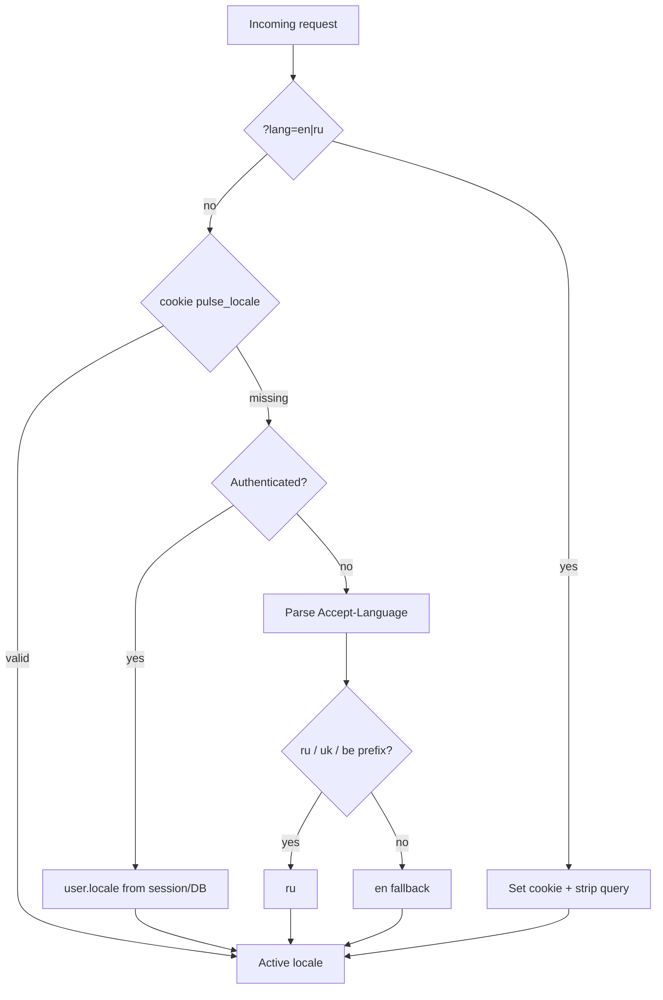

# P17 — UI Internationalization (EN/RU)

**Тип:** Phase Description  
**Статус:** Canonical  
**Версия:** 1.0  
**Дата:** 2026-05-25  
**Волна:** W24  
**Зависит от:** [`P14_phase_description.md`](./P14_phase_description.md), [`adr_009_ui_locale_strategy.md`](../../../prds/07_governance/adr_009_ui_locale_strategy.md), [`i18n_runtime_spec.md`](../contracts/i18n_runtime_spec.md)  
**Связанные документы:** [`P17_tasks.md`](../tasks/P17_tasks.md), [`copy_and_messages.md`](../../../guidelines/react/copy_and_messages.md), [`content_and_microcopy_contract.md`](../../../design/content_and_microcopy_contract.md) §C8, [`database_schema_v1.md`](../../../prds/03_data_model/database_schema_v1.md) §1.2

---

## Purpose

Фаза **P17** — платформа локали UI для Pulse: **EN (default)** и **RU**, автоматическое определение языка браузера, явный переключатель, persist в cookie и `user.locale`, централизованное форматирование дат/денег.

**Архитектурный принцип:** **cookie-first locale resolution** без prefix-маршрутов `/[lang]/…` — минимальный blast radius для 50+ canonical routes, auth `callbackUrl`, iOS Safari mutation transport и `proxy.ts` (ADR-002).

**Аудитория:** AI-агенты после P14 quality gate.

---

## Agent context budget

| # | Document | Why |
|---|----------|-----|
| 1 | [`P17_tasks.md`](../tasks/P17_tasks.md) | Checklist waves A–E |
| 2 | [`adr_009_ui_locale_strategy.md`](../../../prds/07_governance/adr_009_ui_locale_strategy.md) | Decisions D1–D8 |
| 3 | [`i18n_runtime_spec.md`](../contracts/i18n_runtime_spec.md) | Resolver, cookie, API, formatters |
| 4 | [`copy_and_messages.md`](../../../guidelines/react/copy_and_messages.md) | Messages tree + import patterns |
| 5 | [`content_and_microcopy_contract.md`](../../../design/content_and_microcopy_contract.md) §C8 | i18n readiness rules |
| 6 | [`database_schema_v1.md`](../../../prds/03_data_model/database_schema_v1.md) §1.2 | `user.locale` DDL |
| 7 | [`ui_component_phase_matrix.md`](../ui_component_phase_matrix.md) | P17 row |
| 8 | [`canonical_routes.md`](../../../design/canonical_routes.md) | Query `?lang=` contract |

**Wireframes:** [`client_profile.md`](../../../design/wireframes/mvp/client_profile.md) v2 (language row); trainer profile — mirror language row (no separate wireframe).

**MUST NOT read** P18 people ops or P21 email in the same session unless cross-linking only.

---

## Scope / Out of scope

### In scope

| Area | Deliverable |
|------|-------------|
| **ADR & contract** | ADR-009 ACCEPTED; `i18n_runtime_spec.md` |
| **Locale model** | `en` \| `ru`; default **`en`**; `SUPPORTED_LOCALES`, `DEFAULT_LOCALE` in `@/lib/i18n` |
| **Resolution** | Priority chain: `?lang=` → cookie `pulse_locale` → session `user.locale` → `Accept-Language` → `en` |
| **Messages** | `en.ts` + `ru.ts`; shared `Messages` type; `getMessages(locale)` server API |
| **Client context** | `LocaleProvider` + `useMessages()` for interactive UI (incremental migration) |
| **Formatters** | `@/lib/i18n/format.ts` — money, date/time, relative, date-fns/Intl locale mapping |
| **HTML / SEO** | Dynamic `<html lang>`; metadata + OG `locale` / JSON-LD `inLanguage` per active locale |
| **UX** | `LocaleSwitcher` (Design Lab + product); marketing footer/nav; profile settings row |
| **Persist** | Server Action `setLocaleAction` → cookie + `user.locale` update when authenticated |
| **Registration** | Set `user.locale` from active locale at signup |
| **Audit** | Remove hardcoded `ru-RU` / inline RU strings outside `@/lib/messages` |

### Out of scope

- URL prefix i18n (`/en/…`, `/ru/…`) — post-MVP MAY (ADR-009 D8)
- Third locales, RTL, ICU runtime beyond keyed plurals (C8)
- Translation of UGC (trainer bio, reviews, admin notes)
- Email / push copy localization → **P21**
- `trainer.languages[]` profile field (DDL deferred)
- CMS / translation management platform
- Full hreflang matrix (MAY defer; correct `lang` sufficient for P17)

---

## Implementation waves

| Wave | Focus | Pilot / exit criteria |
|------|-------|------------------------|
| **A — Foundation** | ADR-009, resolver, cookie, `en.ts` skeleton, `getMessages()`, dynamic `lang` | Landing `/` + `/auth/login` render EN default + RU via cookie |
| **B — Full copy** | Complete `en.ts` parity with `ru.ts`; typecheck key parity | `satisfies Messages` on both locale files |
| **C — Formatters** | Centralize Intl/date-fns; booking/catalog/admin dates | No scattered `"ru-RU"` in product code |
| **D — UX & persist** | `LocaleSwitcher`, profile rows, `setLocaleAction`, register locale | Wireframe client_profile §language → real |
| **E — Verification** | Smoke EN/RU × critical paths; docs sync | P17_tasks Block E complete |

**Coordination:** P16 landing copy SHOULD use `getMessages()` when P16 lands before or with P17 — avoid new hardcoded RU in landing modules.

---

## UI Catalog (this phase)

| Action | Component | Route / placement |
|--------|-----------|-------------------|
| **CREATE** | `LocaleSwitcher` | Design Lab → `#settings`; marketing footer + `LandingNav`; `TopBar` `md+` |
| **CREATE** | `LocaleSettingsRow` | `/client/profile`, `/trainer/profile` |
| **CREATE** | `LocaleProvider.client.tsx` | Root or app shell layout |
| **USE** | `Button`, `PulseCard`, settings list pattern | Profile settings |
| **USE** | `ProductQueryToast` pattern | Optional: strip `?lang=` after set |

Full matrix: [`ui_component_phase_matrix.md`](../ui_component_phase_matrix.md) §P17.

---

## Cross-phase dependencies

| Dependency | Blocker? | Notes |
|------------|----------|-------|
| **P14** complete | Yes | Quality gate before cross-cutting i18n |
| **ADR-009** ACCEPTED | Yes | Locale strategy |
| **P01** messages tree | Yes | Extends `@/lib/messages` |
| **P16** landing | No | Soft coord — use `getMessages()` for new landing copy |
| **P19** complaints | No | Independent; new admin copy → both locale files |
| **P21** email | No | Email templates out of scope |

---

## Locale resolution (summary)

**Login rule (D6):** for authenticated session, **explicit cookie `pulse_locale` wins** over stale `user.locale` until user changes language in profile or switcher (syncs DB).

---

## In-scope routes (behavioral)

All routes in [`canonical_routes.md`](../../../design/canonical_routes.md) — locale is **cross-cutting**, not route-segment. Explicit contracts:

| Mechanism | Behavior |
|-----------|----------|
| Any public/app route + `?lang=en\|ru` | Set cookie; redirect/replace URL without query |
| `/`, `/auth/*`, `/trainers*` | Auto-detect on first visit; switcher visible |
| `/client/profile`, `/trainer/profile` | Language settings row + persist |
| Protected routes | Same locale as cookie; no auth regression |

**MUST NOT** add `/en` or `/ru` path prefixes in P17.

---

## Happy path smoke

1. **First visit (guest, `Accept-Language: ru-RU`):** UI in Russian; cookie `pulse_locale=ru`; `<html lang="ru">`.
2. **First visit (guest, `Accept-Language: en-US`):** UI in English (default); cookie `pulse_locale=en`.
3. **Guest switcher EN → RU:** Immediate refresh; cookie updated; copy + formatters follow.
4. **Register client with RU active:** `user.locale=ru`; subsequent login keeps RU unless cookie overridden.
5. **Authenticated profile change EN → RU:** DB + cookie updated; booking dates still respect trainer timezone.
6. **`?lang=en` on deep link `/client/bookings`:** Cookie set; query stripped; list in English.

---

## Negative paths

| Scenario | Expected UX |
|----------|-------------|
| Invalid `?lang=de` | Ignore query; fall through resolver; no cookie write |
| `setLocaleAction` fail | `toast.error`; locale unchanged |
| Missing key in `en.ts` | Typecheck fail in CI — not runtime |
| Hydration | Locale resolved on server for initial HTML; client reads same cookie |

---

## Definition of done

- [x] All [`P17_tasks.md`](../tasks/P17_tasks.md) checked (waves A–E)
- [x] ADR-009 **ACCEPTED**; contract canonical
- [x] `npm run typecheck` + `npm run lint`
- [x] No product hardcoded `"ru-RU"` outside `@/lib/i18n/format.ts`
- [x] Docs synced: matrix, canonical_routes, copy guide, wireframe, registry
- [x] Manual smoke paths above (EN + RU)

---

## Related documents

| Document | Relationship |
|----------|--------------|
| [`P14_phase_description.md`](./P14_phase_description.md) | Prerequisite |
| [`P16_phase_description.md`](./P16_phase_description.md) | Soft coord (landing copy) |
| [`P21_phase_description.md`](./P21_phase_description.md) | Email locale deferred |

**Registry:** W24
