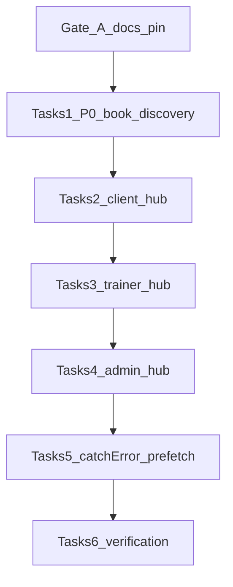

# P22 — Instant Navigations Adoption (Next.js 16.3)

**Тип:** Phase Description  
**Статус:** Canonical  
**Версия:** 1.3  
**Дата:** 2026-08-11  
**Волна:** W25  
**Зависит от:** [`P14_phase_description.md`](./P14_phase_description.md), [ADR-002](../../../prds/07_governance/adr_002_next162_vercel_runtime_policy.md), [`instant_navigations_adoption_spec.md`](../specs/instant_navigations_adoption_spec.md), [`ai_loading_patterns.md`](../../../guidelines/nextjs/ai_loading_patterns.md), [`cache_revalidation_policy.md`](../../../prds/05_runtime/cache_revalidation_policy.md)  
**Связанные документы:** [`P22_tasks.md`](../tasks/P22_tasks.md), [`ui_component_phase_matrix.md`](../ui_component_phase_matrix.md)

**Prerequisite shipped outside this phase:** pin `next@16.3.0`; `cacheComponents: true` + `partialPrefetching: true` in `apps/web/next.config.ts`; ADR-002 amend §5.1–§5.2.

---

## Purpose

Фаза **P22** — довести product routes `apps/web` до **Instant Navigations** best practices Next.js **16.3** (Context7 `/vercel/next.js`): reusable **App Shell** через Suspense / `'use cache'`, покрытие `loading.tsx` / `error.tsx`, selective `catchError` + `retry()`, intentional deeper prefetch.

Конфиг уже включён; основной долг — **blocking composition** (`await` DAL наверху `page.tsx`) и дыры streaming coverage. Фаза **не** добавляет product features.

**Аудитория:** AI-агенты после P14; runtime / UX performance.

---

## Agent context budget

**MUST read (≤8 docs + matrix row):**

| # | Document | Why |
|---|----------|-----|
| 1 | [`P22_tasks.md`](../tasks/P22_tasks.md) | Checklist |
| 2 | [`instant_navigations_adoption_spec.md`](../specs/instant_navigations_adoption_spec.md) | Normative rules + route matrix |
| 3 | [ADR-002](../../../prds/07_governance/adr_002_next162_vercel_runtime_policy.md) §5.1–§5.2 | Instant Navigations + `catchError` |
| 4 | [`ai_loading_patterns.md`](../../../guidelines/nextjs/ai_loading_patterns.md) | §8.1, §10, §12.1, §14 |
| 5 | [`cache_revalidation_policy.md`](../../../prds/05_runtime/cache_revalidation_policy.md) | Tags / no `unstable_cache` |
| 6 | [`ui_component_phase_matrix.md`](../ui_component_phase_matrix.md) | **P22** section only |
| 7 | [`.cursor/rules/app-router-streaming-loading.mdc`](../../../../.cursor/rules/app-router-streaming-loading.mdc) | Route work checklist |
| 8 | [`.cursor/rules/nextjs-vercel-app-router.mdc`](../../../../.cursor/rules/nextjs-vercel-app-router.mdc) | Pin + Instant Navigations |

**Wireframe:** none — infrastructure / composition phase.

**MUST NOT read** other `P*_phase_description.md` in the same session — use **Cross-phase dependencies** for blockers only.

---

## Scope / Out of scope

### In scope

| Area | Deliverable |
|------|-------------|
| Gate A | Docs/pin consistency (16.3.0), nested lockfile hygiene, ADR amend wording, loading-patterns example key |
| P0 App Shell | Fix blocking awaits B1–B7 (book, bookings, dashboards, trainers list/detail) |
| P1 Coverage | Missing `loading.tsx` / `error.tsx`; region split where page still blocks behind segment loading |
| P2 16.3 polish | `catchError` + `retry()` on multi-region pages; deeper `prefetch={true}` after P0; Instant Insights QA |
| Composition | Thin `page.tsx` + `*.server.tsx` Suspense children; public `'use cache'` only where policy allows |

### Out of scope

- P16 landing visual redesign
- P18 admin people ops
- P21 email & jobs
- Renaming ADR file `adr_002_next162_*`
- Blanket `'use cache'` on auth-gated / user-scoped DAL
- New product features, route inventory changes
- `templates/**` pin maintenance

---

## Gap inventory (canon)

Full matrix: [`instant_navigations_adoption_spec.md`](../specs/instant_navigations_adoption_spec.md). Summary:

### A — Docs / pin (Gate)

| ID | Gap |
|----|-----|
| A1 | High-precedence docs still `16.2.6` / Context7 `/v16.2.2` — **listed files only** (see tasks §0); residual outside list = out of P22 |
| A2 | User-facing how-it-was-built stack string |
| A3 | Nested `apps/web/package-lock.json` @ 16.2.6 vs root 16.3.0 |
| A4 | ADR-002 amend wording («Transition section removed») + Amend date vs `adr_index` → sync to **2026-08-11** |
| A5 | `ai_loading_patterns` §12.1 → `common.segmentError.retry` |

### B — P0 blocking awaits

| ID | Route | Defect |
|----|-------|--------|
| B1 | `/book/[trainerId]` | Profile await before Suspense |
| B2 | `/client/bookings` | Atomic fetch; need upcoming/past regions |
| B3 | `/trainer/dashboard` | Blocking snapshot; no `loading.tsx` |
| B4 | `/client/dashboard` | Blocking next session — **nuance:** fast `auth()` + redirect on page OK; only `getClientNextSession` → Suspense |
| B5 | `/admin/dashboard` | Entire dashboard top-level fetch |
| B6 | `/trainers/[id]` | Profile body outside Suspense |
| B7 | `/trainers` | Filter options block grid shell |

### C — P1 loading / error / split

Missing loading on trainer `{dashboard,clients,[id],income,profile}` and client `profile`.  
Missing error on client `{dashboard,profile,reviews/[bookingId]}` and trainer `{dashboard,clients(+[id]),income,profile}`.  
Blocking-with-loading: booking detail, review form, trainer services/schedule, admin lists counts + details.

### D — P2

`catchError` (D1), deeper prefetch (D2), Instant Insights (D3), lockfile (D4 = A3).

### E — Compliant baseline (do not regress)

Config flags; pin 16.3.0 (root); role layout Suspense; marketing `/`; admin list Suspense; public reviews/schedule Suspense; catalog `'use cache'` DAL modules; mutation tag invalidation; no casual `instant = false`.

---

## UI Catalog (this phase)

Import paths: `@/components/atoms`, `@/components/ui/*`, `@/components/{domain}/*`, `@/components/shell/*`.

| Action | Component | Path / notes |
|--------|-----------|--------------|
| **CREATE** | Route-local `*-skeleton.tsx` | Only if missing for new Suspense regions |
| **CREATE** | Region error fallback (client) | For `catchError` — one component per file; messages from `@/lib/messages` |
| **USE** | `Skeleton`, `Container`, `Empty`, `Button`, shell fallbacks | Existing catalog |
| **USE** | `AppShellFallback` | Role layouts |
| **MUST NOT** | `@/components/design-lab/**` | Showcase only |

Full matrix: [`ui_component_phase_matrix.md`](../ui_component_phase_matrix.md).

---

## Cross-phase dependencies

| Dependency | Blocker? | Notes |
|------------|----------|-------|
| **P14** complete | Yes | Quality gate baseline |
| ADR-002 + next 16.3.0 pin | Yes | Already shipped; Gate verifies |
| **P16** landing redesign | No | May share `/trainers` CTA prefetch after P0 |
| **P17** i18n | No | Retry copy via existing messages keys |
| **P19** complaints | No | Admin list Suspense patterns reusable |
| **P21** email | No | Out of scope |

---

## In-scope routes

Маршруты — [`canonical_routes.md`](../../../design/canonical_routes.md). **MUST NOT** дублировать полный inventory.

| Path | P22 work |
|------|----------|
| `/book/[trainerId]` | B1 shell |
| `/trainers`, `/trainers/[id]` | B7, B6 + D1/D2 |
| `/client/dashboard`, `/client/bookings`, `/client/bookings/[id]`, `/client/profile`, `/client/reviews/[bookingId]` | B2, B4 + C |
| `/trainer/dashboard`, `/trainer/{clients,income,profile,services,schedule}` | B3 + C |
| `/admin/dashboard`, `/admin/{trainers,complaints,reviews}/**` | B5 + C |

---

## Implementation sequence (recommended)

Aligns with [`P22_tasks.md`](../tasks/P22_tasks.md) blocks 0–6.

---

## Happy path smoke

1. Hover/default navigate `/` → `/trainers` — chrome/filters/grid shell paints without waiting full DB.
2. `/trainers/[id]` — header chrome + skeletons; profile/reviews/schedule stream independently where split.
3. `/book/[trainerId]` — shell visible before profile/slots resolve (no empty Suspense after blocking await).
4. `/client/bookings` — list chrome; upcoming/past regions stream.
5. Role dashboards (client/trainer/admin) — shell/KPI skeletons before snapshot completes.
6. Instant Insights in `next dev` on adopted routes — no unexplained blocking for P0 list.

---

## Negative path smoke

| Scenario | Expected |
|----------|----------|
| DAL failure in one Suspense region | Sibling regions still usable; `error.tsx` or `catchError` + retry |
| `retry()` after transient error | Region recovers without full page remount when using `catchError` |
| Offline / DB down on segment | Segment `error.tsx` with retry copy from messages |

---

## Security smoke

| Check | Expected |
|-------|----------|
| Auth-gated pages | Still behind `proxy.ts` / layout guards; streaming does not leak unauthorized data |
| `'use cache'` | Only public approved slices; no private bookings in shared cache |
| Admin/trainer data | Fresh reads; no cross-user cache tags |

---

## Concurrency & race check

| Scenario | Expected |
|----------|----------|
| Mutation then navigate back to list | `updateTag` / `revalidateTag` freshness preserved |
| Parallel Suspense regions | Independent failure; no single Promise.all atomic fail unless intentional |

---

## Drift risks & guards

| Risk | Guard |
|------|-------|
| Docs still say 16.2.6 | Gate A1–A2 + registry Context7 row — **A1 listed-only** |
| Agents treat `prefetch={true}` as old full-page default | Spec prefetch policy + ADR-002 §5.1 |
| `'use cache'` on private DAL | Spec cache table + this Out of scope |
| Blocking await sneaks back into `page.tsx` | `app-router-streaming-loading` rule + Instant Insights |
| Nested lockfile confusion | A3 / D4 — prefer root lockfile only |

---

## Definition of done

- [x] Gate A complete (docs pin + lockfile decision)
- [x] P0 routes B1–B7: no blocking DAL await before owning Suspense
- [x] P1: missing `loading.tsx` / `error.tsx` from gap list added (or documented exception in **Change log** below; root `app/error.tsx` skipped in P22)
- [x] At least one multi-region `catchError` + `retry()` adoption where segment error is too coarse
- [x] Deeper prefetch only on approved hot CTAs after P0
- [x] Instant Insights / manual smoke on happy path (`next dev` 2026-08-11: `/`, `/trainers`, `/trainers/[id]` App Shell usable; crypto insights cleared via cookie-locale root + `connection()` before `auth()` in shell gates/TopBar; profile session moved behind Suspense)
- [x] `npm run typecheck` + `npm run lint` (root — `apps/web` + все `packages/*`) — typecheck OK; lint has pre-existing `ThemeToggle` error (not P22)
- [x] Spec + phase + tasks remain source of truth; no silent composition drift

---

## Related documents

| Document | Relationship |
|----------|--------------|
| [`P22_tasks.md`](../tasks/P22_tasks.md) | Agent checklist |
| [`instant_navigations_adoption_spec.md`](../specs/instant_navigations_adoption_spec.md) | Normative spec |
| [`P14_phase_description.md`](./P14_phase_description.md) | Prerequisite quality gate |
| [`documentation_creation_registry.md`](../../../meta/documentation_creation_registry.md) | W25 |
| [ADR-002](../../../prds/07_governance/adr_002_next162_vercel_runtime_policy.md) | Runtime policy |

---

## Agent notes

- **Одна сессия = P22 only.**
- Verify Context7 `/vercel/next.js` (or `node_modules/next/dist/docs/`) before inventing APIs.
- Prefer extract `*.server.tsx` over growing `page.tsx` past thin compose.
- User-visible retry strings from `@/lib/messages` — **ui-messages-and-copy**.
- One component per file — **react-one-component-per-file**.

---

## Acceptance criteria

- [x] Happy + negative + security smoke pass (happy public nav + auth redirects; catchError wired; private cache unchanged)
- [x] Gap B P0 closed; C/D per tasks checklist
- [x] No duplicate route inventory (link `canonical_routes.md` only)
- [x] UI Catalog CREATE items are route-local skeletons/fallbacks only

---

## Change log

| Date | Change |
|------|--------|
| 2026-08-11 | v1.3 — D3 smoke + follow-ups: ADR-002 prefetch audit wording; sibling Suspense `/trainers`; `RouteSegmentError`/`AdminPageError` → `retry`; split DAL bookings tabs + admin KPI/needs-attention; Instant Insights crypto fixes (no `auth()` in root layout content; `connection()` before `auth()` in shell gates/TopBar; profile session behind Suspense); deferred ThemeProvider mount; deterministic RootLayoutFallback; **i18n contract** I18N-MUST-2/12 exception documented |
| 2026-08-11 | v1.2 — implementation: Gate A + App Shell B1–B7 + client/trainer/admin hubs + catalog `catchError`/`retry` + hot CTA `prefetch={true}`; **exception:** root `app/error.tsx` skipped; D3 Instant Insights + manual browser smoke pending |
| 2026-08-11 | v1.1 — docs polish: mermaid wave IDs; A1 listed-only; B4 auth nuance; DoD exceptions → Change log; root `error.tsx` skipped |
| 2026-08-11 | v1.0 — W25 P22 Instant Navigations adoption phase |
