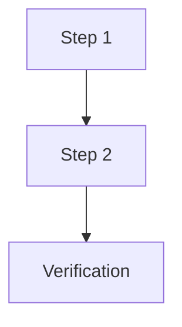

# P{N} — {Phase Title}

**Тип:** Phase Description  
**Статус:** Canonical  
**Версия:** 1.0  
**Дата:** 2026-05-23  
**Волна:** W16  
**Зависит от:** {prerequisite phase docs + contracts}  
**Связанные документы:** [`P{N}_tasks.md`](../tasks/P{N}_tasks.md), {specs/contracts}

---

## Purpose

{1–2 абзаца: что даёт фаза, для кого документ.}

---

## Agent context budget

**MUST read (≤8 docs + 1 wireframe + matrix row):**

| # | Document | Why |
|---|----------|-----|
| 1 | [`P{N}_tasks.md`](../tasks/P{N}_tasks.md) | Checklist |
| 2 | {contract/spec} | {why} |
| … | … | … |

**Wireframe (if applicable):** {link or «none — infrastructure phase»}

**UI matrix row:** [`ui_component_phase_matrix.md`](../ui_component_phase_matrix.md) — **P{N}** section only.

**MUST NOT read** other `P*_phase_description.md` files in the same session — use **Cross-phase dependencies** below for blockers only.

---

## Scope / Out of scope

### In scope

| Area | Deliverable |
|------|-------------|
| … | … |

### Out of scope

- … (→ **P{M}**)

---

## UI Catalog (this phase)

Import paths: `@/components/atoms`, `@/components/ui/*`, `@/components/{domain}/*`, `@/components/shell/*`.

| Action | Component | Path / notes |
|--------|-----------|--------------|
| **CREATE** | … | … |
| **USE** | … | … |
| **MUST NOT** | … | … |

Full matrix: [`ui_component_phase_matrix.md`](../ui_component_phase_matrix.md).

---

## Cross-phase dependencies

| Dependency | Blocker? | Notes |
|------------|----------|-------|
| **P{prev}** complete | Yes/No | … |
| … | … | … |

---

## In-scope routes

Маршруты — [`canonical_routes.md`](../../../design/canonical_routes.md). **MUST NOT** дублировать полный inventory.

| Path | MVP content |
|------|-------------|
| … | … |

---

## Implementation sequence (recommended)

---

## Happy path smoke

1. …

---

## Negative path smoke

| Scenario | Expected |
|----------|----------|
| … | … |

---

## Security smoke

| Check | Expected |
|-------|----------|
| … | … |

---

## Concurrency & race check

| Scenario | Expected |
|----------|----------|
| … | … ([**FM-00X**](../../../prds/02_domain_model/failure_modes_catalog.md) if applicable) |

---

## Drift risks & guards

| Risk | Guard |
|------|-------|
| Docs ↔ code phase numbering | This doc + [`_migration_P01-P07_to_P01-P15.md`](./_migration_P01-P07_to_P01-P15.md) |
| Prototype ↔ design tokens | Design Lab spot-check; **ui-prototype-fidelity** |
| Spec ↔ contract mismatch | Contracts win for mutations; specs win for UX |
| Timezone (INV-01) | `TrainerProfile.timezone` on schedule/booking display |

---

## Definition of done

- [ ] …
- [ ] `npm run typecheck` + `npm run lint -w web`
- [ ] Smoke checklist above passed
- [ ] Design Lab spot-check for new **CREATE** components (390px, md, light/dark)

---

## Related documents

| Document | Relationship |
|----------|--------------|
| [`P{N}_tasks.md`](../tasks/P{N}_tasks.md) | Agent checklist |
| [`P{N±1}_phase_description.md`](./P{N±1}_phase_description.md) | Prev / next phase |
| [`documentation_creation_registry.md`](../../../meta/documentation_creation_registry.md) | W16 |

---

## Agent notes

- **Одна сессия = P{N} only.**
- …

---

## Acceptance criteria

- [ ] Happy + negative + security smoke pass
- [ ] UI Catalog CREATE items verified on Design Lab or route
- [ ] No duplicate route inventory (link to `canonical_routes.md` only)
