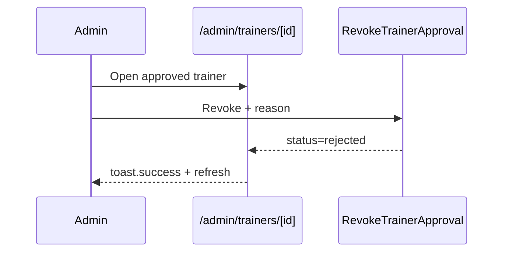

# Admin People Ops Spec — Pulse (Post-P14)

**Тип:** Spec  
**Статус:** Canonical (planned implementation)  
**Версия:** 1.0  
**Дата:** 2026-05-25  
**Волна:** W18  
**Фаза:** **P18 (planned)** — после P14 quality gate  
**Зависит от:** [`admin_verification_spec.md`](./admin_verification_spec.md), [`trainer_verification_contract.md`](../contracts/trainer_verification_contract.md), [`complaint_refund_spec.md`](./complaint_refund_spec.md), [`authorization_matrix.md`](../../../prds/04_authorization_privacy/authorization_matrix.md)  
**Связанные документы:** [`admin_flow.md`](../../../prds/01_product_scope/user_flows/users_mvp/admin_flow.md), [`ux_ui_faang_best_practices_for_agents.md`](../../../design/ux_ui_faang_best_practices_for_agents.md), [`privacy_data_handling.md`](../../../prds/04_authorization_privacy/privacy_data_handling.md)

---

## Purpose

Implementation-spec **операционного управления участниками платформы** после MVP-очередей модерации (P13): post-approval профиль тренера, реестр клиентов, cross-links в complaints/refunds. Закрывает product gap «approved detail = dead end» и отсутствие admin surface для клиентов.

**Аудитория:** AI-агенты P18; product/design при wireframes W10-30…32.

**Не подменяет:** [`admin_verification_spec.md`](./admin_verification_spec.md) — очередь `pending` / first-time Approve|Reject остаётся там.

---

## Scope / Out of scope

### In scope (P18)

| Area | Deliverable |
|------|-------------|
| Trainer post-approval | Расширение `/admin/trainers/[id]` для `approved` \| `rejected` (read-only + operational actions) |
| Revoke approval | UI для `RevokeTrainerApproval` (domain + FM-014) |
| Trainer cross-links | Каталог, жалобы, активные брони (read-only aggregates) |
| Client registry | `/admin/clients` — search + list |
| Client detail | `/admin/clients/[id]` — profile read-only + bookings + complaints + refunds |
| Deep links | Из `/admin/complaints/[id]`, `/admin/refunds` → client/trainer people pages |
| Nav | Sidebar item «Клиенты» (без badge — не queue) |

### Out of scope (defer)

| Area | Defer to |
|------|----------|
| `user.account_status` (suspend/ban) | Post-MVP + ADR; schema change |
| Admin role change UI | ADR-003 post-MVP admin user management |
| Unified `/admin/people` search | Post-MVP when scale warrants |
| Email on revoke | P21 email jobs |
| Admin booking list route | Separate phase; context panels on complaint suffice for P18 |
| Edit trainer profile fields by admin | Trainer self-service only |

---

## Definitions

### Two admin contours

| Contour | Mental model | Routes | Badge |
|---------|--------------|--------|-------|
| **Moderation Queues** | «Разобрать входящее» | `/admin/trainers?tab=pending`, complaints, refunds, reviews | Yes (pending counts) |
| **People Registry** | «Найти участника, посмотреть историю» | `/admin/clients`, `/admin/clients/[id]`; approved trainer ops on existing `[id]` | No |

### Trainer status × UI mode on `/admin/trainers/[id]`

| `trainer_profile.status` | UI mode | Primary CTA | Spec owner |
|--------------------------|---------|-------------|------------|
| `pending` | Verification review | **Одобрить** | [`admin_verification_spec.md`](./admin_verification_spec.md) · W10-25 |
| `approved` | Operational profile | **Открыть в каталоге** (link) | **This spec** · W10-30 |
| `rejected` | Processed archive | **Назад к очереди** | **This spec** (read-only; resubmit — trainer-side) |

### Client (MVP schema)

- `User.role = client` — единственный «статус» клиента в MVP.
- Admin **не меняет** role/status клиента в P18 — только read + navigation.

---

## Happy paths

### A — Approved trainer operational detail

1. Admin opens `/admin/trainers` → tab **Одобрены** → card → `/admin/trainers/[id]`.
2. Page shows:
   - Processed banner (success) + **review metadata** (reviewed_at, reviewer name).
   - Profile card (existing) + services + documents (read-only, collapsible).
   - **Activity panel:** counts + links — open complaints (N), upcoming bookings (N), public profile.
   - **Management section** (secondary): **«Отозвать одобрение»** — destructive outline, not primary CTA.
3. Admin taps **Отозвать одобрение** → AlertDialog: reason (required, min 10) → `RevokeTrainerApproval`.
4. Success → toast.success → status `rejected`; banner updates; catalog hidden; management actions hidden.

### B — Client registry

1. Admin opens `/admin/clients` from sidebar.
2. Search by name or email (debounced, server filter).
3. List rows: avatar, fullName, email, registeredAt, bookingsCount.
4. Row click → `/admin/clients/[id]`.

### C — Client detail

1. Admin on `/admin/clients/[id]` — header: name, email, member since.
2. Tabs: **Бронирования** | **Жалобы** | **Возвраты** (FX-3 progressive disclosure).
3. Each tab: read-only list with link to booking complaint/refund detail where applicable.
4. **No primary mutation** on client detail in P18 — support/discovery surface.

### D — Deep link from complaint

1. Admin on `/admin/complaints/[id]` sees reporter name.
2. **CustomLink** «Профиль клиента» → `/admin/clients/[userId]`.
3. Same pattern for target trainer → `/admin/trainers/[trainerProfileId]` (operational mode if approved).

---

## Negative paths (UX)

| Scenario | UX |
|----------|-----|
| Revoke with future confirmed bookings | `TRAINER_HAS_ACTIVE_BOOKINGS` — AlertDialog stays open; inline error + FM-014 copy from `@/lib/messages` |
| Revoke already rejected | `INVALID_STATUS_TRANSITION` — toast.error; refresh |
| Revoke without reason | Inline validation on reason field (same as Reject) |
| Client search no results | Empty state + «Попробуйте другой запрос» |
| Client IDOR | 404 if not `role=client` or not found |
| Trainer ID not found | 404 |
| Approved detail with zero complaints | Activity panel shows «0» + muted copy, no dead link |

---

## Security paths

| Scenario | UX |
|----------|-----|
| Non-admin | proxy redirect — no PII leak |
| Client registry export | Deny FM-005 — no CSV in P18 |
| Trainer private notes | **MUST NOT** show `trainer_client_note` on admin client detail (trainer-only per privacy) |
| Verification docs on approved | Presigned download — admin session + policy (existing file_upload_contract) |

---

## Concurrency notes

- **FM-010** on Revoke — conditional update `WHERE status=approved`; second admin → toast.error.
- Client list pagination — cursor or offset; stale search acceptable on slow type.

---

## UI states matrix

| Region | empty | loading | error | forbidden |
|--------|-------|---------|-------|-----------|
| Approved trainer activity | Zero counts, no links | Section skeleton | Alert per section | non-admin redirect |
| Revoke dialog | — | `aria-busy` on confirm | toast.error + inline FM-014 | — |
| Client search list | «Клиенты не найдены» | Row skeletons | Alert + Retry | non-admin |
| Client detail tabs | Tab-specific empty | Tab skeleton | toast/Alert | 404 |

---

## Interaction requirements

| ID | Rule |
|----|------|
| PO-MUST-1 | **One primary CTA per view:** approved detail → link «Открыть в каталоге»; client detail → none (read-only) |
| PO-MUST-2 | Revoke — **destructive** + AlertDialog + required reason; **never** primary Button on page shell |
| PO-MUST-3 | Reuse Approve/Reject transport pattern — Server Action + iOS Route Handler fallback (**ios-safari-mutation-transport**) |
| PO-MUST-4 | `toast.success` / `toast.error` on revoke; revalidate catalog tags |
| PO-MUST-5 | Deep links from complaints/refunds **SHOULD** land in P18 |
| PO-MUST-6 | Client list — email visible (admin-only); no phone (not in schema MVP) |
| PO-SHOULD-1 | Approved tab queue card → same `[id]` URL; mode derived from `status` server-side |
| PO-SHOULD-2 | Activity counts — badge chips, not only text |

---

## Routes (canonical)

| Path | MVP P13 | P18 | Notes |
|------|---------|-----|-------|
| `/admin/trainers/[id]` | ✅ pending review | ✅ + approved/rejected ops | Conditional regions |
| `/admin/clients` | — | ✅ planned | Registry list |
| `/admin/clients/[id]` | — | ✅ planned | Client detail |

See [`canonical_routes.md`](../../../design/canonical_routes.md) — updated in same doc wave.

---

## Wireframes & prototype

| Route | Wireframe | Registry |
|-------|-----------|----------|
| `/admin/trainers/[id]` (`approved`) | [`admin_trainer_approved_detail.md`](../../../design/wireframes/mvp/admin_trainer_approved_detail.md) | W10-30 |
| `/admin/clients` | [`admin_clients_registry.md`](../../../design/wireframes/mvp/admin_clients_registry.md) | W10-31 |
| `/admin/clients/[id]` | [`admin_client_detail.md`](../../../design/wireframes/mvp/admin_client_detail.md) | W10-32 |

Pending review wireframe unchanged: [`admin_trainer_application.md`](../../../design/wireframes/mvp/admin_trainer_application.md) (W10-25).

[`admin_flow.md`](../../../prds/01_product_scope/user_flows/users_mvp/admin_flow.md) § Поток 6–7.

---

## Requirements

1. **MUST** — extend existing `[id]` page; **MUST NOT** fork duplicate route for approved trainers.
2. **MUST** — `RevokeTrainerApproval` via shared DAL; policy `assertCanRevokeTrainer`.
3. **MUST** — FM-014 guard before revoke mutation.
4. **MUST** — client routes admin-only per authorization matrix.
5. **MUST NOT** — introduce `account_status` without ADR + migration.
6. **SHOULD** — complaint detail links to people pages when P18 ships.

---

## Acceptance criteria

- [ ] Happy: approved detail → catalog link + activity panel
- [ ] Happy: revoke with reason → rejected + catalog hidden
- [ ] Negative: FM-014 block UX
- [ ] Happy: client search → detail → tabs
- [ ] Security: admin-only, no trainer notes leak
- [ ] Deep links from complaint detail
- [ ] UI states matrix covered
- [ ] Wireframes W10-30…32 linked
- [ ] FAANG overlay rules: Revoke = AlertDialog; mobile Sheet if form grows

---

## UI Catalog (by screen)

**Phase:** P18 · Matrix: [`ui_component_phase_matrix.md`](../ui_component_phase_matrix.md) (update on implementation)

| Screen | CREATE | USE |
|--------|--------|-----|
| `/admin/trainers/[id]` approved | `TrainerOperationalActivityPanel`, `RevokeTrainerDialog`, `TrainerReviewMetadata` | Existing profile/docs/services cards |
| `/admin/clients` | `AdminClientSearchBar`, `AdminClientRegistryRow` | `PageHeader`, `PulseCard`, `Skeleton` |
| `/admin/clients/[id]` | `AdminClientDetailHeader`, `AdminClientBookingsTab`, `AdminClientComplaintsTab`, `AdminClientRefundsTab` | `AdminPillTabs`, `StatusBadge`, `CustomLink` |
| `/admin/complaints/[id]` | — | Add `CustomLink` to client/trainer people pages |

---

## Related documents

| Document | Relationship |
|----------|--------------|
| [`admin_verification_spec.md`](./admin_verification_spec.md) | Pending queue — predecessor |
| [`trainer_verification_contract.md`](../contracts/trainer_verification_contract.md) | RevokeTrainerApproval API |
| [`complaint_refund_spec.md`](./complaint_refund_spec.md) | Deep link source |
| [`authorization_matrix.md`](../../../prds/04_authorization_privacy/authorization_matrix.md) | Admin read users |
| [`privacy_data_handling.md`](../../../prds/04_authorization_privacy/privacy_data_handling.md) | PII classes |
| [`ux_ui_faang_best_practices_for_agents.md`](../../../design/ux_ui_faang_best_practices_for_agents.md) | FX-1, FX-3, FX-8, FX-10 |

**Registry:** [`documentation_creation_registry.md`](../../../meta/documentation_creation_registry.md) — wave W18-01

---

## Agent notes

- Do **not** implement before P14 sign-off unless explicitly scoped.
- Pending `canModerate` logic stays: decision bar only when `status=pending`.
- Prefer extending `getTrainerApplication` → `getTrainerAdminDetail` with activity counts in one server loader.
- Client list: index on `user.email`, `user.full_name` — see [`indexing_strategy.md`](../../../prds/03_data_model/indexing_strategy.md); add admin search index in migration if needed.

---

## Change log

| Date | Change |
|------|--------|
| 2026-05-25 | v1.0 — initial People Ops spec; P18 planned; wireframes W10-30…32 |
