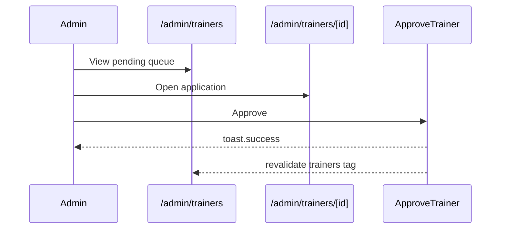

# Admin Verification Spec — Pulse MVP

**Тип:** Spec  
**Статус:** Canonical  
**Версия:** 1.0  
**Дата:** 2026-05-23  
**Волна:** W9  
**Зависит от:** [`trainer_verification_contract.md`](../contracts/trainer_verification_contract.md), [`ui_states_contract.md`](../../../design/ui_states_contract.md)  
**Связанные документы:** [`admin_flow.md`](../../../prds/01_product_scope/user_flows/users_mvp/admin_flow.md)

---

## Purpose

Implementation-spec **admin moderation тренеров**: queue `/admin/trainers`, application detail `/admin/trainers/[id]`, approve/reject actions, document download, tabs Pending/Approved/Rejected, nav badges. UX над [`trainer_verification_contract.md`](../contracts/trainer_verification_contract.md).

**Аудитория:** AI-агенты P05; admin UI.

---

## Scope / Out of scope

**In scope:** Queue list, application sheet/page, approve/reject with reason, badge counts, cache revalidation after decision.

**Out of scope:** Email E-01/E-02; automated ML checks; trainer onboarding wizard (→ `trainer_onboarding_spec.md`).

---

## Definitions

| Tab | Filter |
|-----|--------|
| Pending | `status=pending` |
| Approved | `status=approved` |
| Rejected | `status=rejected` |

**Primary CTA on detail:** Approve (default Button); Reject — destructive outline + confirm if reason empty blocked.

---

## Happy path

### Queue review

1. Admin opens `/admin/trainers` — default tab **Pending**.
2. Grid of application cards: avatar, name, email, spec chips, waiting duration.
3. Card click → `/admin/trainers/[id]` or Sheet (mobile: full Sheet; desktop: **MAY** use dedicated page).
4. Detail shows documents list with download (signed URL / policy-gated).
5. Admin enters optional comment; taps **Approve**.
6. `ApproveTrainer` Action → `toast.success` → card removed from Pending; catalog revalidated.
7. Nav badge count decrements (revalidate or optimistic).

### Reject flow

1. Admin taps **Reject** — require `rejectionReason` (min length).
2. If empty → field error, no submit.
3. Success → toast; move to Rejected tab on next visit.

---

## Negative paths (UX)

| Scenario | UX |
|----------|-----|
| Approve incomplete application | `APPLICATION_INCOMPLETE` — Alert + list missing docs |
| Approve already processed | Toast error; refresh queue |
| Reject without reason | Inline validation on comment field |
| Document download fails | toast.error per file |
| Empty pending queue | Positive empty «All caught up» (P2) |
| Approved/Rejected tabs empty | «Section under development» or processed list (MVP: empty state per admin_flow) |
| Load queue error | Alert + Retry |

---

## Security paths

| Scenario | UX |
|----------|-----|
| Non-admin access | proxy redirect — no queue leak |
| Trainer self-approve via API | Server deny [`FM-005`](../../../prds/02_domain_model/failure_modes_catalog.md#fm-005) |
| Guest download verification doc | Deny — admin session required |
| IDOR application id | 404 if not admin-readable |

---

## Concurrency notes

- **FM-010** double admin approve — second fails `INVALID_STATUS_TRANSITION`; toast.error, refresh detail.
- Two admins approve same app — one wins, other sees error — no double catalog entry.
- Badge count lag acceptable &lt;1 navigation — revalidate on success.

---

## UI states matrix

| Region | empty | loading | error | forbidden |
|--------|-------|---------|-------|-----------|
| Pending grid | All caught up | card skeletons | Retry | non-admin redirect |
| Application detail | — | doc list skeleton | notFound | — |
| Approve/Reject bar | — | `aria-busy` both disabled | toast.error | — |
| Document row | — | download pending | per-row error | — |
| Approved/Rejected tabs | empty copy | skeleton | Retry | — |

---

## Interaction requirements

| ID | Rule |
|----|------|
| AV-MUST-1 | Reject destructive styling; Approve primary — side by side, distinct |
| AV-MUST-2 | Confirm dialog optional for Approve; **required** for Reject if reason empty (validation) |
| AV-MUST-3 | Waiting &gt;3 days — warning color + clock icon (admin_flow) |
| AV-MUST-4 | `toast.success` on approve/reject — same page or close sheet |
| AV-MUST-5 | Revalidate catalog tags on approve |

---

## Wireframe & prototype

| Route | Wireframe (planned) | Prototype |
|-------|---------------------|-----------|
| `/admin/trainers` | W10-24 `admin_trainers_queue.md` | Admin trainers queue |
| `/admin/trainers/[id]` | W10-25 `admin_trainer_application.md` | Application sheet |

[`admin_flow.md`](../../../prds/01_product_scope/user_flows/users_mvp/admin_flow.md) § Поток 2.

---

## Requirements

1. **MUST** — admin-only routes per authorization matrix.
2. **MUST** — rejection reason required (contract).
3. **MUST** — approve only when required docs `ready`.
4. **MUST** — update nav badges after mutation success.
5. **MUST NOT** — expose pending trainer in public catalog.

---

## Acceptance criteria

- [ ] Happy: queue → detail → approve
- [ ] Negative: incomplete, reject validation, empty queue
- [ ] Security: admin-only, FM-005 reference
- [ ] Concurrency: FM-010 UX
- [ ] UI states matrix
- [ ] Wireframes linked

---

## Related documents

| Document | Relationship |
|----------|--------------|
| [`trainer_verification_contract.md`](../contracts/trainer_verification_contract.md) | Approve/Reject API |
| [`file_upload_contract.md`](../contracts/file_upload_contract.md) | Document download |
| [`trainer_onboarding_spec.md`](./trainer_onboarding_spec.md) | Incoming applications |
| [`global_shell_spec.md`](./global_shell_spec.md) | Admin badges |
| [`authorization_matrix.md`](../../../prds/04_authorization_privacy/authorization_matrix.md) | Admin permissions |

**Registry:** [`documentation_creation_registry.md`](../../../meta/documentation_creation_registry.md) — wave W9-07

---

## Agent notes

- Mobile uses Sheet with drag handle; desktop may use full page for a11y.
- Download links — short-lived; do not put raw blob URLs in client cache.
- Reviews moderation is separate route `/admin/reviews` — not this spec.

---

## Change log

| Date | Change |
|------|--------|
| 2026-05-23 | v1.0 — admin verification spec (W9-07) |
