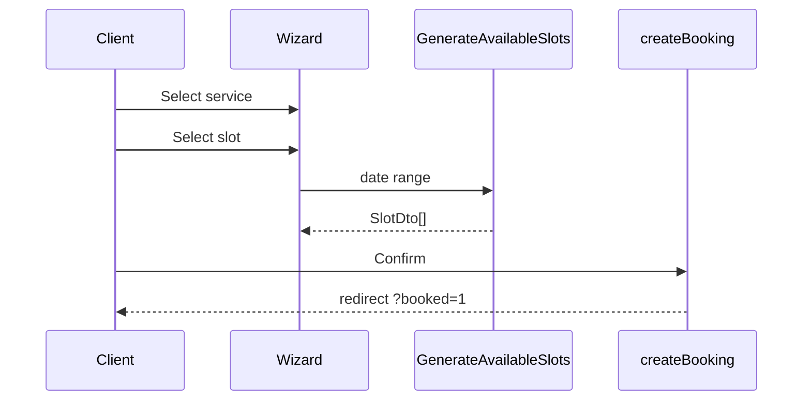

# Booking Wizard Spec — Pulse MVP

**Тип:** Spec  
**Статус:** Canonical  
**Версия:** 1.0  
**Дата:** 2026-05-23  
**Волна:** W9  
**Зависит от:** [`booking_lifecycle_contract.md`](../contracts/booking_lifecycle_contract.md), [`schedule_slots_contract.md`](../contracts/schedule_slots_contract.md), [`ui_states_contract.md`](../../../design/ui_states_contract.md)  
**Связанные документы:** [`client_flow.md`](../../../prds/01_product_scope/user_flows/users_mvp/client_flow.md), [`adr_005_mvp_booking_without_payment.md`](../../../prds/07_governance/adr_005_mvp_booking_without_payment.md)

---

## Purpose

Implementation-spec **3-step booking wizard** (`/book/[trainerId]`): Service → Slot → Confirm, stripped chrome, optional summary sidebar, `CreateBooking` mutation, redirect + toast pattern. Без оплаты (ADR-005).

**Аудитория:** AI-агенты P03; client booking flow.

---

## Scope / Out of scope

**In scope:** Wizard UI, step state, slot grid, confirm summary, optional message field, create booking action.

**Out of scope:** Payment, Stripe, email E-06 (toast only on MVP); trainer confirm/cancel flows (booking detail pages).

---

## Definitions

| Step | Content |
|------|---------|
| 1 Service | Radio cards — active services only |
| 2 Slot | `ScheduleGrid` — day scroll + slot chips |
| 3 Confirm | Summary + optional note (max 500) + submit |

**Route group:** `(booking)` — no bottom nav ([`global_shell_spec.md`](./global_shell_spec.md)).

---

## Happy path

1. Client navigates to `/book/[trainerId]` (from profile CTA or deep link).
2. **Preload:** trainer name, avatar, approved check; services list.
3. **Step 1:** Select service → enable Next.
4. **Step 2:** Load slots via `GenerateAvailableSlots` for selected service duration; pick slot → Next.
5. **Step 3:** Show summary (trainer, service, local time label, price snapshot); optional message.
6. Submit `createBooking` Server Action → [`booking_lifecycle_contract.md`](../contracts/booking_lifecycle_contract.md).
7. Success: redirect `/client/bookings/[id]?booked=1` + client `RedirectToast` (no payment step).

**Desktop:** `md:grid-cols-[1fr_340px]` — sticky summary sidebar mirrors confirm card.

---

## Negative paths (UX)

| Scenario | UX |
|----------|-----|
| Trainer not approved | `notFound()` before wizard renders |
| No services | Empty + CTA back to profile |
| No slots for day | Empty slot grid — pick another day |
| Slot taken on submit | `toast.error` SLOT_UNAVAILABLE; refresh step 2 slots |
| Validation (no slot selected) | Disable Next / inline hint |
| Guest opens wizard | Redirect login with `callbackUrl` |
| Service deactivated mid-flow | Error on submit + refresh services |
| Past slot tampering | Server rejects `SLOT_IN_PAST` |

---

## Security paths

| Scenario | UX |
|----------|-----|
| Non-client role | proxy redirect |
| POST arbitrary `startsAtUtc` | Server regenerates/matches allowlist — contract |
| Book another user's session | N/A — create only |
| IDOR trainerId | notFound if not approved |

---

## Concurrency notes

- **FM-001** double book — user sees `toast.error`; remain on confirm step; slots refresh ([`booking_lifecycle_contract.md`](../contracts/booking_lifecycle_contract.md)).
- Double submit Confirm — `disabled` + `aria-busy` on button; second request may return SLOT_UNAVAILABLE or idempotent success if same payload (domain defines).
- Do not duplicate transaction details in this spec.

---

## UI states matrix

| Step | empty | loading | error | forbidden |
|------|-------|---------|-------|-----------|
| Header progress | — | — | — | — |
| Step 1 services | no services CTA | skeleton cards | Retry | guest→login |
| Step 2 slots | no slots for day | slot skeleton | toast + refresh | — |
| Step 3 confirm | — | submit pending | SLOT_UNAVAILABLE toast | — |
| Summary sidebar | — | mirrors main | — | — |

---

## Interaction requirements

| ID | Rule |
|----|------|
| BW-MUST-1 | Stripped header: back + «STEP X OF 3» + progress bar |
| BW-MUST-2 | One primary CTA per step (Next / Confirm booking) |
| BW-MUST-3 | Confirm: `disabled={pending}` `aria-busy={pending}` |
| BW-MUST-4 | Success via redirect+query — not Action toast ([`interaction_design_contract.md`](../../../design/interaction_design_contract.md)) |
| BW-MUST-5 | Optional note max 500 chars with mono counter |
| BW-SHOULD-1 | Mobile confirm button sticky bottom on long content |

---

## Wireframe & prototype

| Route | Wireframe (planned) | Prototype |
|-------|---------------------|-----------|
| `/book/[trainerId]` | W10-08 `booking_wizard.md` | BookingFlow 3 steps |
| `/book/[trainerId]/confirm` | W10-09 (if split) | Optional separate confirm |

[`client_flow.md`](../../../prds/01_product_scope/user_flows/users_mvp/client_flow.md) § Поток 6.

---

## Requirements

1. **MUST** — exactly 3 steps on MVP (P1).
2. **MUST** — create booking `status=pending` — no payment UI.
3. **MUST** — use `SlotDto.startsAtUtc` from server for submit payload.
4. **MUST NOT** — client-side overlap logic — server authoritative.
5. **SHOULD** — preserve wizard step in URL `?step=2` for refresh resilience.

---

## Acceptance criteria

- [ ] Happy path service → slot → confirm → redirect
- [ ] Negative: no slots, slot taken, guest redirect
- [ ] Security: approved trainer only, tampered slot denied
- [ ] Concurrency: FM-001 UX outcome only
- [ ] UI states matrix complete
- [ ] Wireframes linked
- [ ] ADR-005 no payment affirmed

---

## Related documents

| Document | Relationship |
|----------|--------------|
| [`booking_lifecycle_contract.md`](../contracts/booking_lifecycle_contract.md) | CreateBooking |
| [`schedule_slots_contract.md`](../contracts/schedule_slots_contract.md) | Slot generation |
| [`global_shell_spec.md`](./global_shell_spec.md) | Stripped chrome |
| [`catalog_discovery_spec.md`](./catalog_discovery_spec.md) | Entry from profile |
| [`pages_functional_spec.md`](../../../prds/01_product_scope/pages_functional_spec.md) | Booking pages |
| [`interaction_design_contract.md`](../../../design/interaction_design_contract.md) | Redirect toast |

**Registry:** [`documentation_creation_registry.md`](../../../meta/documentation_creation_registry.md) — wave W9-05

---

## Agent notes

- Wizard lives in `(booking)` — never add client BottomNav.
- Price shown is informational snapshot — charged post-MVP.
- Email confirmation deferred — toast + booking detail is MVP feedback.

---

## Change log

| Date | Change |
|------|--------|
| 2026-05-23 | v1.0 — booking wizard spec (W9-05) |
