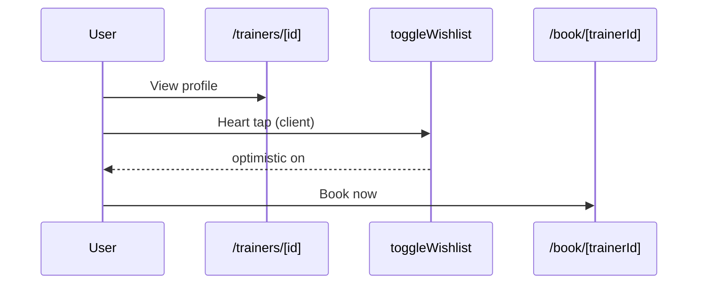

# Catalog & Discovery Spec — Pulse MVP

**Тип:** Spec  
**Статус:** Canonical  
**Версия:** 1.1  
**Дата:** 2026-05-23  
**Волна:** W9  
**Зависит от:** [`pages_functional_spec.md`](../../../prds/01_product_scope/pages_functional_spec.md), [`wishlist_contract.md`](../contracts/wishlist_contract.md)  
**Связанные документы:** [`client_flow.md`](../../../prds/01_product_scope/user_flows/users_mvp/client_flow.md), [`cache_revalidation_policy.md`](../../../prds/05_runtime/cache_revalidation_policy.md)

---

## Purpose

Implementation-spec **публичного каталога тренеров** (`/trainers`) и **профиля** (`/trainers/[id]`): фильтры, сортировка, карточки, табы профиля, sticky CTA, переход в booking wizard. UX + RSC touchpoints без дублирования race logic из contracts.

> **Wishlist (heart toggle):** deferred post-MVP — см. [`post_mvp_deferrals.md`](../../../prds/01_product_scope/post_mvp_deferrals.md); контракт [`wishlist_contract.md`](../contracts/wishlist_contract.md) сохранён для re-enable.

**Аудитория:** AI-агенты P04–P06; frontend + data fetching.

---

## Scope / Out of scope

**In scope:** Catalog list, filters, trainer profile tabs, schedule preview on profile, navigation to `/book/[trainerId]`.

**Out of scope:** Wishlist heart (post-MVP); booking wizard internals (→ `booking_wizard_spec.md`); admin moderation; payment UI; post-MVP map/geo filters.

---

## Definitions

| Term | Meaning |
|------|---------|
| **Approved-only catalog** | Query `trainer_profile.status = approved` — INV-03 |
| **Filter state** | URL searchParams — see [Filter URL contract](#filter-url-contract) |

### Filter URL contract

| Param | Key | Default | Notes |
|-------|-----|---------|-------|
| Search | `q` | `""` | trim, max 120 chars |
| Max price | `maxPrice` | none | integer USD dollars; server maps to cents |
| Min rating | `minRating` | none | `3`, `4`, or `4.5` |
| Specializations | `specializations` | `[]` | repeat param; whitelist slugs from `@pulse/domain` |
| Sort | `sort` | `rating` | `rating` \| `newest` \| `price` |
| Page | `page` | `1` | 1-based |
| Page size | `pageSize` | `12` | max 24 |

Invalid values **MUST** coerce to defaults (Zod in `@pulse/domain`) — no 500.

**P05 deliverables:** `/trainers` catalog only (grid, filters, sort, pagination). Profile + wishlist → P06.

---

## Happy path

### Catalog browse (anonymous or client)

1. User opens `/trainers`.
2. RSC loads approved trainers + aggregate ratings (cached tag `trainers`).
3. Mobile: filter button opens **Sheet**; desktop `lg:` **FilterSidebar** persistent.
4. User adjusts filters → `router.push` with searchParams (shareable URL).
5. Grid renders `TrainerCard` — tap → `/trainers/[id]`.

### Profile → book

1. User on `/trainers/[id]` — tabs About | Services | Schedule | Reviews.
2. Client authenticated: heart toggle wishlist (optimistic).
3. Mobile: sticky bottom bar «Book now»; desktop: sticky sidebar card with service select + CTA.
4. CTA → `/book/[trainerId]` (login redirect if guest with `callbackUrl`).

### Wishlist (client)

1. Authenticated client taps heart on card or profile.
2. `useOptimistic` + `toggleWishlist` Server Action per contract.
3. Visual flip immediate; success toast optional; error → rollback + `toast.error`.

---

## Negative paths (UX)

| Scenario | UX |
|----------|-----|
| Zero results after filter | Empty: «No results» + CTA «Clear filters» |
| Trainer not approved / invalid id | `notFound()` — no leak pending status |
| Guest wishlist tap | Redirect `/auth/login?callbackUrl=` |
| Wishlist on unapproved trainer | Rollback + `toast.error` (contract) |
| Catalog fetch error | Alert + Retry |
| Slow catalog | Card skeletons × 6 — match grid layout |
| Profile tab Schedule empty | «No slots this week» + CTA book anyway or contact |

---

## Security paths

| Scenario | UX |
|----------|-----|
| Pending trainer by direct URL | 404 — not public listing |
| Client reads another user's wishlist | N/A — only own toggle |
| Trainer toggles wishlist | `FORBIDDEN` — hide heart or disabled |
| Tampered `trainerId` in book link | Wizard validates approved trainer |

Matrix: [`authorization_matrix.md`](../../../prds/04_authorization_privacy/authorization_matrix.md).

---

## Concurrency notes

- Wishlist duplicate add/remove — idempotent success, no error toast ([`FM-007`](../../../prds/02_domain_model/failure_modes_catalog.md#fm-007)).
- Catalog cache stale after admin approve — revalidate tag `trainers`; user MAY pull-to-refresh optional.
- Slot preview on profile not booking lock — wizard re-validates slot ([`schedule_slots_contract.md`](../contracts/schedule_slots_contract.md)).

---

## UI states matrix

| Region | empty | loading | error | forbidden |
|--------|-------|---------|-------|-----------|
| Trainer grid | empty + clear filters CTA | card skeletons | Alert + Retry | — |
| Filter sidebar/sheet | — | — | reset to defaults | — |
| Profile header | — | cover/name skeleton | notFound | — |
| Reviews tab | «No reviews yet» | skeleton rows | Retry | — |
| Schedule tab | no slots message | slot skeleton | Retry | — |
| Wishlist heart | outline | aria-busy on toggle | rollback + toast.error | guest → login |

---

## Component & data touchpoints

| Surface | Mechanism |
|---------|-----------|
| Catalog page | RSC + `searchParams`; optional Suspense per filter count |
| `TrainerCard` | Link wrapper; wishlist client island |
| `FilterSheet` / `FilterSidebar` | Client; sync URL |
| Profile tabs | Server tabs content; Schedule uses `GenerateAvailableSlots` read |
| Sticky CTA | Client optional for scroll detect |

**Primary CTA per screen:** catalog — open profile (card tap); profile — «Book now» (one default Button).

---

## Wireframe & prototype

| Route | Wireframe (planned) | Prototype |
|-------|---------------------|-----------|
| `/trainers` | W10-03 `public_trainers_catalog.md` | Catalog grid, filter sheet |
| `/trainers/[id]` | W10-04 `public_trainer_profile.md` | TrainerProfile tabs |

[`prototype_route_mapping.md`](../../../design/prototype_route_mapping.md).

---

## Requirements

1. **MUST** — catalog lists **approved** trainers only.
2. **MUST** — filters: mobile sheet / desktop sidebar per responsive nav contract.
3. **MUST** — wishlist follows optimistic + pending rules (ui-optimistic-mutations).
4. **MUST** — one primary CTA on profile (Book).
5. **MUST NOT** — duplicate route list; use canonical_routes paths only.
6. **SHOULD** — filter state in URL for shareability.

---

## Acceptance criteria

- [ ] Happy: catalog → profile → book entry
- [ ] Negative: empty catalog, notFound trainer, guest wishlist
- [ ] Security: approved-only, guest login redirect
- [ ] Concurrency: wishlist idempotent + contract refs
- [ ] UI states matrix for grid, profile, wishlist
- [ ] Wireframes linked
- [ ] No race resolution duplicated from wishlist contract

---

## UI Catalog (by screen)

**Phases:** P04–P06 · Full matrix: [`ui_component_phase_matrix.md`](../ui_component_phase_matrix.md)

| Screen | CREATE | USE |
|--------|--------|-----|
| `/` (landing) | Landing section modules | `SectionTitle`, `PulseCard`, `Button`, `SpecChip`, `TrainerCard` preview |
| `/trainers` | `TrainerCard`, filter surfaces | `FilterChip`, `Sheet`, `Pagination`, `Empty`, `Skeleton` |
| `/trainers/[id]` | Profile tab panels, wishlist heart | `Tabs`, `RatingStars`, `StatusBadge`, `Button` |

---

## Related documents

| Document | Relationship |
|----------|--------------|
| [`pages_functional_spec.md`](../../../prds/01_product_scope/pages_functional_spec.md) | Page behavior |
| [`wishlist_contract.md`](../contracts/wishlist_contract.md) | Toggle API |
| [`schedule_slots_contract.md`](../contracts/schedule_slots_contract.md) | Profile schedule preview |
| [`trainer_verification_contract.md`](../contracts/trainer_verification_contract.md) | Visibility rules |
| [`ux_ui_principles.md`](../../../design/ux_ui_principles.md) | P1, P2, P3 |
| [`ui_states_contract.md`](../../../design/ui_states_contract.md) | List states |
| [`booking_wizard_spec.md`](./booking_wizard_spec.md) | Next step after CTA |

**Registry:** [`documentation_creation_registry.md`](../../../meta/documentation_creation_registry.md) — wave W9-03

---

## Agent notes

- Mobile catalog chips edge-to-edge `-mx-4` only on mobile per pages spec.
- Do not show payment or Stripe UI from prototype.
- Heart icon: Lucide `Heart` — filled when wishlisted.

---

## Change log

| Date | Change |
|------|--------|
| 2026-05-23 | v1.0 — catalog & discovery spec (W9-03) |
| 2026-05-23 | v1.1 — Filter URL contract (`sort`, `page`, `pageSize`); P05 catalog-only note |
