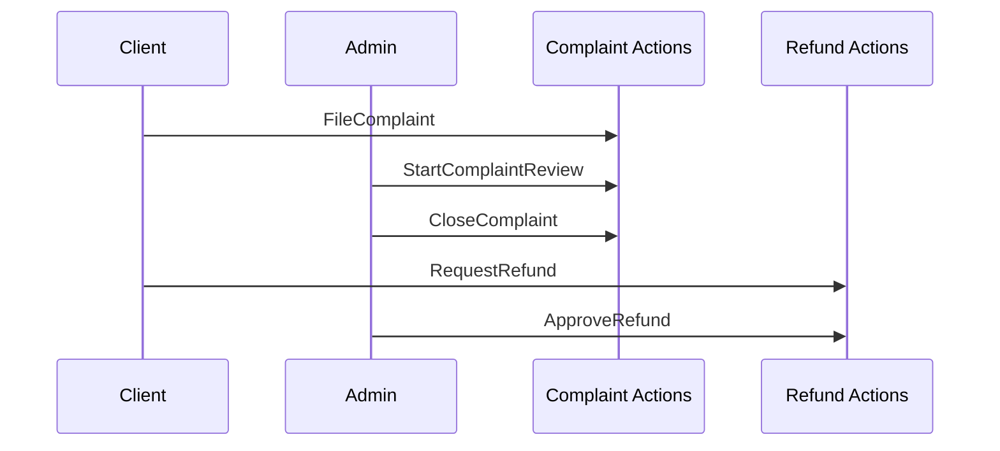

# Complaint & Refund Spec — Pulse MVP

**Тип:** Spec  
**Статус:** Canonical  
**Версия:** 2.0  
**Дата:** 2026-05-25  
**Волна:** W9  
**Зависит от:** [`lifecycle_models.md`](../../../prds/02_domain_model/lifecycle_models.md), [`authorization_matrix.md`](../../../prds/04_authorization_privacy/authorization_matrix.md)  
**Связанные документы:** [`admin_flow.md`](../../../prds/01_product_scope/user_flows/users_mvp/admin_flow.md), [`post_mvp_deferrals.md`](../../../prds/01_product_scope/post_mvp_deferrals.md), [`adr_008_complaint_resolution_model.md`](../../../prds/07_governance/adr_008_complaint_resolution_model.md), [`P19_phase_description.md`](../phases_tasks_descriptions/P19_phase_description.md)

---

## Purpose

Implementation-spec **admin обработки жалоб и возвратов** MVP: `/admin/complaints`, `/admin/complaints/[id]`, `/admin/refunds`; client filing flows where in scope; manual DB-only refunds (no Stripe). UX + Action touchpoints; domain transitions in lifecycle_models.

**Аудитория:** AI-агенты P05; admin ops UI.

---

## Scope / Out of scope

**In scope:** Admin list/detail/status transitions; refund approve/reject; priority badges; nav badge counts; client `FileComplaint` / `RequestRefund` entry points tied to bookings.

**Out of scope:** Stripe refund API; automated no-show refunds; legal escalation workflows; email notifications.

**MVP refund:** admin updates `refund_request.status` in DB only — [`post_mvp_deferrals.md`](../../../prds/01_product_scope/post_mvp_deferrals.md).

---

## Definitions

| Entity | Statuses (MVP) |
|--------|----------------|
| Complaint | `open` → `in_review` → `closed` |
| Complaint resolution (P19, on close only) | `no_action` \| `warning_to_trainer` \| `refund_recommended` \| `duplicate` \| `spam` |
| RefundRequest | `pending` → `approved` \| `rejected` |

| Priority (complaint UI) | Display |
|-------------------------|---------|
| high / medium / low | Badge colors per admin_flow |

---

## Happy path

### Admin — complaints queue

1. Admin opens `/admin/complaints` — tabs **Open** | **In review**.
2. Cards: priority, reporter, subject trainer, summary, actions.
3. «Open details» → `/admin/complaints/[id]`.
4. Admin starts review → `StartComplaintReview` (`open` → `in_review`).
5. Close complaint → `CloseComplaint` → `closed` + **`resolution`** + `adminNotes`; toast.success; badge update.

### Admin — complaint detail (P19)

1. Admin on `/admin/complaints/[id]` — **Context panel**: booking summary (read-only), trainer name, related refund status + link to `/admin/refunds` if exists.
2. Status `in_review` — banner «В работе у {assignee}» (from audit log); **Audit timeline** (review started, closed).
3. Primary CTA **«Завершить рассмотрение»** → dialog: `Select` resolution + `Textarea` admin notes (required except duplicate/spam).
4. On `refund_recommended` — inline copy + link to refunds queue; **MUST NOT** auto-create refund.
5. Status `closed` — **Closed summary**: resolution badge, notes, resolver, timestamp; no actions.

### Admin — quick close (open only)

1. From list or detail while `open` — **«Закрыть без рассмотрения»** for low-priority triage (duplicate/spam resolutions).
2. Skips `in_review`; still requires resolution in dialog.

### Admin — refunds queue

1. Admin opens `/admin/refunds` — list pending refund requests.
2. Card shows client, booking ref, amount (snapshot), reason.
3. **Approve** or **Reject** → Server Actions; set `processed_by_id`, `processed_at`.
4. toast.success; remove from pending list; badge decrement.

### Client — file complaint (MVP entry)

1. Client on `/client/bookings/[id]` — link «Report issue» (if booking eligible).
2. Dialog/form: category, description → `FileComplaint` → status `open`.
3. toast.success; optional redirect bookings list.

### Client — request refund

1. Eligible completed/cancelled booking → «Request refund».
2. Form amount ≤ booking snapshot → `RequestRefund` → `pending`.
3. toast.success; admin sees in `/admin/refunds`.

---

## Negative paths (UX)

| Scenario | UX |
|----------|-----|
| Complaint on invalid booking | Validation error — not eligible |
| Refund amount &gt; booking total | Field error |
| Duplicate open complaint same booking | **MAY** deny or merge — show message |
| Admin reject refund without note | **SHOULD** require reason field |
| Empty open complaints | Positive «All clear» green empty |
| Empty refunds pending | «No pending refunds» |
| Concurrent admin approve refund | Second admin sees error — [`FM-013`](../../../prds/02_domain_model/failure_modes_catalog.md#fm-013) |
| Load failure | Alert + Retry |

---

## Security paths

| Scenario | UX |
|----------|-----|
| Client manages complaints admin routes | proxy deny |
| Client views others' complaints | 404 / forbidden |
| Client approves own refund | Server deny |
| Trainer files complaint | **MAY** allow MVP — matrix says client typically; if allowed, own booking context only |
| IDOR complaint/refund id | Admin-only reads; client own records only |

[`authorization_matrix.md`](../../../prds/04_authorization_privacy/authorization_matrix.md) — Complaints & refunds section.

---

## Concurrency notes

- **FM-013** — two admins approve same refund: second gets error toast; refresh list.
- Complaint close while client editing — rare; last write wins on admin side.
- No Stripe idempotency on MVP — manual status only.

---

## UI states matrix

| Screen | empty | loading | error | forbidden |
|--------|-------|---------|-------|-----------|
| `/admin/complaints` list | All clear | card skeletons | Retry | non-admin |
| `/admin/complaints/[id]` | — | detail skeleton | notFound | — |
| `/admin/complaints/[id]` closed | — | — | — | resolution summary read-only |
| Status actions | — | pending busy | toast.error | — |
| `/admin/refunds` | no pending | card skeletons | Retry | non-admin |
| Client report dialog | — | submit pending | toast.error | wrong booking |
| Client refund form | — | submit pending | validation | — |

---

## Interaction requirements

| ID | Rule |
|----|------|
| CR-MUST-1 | Priority badge visible on list cards |
| CR-MUST-2 | Destructive Close vs primary Start review — distinct buttons |
| CR-MUST-3 | Refund Approve primary; Reject outline/destructive |
| CR-MUST-4 | toast.success on admin resolution |
| CR-MUST-5 | No Stripe UI — copy clarifies manual processing MVP |
| CR-SHOULD-1 | Quick «Close» from list for low-priority open items |
| CR-MUST-6 | Resolution **required** on every `CloseComplaint` (P19) |
| CR-MUST-7 | Admin notes required (min 10 chars) except `duplicate` / `spam` |
| CR-MUST-8 | Context panel: booking + related refund on detail (read-only) |
| CR-MUST-9 | Copy clarifies closing complaint ≠ approving refund |
| CR-SHOULD-2 | In-review list shows assignee + days in review |

---

## Wireframe & prototype

| Route | Wireframe (planned) | Prototype |
|-------|---------------------|-----------|
| `/admin/complaints` | W10-26 | Admin complaints |
| `/admin/complaints/[id]` | W10-27 | Complaint detail |
| `/admin/refunds` | W10-28 | Refunds queue |
| Client booking detail | W10-13 | Report/refund entry |

[`admin_flow.md`](../../../prds/01_product_scope/user_flows/users_mvp/admin_flow.md) § Потоки 3–4.

---

## Requirements

1. **MUST** — follow lifecycle transitions in lifecycle_models — no ad-hoc statuses.
2. **MUST** — admin-only approve/reject refund on MVP (manual DB).
3. **MUST** — client refund request linked to own `booking_id`.
4. **MUST NOT** — call Stripe refund API on MVP.
5. **SHOULD** — sync nav badge counts with open/pending queries.

---

## Acceptance criteria

### MVP (P13)

- [ ] Happy: complaint review + refund approve paths
- [ ] Negative: validation, empty queues, concurrent admin
- [ ] Security: role matrix enforced
- [ ] Concurrency: FM-013 referenced
- [ ] UI states matrix for admin + client entry
- [ ] Wireframes linked
- [ ] Post-MVP Stripe noted in scope

### Complaint resolution v2 (P19)

- [ ] CloseComplaint persists `resolution` per ADR-008
- [ ] Resolve dialog: resolution select + conditional notes validation
- [ ] Detail: context panel, audit timeline, closed summary
- [ ] `in_review` primary CTA «Завершить рассмотрение»
- [ ] Quick close only from `open` state
- [ ] `refund_recommended` shows refunds CTA without auto-create
- [ ] Messages from `@/lib/messages`; literals from `@pulse/domain`

---

## Complaint resolution v2 (P19)

**ADR:** [`adr_008_complaint_resolution_model.md`](../../../prds/07_governance/adr_008_complaint_resolution_model.md)  
**Phase:** [`P19_tasks.md`](../tasks/P19_tasks.md)

Detail page regions (top → bottom):

1. Header + back link
2. Processed banner (`in_review` / `closed`)
3. **Context panel** — booking snippet, refund link/status
4. Complaint card — priority, status, participants, reason
5. **Audit timeline**
6. Sticky actions (`open` / `in_review`) or **Closed summary**

No new routes. No admin booking detail route — context is read-only on complaint detail.

---

## UI Catalog (by screen)

**Phase:** P13 (base) · P19 (resolution v2) · Full matrix: [`ui_component_phase_matrix.md`](../ui_component_phase_matrix.md)

| Screen | CREATE | USE |
|--------|--------|-----|
| `/admin/complaints`, `/admin/refunds` | Admin queue/detail rows | `PageHeader`, confirm dialogs |
| `/admin/complaints/[id]` (P19) | `ComplaintContextPanel`, `ComplaintAuditTimeline`, `ResolveComplaintDialog`, `ComplaintClosedSummary` | `ComplaintDetailCard`, `ComplaintProcessedBanner` |
| Client booking detail (if P08) | Complaint/refund entry actions | `Button`, `Dialog` |

---

## Related documents

| Document | Relationship |
|----------|--------------|
| [`lifecycle_models.md`](../../../prds/02_domain_model/lifecycle_models.md) | State machines |
| [`authorization_matrix.md`](../../../prds/04_authorization_privacy/authorization_matrix.md) | Permissions |
| [`failure_modes_catalog.md`](../../../prds/02_domain_model/failure_modes_catalog.md) | FM-013 |
| [`pages_functional_spec.md`](../../../prds/01_product_scope/pages_functional_spec.md) | Admin pages |
| [`global_shell_spec.md`](./global_shell_spec.md) | Badges |
| [`adr_008_complaint_resolution_model.md`](../../../prds/07_governance/adr_008_complaint_resolution_model.md) | Resolution decisions |
| [`P19_tasks.md`](../tasks/P19_tasks.md) | P19 implementation |
| [`admin_people_ops_spec.md`](./admin_people_ops_spec.md) | P18 deep links to client/trainer people pages |

**Registry:** [`documentation_creation_registry.md`](../../../meta/documentation_creation_registry.md) — wave W9-08

---

## Agent notes

- GMV/KPI on admin dashboard may show refund totals — read-only aggregates.
- Client complaint form texts from `@/lib/messages`.
- When payments go live, extend with Stripe — new contract amendment, not this spec alone.

---

## Change log

| Date | Change |
|------|--------|
| 2026-05-25 | v2.0 — Complaint resolution v2 (P19): resolution enum, detail UX, CR-MUST-6..9 |
| 2026-05-23 | v1.0 — complaint & refund spec (W9-08) |
