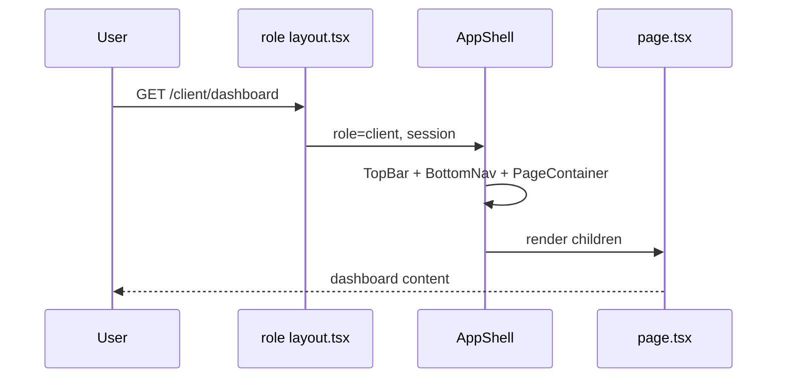

# Global Shell Spec — Pulse MVP

**Тип:** Spec  
**Статус:** Canonical  
**Версия:** 1.0  
**Дата:** 2026-05-23  
**Волна:** W9  
**Зависит от:** [`responsive_navigation_contract.md`](../../../design/responsive_navigation_contract.md), [`visual_identity_contract.md`](../../../design/visual_identity_contract.md), [`ux_ui_principles.md`](../../../design/ux_ui_principles.md)  
**Связанные документы:** [`pages_functional_spec.md`](../../../prds/01_product_scope/pages_functional_spec.md), [`auth_runtime_spec.md`](../../../prds/05_runtime/auth_runtime_spec.md)

**Context7 verified:** Next.js 16.2 — nested `layout.tsx` via `children` prop; segment `loading.tsx` for route-level skeletons (`/vercel/next.js/v16.2.2`).

---

## Purpose

Implementation-spec **глобального app shell** Pulse: route groups, layout composition, shared chrome (TopBar, BottomNav, SidebarNav, PageContainer), theme/toast providers, nav config per role. Связывает UX contracts W2 с файловой структурой `apps/web`.

**Аудитория:** AI-агенты фазы P03; frontend implementers.

---

## Scope / Out of scope

**In scope:** Layout tree, shared components, nav item config module, badge counts, `(booking)` stripped chrome, providers in root layout.

**Out of scope:** Page-level content specs; auth logic (→ `auth_runtime_spec`); proxy matcher details (→ ADR-002); wireframe pixels (→ W10).

---

## Definitions

| Term | Meaning |
|------|---------|
| **Shell** | TopBar + role nav (bottom/sidebar) + PageContainer |
| **Stripped chrome** | TopBar minimal only — no role nav |
| **Nav config** | Single TS module: role → `{ label, href, icon, badgeKey? }[]` |

---

## Target file layout

```text
apps/web/src/app/
├── layout.tsx                    # fonts, ThemeProvider, Toaster, globals
├── (marketing)/layout.tsx        # PublicChrome — TopBar only
├── (discovery)/layout.tsx        # HybridAppShellGate — shell when auth
├── (booking)/layout.tsx          # StrippedBookingHeader
├── (session)/layout.tsx          # Minimal session header
├── (client)/layout.tsx           # RoleAppShellGate role=client
├── (trainer)/layout.tsx          # RoleAppShellGate role=trainer + review banner slot
├── (admin)/layout.tsx            # RoleAppShellGate role=admin
└── ...
```

**MUST** — route paths only from [`canonical_routes.md`](../../../design/canonical_routes.md); no duplicate route list in code comments beyond nav config values.

---

## Happy path

### 1. Client mobile session

1. Authenticated client navigates to `/client/dashboard`.
2. `(client)/layout.tsx` renders `RoleAppShellGate` → `AppShell` with `role="client"`.
3. `TopBar` sticky; `BottomNav` visible (`md:hidden`); `SidebarNav` hidden.
4. `PageContainer` wraps `{children}` with `pb-24 md:pb-6` above bottom nav safe area.
5. User taps «Trainers» → `/trainers` (`(discovery)` group) — **`HybridAppShellGate` preserves shell**; active nav item «Trainers». Guest on same URL sees `PublicChrome` (Top bar only).

### 2. Trainer desktop session

1. Trainer at `/trainer/schedule` (≥ md).
2. `SidebarNav` sticky `top-16`, `w-52 lg:w-60`; BottomNav hidden.
3. If `trainerProfile.status === pending` — `TrainerReviewBanner` in content slot above page title (not in nav).

### 3. Admin with queue badges

1. Admin opens any `/admin/*` route.
2. Layout fetches badge counts (RSC) or receives from parallel data region.
3. Sidebar/BottomNav items «Trainers», «Complaints», «Refunds» show error badge when count &gt; 0.



---

## Negative paths (UX)

| Scenario | UX |
|----------|-----|
| Unknown route | `not-found.tsx` — Zero Dead End CTA «На главную» / role home |
| Layout data fetch fails (badges) | Nav renders without badges; inline retry in dashboard only — **not** block shell |
| Session expired during nav | Next protected navigation → proxy redirect login |
| Trainer pending | Shell visible; banner «Under review» — nav unchanged |
| Very narrow mobile (&lt;360px) | Trainer 5-item nav: labels MAY collapse to icons only (trainer_flow) |

---

## Security paths

| Scenario | Behavior |
|----------|----------|
| Client renders trainer nav items | **Forbidden** — nav config filtered by `session.user.role` only |
| Admin badges leaked to client | Count queries scoped server-side; no client-side admin API |
| Prototype role switcher | **Dev/demo only** — MUST NOT ship in production shell |
| Unauthenticated user on `(client)` layout | Should not reach layout — `proxy.ts` redirects first |

Role prefix enforcement: [`auth_runtime_spec.md`](../../../prds/05_runtime/auth_runtime_spec.md); object-level — policy-server (not shell).

---

## Concurrency notes

- Nav badge counts may lag after admin mutation — **SHOULD** `revalidatePath` / tag invalidation on approve/close actions (see admin specs).
- Optimistic badge decrement optional; stale badge acceptable briefly.
- No race resolution in shell — reference contracts W8.

---

## UI states matrix

| Region | empty | loading | error | forbidden |
|--------|-------|---------|-------|-----------|
| TopBar | — | avatar skeleton optional | hide broken avatar | — |
| BottomNav / Sidebar | — | — | — | wrong role → proxy before render |
| PageContainer `{children}` | per-page | `loading.tsx` / Suspense | `error.tsx` | redirect |
| Admin badges | count=0 hidden | skeleton dot optional | omit badge | — |
| Trainer review banner | hidden when approved | — | — | — |

---

## Component contracts

| Component | Responsibility |
|-----------|----------------|
| `AppShell` | Compose TopBar + `AppShellCanvas` + BottomNav; props: `role`, `children` |
| `AppShellCanvas` | `Container variant="shell"` flex row on md+ — sidebar + main share one `max-w-[1400px]` canvas (prototype parity) |
| `PublicChrome` | TopBar + `<main>` wrapper for guest/marketing routes |
| `RoleAppShellGate` | Auth guard + role-specific shell (banner, badges) |
| `HybridAppShellGate` | Session-aware: `RoleAppShellGate` when auth, else `PublicChrome` — `(discovery)` routes |
| `TopBar` | Logo, theme toggle, notifications popover (placeholder MVP), avatar `hidden md:inline-flex` on mobile |
| `BottomNav` | `sticky bottom-0`, `md:hidden`, icon-only active pill, safe-area padding, `aria-current="page"` |
| `SidebarNav` | `hidden md:flex`, inside `AppShellCanvas`, same items as BottomNav |
| `PageContainer` | Standalone: `max-w-[1400px]`; in shell: `inShellCanvas` — width from `AppShellCanvas`, main column gutters only |
| `StrippedBookingHeader` | Back + step progress; no role nav |
| `getNavItems(role)` | Single module — DRY per [`responsive_navigation_contract.md`](../../../design/responsive_navigation_contract.md) |

### Providers (root `layout.tsx`)

| Provider | Notes |
|----------|-------|
| `next-themes` | `attribute="class"` on `<html>` |
| `Toaster` (Sonner) | One instance; see interaction contract |
| Fonts | Cormorant Garamond, Onest, JetBrains Mono via `next/font` (`latin`, `cyrillic`) |

---

## Wireframe & prototype

| Surface | Wireframe (planned) | Prototype |
|---------|---------------------|-----------|
| Client shell | W10-11 `client_dashboard.md` | `c.home`, BottomNav `c.*` |
| Trainer shell | W10-16 `trainer_dashboard.md` | `t.home` |
| Admin shell | W10-23 `admin_dashboard.md` | `a.home` |
| Booking stripped | W10-08 `booking_wizard.md` | `BookingFlow` header |

Mapping: [`prototype_route_mapping.md`](../../../design/prototype_route_mapping.md).

---

## Requirements

1. **MUST** — one nav config module per role; no duplicated path arrays in page files.
2. **MUST** — `(booking)` and `(session)` groups omit BottomNav/Sidebar.
3. **MUST** — admin nav includes `/admin/reviews` entry (canonical route; prototype gap documented in nav contract).
4. **MUST** — touch targets ≥ 44×44px on nav items.
5. **SHOULD** — badge counts from server component in layout or dedicated `@badges` parallel slot (post-P01 optimization).
6. **MUST NOT** — import `auth.ts` with Prisma in client nav components.

---

## Acceptance criteria

- [ ] Layout tree matches six route groups in canonical_routes
- [ ] Happy path: client mobile + trainer desktop + admin badges documented
- [ ] Negative: 404 Zero Dead End, pending trainer banner
- [ ] Security: role-filtered nav, no prototype role switcher in prod
- [ ] UI states matrix for shell regions
- [ ] Wireframe placeholders linked
- [ ] Context7 nested layout pattern cited
- [ ] Single nav config — drift guard documented

---

## UI Catalog (by screen)

**Phase:** P03 · Full matrix: [`ui_component_phase_matrix.md`](../ui_component_phase_matrix.md)

| Screen / route group | CREATE | USE |
|----------------------|--------|-----|
| All authenticated roles | `AppShell`, `TopBar`, `BottomNav`, `SidebarNav`, `NavItem`, `PageContainer` | `Button`, theme toggle |
| `(booking)` stripped | — | Minimal `TopBar` only |
| Placeholder dashboards | — | `PulseCard`, `Empty`, typography atoms |

---

## Related documents

| Document | Relationship |
|----------|--------------|
| [`responsive_navigation_contract.md`](../../../design/responsive_navigation_contract.md) | Nav items, breakpoints |
| [`visual_identity_contract.md`](../../../design/visual_identity_contract.md) | Tokens for shell |
| [`ux_ui_principles.md`](../../../design/ux_ui_principles.md) | P3 Thumb Zone, P4 One Primary Action |
| [`ui_states_contract.md`](../../../design/ui_states_contract.md) | Loading/error patterns |
| [`interaction_design_contract.md`](../../../design/interaction_design_contract.md) | Toaster placement |
| [`monorepo_boundaries_contract.md`](../contracts/monorepo_boundaries_contract.md) | apps/web thin adapters |
| *(planned)* W10 wireframes | Visual regions |

**Registry:** [`documentation_creation_registry.md`](../../../meta/documentation_creation_registry.md) — wave W9-01

---

## Agent notes

- Do not add Bottom Nav to `(booking)` — intentional UX per nav contract.
- Catalog link in client nav points to **public** `/trainers`, not `/client/trainers`.
- Prefer Server Components for shell; client only for theme toggle, mobile sheet triggers.
- Replace any lampto `middleware.ts` examples with `proxy.ts` when copying patterns.

---

## Change log

| Date | Change |
|------|--------|
| 2026-05-23 | v1.0 — global shell implementation spec (W9-01) |
