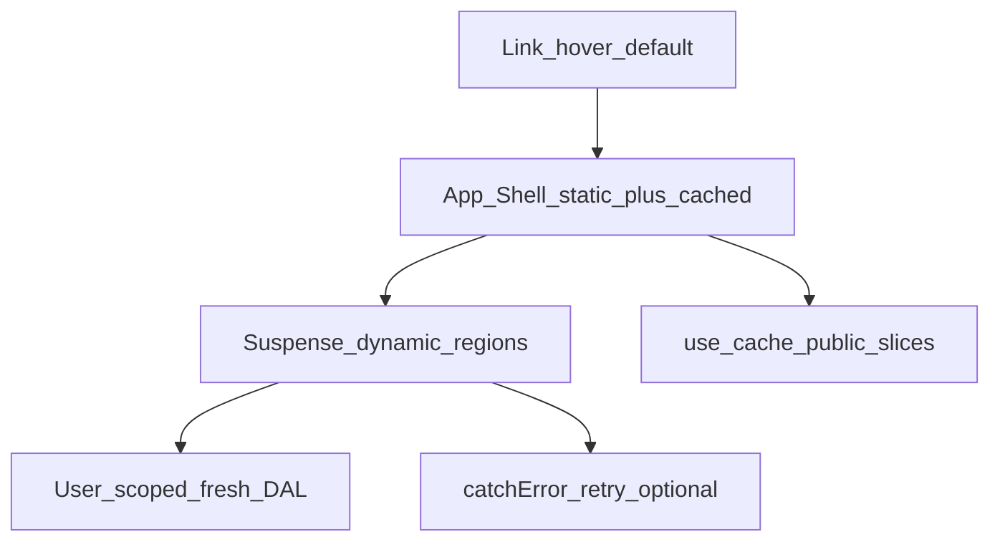

# Instant Navigations Adoption Spec — Pulse (P22)

**Тип:** Spec  
**Статус:** Canonical  
**Версия:** 1.1  
**Дата:** 2026-08-11  
**Волна:** W25  
**Фаза:** **P22** — Instant Navigations adoption (Next.js 16.3)  
**Зависит от:** [ADR-002](../../../prds/07_governance/adr_002_next162_vercel_runtime_policy.md) §5.1–§5.2, [`cache_revalidation_policy.md`](../../../prds/05_runtime/cache_revalidation_policy.md), [`ai_loading_patterns.md`](../../../guidelines/nextjs/ai_loading_patterns.md)  
**Связанные документы:** [`P22_phase_description.md`](../phases_tasks_descriptions/P22_phase_description.md), [`P22_tasks.md`](../tasks/P22_tasks.md)

**Context7:** `/vercel/next.js` — [Instant navigation](https://nextjs.org/docs/app/guides/instant-navigation), [Adopting Partial Prefetching](https://nextjs.org/docs/app/guides/adopting-partial-prefetching), [`catchError`](https://nextjs.org/docs/app/api-reference/functions/catchError), [`partialPrefetching`](https://nextjs.org/docs/app/api-reference/config/next-config-js/partialPrefetching). Prefer bundled `node_modules/next/dist/docs/` after pin bump.

---

## Purpose

Нормативный contract для **adoption Instant Navigations** в product routes `apps/web` после pin **Next.js 16.3.0**.

Конфиг уже включён:

```ts
// apps/web/next.config.ts
cacheComponents: true
partialPrefetching: true
```

Спека описывает **composition**, покрытие `loading.tsx` / `error.tsx`, `'use cache'` vs fresh DAL, `catchError`, prefetch policy и verification — не redesign продукта.

**Аудитория:** AI-агенты P22; runtime QA.

---

## Normative composition rules

Instant Navigations = **Cache Components** + **Partial Prefetching** + route composition that leaves a reusable **App Shell**.

| Rule | MUST |
|------|------|
| **R1** | `page.tsx` is **thin compose**: sync chrome (titles, layout slots) + `<Suspense fallback={…}>` around async data regions |
| **R2** | **MUST NOT** `await` DB/DAL at the top of `page.tsx` before the first Suspense that owns that data (blocks App Shell) |
| **R3** | Async work lives in `*.server.tsx` (or colocated async Server Components) imported into Suspense children |
| **R4** | Public, URL-stable slices → **`'use cache'`** + `cacheTag()` / `cacheLife()` per [`cache_revalidation_policy.md`](../../../prds/05_runtime/cache_revalidation_policy.md) |
| **R5** | User-scoped / auth-gated mutable data → **fresh** read (no cross-request `'use cache'`); still stream behind Suspense |
| **R6** | Segment **`loading.tsx`** required for data-heavy product routes ([`ai_loading_patterns.md`](../../../guidelines/nextjs/ai_loading_patterns.md) §10) |
| **R7** | Segment **`error.tsx`** for async segment failure; component-level **`catchError`** + prefer **`retry()`** when one region must recover independently ([ADR-002](../../../prds/07_governance/adr_002_next162_vercel_runtime_policy.md) §5.2) |
| **R8** | Default `<Link>` warms App Shell under `partialPrefetching`. **`prefetch={true}`** only for intentional deeper prefetch after the target route’s shell is non-blocking |
| **R9** | **`export const instant = false`** only with a documented blocking reason in phase notes / PR — not the default |
| **R10** | Skeletons match final layout (CLS &lt; 0.1); reuse catalog `<Skeleton />` |



---

## Cache vs fresh

| Data class | Strategy | Examples |
|------------|----------|----------|
| Public catalog / filter options / featured | `'use cache'` + tags | `get-catalog-trainers`, `get-catalog-filter-options`, `get-featured-trainers` |
| Public trainer profile / reviews / schedule preview | `'use cache'` + tags | `get-public-trainer-profile`, `get-trainer-reviews`, `get-trainer-schedule-preview` |
| Session / role guards (same request) | React `cache()` | `auth()` wrappers |
| Client bookings, dashboards, admin queues, trainer private editors | **Fresh** + Suspense | bookings list, KPI snapshots, moderation queues |

**MUST NOT** add `'use cache'` to auth-gated mutable lists without an explicit ADR/cache-policy amendment.

Invalidation unchanged: `updateTag` (Server Actions, read-your-own-writes), `revalidateTag`, `revalidatePath`.

---

## Error recovery decision table

| Situation | Prefer |
|-----------|--------|
| Whole route segment failed | Colocated **`error.tsx`** |
| Independent UI region (grid vs filters, KPI vs list) | **`catchError(fallback)`** from `next/error`; fallback in `'use client'` module; **`retry()`** over `reset()` |
| Fatal root HTML / React tree | Existing **`global-error.tsx`** |
| Optional shared segment fallback | Root `app/error.tsx` (P22 optional) if product wants non-global recovery |

`catchError` must not swallow `notFound()` / `redirect()`.

Copy for retry controls: `@/lib/messages` — e.g. `common.segmentError.retry` (not inventing `common.retry`).

---

## Prefetch policy

| Mode | When |
|------|------|
| Default `<Link>` | Always — App Shell per route under `partialPrefetching: true` |
| `prefetch={true}` | Hot CTAs to routes whose shell is already non-blocking and preferably cached: landing → `/trainers`, card → `/trainers/[id]`, book CTA → `/book/[trainerId]` **after** P0 fixes |
| `prefetch={false}` | Dev-only / intentional opt-out (e.g. Design Lab) |
| `export const prefetch = 'partial'` | Not required when global `partialPrefetching` is on; temporary only during incremental adoption |

---

## Route priority matrix (gap canon)

### Already compliant (baseline — do not regress)

| Area | Notes |
|------|-------|
| `next.config.ts` | `cacheComponents` + `partialPrefetching` |
| Pin | `next@16.3.0` (+ aligned third-parties / eslint-config) |
| Role layouts | Suspense + `AppShellFallback` |
| Marketing `/` | Suspense regions |
| Admin list pages | List Suspense patterns |
| Public reviews / schedule Suspense on profile | Present |
| No `unstable_cache` / casual `instant = false` | Present |

### P0 — blocking App Shell (MUST fix in P22)

| ID | Path | File (under `apps/web/src/app/`) | Defect |
|----|------|----------------------------------|--------|
| B1 | `/book/[trainerId]` | `(booking)/book/[trainerId]/page.tsx` | `await getPublicTrainerProfile` before Suspense |
| B2 | `/client/bookings` | `(client)/client/bookings/page.tsx` | Atomic `getClientBookings`; split upcoming/past Suspense |
| B3 | `/trainer/dashboard` | `(trainer)/trainer/dashboard/page.tsx` | Blocking snapshot; missing `loading.tsx` |
| B4 | `/client/dashboard` | `(client)/client/dashboard/page.tsx` | Blocking `getClientNextSession` |
| B5 | `/admin/dashboard` | `(admin)/admin/dashboard/page.tsx` | Entire dashboard top-level fetch |
| B6 | `/trainers/[id]` | `(discovery)/trainers/[id]/page.tsx` | Profile header/about/services outside Suspense |
| B7 | `/trainers` | `(discovery)/trainers/page.tsx` | Filter options await blocks grid shell |

### P1 — loading / error / region split

**Missing `loading.tsx`:**  
`trainer/dashboard`, `trainer/clients`, `trainer/clients/[id]`, `trainer/income`, `trainer/profile`, `client/profile`.

**Missing `error.tsx`:**  
`client/dashboard`, `client/profile`, `client/reviews/[bookingId]`, `trainer/dashboard`, `trainer/clients` (+ `[id]`), `trainer/income`, `trainer/profile`.  
Optional: root `app/error.tsx`.

**Has `loading.tsx` but page still blocks:**  
`client/bookings/[id]`, `client/reviews/[bookingId]`, `trainer/services`, `trainer/schedule` (async child without page Suspense), `admin/trainers|complaints|reviews` (counts before list), `admin/.../[id]` details.

### P2 — 16.3 feature polish

| ID | Item |
|----|------|
| D1 | Introduce `catchError` + `retry()` on multi-region pages (catalog grid, public profile regions, dashboard KPI vs list) |
| D2 | Deeper `prefetch={true}` on hot CTAs after P0 |
| D3 | Instant Insights QA (`next dev` + preview/`next start`) |
| D4 | Nested `apps/web/package-lock.json` hygiene (prefer single root lockfile) |

### Docs gate (before / with first code wave)

| ID | Item |
|----|------|
| A1 | High-precedence docs still say `16.2.6` / Context7 `/v16.2.2` — **listed files only** (tasks §0); residual outside list = out of P22 |
| A2 | User-facing how-it-was-built stack string |
| A3 | Nested lockfile vs root 16.3.0 |
| A4 | ADR-002 amend wording / date vs `adr_index` changelog → **2026-08-11** |
| A5 | `ai_loading_patterns` §12.1 example key → `common.segmentError.retry` |

---

## Verification

| Check | Expected |
|-------|----------|
| Instant Insights (`next dev`) | Adopted hot routes show usable App Shell; no unexplained blocking |
| Manual navigation | Client nav to P0 routes paints chrome/skeletons before DB settles |
| Prefetch | Default Link does not regress; deeper prefetch only on approved CTAs |
| CLS | Skeletons match layout |
| Config | `cacheComponents` + `partialPrefetching` remain `true` |
| Pin | `npm ls next -w web` → `16.3.0` |
| Quality | `npm run typecheck` + `npm run lint` (root) |

---

## Out of scope

- P16 landing visual redesign; P18 people ops; P21 email
- Renaming ADR file `adr_002_next162_*`
- Blanket `'use cache'` on private DAL
- New product features unrelated to streaming/shell
- `templates/**` snapshot pin (separate maintenance)

---

## Related documents

| Document | Relationship |
|----------|--------------|
| [ADR-002](../../../prds/07_governance/adr_002_next162_vercel_runtime_policy.md) | Runtime pin + Instant Navigations / `catchError` |
| [`ai_loading_patterns.md`](../../../guidelines/nextjs/ai_loading_patterns.md) | §8.1, §10, §12.1, §14 |
| [`cache_revalidation_policy.md`](../../../prds/05_runtime/cache_revalidation_policy.md) | Tags / invalidation |
| [`P22_phase_description.md`](../phases_tasks_descriptions/P22_phase_description.md) | Phase |
| [`P22_tasks.md`](../tasks/P22_tasks.md) | Checklist |
| [`canonical_routes.md`](../../../design/canonical_routes.md) | Route inventory |

---

## Change log

| Date | Change |
|------|--------|
| 2026-08-11 | v1.1 — A1 listed-only note (D3 already in matrix — no task duplication); implementation notes live in phase/tasks v1.2 |
| 2026-08-11 | v1.0 — W25 / P22 Instant Navigations adoption spec |
