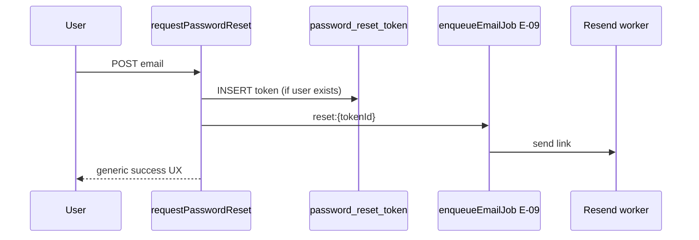

# Password Reset Spec — Pulse (Post-MVP)

**Тип:** Spec  
**Статус:** Canonical (post-MVP — **не** P01–P05 scope)  
**Версия:** 1.0  
**Дата:** 2026-05-23  
**Волна:** W9  
**Зависит от:** [`auth_runtime_spec.md`](../../../prds/05_runtime/auth_runtime_spec.md), [`email_notifications_contract.md`](../contracts/email_notifications_contract.md)  
**Связанные документы:** [`email_notifications_matrix.md`](../../../prds/01_product_scope/email_notifications_matrix.md), [`post_mvp_deferrals.md`](../../../prds/01_product_scope/post_mvp_deferrals.md)

**Context7 verified:** Auth.js v5 Credentials — custom flows via Server Actions + `authorize()`; no built-in reset UI (`/websites/authjs_dev`).

---

## Purpose

Implementation-spec **self-service password reset** для Pulse после включения email jobs (P06+). На MVP **не реализуется** — таблица `password_reset_token` schema-ready; login MAY hide or disable «Forgot password». Документ готовит агентов к включению без архитектурных сюрprises.

**Аудитория:** AI-агенты post-MVP auth phase; security review.

---

## Scope / Out of scope

**In scope:** Request reset, email E-09, token validation, set new password, UX/security states, idempotent email enqueue.

**Out of scope (MVP):** Любые routes `/auth/forgot-password`, `/auth/reset-password`; Resend sends; UI on login except disabled link.

**MVP behavior:** [`mvp_scope.md`](../../../prds/01_product_scope/mvp_scope.md) — MUST NOT self-service reset; [`auth_runtime_spec.md`](../../../prds/05_runtime/auth_runtime_spec.md) — MAY hide link.

---

## Definitions

| Term | Rule |
|------|------|
| `password_reset_token` | Single-use row; short TTL (e.g. 1h); hashed token at rest |
| E-09 | Email event «Password reset» — [`email_notifications_matrix.md`](../../../prds/01_product_scope/email_notifications_matrix.md) |
| `idempotency_key` | `reset:{tokenId}` per email contract |

---

## Happy path (post-MVP)

### Request reset

1. User opens `/auth/forgot-password` (public).
2. Submits email via Server Action `requestPasswordReset`.
3. Server: if user exists → create `password_reset_token` (hash, expiry); enqueue E-09 via [`email_notifications_contract.md`](../contracts/email_notifications_contract.md).
4. **Always** show same success message (no email enumeration): «If an account exists, we sent instructions».
5. Redirect or stay on confirmation screen.

### Consume token

1. User clicks link `/auth/reset-password?token=...` (token in URL **once** — prefer short-lived opaque id lookup).
2. Server validates: not expired, not used, user active.
3. Form: new password + confirm → `resetPassword` Action.
4. bcrypt hash update; mark token used; invalidate other sessions (optional post-MVP).
5. `toast.success` + redirect `/auth/login` or auto sign-in (product choice: **SHOULD** redirect login).

---

## Negative paths (UX)

| Scenario | UX |
|----------|-----|
| Unknown email | Same success copy as known email — no leak |
| Expired token | Error page + CTA «Request new link» → `/auth/forgot-password` |
| Used token | Same as expired — generic invalid message |
| Weak password | Field errors `border-destructive`; stay on form |
| Network error on submit | `toast.error` + Retry |
| **MVP:** user taps forgot password | Link disabled or hidden; optional tooltip «Coming soon» |

---

## Security paths

| Scenario | MUST |
|----------|------|
| Email enumeration | Identical response for missing vs existing email |
| Token in logs | Never log raw token; store hash only |
| Brute force token | Rate limit by IP + email on request endpoint |
| Open redirect in reset link | Same-origin only; fixed path |
| CSRF on reset form | Server Action with session-less token binding |
| Admin reset for user | Out of scope — separate admin tool post-MVP |

Reference: [`failure_modes_catalog.md`](../../../prds/02_domain_model/failure_modes_catalog.md) — add FM entry when implementing.

---

## Concurrency notes

- Double «Request reset» — multiple tokens allowed; only latest valid OR invalidate previous on new issue (product rule: **SHOULD** invalidate prior unused tokens for same user).
- E-09 duplicate enqueue — idempotent `reset:{tokenId}` per email contract.
- User resets password while logged in elsewhere — acceptable; optional session revocation post-MVP.

---

## UI states matrix

| Screen | empty | loading | error | forbidden |
|--------|-------|---------|-------|-----------|
| Forgot password form | — | submit pending | toast.error | — |
| Check your email (optional) | — | — | — | — |
| Reset password form | — | submit pending | invalid/expired token shell + CTA | — |
| Login forgot link (MVP) | — | — | — | disabled/hidden |

---

## Wireframe & prototype

| Route | Wireframe | MVP |
|-------|-----------|-----|
| `/auth/forgot-password` | *(planned W10 extension)* | ❌ Not built |
| `/auth/reset-password` | *(planned W10 extension)* | ❌ Not built |
| `/auth/login` | W10-05 `auth_login.md` | Forgot link disabled optional |

Prototype: no reset screens — post-MVP.

---

## Routes (post-MVP target)

Add to [`canonical_routes.md`](../../../design/canonical_routes.md) **when implementing** — not before:

| Path | Role |
|------|------|
| `/auth/forgot-password` | public |
| `/auth/reset-password` | public |

---

## Requirements

1. **MUST NOT (MVP)** — implement reset routes, token creation, or E-09 enqueue.
2. **MUST (post-MVP)** — generic success on forgot request; hashed tokens; single-use.
3. **MUST (post-MVP)** — E-09 via email contract only; no inline Resend in Action.
4. **MUST** — password rules match registration (bcrypt cost ≥ 10).
5. **SHOULD (post-MVP)** — invalidate prior unused tokens on new request.

---

## Acceptance criteria

- [ ] MVP vs post-MVP boundary explicit
- [ ] Happy path request + consume documented
- [ ] Negative UX includes enumeration-safe messaging
- [ ] Security: rate limit, token hash, no open redirect
- [ ] Concurrency: idempotent E-09 reference
- [ ] UI states matrix present
- [ ] Links to auth_runtime, email contract, matrix E-09
- [ ] Context7: custom Credentials flow noted

---

## Related documents

| Document | Relationship |
|----------|--------------|
| [`auth_runtime_spec.md`](../../../prds/05_runtime/auth_runtime_spec.md) | Login; MVP defers reset |
| [`email_notifications_contract.md`](../contracts/email_notifications_contract.md) | E-09 enqueue |
| [`email_notifications_matrix.md`](../../../prds/01_product_scope/email_notifications_matrix.md) | Event E-09 |
| [`post_mvp_deferrals.md`](../../../prds/01_product_scope/post_mvp_deferrals.md) | Deferral rationale |
| [`database_schema_v1.md`](../../../prds/03_data_model/database_schema_v1.md) | `password_reset_token` DDL |
| [`forms_and_validation_ux.md`](../../../design/forms_and_validation_ux.md) | Password field UX |

**Registry:** [`documentation_creation_registry.md`](../../../meta/documentation_creation_registry.md) — wave W9-02

---

## Agent notes

- Do not scaffold reset routes in P01 — schema-only is sufficient.
- When enabling, update `canonical_routes.md` + wireframes in same task.
- Auth.js has no magic reset provider for Credentials — full custom flow.

---

## Change log

| Date | Change |
|------|--------|
| 2026-05-23 | v1.0 — post-MVP password reset spec (W9-02) |
