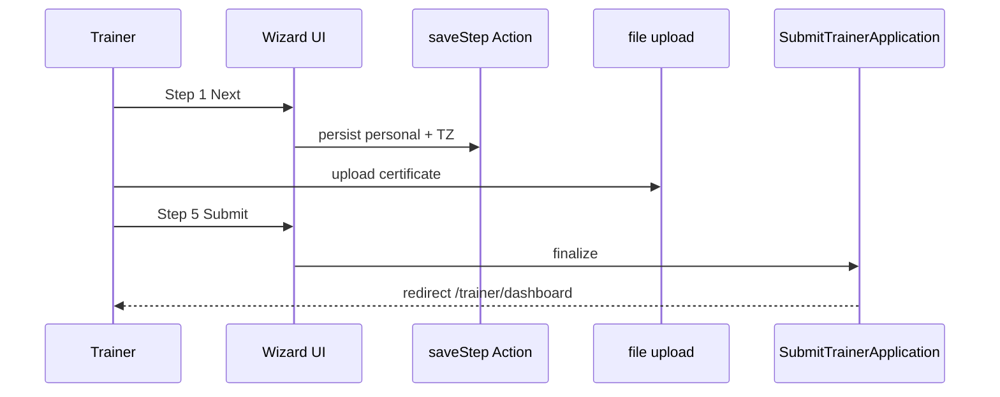

# Trainer Onboarding Spec — Pulse MVP

**Тип:** Spec  
**Статус:** Canonical  
**Версия:** 1.0  
**Дата:** 2026-05-23  
**Волна:** W9  
**Зависит от:** [`trainer_verification_contract.md`](../contracts/trainer_verification_contract.md), [`forms_and_validation_ux.md`](../../../design/forms_and_validation_ux.md)  
**Связанные документы:** [`trainer_flow.md`](../../../prds/01_product_scope/user_flows/users_mvp/trainer_flow.md), [`file_upload_contract.md`](../contracts/file_upload_contract.md)

---

## Purpose

Implementation-spec **регистрации и onboarding тренера**: role tile → base credentials → multi-step wizard `/auth/register/trainer` → submit application → pending dashboard. Покрывает UX шагов, auto-save, file uploads, validation, и touchpoints с verification contract.

**Аудитория:** AI-агенты P04; auth + trainer profile implementers.

---

## Scope / Out of scope

**In scope:** 5-step wizard, draft persistence, photo/cert uploads, services step (min 0 with skip), final submit, post-submit banner.

**Out of scope:** Admin approve UI (→ `admin_verification_spec.md`); email E-01/E-02; public profile edit after approval (→ `/trainer/profile`).

---

## Definitions

| Step | Fields (summary) |
|------|------------------|
| 0 Credentials | email, name, password, terms (guest only; not counted in 1–5) |
| 1 Personal | photo, **timezone** (required — INV-01) |
| 2 Professional | bio (optional), specializations, experience |
| 3 Certificates | repeatable rows + file upload |
| 4 Services | ≥0 services; skip allowed |
| 5 Preview | read-only summary + terms + submit |

**Note:** `city` and `languages` deferred — no DDL columns in [`database_schema_v1.md`](../../../prds/03_data_model/database_schema_v1.md) (P11+ if added).

---

## Happy path

1. User selects «Я тренер» on `/auth/register` → base email/name/password OR existing flow to `/auth/register/trainer`.
2. Wizard loads draft from server if `trainer_profile` exists (`status=pending` draft).
3. Each «Next» → Server Action saves step → advance progress bar (1–5).
4. Step 3 uploads via [`file_upload_contract.md`](../contracts/file_upload_contract.md) — `verification_doc` / `certificate`.
5. Step 5 «Submit for review» → `SubmitTrainerApplication` → status stays `pending`, sets `submitted_at`.
6. Redirect `/trainer/dashboard` with «Under review» banner; catalog hidden until approve.

---

## Negative paths (UX)

| Scenario | UX |
|----------|-----|
| Missing timezone | Field error on step 1 — block Next |
| Bio length invalid | Inline counter + error |
| Upload fails | Field error + retry; pending upload indicator |
| Submit incomplete (no docs) | `APPLICATION_INCOMPLETE` → form error summary |
| Duplicate email (earlier step) | Email field error |
| Network on save step | `toast.error`; stay on step, preserve input |
| User closes mid-wizard | Draft restored on return |
| Already approved trainer hits wizard | Redirect `/trainer/dashboard` |

---

## Security paths

| Scenario | UX |
|----------|-----|
| Guest on wizard past step 0 | Redirect login |
| Client role accesses wizard | Deny — trainer registration only |
| Upload wrong purpose MIME | Reject with message |
| Skip submit without auth | Server rejects |

Policy: [`trainer_verification_contract.md`](../contracts/trainer_verification_contract.md) — no self-approve.

---

## Concurrency notes

- Double submit on step 5 — idempotent or `INVALID_STATUS_TRANSITION` if already submitted ([`FM-010`](../../../prds/02_domain_model/failure_modes_catalog.md#fm-010) reference).
- Parallel tab save — last write wins on step fields; **SHOULD** use step-scoped actions.
- Upload confirm race — file contract `pending` → `ready` before FK link.

---

## UI states matrix

| Step / region | empty | loading | error | forbidden |
|---------------|-------|---------|-------|-----------|
| Progress bar | step 1 | — | — | — |
| Photo upload | placeholder circle | uploading spinner | upload failed | — |
| Certificate list | «Add certificate» CTA | per-row pending | row error | — |
| Services step | skip link visible | save pending | validation | — |
| Preview | — | submit pending | incomplete alert | — |
| Post-submit dashboard | — | — | — | — (banner info, not forbidden) |

---

## Form UX requirements

Per [`forms_and_validation_ux.md`](../../../design/forms_and_validation_ux.md):

- **MUST** — `disabled` + `aria-busy` on Next/Submit when pending.
- **MUST** — no success toast until terminal Submit (F4-2).
- **MUST** — timezone dropdown with IANA labels; stored on `trainer_profile.timezone`.
- **SHOULD** — password strength indicator on base registration form.
- **SHOULD** — mobile photo pick Sheet (camera/gallery).

---

## Wireframe & prototype

| Route | Wireframe (planned) | Prototype |
|-------|---------------------|-----------|
| `/auth/register` | W10-06 | Role tiles |
| `/auth/register/trainer` | W10-07 | Multi-step trainer reg |

[`trainer_flow.md`](../../../prds/01_product_scope/user_flows/users_mvp/trainer_flow.md) § Поток 1.

---

## Requirements

1. **MUST** — 5 steps with visible progress (P1 Progressive Disclosure).
2. **MUST** — timezone captured before submit (ADR-004).
3. **MUST** — auto-save on Next per step.
4. **MUST** — submit calls domain use-case; not direct Prisma in UI.
5. **MAY** — skip services step with ghost link «Add later».
6. **MUST NOT** — expose trainer in catalog before `approved`.

---

## Acceptance criteria

- [ ] Happy path 5 steps → dashboard banner
- [ ] Negative: validation, upload fail, incomplete submit
- [ ] Security: role gate, no self-approve
- [ ] Concurrency: double submit reference FM-010
- [ ] UI states per step
- [ ] Wireframes linked
- [ ] File upload contract referenced

---

## UI Catalog (by screen)

**Phase:** P10 · Full matrix: [`ui_component_phase_matrix.md`](../ui_component_phase_matrix.md)

| Screen | CREATE | USE |
|--------|--------|-----|
| `/auth/register/trainer` (5 steps) | Onboarding step components | `WizardHeader`, `Progress`, `PhotoSlot`, `FileUploadZone`, `Field`, `Checkbox` |

**Upload contract:** [`file_upload_contract.md`](../contracts/file_upload_contract.md) — PhotoSlot, FileUploadZone.

---

## Related documents

| Document | Relationship |
|----------|--------------|
| [`trainer_verification_contract.md`](../contracts/trainer_verification_contract.md) | Submit/approve |
| [`file_upload_contract.md`](../contracts/file_upload_contract.md) | Certificates |
| [`auth_runtime_spec.md`](../../../prds/05_runtime/auth_runtime_spec.md) | Trainer register transaction |
| [`forms_and_validation_ux.md`](../../../design/forms_and_validation_ux.md) | Field UX |
| [`admin_verification_spec.md`](./admin_verification_spec.md) | Admin queue after submit |
| [`pages_functional_spec.md`](../../../prds/01_product_scope/pages_functional_spec.md) | Auth pages |

**Registry:** [`documentation_creation_registry.md`](../../../meta/documentation_creation_registry.md) — wave W9-04

---

## Agent notes

- Timezone is source of truth for schedule — never default silently to UTC without user pick.
- Certificate PDFs — private until approved; public certificates post-approve separate purpose.
- Do not send email on submit (MVP).

---

## Change log

| Date | Change |
|------|--------|
| 2026-05-23 | v1.0 — trainer onboarding spec (W9-04) |
