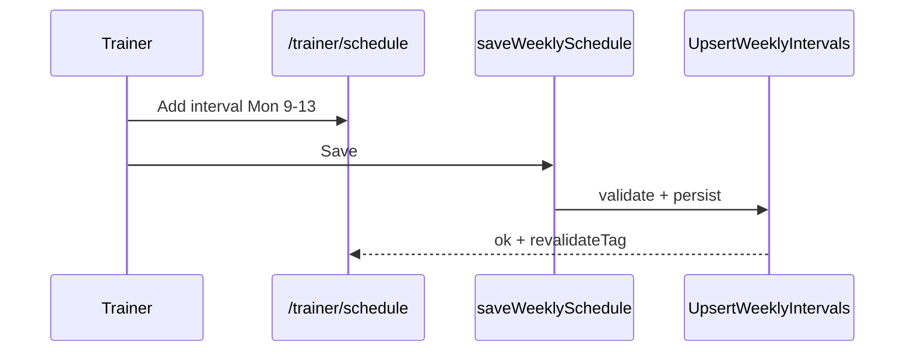

# Trainer Schedule Spec — Pulse MVP

**Тип:** Spec  
**Статус:** Canonical  
**Версия:** 1.0  
**Дата:** 2026-05-23  
**Волна:** W9  
**Зависит от:** [`schedule_slots_contract.md`](../contracts/schedule_slots_contract.md), [`adr_004_timezone_scheduling_model.md`](../../../prds/07_governance/adr_004_timezone_scheduling_model.md)  
**Связанные документы:** [`trainer_flow.md`](../../../prds/01_product_scope/user_flows/users_mvp/trainer_flow.md)

**Context7 verified:** Next.js 16 — segment `loading.tsx` for schedule page skeleton (`/vercel/next.js/v16.2.2`).

---

## Purpose

Implementation-spec экрана **`/trainer/schedule`**: weekly intervals editor, day on/off toggles, exception calendar, save mutations, timezone display. UX слой над [`schedule_slots_contract.md`](../contracts/schedule_slots_contract.md).

**Аудитория:** AI-агенты P04; trainer schedule UI.

---

## Scope / Out of scope

**In scope:** Regular weekly tab, Exceptions tab, interval chips, add/remove slot UI, block dates, display trainer TZ.

**Out of scope:** Client slot picker (→ booking/catalog specs); booking overlap resolution; reminder cron.

---

## Definitions

| UI tab | Domain ops |
|--------|------------|
| **Regular** | `UpsertWeeklyIntervals` |
| **Exceptions** | `UpsertScheduleException`, delete exception |
| **Day switch** | Enable/disable all intervals for weekday |

Display line: `UTC+3 · Moscow` from `trainer_profile.timezone` (local label helper).

---

## Happy path

### Edit weekly schedule

1. Trainer opens `/trainer/schedule`.
2. Header shows timezone label (read-only link to profile if change needed).
3. Pill tabs: **Regular** | **Exceptions**.
4. **Regular:** list Mon–Sun rows; switch ON/OFF per day; interval chips `09:00–13:00 ×`; `[+ Slot]` opens Sheet to add interval.
5. Save via Server Action `saveWeeklySchedule` on explicit Save **or** auto-save per row (product: **SHOULD** debounced save + toast on error only).
6. Success: subtle «Saved» or silent revalidate; **no** toast spam on every chip remove.

### Add exception

1. Switch to **Exceptions** tab.
2. Mini calendar — tap date → block or unblock.
3. `[+ Add exception]` → form: date, blocked toggle, optional note.
4. Submit → exception list card with delete.

---

## Negative paths (UX)

| Scenario | UX |
|----------|-----|
| `endTime <= startTime` | Inline field error on Sheet |
| Overlapping intervals same day | Validation error before save |
| Invalid timezone on profile | Block save; link to profile settings |
| Trainer pending approval | Schedule editable; slots not public until approved |
| Save network error | `toast.error` + Retry |
| Delete last interval on active day | Allow — day becomes empty (no slots that day) |
| Exception on past date | **MAY** allow block for record; slots already past |

---

## Security paths

| Scenario | UX |
|----------|-----|
| Client edits `/trainer/schedule` | proxy deny |
| Trainer A edits Trainer B schedule | policy deny — not in UI |
| Tampered dayOfWeek in POST | Server validation reject |

[`FM-016`](../../../prds/02_domain_model/failure_modes_catalog.md#fm-016) — IDOR schedule mutation.

---

## Concurrency notes

- Two tabs editing schedule — last save wins; **SHOULD** revalidate on focus.
- FM-009 concurrent interval upsert — contract handles; UI shows generic error on conflict retry.
- Existing bookings not cancelled when shrinking schedule — warn copy optional (post-MVP); MVP silent.

---

## UI states matrix

| Region | empty | loading | error | forbidden |
|--------|-------|---------|-------|-----------|
| Weekly list | all days off | row skeleton | Alert + Retry | non-trainer redirect |
| Interval sheet | — | save pending | field errors | — |
| Exceptions calendar | no exceptions list | calendar skeleton | Retry | — |
| Exception cards | CTA add exception | delete pending | toast.error | — |

---

## Component notes

| Component | Behavior |
|-----------|----------|
| `DayRow` | Switch + chips + add slot |
| `IntervalChip` | Mono time range; × removes (confirm if busy day optional) |
| `AddIntervalSheet` | start/end time pickers; local time |
| `ExceptionsCalendar` | Highlights blocked, today, selected |
| `TimezoneLabel` | From profile; ADR-004 |

**Mobile:** switches min `h-7 w-12`; chips wrap; Sheet bottom on mobile.

---

## Wireframe & prototype

| Route | Wireframe (planned) | Prototype |
|-------|---------------------|-----------|
| `/trainer/schedule` | W10-19 `trainer_schedule.md` | Trainer schedule tabs |

[`trainer_flow.md`](../../../prds/01_product_scope/user_flows/users_mvp/trainer_flow.md) § Поток 3.

---

## Requirements

1. **MUST** — display and persist intervals in trainer local time; store per ADR-004/schema.
2. **MUST** — `dayOfWeek` 0=Monday in UI mapping consistent with domain.
3. **MUST** — mutations via contract use-cases; policy `assertCanMutateSchedule`.
4. **MUST** — pending trainers can configure schedule before approval.
5. **SHOULD** — destructive remove interval without modal unless day has upcoming bookings (post-MVP enhancement).

---

## Acceptance criteria

- [ ] Happy: weekly edit + exception block
- [ ] Negative: invalid interval, save error
- [ ] Security: trainer-only route
- [ ] Concurrency: reference FM-009, no duplicate resolution
- [ ] UI states matrix
- [ ] Wireframe linked
- [ ] Timezone label visible

---

## Related documents

| Document | Relationship |
|----------|--------------|
| [`schedule_slots_contract.md`](../contracts/schedule_slots_contract.md) | Domain API |
| [`adr_004_timezone_scheduling_model.md`](../../../prds/07_governance/adr_004_timezone_scheduling_model.md) | TZ model |
| [`booking_wizard_spec.md`](./booking_wizard_spec.md) | Consumer of slots |
| [`trainer_onboarding_spec.md`](./trainer_onboarding_spec.md) | TZ captured at onboarding |
| [`forms_and_validation_ux.md`](../../../design/forms_and_validation_ux.md) | Sheet validation |

**Registry:** [`documentation_creation_registry.md`](../../../meta/documentation_creation_registry.md) — wave W9-06

---

## Agent notes

- Do not compute slot overlaps in UI for booking — only interval validation for same day.
- Use `font-mono` for time chips per visual identity.
- Revalidate tags: `trainer:{id}:schedule` per cache policy when defined.

---

## Change log

| Date | Change |
|------|--------|
| 2026-05-23 | v1.0 — trainer schedule spec (W9-06) |
