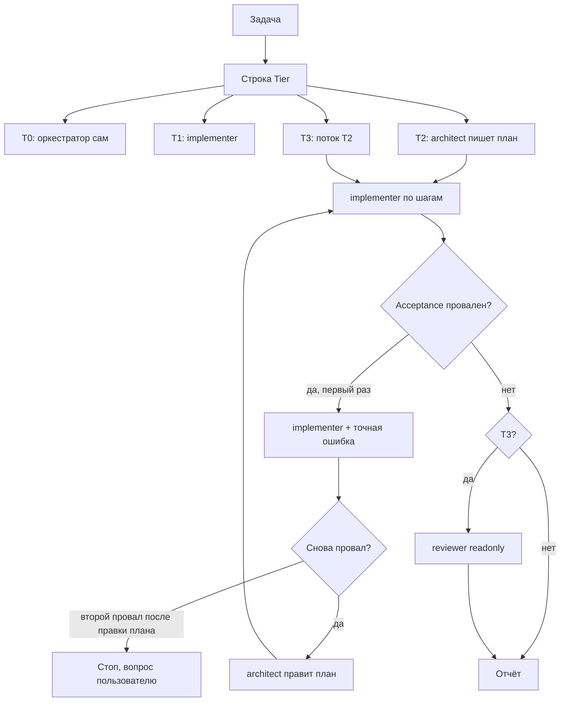

# Маршрутизация моделей и делегирование

**Тип:** Guide  
**Статус:** Canonical  
**Версия:** 1.0  
**Дата:** 2026-10-07  
**Волна:** post-W14 (операционный контракт агента, вне реестра волн PRD)  
**Зависит от:** [`ai_first_project_methodology.md`](./ai_first_project_methodology.md) §2.2–§2.4, [`.cursor/rules/model-routing.mdc`](../../.cursor/rules/model-routing.mdc)  
**Связанные документы:** [`AGENTS.md`](../../AGENTS.md), [`docs/guidelines/README.md`](../guidelines/README.md)

---

## Purpose

Контракт **кто** в сессии Cursor пишет код Pulse и **какой моделью**. Цель — держать длинный контекст чата дешёвым, а дорогое рассуждение и независимое ревью вызывать только там, где ошибка дороже лишних токенов.

Читают оркестратор (чат) и человек, который выбирает модель в пикере. Исполнение в каждой сессии — [`.cursor/rules/model-routing.mdc`](../../.cursor/rules/model-routing.mdc) (`alwaysApply`). При расхождении побеждает `.mdc`; этот файл обновляется в том же изменении.

## Scope / Out of scope

**In scope:** классификация задачи T0–T3, выбор субагента, файл плана как общая память, эскалация, лимиты контекста и моделей.

**Out of scope:**

- продуктовое ревью отзывов тренеров и модерация;
- Bugbot и `/review-bugbot` (PR / явный запрос пользователя);
- Security Review (`/review-security`) — только по явной просьбе пользователя, это не субагент `reviewer`;
- выбор продуктовых фич и процесс ADR ([`decision_process.md`](../prds/07_governance/decision_process.md)).

Cursor **Agent Review** (панель IDE, `/agent-review`, Quick/Deep) — отдельный локальный пайплайн. Он **не** заменяет субагента `reviewer` из этого контракта. См. § Agent Review.

## Definitions

| Термин | Значение |
|--------|----------|
| Оркестратор | Чат. Классифицирует, планирует, делегирует, собирает результат. Не отдельный субагент-«роутер». |
| `architect` | Субагент плана. Пишет `.cursor/plans/<task-slug>.md`. Код не пишет. |
| `implementer` | Субагент правок по шагу плана. |
| `reviewer` | Субагент независимой проверки. Только чтение. Обязателен на T3 до отчёта «готово». |
| Explore | Встроенный поиск по коду. Не `architect`. |
| План | Общая память handoff: путь к файлу + номера шагов, не пересказ чата. |

Модели закрепляются во frontmatter `.cursor/agents/*.md`, не в тексте промпта оркестратора.

## Requirements

1. **MUST** — первая строка ответа на задачу с кодом: `Tier: T0|T1|T2|T3 —` и причина не длиннее 10 слов.
2. **MUST** — карта моделей (не переопределять в промпте):

   | Роль | Модель | Когда |
   |------|--------|--------|
   | Оркестратор | Composer 2.5, не fast (пикер чата) | Вся сессия. Длинный контекст. Тяжёлое рассуждение уходит в `architect`. |
   | `implementer` | `composer-2.5[fast=false]` | T0 сам оркестратор; T1 и шаги плана. |
   | `architect` | `grok-4.7[effort=high,fast=false]` | T2/T3, пока нет утверждённого плана. |
   | `reviewer` | `grok-4.7[effort=high,fast=false]`, `readonly: true` | T3, до отчёта «готово». |
   | Поиск | Explore | Поиск по репозиторию. |

3. **MUST** — оставаться в пуле Cursor: Grok 4.x и Composer 2.5. Сторонние модели не выбирать.
4. **MUST** — при сомнении между двумя тирами брать **нижний**. Эскалация § ниже поправляет ошибку.
5. **MUST** — вопрос без правки кода отвечать самому, без субагента.
6. **MUST NOT** — запускать субагента, если ни одно не верно: шум > ~20k токенов в этом контексте; независимый шаг с файлами и критериями приёмки; независимая проверка (T3).
7. **MUST NOT** — субагент на T0; дробление последовательных шагов в одних и тех же файлах (один вызов `implementer`); задача, которая закрывается ≤ 3 вызовами инструментов.
8. **MUST** — параллелить субагентов только если списки `Files` не пересекаются.
9. **MUST** — каждый шаг плана содержит `Goal`, `Files`, `Acceptance`, `Tier` (по умолчанию T1). Делегату передавать путь плана и номера шагов. Ответ субагента ≤ 15 строк: что изменилось, файлы, проверки, открытые вопросы.
10. **MUST** — эскалация: один повтор `implementer` с точной ошибкой → `architect` правит план и не пишет код → `implementer` применяет поправку → стоп и вопрос пользователю. Цикл повторов запрещён.
11. **MUST NOT** — варианты `-fast`, effort `xhigh` и контекст 500k, пока пользователь явно не попросил.
12. **MUST** — один контекст держать ниже ~200k токенов (выше этого Grok 4.7 тарифицируется с множителем 2). Дальше — новый чат или делегирование. Читать файлы по пути, не перечитывать уже известное, править точечно. Когда задача закрыта или контекст устарел — предложить новый чат.

### Классификация

| Тир | Сигнал | Кто делает |
|-----|--------|------------|
| T0 | 1–2 файла, до ~40 строк, намерение однозначно (опечатка, переименование, копирайт, мелкий CSS, одно поле) | Оркестратор. Без субагента. |
| T1 | Есть утверждённый шаг плана **или** правка локальная и определённая | `implementer` |
| T2 | Плана нет; ≥ 4 файлов или кросс-модуль; новая фича; новая зависимость; контракт данных или API; неочевидный баг после одной неудачной попытки | `architect` → план → `implementer` по шагам |
| T3 | Auth, платежи, права, секреты, миграция по живым данным, разрушительные операции, ломающий публичный API | Поток T2 + обязательный `reviewer` до отчёта «готово» |

Сигналы T3 для Pulse (вместе с auth/payments/permissions в `.mdc`): границы `proxy.ts` / `@pulse/policy-server`, автомат бронирования, `TrainerProfile.status = approved`, `TrainerProfile.timezone` для слотов, presigned S3, dual transport iOS Safari — см. [`AGENTS.md`](../../AGENTS.md) domain invariants.

## Flows

Цикл методологии **не заменяется**:

`КОНТЕКСТ → классификация T0–T3 → ФАЗА → КОНТРАКТ → ЗАДАЧИ → реализация по этому контракту → ВЕРИФИКАЦИЯ (lint / typecheck / чеклист фазы) → reviewer, если T3`.

Верификация фазы и `reviewer` — разные проверки. Lint не отменяет `reviewer` на T3. `reviewer` не заменяет `npm run typecheck` и `npm run lint`.

## Agent Review

[Agent Review](https://cursor.com/docs/agent/agent-review) смотрит локальный diff (Quick — дёшево и быстро, Deep — медленно и дорого). Запуск: вручную (`/agent-review`, Source Control) или автоматически, если включено в настройках.

1. **MUST NOT** считать Agent Review субагентом `reviewer`. У него нет pin `grok-4.7[effort=high,fast=false]`, нет `readonly` из `.cursor/agents/reviewer.md`, нет handoff «путь плана + шаг», нет гейта «только T3».
2. **MUST NOT** включать автоматический Agent Review на каждую задачу или каждый коммит как способ исполнить этот контракт: T0 и гигиена стоимости запрещают ревью на каждую правку.
3. **MAY** — человек вручную запускает Deep на T3, пока в репозитории нет `.cursor/agents/reviewer.md`. Это временная замена, не второй обязательный прогон рядом с `reviewer`.
4. **MUST NOT** вызывать в одной задаче и `reviewer`, и Deep Agent Review.
5. Правила ревью Agent Review читает из `BUGBOT.md`. Файла в репозитории нет; инварианты Pulse в этот пайплайн сами не попадают.

## Acceptance criteria

- [ ] Оркестратор печатает строку `Tier` до делегирования и до правок.
- [ ] T0 закрыт без субагента.
- [ ] T2/T3 начинаются с файла `.cursor/plans/<task-slug>.md`, шаг содержит Goal, Files, Acceptance, Tier.
- [ ] T3 не объявлен готовым без прогона `reviewer`.
- [ ] Проваленный шаг не зациклен: один повтор, затем правка плана, затем стоп.
- [ ] Модель субагента задана файлом `.cursor/agents/*.md`, не фразой в промпте.
- [ ] Контекст чата не раздувается перечитыванием и лишними субагентами.

## Drift risks

| Риск | Следствие | Страж |
|------|-----------|--------|
| `.mdc` и этот файл разошлись | Агент следует always-applied тексту, документ врёт | Править оба в одном изменении; приоритет у `.mdc` |
| Нет `.cursor/agents/*.md` | Субагент наследует модель чата, pin из таблицы не работает | `architect.md`, `implementer.md`, `reviewer.md` в репозитории |
| Авто Agent Review включён | Токены на T0 и второй прогон рядом с `reviewer` | Настройка IDE: ручной запуск; Deep только как временная замена |
| Цикл `AGENTS.md` без тира | Агент идёт в реализацию на Grok/Composer чата | Ссылка на этот файл из методологии и `AGENTS.md` |
| T3 без Pulse-сигналов в `.mdc` | Слоты, proxy, S3 ошибочно как T1 | Таблица T3 в `model-routing.mdc` + этот § |

## Related documents

| Документ | Роль |
|----------|------|
| [`.cursor/rules/model-routing.mdc`](../../.cursor/rules/model-routing.mdc) | Runtime-копия, always applied |
| [`ai_first_project_methodology.md`](./ai_first_project_methodology.md) | Цикл КОНТЕКСТ → … → ВЕРИФИКАЦИЯ |
| [`AGENTS.md`](../../AGENTS.md) | Конституция monorepo |
| [`decision_process.md`](../prds/07_governance/decision_process.md) | ADR; политика code review вынесена из его scope |
| [Agent Review](https://cursor.com/docs/agent/agent-review) | Локальный пайплайн IDE, не `reviewer` |
| [Subagents](https://cursor.com/docs/agent/subagents) | Формат `.cursor/agents/*.md` |

## Agent notes

- Отдельного субагента-роутера нет. Роутинг — выбор `architect` / `implementer` / `reviewer` / Explore.
- Субагент начинает с пустого контекста и заново читает файлы. Лишнее дробление дороже, чем один вызов.
- `reviewer` не чинит код. Находки возвращаются оркестратору; правка — снова через `implementer` или, если это уже новый дизайн, через `architect`.
- Вопросы «как устроено» и поиск по коду не повышать до T2.
- Не просить `-fast`, даже если в списке моделей Cursor он есть: для `architect` и `reviewer` это прямой запрет контракта.
