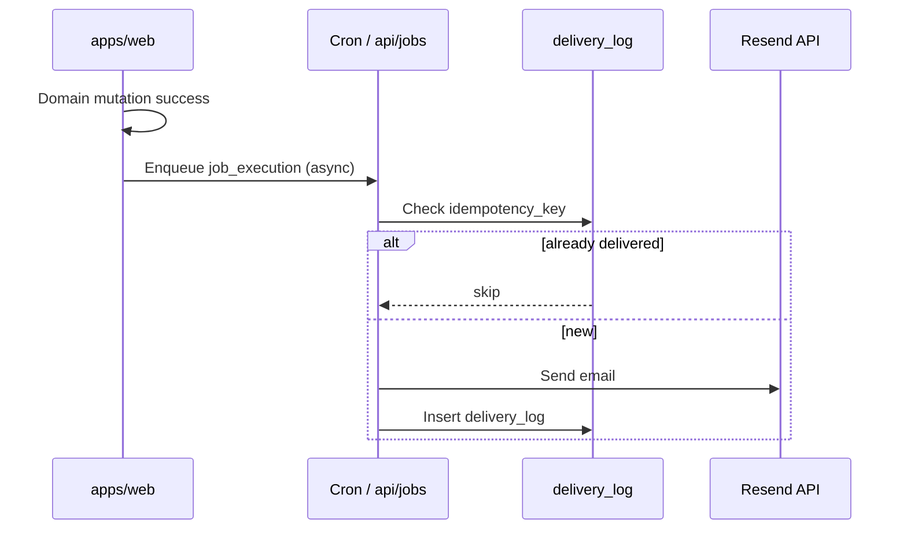

# Email Notifications Matrix — Pulse (Post-MVP Spec)

**Тип:** PRD  
**Статус:** Canonical (spec only — **не** MVP implementation)  
**Версия:** 1.1  
**Дата:** 2026-05-23  
**Волна:** W1  
**Зависит от:** [`mvp_scope.md`](./mvp_scope.md), [`post_mvp_deferrals.md`](./post_mvp_deferrals.md)  
**Связанные документы:** [`database_schema_v1.md`](../03_data_model/database_schema_v1.md), [`adr_001_stack_and_runtime.md`](../07_governance/adr_001_stack_and_runtime.md)

**Planned implementation:** фаза **post-MVP** (не P01–P05); [`email_notifications_contract.md`](../../implementation/mvp/contracts/email_notifications_contract.md) (W8), [ADR-006](../07_governance/adr_006_idempotent_email_delivery.md) (W4)

---

## Purpose

Целевая матрица **транзакционных email** после MVP: событие → получатель → `job_type` → idempotency. На MVP **не реализуется** (ни Resend, ни Cron, ни записи в `delivery_log` от приложения). Документ нужен агентам для согласованной схемы БД и будущего включения фичи без переделки DDL.

---

## Scope / Out of scope

**In scope:** каталог событий E-01–E-09, idempotency patterns, целевая архитектура доставки, schema touchpoints.

**Out of scope (MVP):** любая отправка писем, `RESEND_API_KEY`, `/api/jobs/*`, Vercel Cron для email, UI «письмо отправлено».

**MVP MUST:** таблицы `job_execution`, `delivery_log` (и `password_reset_token` для E-09) в [`database_schema_v1.md`](../03_data_model/database_schema_v1.md).

---

## Definitions

| Term | Definition |
|------|------------|
| **Transactional email** | Письмо по событию домена (не newsletter) |
| **job_type** | Строка в `job_execution.job_type` |
| **idempotency_key** | UNIQUE в `job_execution` и `delivery_log` |
| **MVP feedback channel** | Toast, in-app banner, review prompt — **не** email |

Provider (при включении): **Resend** ([ADR-001](../07_governance/adr_001_stack_and_runtime.md)).

---

## MVP vs post-MVP

| Layer | MVP | Post-MVP |
|-------|-----|----------|
| DDL `job_execution`, `delivery_log` | ✅ Migrate | ✅ Use |
| Prisma models | ✅ Generate | ✅ Use |
| Resend / workers / Cron | ❌ | ✅ |
| Rows in `delivery_log` from app | ❌ | ✅ |
| This matrix events E-01–E-09 | ❌ | ✅ Implement |

---

## Target delivery architecture (post-MVP)

---

## Notification matrix

| ID | Event | Trigger | Recipient(s) | job_type (suggested) | idempotency_key pattern | MVP UX substitute | Target phase |
|----|-------|---------|--------------|----------------------|-------------------------|-------------------|----------------|
| E-01 | Client registration | `User` created, role=client | Client | `registration_email_client` | `reg:{userId}` | Redirect + dashboard | Post-MVP |
| E-02 | Trainer registration | `User` created, role=trainer | Trainer | `registration_email_trainer` | `reg:{userId}` | Onboarding UI | Post-MVP |
| E-03 | Trainer application received | Onboarding submit | Trainer | `trainer_app_received` | `trainer_app:{profileId}` | Banner «Under review» | Post-MVP |
| E-04 | Trainer approved | Admin approve | Trainer | `trainer_app_approved` | `trainer_approved:{profileId}` | Banner off + toast | Post-MVP |
| E-05 | Trainer rejected | Admin reject | Trainer | `trainer_app_rejected` | `trainer_rejected:{profileId}` | Banner + message | Post-MVP |
| E-06 | Booking confirmed | Booking → `pending` | Client + Trainer | `booking_confirmed` | `booking_confirmed:{bookingId}` | **toast.success** + redirect | Post-MVP |
| E-07 | Reminder 24h | Cron, T-24h to `startsAt` | Client + Trainer | `booking_reminder_24h` | `reminder24:{bookingId}:{date}` | Optional in-app notif popover | Post-MVP |
| E-08 | Session completed | Trainer marks completed | Client | `session_completed_review` | `completed:{bookingId}` | Review prompt route | Post-MVP |
| E-09 | Password reset | Reset token issued | User | `password_reset` | `reset:{tokenId}` | **Not on MVP** (no reset email flow) | Post-MVP |

### Not in matrix (other deferrals)

| Event | Status |
|-------|--------|
| Payment receipt | Post-MVP — payments |
| Video room link | Daily.co |
| Marketing newsletter | Out of product scope |

---

## Happy paths (post-MVP only)

1. Domain event fires once.
2. Job enqueued with deterministic `idempotency_key`.
3. Worker sends via Resend; `delivery_log.status = sent`.
4. Retry cron skips duplicate keys.

**MVP happy path:** same domain events end with in-app feedback only (см. колонка «MVP UX substitute»).

---

## Negative paths

| Scenario | MVP | Post-MVP |
|----------|-----|----------|
| Resend 5xx | N/A | Retry; `delivery_log.status = failed` |
| Invalid email | N/A | Log; do not block booking |
| Cron overlap | N/A | Skip via `idempotency_key` |
| `await resend.send` in Server Action | **MUST NOT** (no Resend on MVP) | **MUST NOT** |

---

## Security paths

| Scenario | MVP | Post-MVP |
|----------|-----|----------|
| Password reset token | No public reset flow | Single-use; short TTL |
| Wrong recipient | N/A | `delivery_log.target` audit |
| PII in logs | N/A | Mask email in logs |

---

## Concurrency & idempotency

Правила применяются **после** включения email. Schema UNIQUE keys уже заложены в DDL для будущих workers.

---

## Drift & consistency notes

| Risk | Guard |
|------|-------|
| Interim `default_docs` lists email as MVP | [`mvp_scope.md`](./mvp_scope.md) v1.1+ wins |
| Agent implements P06 Resend on MVP | **Reject** — defer to post-MVP phase |
| Empty `delivery_log` confuses reviewers | Expected on MVP |

---

## Requirements

1. **MUST NOT** (MVP) — вызывать Resend, создавать Cron для E-01–E-09, писать в `delivery_log` из request path.
2. **MUST** (MVP) — миграции включают `job_execution` + `delivery_log` per schema v1.
3. **MUST** (post-MVP) — при включении фичи реализовать E-01–E-09 с ключами из таблицы; copy из `@/lib/messages`.
4. **SHOULD** (MVP) — E-06, E-04, E-08 покрыты toast / banner / routes без email.

---

## Acceptance criteria

- [ ] Документ явно помечает email как post-MVP implementation
- [ ] MVP UX substitutes указаны для ключевых событий
- [ ] Schema readiness ссылка на `database_schema_v1.md` §10
- [ ] Согласовано с `mvp_scope.md` и `post_mvp_deferrals.md`
- [ ] Нет MUST «реализовать к P06» для MVP

---

## Related documents

| Document | Relationship |
|----------|--------------|
| [`mvp_scope.md`](./mvp_scope.md) | MVP excludes email sending |
| [`post_mvp_deferrals.md`](./post_mvp_deferrals.md) | Deferred feature row |
| [`database_schema_v1.md`](../03_data_model/database_schema_v1.md) | `delivery_log`, `job_execution` |
| [`email_notifications_contract.md`](../../implementation/mvp/contracts/email_notifications_contract.md) | Implementation contract |
| [`adr_006_idempotent_email_delivery.md`](../07_governance/adr_006_idempotent_email_delivery.md) | ADR — idempotent jobs |

**Registry:** [`documentation_creation_registry.md`](../../meta/documentation_creation_registry.md) — wave W1-06

---

## Agent notes

- In-app notifications popover в shell — **не** замена email; optional UX, не Resend.
- Reminder E-07: timezone = `TrainerProfile.timezone` when implemented.
- Do not scaffold `RESEND_API_KEY` in P01 unless user explicitly expands scope.

---

## Change log

| Date | Change |
|------|--------|
| 2026-05-23 | v1.1 — email sending deferred from MVP; matrix = post-MVP spec; schema stays |
| 2026-05-23 | v1.0 — initial matrix |
