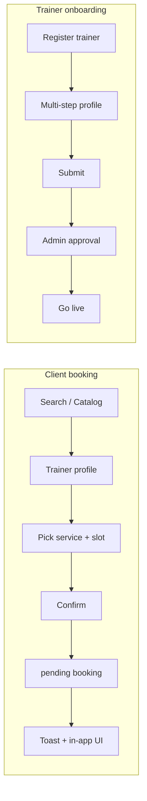

# MVP Scope — Pulse

**Тип:** PRD  
**Статус:** Canonical  
**Версия:** 1.1  
**Дата:** 2026-05-23  
**Волна:** W1  
**Зависит от:** [`default_docs/fitness-platform-mvp.md`](../../default_docs/fitness-platform-mvp.md), [`user_flows/users_mvp/`](./user_flows/users_mvp/), [`adr_001_stack_and_runtime.md`](../07_governance/adr_001_stack_and_runtime.md)  
**Связанные документы:** [`post_mvp_deferrals.md`](./post_mvp_deferrals.md), [`pages_functional_spec.md`](./pages_functional_spec.md), [`email_notifications_matrix.md`](./email_notifications_matrix.md), [`canonical_routes.md`](../../design/canonical_routes.md)

**Migrated from:** `docs/default_docs/fitness-platform-mvp.md`

---

## Purpose

Канонический объём **MVP** маркетплейса фитнес-тренеров Pulse: роли, ключевые возможности, стек, границы «в продукте / вне продукта». Читают PM, дизайн, разработчики и AI-агенты перед фазами **P01–P13** (feature) + **P14** (quality gate). **P15** — post-MVP email.

---

## Scope / Out of scope

**In scope:** discovery, booking без оплаты, trainer onboarding + admin moderation, расписание, роли `client` | `trainer` | `admin`, global UI shell, **in-app** обратная связь (toast, баннеры, review prompt).

**Out of scope:** транзакционные email (Resend, Cron, workers) и password reset по email — [`post_mvp_deferrals.md`](./post_mvp_deferrals.md); детальная page spec, lifecycle PRD, authorization matrix. **Schema-ready на MVP:** `job_execution`, `delivery_log`, `password_reset_token` — DDL есть, runtime отправки нет.

---

## Definitions

| Term | Definition |
|------|------------|
| **Client** | Пользователь, ищущий и бронирующий тренеров |
| **Trainer** | Поставщик услуг; публичный профиль после `approved` |
| **Admin** | Модерация верификаций, жалоб, возвратов, отзывов |
| **Booking (MVP)** | Запись на слот со статусом `pending` без онлайн-оплаты |
| **Session (MVP)** | Placeholder-маршрут; видео — post-MVP |

Роли и статусы в коде — из `@pulse/domain` (после scaffold), не inline строки.

---

## Product overview

Pulse — онлайн-маркетплейс, соединяющий клиентов с фитнес-тренерами: поиск, профиль, бронирование слота, управление сессиями и модерация платформы.

---

## Tech stack (MVP)

| Layer | Choice | Governance |
|-------|--------|------------|
| Framework | Next.js **16.2.6** App Router, TypeScript | [ADR-002](../07_governance/adr_002_next162_vercel_runtime_policy.md) |
| Hosting | Vercel | [ADR-001](../07_governance/adr_001_stack_and_runtime.md) |
| Auth | Auth.js v5, **Credentials** (email + password), JWT | [ADR-003](../07_governance/adr_003_auth_credentials_jwt_rbac.md) |
| ORM / DB | Prisma v7, Neon PostgreSQL 17 | [database_schema_v1.md](../03_data_model/database_schema_v1.md) |
| UI | shadcn/ui + Tailwind CSS v4, Warm Forest | Guidelines + prototype |
| Storage | AWS S3 | [ADR-007](../07_governance/adr_007_file_asset_blob_lifecycle.md) |
| Email (sending) | Resend — **post-MVP** | [ADR-006](../07_governance/adr_006_idempotent_email_delivery.md), [`email_notifications_matrix.md`](./email_notifications_matrix.md) |
| Booking (MVP) | Без оплаты, `pending` → confirm | [ADR-005](../07_governance/adr_005_mvp_booking_without_payment.md) |
| Jobs / `delivery_log` | Таблицы в schema — **post-MVP runtime** | [database_schema_v1.md](../03_data_model/database_schema_v1.md) §10 |

**MUST NOT** на MVP: Stripe Connect, Daily.co rooms, OAuth Google, **отправка** транзакционных email и Cron jobs для уведомлений.

---

## Authentication (MVP)

1. **MUST** — регистрация и вход: email + password; `passwordHash` (bcrypt) на `User`.
2. **MUST** — роль `client` | `trainer` | `admin` в JWT и session (Auth.js callbacks — Context7 `/websites/authjs_dev`).
3. **MUST** — защита маршрутов по роли через **`proxy.ts`** ([ADR-002](../07_governance/adr_002_next162_vercel_runtime_policy.md)); не `middleware.ts` как канон.
4. **MUST NOT** на MVP — self-service password reset через email (Resend); таблица `password_reset_token` только schema-ready.
5. **SHOULD** — seed пользователей всех ролей для local dev (см. [`seed_data_spec.md`](../03_data_model/seed_data_spec.md)); смена пароля в dev — через seed/admin, не через письмо.
6. **MAY** — OAuth Google — **post-MVP** only.

---

## Global UI shell (MVP)

| Element | Requirement |
|---------|-------------|
| Top bar | Logo, lang EN/RU, theme toggle, notifications popover, avatar (md+) |
| Mobile nav | Sticky bottom nav `< md` |
| Desktop nav | Sticky sidebar `≥ md` |
| Feedback | Sonner toast на мутации ([`ui-toast-mutations`](../../../.cursor/rules/ui-toast-mutations.mdc)) |

Детали навигации по ролям — [`pages_functional_spec.md`](./pages_functional_spec.md) § Global shell; маршруты — [`canonical_routes.md`](../../design/canonical_routes.md).

---

## Client — MVP capabilities

### Discovery & booking

- Dashboard: приветствие, next session, search, категории, топ тренеры
- Каталог `/trainers`: фильтры (специализация, цена, рейтинг), сортировка, пагинация
- Профиль тренера `/trainers/[id]`: hero, tabs (About / Services / Schedule / Reviews), sticky CTA
- Inline weekly schedule → booking wizard `/book/[trainerId]`
- 3 шага: Service → Time slot → Confirm (+ optional message)
- Booking создаётся со статусом **`pending`** (без оплаты)

### Management

- `/client/bookings`: Upcoming / Past / Cancelled
- Отмена брони (правило: до 24h — детали в planned lifecycle contract)
- Отзыв после `completed` — `/client/reviews/[bookingId]`
- Профиль `/client/profile`: настройки, безопасность, выход

**User flow canon:** [`client_flow.md`](./user_flows/users_mvp/client_flow.md)

---

## Trainer — MVP capabilities

- Публичный профиль: фото, bio, specs, опыт, сертификаты, verified badge
- Banner «Under review» пока `status != approved`
- Услуги: CRUD + active/hidden toggle
- Редактирование профиля
- Расписание: недельные слоты + exceptions (blocked dates)
- Клиенты: список, поиск, приватные заметки (auto-save)
- Dashboard KPI; income history **без Stripe**

**User flow canon:** [`trainer_flow.md`](./user_flows/users_mvp/trainer_flow.md)

---

## Admin — MVP capabilities

- Dashboard KPI + «Needs attention»
- Верификация тренеров: Pending / Approved / Rejected
- Жалобы: приоритеты, смена статуса
- Возвраты: ручная обработка (статус в БД, не Stripe API)
- Модерация отзывов: hide / delete

**User flow canon:** [`admin_flow.md`](./user_flows/users_mvp/admin_flow.md)

---

## Core flows (happy paths)

**Session lifecycle (MVP, manual):** тренер отмечает завершение → клиент получает **in-app** prompt на отзыв (email E-08 — post-MVP).

---

## Negative paths (product-level)

| Scenario | Expected UX / outcome |
|----------|----------------------|
| Trainer not `approved` | Нет публичного listing; booking может быть заблокирован — contract |
| Slot taken (race) | Ошибка при submit; toast.error; не двойная бронь — contract |
| Cancel inside 24h window | Отказ с объяснением — lifecycle PRD |
| Empty catalog | Empty state + CTA (Zero Dead Ends) |
| Invalid credentials | Login error без утечки «user exists» |

Детали security/race — [`failure_modes_catalog.md`](../02_domain_model/failure_modes_catalog.md) (W3).

---

## Security paths (high-level)

| Risk | MVP mitigation |
|------|----------------|
| Role escalation | JWT role + server-side policy |
| IDOR on bookings | Owner/client/trainer checks in policy/server |
| Unauthenticated `/admin/*` | proxy + session gate |

Полная матрица — planned W5 `authorization_matrix.md`.

---

## Concurrency & drift (summary)

- **Race на слот:** UNIQUE / transaction в contract `schedule_slots` (W8).
- **Drift:** nullable Stripe/Daily поля в schema без UI — см. [`post_mvp_deferrals.md`](./post_mvp_deferrals.md); агент не добавляет payment UI без ADR.

---

## Requirements (MVP MUST)

1. **MUST** — все MVP маршруты из [`canonical_routes.md`](../../design/canonical_routes.md) реализуемы в фазах **P01–P13**; hardening — **P14**.
2. **MUST** — `TrainerProfile.timezone` для расписания и отображения времени.
3. **MUST** — публичный профиль и приём броней только при `TrainerProfile.status = approved`.
4. **MUST** — переходы статусов booking только через domain use-cases (не прямой PATCH из UI).
5. **MUST** — в schema присутствуют `job_execution`, `delivery_log` (и при необходимости `password_reset_token`) — **без** MVP-кода отправки писем и без записей `delivery_log` от приложения.
6. **MUST NOT** — Resend SDK, `/api/jobs/*` для email, Cron напоминаний, Stripe/Daily/OAuth Google в MVP UI.
7. **SHOULD** — продуктовые события (booking confirmed, trainer approved) закрывать toast + навигацией; матрица писем — на будущее ([`email_notifications_matrix.md`](./email_notifications_matrix.md)).

---

## Deferred (post-MVP)

См. полный реестр: [`post_mvp_deferrals.md`](./post_mvp_deferrals.md).

---

## Acceptance criteria

- [ ] Роли и три контура (client/trainer/admin) описаны без противоречий user flows
- [ ] Стек согласован с ADR-001/002
- [ ] Нет второго списка URL (только ссылка на `canonical_routes.md`)
- [ ] Post-MVP не смешан с MUST-требованиями MVP
- [ ] Negative/security/drift указаны или ссылаются на planned contracts
- [ ] `architecture_master_index.md` и `01_product_scope/README.md` обновлены

---

## Related documents

| Document | Relationship |
|----------|--------------|
| [`post_mvp_deferrals.md`](./post_mvp_deferrals.md) | Out of MVP scope |
| [`pages_functional_spec.md`](./pages_functional_spec.md) | Page-level behavior |
| [`email_notifications_matrix.md`](./email_notifications_matrix.md) | Post-MVP email spec (schema-ready) |
| [`canonical_routes.md`](../../design/canonical_routes.md) | Route inventory |
| [`database_schema_v1.md`](../03_data_model/database_schema_v1.md) | Data model |
| [`../02_domain_model/lifecycle_models.md`](../02_domain_model/lifecycle_models.md) | Booking/verification state machines |
| [`../02_domain_model/failure_modes_catalog.md`](../02_domain_model/failure_modes_catalog.md) | FM-xxx failure index |
| [`../07_governance/adr_003_auth_credentials_jwt_rbac.md`](../07_governance/adr_003_auth_credentials_jwt_rbac.md) | Auth MVP |
| [`../07_governance/adr_005_mvp_booking_without_payment.md`](../07_governance/adr_005_mvp_booking_without_payment.md) | Booking without payment |
| [`../07_governance/adr_007_file_asset_blob_lifecycle.md`](../07_governance/adr_007_file_asset_blob_lifecycle.md) | S3 file uploads |

**Registry:** [`documentation_creation_registry.md`](../../meta/documentation_creation_registry.md) — wave W1-03

---

## Agent notes

- Interim `default_docs/fitness-platform-mvp.md` — read-only; при конфликте побеждает **этот** файл.
- «Middleware» в старых черновиках = **`proxy.ts`** для Pulse.
- Не расширять MVP без обновления этого PRD и registry wave.
- Пустые `job_execution` / `delivery_log` на MVP — норма; не добавлять Resend «на будущее» в **P01–P13**.

---

## Change log

| Date | Change |
|------|--------|
| 2026-05-23 | v1.1 — transactional email out of MVP; schema `job_execution` / `delivery_log` remains |
| 2026-05-23 | v1.0 — canonical migration from default_docs |
