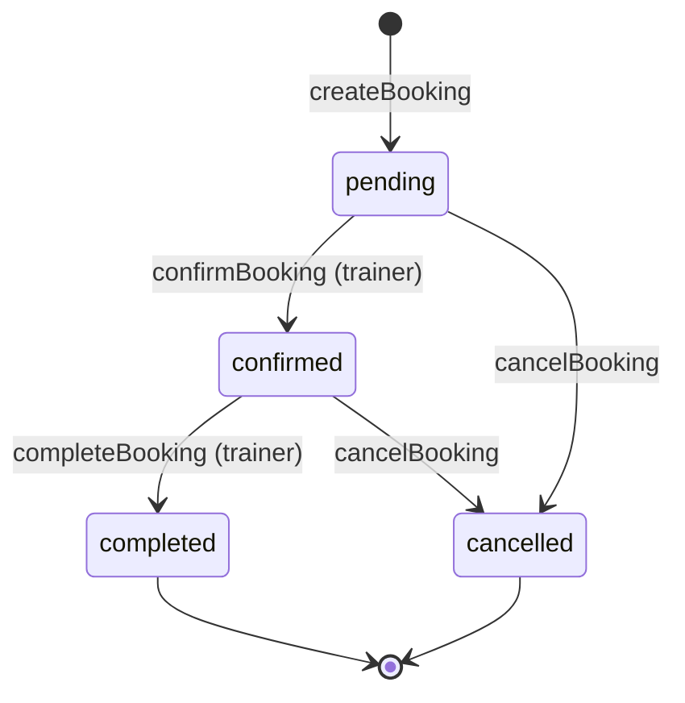
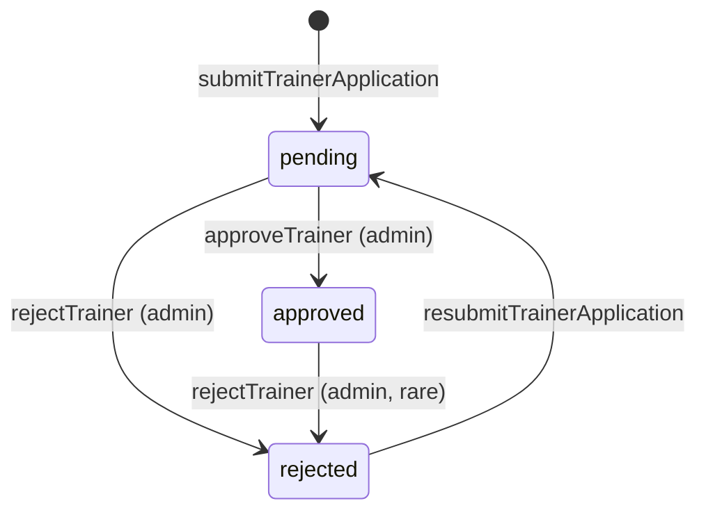
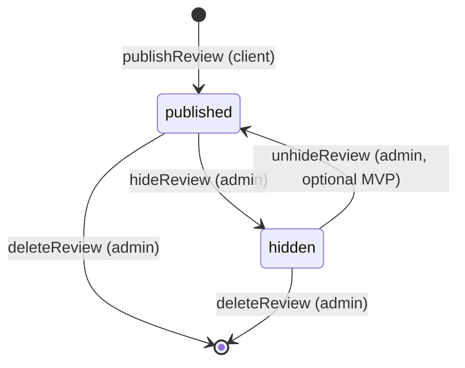
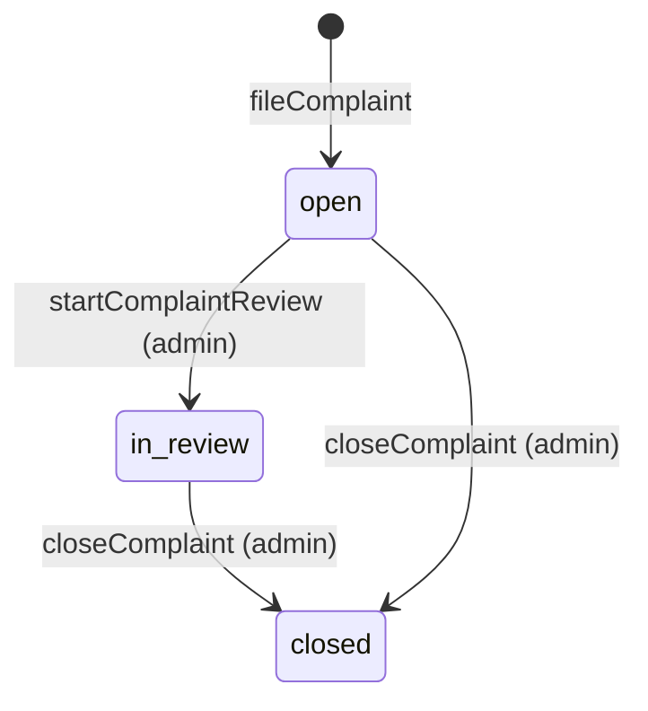
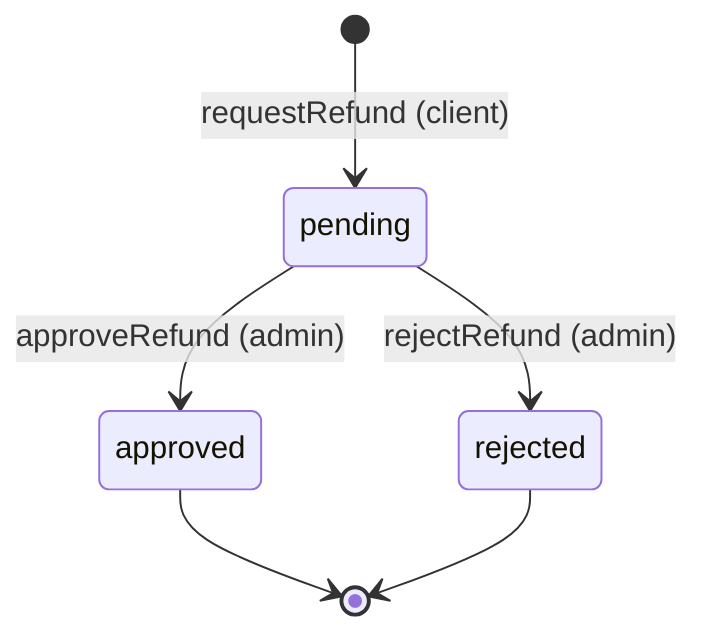
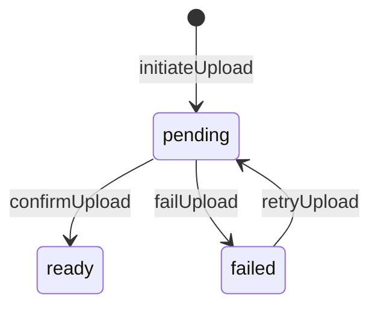

# Lifecycle Models — Pulse MVP

**Тип:** PRD  
**Статус:** Canonical  
**Версия:** 1.0  
**Дата:** 2026-05-23  
**Волна:** W3  
**Зависит от:** [`mvp_scope.md`](../01_product_scope/mvp_scope.md), [`database_schema_v1.md`](../03_data_model/database_schema_v1.md), [`user_flows/users_mvp/`](../01_product_scope/user_flows/users_mvp/)  
**Связанные документы:** [`failure_modes_catalog.md`](./failure_modes_catalog.md), [`domain_invariants.md`](./domain_invariants.md), [`use_cases_index.md`](./use_cases_index.md)

---

## Purpose

Канон **state machines** домена Pulse MVP: допустимые статусы, переходы, акторы, pre/postconditions. Источник для `packages/domain` и contracts W8. Читают backend-разработчики и AI-агенты перед реализацией мутаций.

---

## Scope / Out of scope

**In scope:** `Booking`, `TrainerProfile`, `Review`, `Complaint`, `RefundRequest`, `FileAsset`, wishlist toggle semantics, schedule slot availability rules.

**Out of scope:** Stripe payment states, Daily.co room lifecycle, email job states (`job_execution` — ops layer), OAuth account linking.

---

## Definitions

| Term | Value / source |
|------|----------------|
| `BookingStatus` | `pending` \| `confirmed` \| `completed` \| `cancelled` |
| `TrainerStatus` | `pending` \| `approved` \| `rejected` |
| `ComplaintStatus` | `open` \| `in_review` \| `closed` |
| `RefundStatus` | `pending` \| `approved` \| `rejected` |
| `FileUploadStatus` | `pending` \| `ready` \| `failed` |
| Actor roles | `client` \| `trainer` \| `admin` \| `system` |

Enum literals **MUST** match [`database_schema_v1.md`](../03_data_model/database_schema_v1.md) and future `@pulse/domain`.

---

## Global rules (all lifecycles)

1. **MUST** — переходы только через named use-cases ([`use_cases_index.md`](./use_cases_index.md)); прямой `UPDATE status` из UI — запрещён.
2. **MUST** — каждый write смены статуса логируется в `audit_log` (action code + actor + target).
3. **MUST** — invalid transition возвращает domain error (не silent no-op).
4. **SHOULD** — side effects (rating recalc, badge counts) в той же DB transaction, что и transition.
5. **MAY** — `system` actor только для post-MVP cron (reminders) — не MVP runtime.

---

## Booking lifecycle

### States

| Status | Meaning (MVP) |
|--------|---------------|
| `pending` | Клиент забронировал слот; оплаты нет; ожидает подтверждения тренером |
| `confirmed` | Тренер принял; сессия в расписании обеих сторон |
| `completed` | Сессия проведена (trainer marks done) |
| `cancelled` | Отменена client/trainer/admin по правилам |

### State diagram

### Transition table

| From | To | Actor | Use-case | Preconditions |
|------|-----|-------|----------|---------------|
| — | `pending` | `client` | `CreateBooking` | Trainer `approved`; slot free; service active |
| `pending` | `confirmed` | `trainer` | `ConfirmBooking` | Booking owned by trainer profile |
| `pending` | `cancelled` | `client` \| `trainer` \| `admin` | `CancelBooking` | Cancellation policy (see below) |
| `confirmed` | `completed` | `trainer` | `CompleteBooking` | `starts_at` in past or same day (trainer discretion MVP) |
| `confirmed` | `cancelled` | `client` \| `trainer` \| `admin` | `CancelBooking` | Policy window |

**Cancellation policy (MVP):**

- **Client** MAY cancel if `now() < starts_at - 24 hours` → [`FM-002`](./failure_modes_catalog.md#fm-002).
- **Trainer** MAY cancel any non-`completed` booking (with client notification in-app; email post-MVP).
- **Admin** MAY cancel any non-`completed` booking (moderation).

**Postconditions:**

- `CreateBooking`: snapshot service fields on row; slot blocked for overlap check.
- `CancelBooking`: set `cancelled_at`, `cancelled_by_id`.
- `CompleteBooking`: set `completed_at`, `completed_by_id`; enable review prompt (in-app).

### Happy path

Client selects service + slot → `CreateBooking` → `pending` → trainer `ConfirmBooking` → `confirmed` → after session trainer `CompleteBooking` → `completed` → client review flow.

### Negative paths (invalid transitions)

| Attempt | Result |
|---------|--------|
| `completed` → `confirmed` | Deny — terminal state |
| `cancelled` → any | Deny — terminal state |
| `CreateBooking` on unapproved trainer | Deny — [`FM-003`](./failure_modes_catalog.md#fm-003) |
| Client cancel within 24h | Deny — [`FM-002`](./failure_modes_catalog.md#fm-002) |
| Confirm by non-owner trainer | Deny — security |

### Concurrency & races

- Double submit same slot → [`FM-001`](./failure_modes_catalog.md#fm-001): transaction + overlap check; second client gets error.
- Trainer confirms while client cancels → last-writer-wins **within transaction**; losing side gets domain error + UI refresh.

---

## Trainer verification lifecycle

### States

| Status | Meaning |
|--------|---------|
| `pending` | Заявка подана; не в public catalog |
| `approved` | Модерация пройдена; catalog + bookings enabled |
| `rejected` | Отклонена; не в catalog |

### State diagram

### Transition table

| From | To | Actor | Use-case | Notes |
|------|-----|-------|----------|-------|
| — | `pending` | `trainer` | `SubmitTrainerApplication` | Sets `submitted_at` |
| `pending` | `approved` | `admin` | `ApproveTrainer` | Sets `reviewed_at`, `reviewed_by_id`; clears rejection_reason |
| `pending` | `rejected` | `admin` | `RejectTrainer` | **SHOULD** set `rejection_reason` |
| `rejected` | `pending` | `trainer` | `ResubmitTrainerApplication` | Updates profile; new review queue |
| `approved` | `rejected` | `admin` | `RevokeTrainerApproval` | Rare; hides catalog — [`FM-014`](./failure_modes_catalog.md#fm-014) |

**Invariant:** public catalog query **MUST** filter `status = approved` only — [`domain_invariants.md`](./domain_invariants.md) § INV-03.

### Negative paths

| Attempt | Result |
|---------|--------|
| Trainer self-approve | Deny — role `admin` required |
| Booking for `pending`/`rejected` trainer | Deny — [`FM-003`](./failure_modes_catalog.md#fm-003) |
| Approve without required documents | Deny — validation in use-case |

---

## Review lifecycle

Reviews are **created once** per completed booking; no edit after publish.

### States (logical)

| State | Condition |
|-------|-----------|
| *(none)* | Booking not `completed` or review exists |
| `published` | Row in `review`; `is_hidden = false` |
| `hidden` | Admin set `is_hidden = true` |
| `deleted` | Row removed by admin (hard delete MVP) |

### Flow

**Rules:**

- **MUST** — one review per `booking_id` (UNIQUE).
- **MUST NOT** — client edit after publish.
- **MUST** — `rating` 1–5, `body` 20–500 chars (schema CHECK).
- On `publishReview`: recalc `trainer_profile.rating_avg` / `rating_count` in transaction.

### Negative paths

| Attempt | Result |
|---------|--------|
| Review on non-completed booking | Deny |
| Second review same booking | Deny — [`FM-006`](./failure_modes_catalog.md#fm-006) |
| Client hides own review | Deny — admin only |

---

## Complaint lifecycle

### State diagram

| From | To | Actor | Use-case |
|------|-----|-------|----------|
| — | `open` | `client` (typically) | `FileComplaint` |
| `open` | `in_review` | `admin` | `StartComplaintReview` |
| `*` | `closed` | `admin` | `CloseComplaint` |

**P19 (ADR-008):** on `CloseComplaint`, persist **`resolution`** (`no_action` | `warning_to_trainer` | `refund_recommended` | `duplicate` | `spam`) + `admin_notes`. Status remains `closed`; resolution is not a workflow state.

**Assignee (P19):** admin who started review — from `audit_log.action = complaint.review_started` (no `assigned_to_id` FK).

**MVP:** reporter is usually client; admin assigns priority on create or review.

---

## Refund request lifecycle

**MVP:** manual admin decision; no Stripe API.

| Transition | Actor | Notes |
|------------|-------|-------|
| `RequestRefund` | `client` | Linked to `booking_id`; amount ≤ booking snapshot |
| `ApproveRefund` / `RejectRefund` | `admin` | Sets `processed_by_id`, `processed_at` |

Concurrent admin actions → [`FM-013`](./failure_modes_catalog.md#fm-013).

---

## File upload lifecycle

| Status | Meaning |
|--------|---------|
| `pending` | DB row created; Blob upload not confirmed |
| `ready` | Blob URL valid; FKs from certificates/docs allowed |
| `failed` | Upload error or timeout |

**MUST NOT** attach `verification_document` to non-`ready` asset — [`FM-012`](./failure_modes_catalog.md#fm-012).

---

## Schedule & slot availability (derived state)

Not a DB enum — **computed** from:

1. `trainer_weekly_interval` (local times in `trainer_profile.timezone`)
2. `trainer_schedule_exception` (blocked dates)
3. Non-`cancelled` bookings overlapping interval

**Slot generation use-case:** `GenerateAvailableSlots(trainerProfileId, dateRange)` — pure domain + TZ library.

**Rules:**

- **MUST** use IANA timezone from profile — [`FM-009`](./failure_modes_catalog.md#fm-009).
- Past slots **MUST NOT** be bookable.
- Overlapping booking intervals for same trainer **MUST NOT** coexist (non-cancelled).

---

## Wishlist (idempotent toggle)

No status enum — composite PK `(client_id, trainer_profile_id)`.

| Action | Result |
|--------|--------|
| Add | INSERT; duplicate → no-op success [`FM-007`](./failure_modes_catalog.md#fm-007) |
| Remove | DELETE; missing → no-op success |

---

## Acceptance criteria

- [ ] All MVP enums align with `database_schema_v1.md`
- [ ] Booking diagram includes cancel policy reference to FM-002
- [ ] Trainer verification covers resubmit from `rejected`
- [ ] Invalid transitions listed per entity
- [ ] Race scenarios link to `failure_modes_catalog.md`, not duplicated
- [ ] Post-MVP payment/video absent from MVP transitions

---

## Related documents

| Document | Relationship |
|----------|--------------|
| [`failure_modes_catalog.md`](./failure_modes_catalog.md) | FM index for races/security |
| [`domain_invariants.md`](./domain_invariants.md) | Cross-cutting invariants |
| [`use_cases_index.md`](./use_cases_index.md) | Use-case names |
| [`../03_data_model/database_schema_v1.md`](../03_data_model/database_schema_v1.md) | DDL |
| [`../01_product_scope/user_flows/users_mvp/client_flow.md`](../01_product_scope/user_flows/users_mvp/client_flow.md) | Client UX |
| [`../../implementation/mvp/contracts/booking_lifecycle_contract.md`](../../implementation/mvp/contracts/booking_lifecycle_contract.md) | W8 implementation |

**Registry:** [`documentation_creation_registry.md`](../../meta/documentation_creation_registry.md) — wave W3-02

---

## Agent notes

- Client flow toast «Booking confirmed» на MVP означает **запись создана** (`pending`), не обязательно `confirmed` — согласовать copy в W7 `content_and_microcopy_contract`.
- Не добавлять auto-confirm без ADR + contract update.
- `CompleteBooking` before `starts_at` — MAY allow on MVP (trainer marks early); document in spec if restricted later.

---

## Change log

| Date | Change |
|------|--------|
| 2026-05-23 | v1.0 — initial canonical lifecycles |
