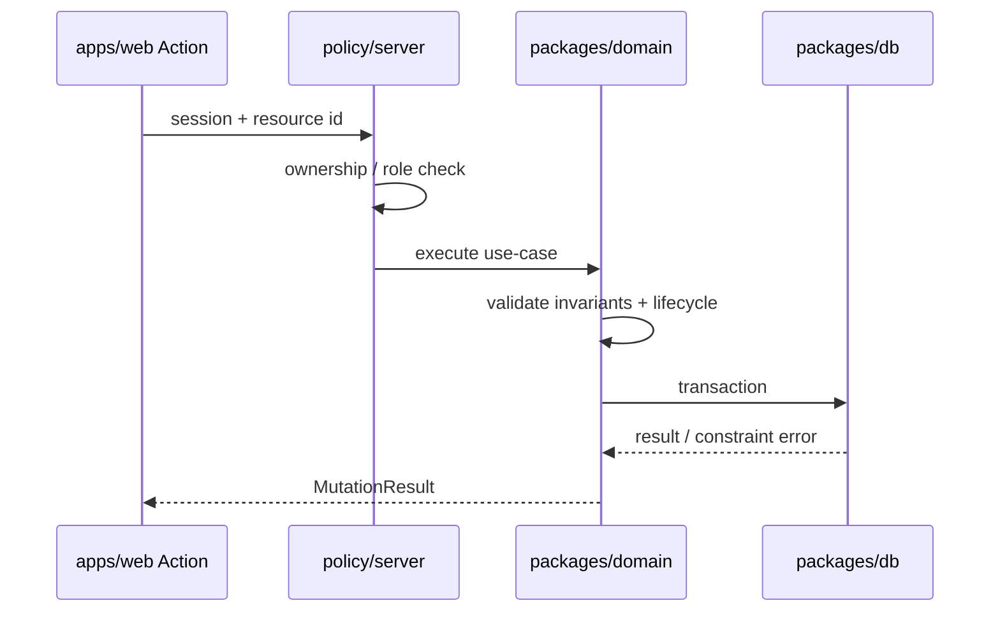

# Use Cases Index — Pulse MVP

**Тип:** PRD  
**Статус:** Canonical  
**Версия:** 1.0  
**Дата:** 2026-05-23  
**Волна:** W3  
**Зависит от:** [`lifecycle_models.md`](./lifecycle_models.md), [`failure_modes_catalog.md`](./failure_modes_catalog.md), [`mvp_scope.md`](../01_product_scope/mvp_scope.md)  
**Связанные документы:** [`domain_invariants.md`](./domain_invariants.md), [`../01_product_scope/user_flows/users_mvp/`](../01_product_scope/user_flows/users_mvp/)

---

## Purpose

Каталог **именованных use-case** для `packages/domain`: входы, актор, lifecycle touchpoints, связанные `FM-xxx` и planned contracts. Единые имена для Server Actions, тестов и learning pack. AI-агент **MUST** использовать эти имена при scaffold domain layer.

---

## Scope / Out of scope

**In scope:** MVP mutations and queries with business rules.

**Out of scope:** Pure UI navigation, read-only public catalog queries (listed briefly), post-MVP payment/video use-cases.

---

## Naming convention

| Pattern | Example |
|---------|---------|
| Command (mutation) | `CreateBooking`, `ApproveTrainer` |
| Query (read) | `ListApprovedTrainers`, `GetBookingForClient` |
| Module file (target) | `packages/domain/src/booking/create-booking.ts` |

**MUST** — PascalCase export; **SHOULD** — one primary function per use-case file.

---

## Use case catalog

### Identity & auth

| Use-case | Actor | Summary | Lifecycle | FM | Planned contract/spec |
|----------|-------|---------|-----------|-----|------------------------|
| `RegisterClient` | guest | Create user role `client` | — | FM-008 | auth_runtime_spec |
| `RegisterTrainer` | guest | Create user + empty `trainer_profile` pending | Trainer § submit | — | trainer_onboarding_spec |
| `AuthenticateUser` | guest | Credentials verify → JWT session | — | FM-008 | auth_runtime_spec |

### Trainer onboarding & profile

| Use-case | Actor | Summary | Lifecycle | FM | Planned contract/spec |
|----------|-------|---------|-----------|-----|------------------------|
| `SaveTrainerOnboardingDraft` | trainer | Persist step data (multi-step) | — | — | trainer_onboarding_spec |
| `SubmitTrainerApplication` | trainer | `pending`, set `submitted_at` | → pending | FM-003 | trainer_verification_contract |
| `ResubmitTrainerApplication` | trainer | rejected → pending | rejected → pending | FM-010 | trainer_verification_contract |
| `UpdateTrainerProfile` | trainer | Bio, photo, specs (approved or pending) | — | FM-016 | trainer_onboarding_spec |
| `ApproveTrainer` | admin | pending → approved | ApproveTrainer | FM-010 | trainer_verification_contract |
| `RejectTrainer` | admin | pending → rejected | RejectTrainer | FM-010 | trainer_verification_contract |
| `RevokeTrainerApproval` | admin | approved → rejected (rare) | Revoke | FM-014 | trainer_verification_contract |

### Services & schedule

| Use-case | Actor | Summary | Lifecycle | FM | Planned contract/spec |
|----------|-------|---------|-----------|-----|------------------------|
| `CreateTrainerService` | trainer | New row `trainer_service` | — | FM-016 | — |
| `UpdateTrainerService` | trainer | Edit fields | — | FM-016 | — |
| `DeleteTrainerService` | trainer | Remove if no future bookings | — | FM-016 | — |
| `ToggleTrainerServiceActive` | trainer | Flip `is_active` | — | FM-019 | interaction_design (optimistic) |
| `UpsertWeeklyIntervals` | trainer | Replace day intervals | Schedule | FM-009 | schedule_slots_contract |
| `UpsertScheduleException` | trainer | Block/unblock date | Schedule | FM-009 | schedule_slots_contract |
| `GenerateAvailableSlots` | system/client read | Compute free slots | Schedule | FM-001, FM-009 | schedule_slots_contract |

### Discovery & wishlist

| Use-case | Actor | Summary | Lifecycle | FM | Planned contract/spec |
|----------|-------|---------|-----------|-----|------------------------|
| `ListApprovedTrainers` | public/client | Catalog with filters | — | FM-018 | catalog_discovery_spec |
| `GetPublicTrainerProfile` | public | Approved trainer detail | — | FM-003 | catalog_discovery_spec |
| `AddToWishlist` | client | INSERT wishlist | Wishlist | FM-007, FM-019 | wishlist_contract |
| `RemoveFromWishlist` | client | DELETE wishlist | Wishlist | FM-007, FM-019 | wishlist_contract |

### Booking

| Use-case | Actor | Summary | Lifecycle | FM | Planned contract/spec |
|----------|-------|---------|-----------|-----|------------------------|
| `CreateBooking` | client | New `pending` + snapshot | → pending | FM-001, FM-003 | booking_lifecycle_contract |
| `ConfirmBooking` | trainer | pending → confirmed | Confirm | FM-015 | booking_lifecycle_contract |
| `CompleteBooking` | trainer | confirmed → completed | Complete | — | booking_lifecycle_contract |
| `CancelBooking` | client/trainer/admin | → cancelled | Cancel | FM-002, FM-015 | booking_lifecycle_contract |
| `ListClientBookings` | client | Filter by status tab | — | FM-004 | client_flow |
| `GetBookingDetail` | client/trainer/admin | Single booking + policy | — | FM-004 | booking_lifecycle_contract |

### Reviews

| Use-case | Actor | Summary | Lifecycle | FM | Planned contract/spec |
|----------|-------|---------|-----------|-----|------------------------|
| `PublishReview` | client | Insert review + rating recalc | → published | FM-006 | review_moderation_contract |
| `HideReview` | admin | is_hidden = true | hidden | — | review_moderation_contract |
| `DeleteReview` | admin | Hard delete + recalc | deleted | — | review_moderation_contract |
| `ListReviewsForTrainer` | public | Visible reviews only | — | — | catalog_discovery_spec |

### Trainer ↔ client notes

| Use-case | Actor | Summary | Lifecycle | FM | Planned contract/spec |
|----------|-------|---------|-----------|-----|------------------------|
| `UpsertTrainerClientNote` | trainer | Auto-save private notes | — | FM-016 | privacy_data_handling |
| `ListTrainerClients` | trainer | Aggregated from bookings | — | FM-016 | trainer_flow |

### Admin moderation

| Use-case | Actor | Summary | Lifecycle | FM | Planned contract/spec |
|----------|-------|---------|-----------|-----|------------------------|
| `FileComplaint` | client | New complaint open | → open | — | complaint_refund_spec |
| `StartComplaintReview` | admin | open → in_review | | — | complaint_refund_spec |
| `CloseComplaint` | admin | → closed | | — | complaint_refund_spec |
| `RequestRefund` | client | New refund pending | → pending | — | complaint_refund_spec |
| `ApproveRefund` | admin | pending → approved | Approve | FM-013 | complaint_refund_spec |
| `RejectRefund` | admin | pending → rejected | Reject | FM-013 | complaint_refund_spec |

### Media

| Use-case | Actor | Summary | Lifecycle | FM | Planned contract/spec |
|----------|-------|---------|-----------|-----|------------------------|
| `InitiateFileUpload` | user | Create `file_asset` pending | → pending | — | file_upload_contract |
| `ConfirmFileUpload` | user | Mark ready after Blob PUT | → ready | FM-012 | file_upload_contract |
| `FailFileUpload` | user/system | Mark failed | → failed | — | file_upload_contract |

### Post-MVP (deferred — names reserved)

| Use-case | Notes |
|----------|-------|
| `SendBookingReminderEmail` | INV-12 blocks MVP; uses FM-011 |
| `CreateDailyRoom` | INV-14 |
| `CaptureStripePayment` | INV-14 |

---

## Layer touchpoints (target architecture)



**MUST:**

- `proxy.ts` — role route gate only (no Prisma).
- `policy/server` — FM-004, FM-005, FM-016 before domain call.
- `domain` — INV rules + lifecycle transitions.
- Map Prisma `P2002` → domain errors ([`FM-001`](./failure_modes_catalog.md#fm-001), [`FM-006`](./failure_modes_catalog.md#fm-006)).

---

## Happy path (reference chain)

```
RegisterClient → ListApprovedTrainers → GetPublicTrainerProfile
  → GenerateAvailableSlots → CreateBooking → ConfirmBooking
  → CompleteBooking → PublishReview
```

Parallel trainer path:

```
RegisterTrainer → SubmitTrainerApplication → ApproveTrainer
  → UpsertWeeklyIntervals → ConfirmBooking
```

---

## Negative paths (use-case level)

| Use-case | Common failure | Domain error code |
|----------|----------------|-------------------|
| `CreateBooking` | Slot taken | `SLOT_UNAVAILABLE` |
| `CancelBooking` | Inside 24h | `CANCELLATION_WINDOW_CLOSED` |
| `PublishReview` | Not completed | `BOOKING_NOT_REVIEWABLE` |
| `ApproveTrainer` | Already processed | `TRAINER_ALREADY_REVIEWED` |
| `ConfirmFileUpload` | Asset not pending | `INVALID_UPLOAD_STATE` |

Errors **SHOULD** map to `@/lib/messages` in web layer — not raw codes to user.

---

## Security paths

| Use-case | Check location |
|----------|----------------|
| Admin mutations | policy: role `admin` |
| `GetBookingDetail` | policy: client owner OR trainer owner OR admin |
| `UpdateTrainerService` | policy: trainer_profile.user_id match |
| `CreateBooking` | policy: role client + trainer approved |

---

## Concurrency notes

| Use-case | Strategy |
|----------|----------|
| `CreateBooking` | Transaction + overlap; see FM-001 |
| `AddToWishlist` | Idempotent PK FM-007 |
| `ApproveRefund` | UPDATE WHERE pending FM-013 |
| `PublishReview` | UNIQUE booking_id FM-006 |

---

## Acceptance criteria

- [ ] Every MVP mutation in user flows maps to ≥1 use-case row
- [ ] Names align with lifecycle_models transition table
- [ ] Each mutating use-case lists FM ids where applicable
- [ ] Post-MVP use-cases clearly separated
- [ ] Sequence diagram matches ADR-001 layering

---

## Related documents

| Document | Relationship |
|----------|--------------|
| [`lifecycle_models.md`](./lifecycle_models.md) | Transition names |
| [`failure_modes_catalog.md`](./failure_modes_catalog.md) | FM references |
| [`domain_invariants.md`](./domain_invariants.md) | INV enforcement |
| [`../01_product_scope/user_flows/users_mvp/client_flow.md`](../01_product_scope/user_flows/users_mvp/client_flow.md) | Client journeys |
| [`../01_product_scope/user_flows/users_mvp/trainer_flow.md`](../01_product_scope/user_flows/users_mvp/trainer_flow.md) | Trainer journeys |
| [`../01_product_scope/user_flows/users_mvp/admin_flow.md`](../01_product_scope/user_flows/users_mvp/admin_flow.md) | Admin journeys |
| [`../../implementation/mvp/contracts/booking_lifecycle_contract.md`](../../implementation/mvp/contracts/booking_lifecycle_contract.md) | Booking mutations W8 |
| [`../../implementation/mvp/contracts/schedule_slots_contract.md`](../../implementation/mvp/contracts/schedule_slots_contract.md) | Schedule W8 |
| [`../../implementation/mvp/contracts/trainer_verification_contract.md`](../../implementation/mvp/contracts/trainer_verification_contract.md) | Verification W8 |
| [`../../implementation/mvp/contracts/wishlist_contract.md`](../../implementation/mvp/contracts/wishlist_contract.md) | Wishlist W8 |
| [`../../implementation/mvp/contracts/review_moderation_contract.md`](../../implementation/mvp/contracts/review_moderation_contract.md) | Reviews W8 |
| [`../../implementation/mvp/contracts/file_upload_contract.md`](../../implementation/mvp/contracts/file_upload_contract.md) | Uploads W8 |

**Registry:** [`documentation_creation_registry.md`](../../meta/documentation_creation_registry.md) — wave W3-05

---

## Agent notes

- Scaffold `packages/domain`: create folder per subdomain (`booking/`, `trainer/`, …) mirroring table above.
- Do not implement post-MVP use-cases in P01–P05.
- Query use-cases may live in `apps/web` server modules until second consumer — then promote to domain.

---

## Change log

| Date | Change |
|------|--------|
| 2026-05-23 | v1.0 — MVP use-case index (~45 entries) |
