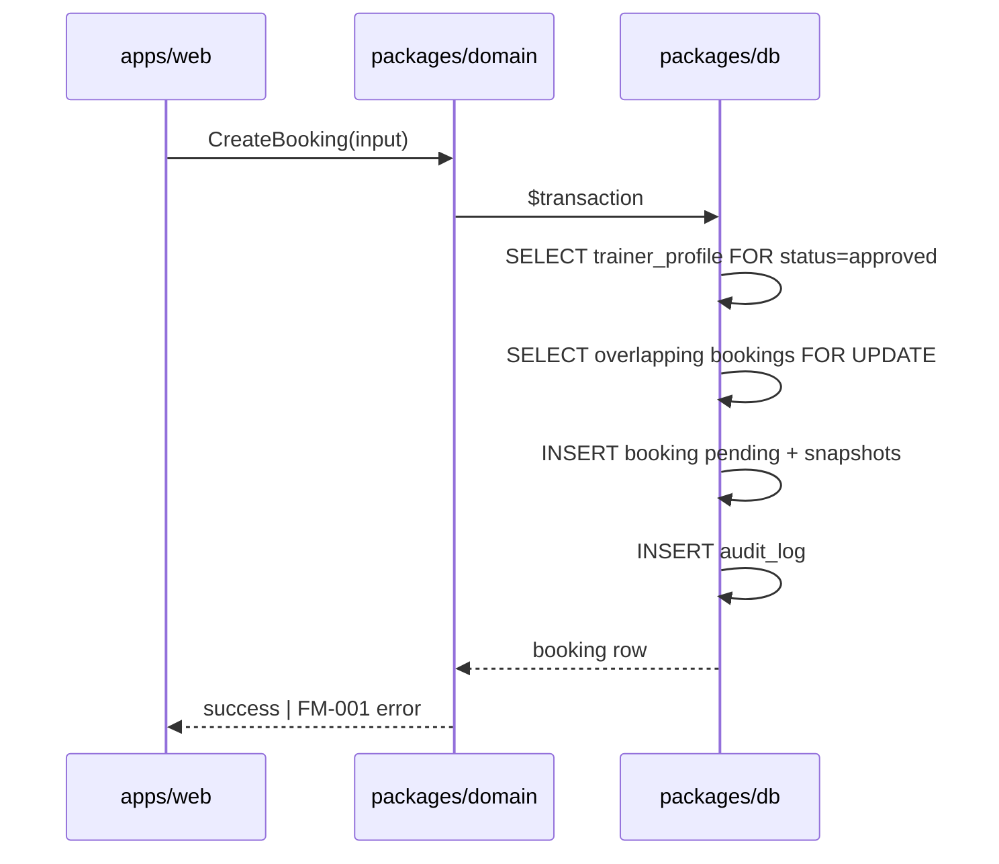

# Data Access Patterns — Pulse MVP

**Тип:** PRD / Spec  
**Статус:** Canonical  
**Версия:** 1.0  
**Дата:** 2026-05-23  
**Волна:** W6  
**Зависит от:** [`database_schema_v1.md`](./database_schema_v1.md), [`lifecycle_models.md`](../02_domain_model/lifecycle_models.md)  
**Связанные документы:** [`indexing_strategy.md`](./indexing_strategy.md), [`use_cases_index.md`](../02_domain_model/use_cases_index.md), [`domain_invariants.md`](../02_domain_model/domain_invariants.md)

---

## Purpose

Канон **паттернов доступа к данным** Pulse MVP: где живут запросы, какие Prisma-операции соответствуют hot paths, границы транзакций, правила фильтрации по роли и timezone. Читают backend-разработчики и AI-агенты при scaffold `packages/db` и repository-слоя.

**Runtime (Context7, Prisma v7 + Neon, May 2026):**

- Runtime queries — pooled `DATABASE_URL` через driver adapter (`@prisma/adapter-pg`).
- Migrations / seed CLI — `DIRECT_URL` в `prisma.config.ts` → `datasource.url`.
- `url` / `directUrl` в `schema.prisma` datasource block — deprecated; конфигурация в `prisma.config.ts`.

---

## Scope / Out of scope

**In scope:** MVP read/write patterns для use-cases из [`use_cases_index.md`](../02_domain_model/use_cases_index.md); transaction boundaries; pagination; overlap detection; catalog filters; admin queues.

**Out of scope:** полный Prisma schema DDL (→ `database_schema_v1.md`); детали индексов (→ [`indexing_strategy.md`](./indexing_strategy.md)); authorization matrix cells (→ [`authorization_matrix.md`](../04_authorization_privacy/authorization_matrix.md)); post-MVP email job queries.

---

## Definitions

| Term | Meaning |
|------|---------|
| **Repository** | Модуль в `packages/db` (или `packages/domain` ports + db impl) — единственное место Prisma-вызовов для сущности |
| **Hot path** | Запрос на критическом UX-маршруте (catalog, booking wizard, dashboards) |
| **Write transaction** | `prisma.$transaction` с overlap/status checks и audit в одном commit |
| **Policy gate** | Object-level check в `policy/server` **до** repository read/write по ID |

Enum literals и таблицы — только из [`database_schema_v1.md`](./database_schema_v1.md).

---

## Layering rules

1. **MUST** — `apps/web` не импортирует `@prisma/client` напрямую; только через domain use-cases + db package.
2. **MUST** — status transitions (`booking.status`, `trainer_profile.status`, …) выполняются **только** в domain use-case, вызывающем repository method с фиксированным именем (не generic `updateMany`).
3. **MUST** — public catalog queries **всегда** включают `trainer_profile.status = approved` ([`INV-03`](../02_domain_model/domain_invariants.md)).
4. **SHOULD** — read methods возвращают DTO/view-model, не raw Prisma shapes, на границе domain.
5. **MUST NOT** — вычислять «локальный день тренера» через `AT TIME ZONE 'UTC'` без явного IANA из профиля ([`FM-009`](../02_domain_model/failure_modes_catalog.md#fm-009)).

---

## Requirements (MUST / SHOULD / MAY)

### Connection & client lifecycle

| ID | Rule |
|----|------|
| **DAP-01** | **MUST** — singleton `PrismaClient` в `packages/db` с pg adapter + pooled `DATABASE_URL`. |
| **DAP-02** | **MUST** — seed и migrate CLI используют `DIRECT_URL` (см. `database_schema_v1.md` §0.3). |
| **DAP-03** | **SHOULD** — interactive transactions для всех multi-row mutations с business invariants. |
| **DAP-04** | **MAY** — `findUnique` + throw в repository; domain маппит в `MutationResult`. |

### Read patterns (general)

| ID | Rule |
|----|------|
| **DAP-10** | **MUST** — явный `select` / `include` только нужных полей; не `include` всё дерево по умолчанию. |
| **DAP-11** | **SHOULD** — cursor pagination для длинных списков (admin complaints, booking history); offset допустим для MVP catalog ≤ 100 rows. |
| **DAP-12** | **MUST** — list endpoints применяют domain filters **до** limit (approved, `is_hidden = false`, …). |

---

## Hot path catalog

### Discovery & catalog

**Use-case:** `ListApprovedTrainers`  
**Route:** `/trainers`  
**Pattern:**

```typescript
// Conceptual — packages/db/src/catalog/list-approved-trainers.ts
prisma.trainerProfile.findMany({
  where: {
    status: "approved",
    ...(specializationSlug && {
      specializations: { some: { specialization: { slug: specializationSlug } } },
    }),
    ...(minRating && { ratingAvg: { gte: minRating } }),
  },
  orderBy: sort === "rating" ? { ratingAvg: "desc" } : { createdAt: "desc" },
  take: pageSize,
  skip: offset,
  select: {
    id: true,
    bio: true,
    photoUrl: true,
    ratingAvg: true,
    ratingCount: true,
    experienceYears: true,
    user: { select: { fullName: true } },
    specializations: { select: { specialization: { select: { slug: true, name: true } } } },
    services: {
      where: { isActive: true },
      orderBy: { sortOrder: "asc" },
      take: 1,
      select: { priceCents: true, currency: true, durationMinutes: true },
    },
  },
});
```

**Notes:** минимальная цена/длительность — cheapest active service или aggregate в domain; не N+1 per card.

---

**Use-case:** `GetPublicTrainerProfile`  
**Route:** `/trainers/[id]`  
**Pattern:** single `findFirst` with `status: approved`, parallel loads optional:

- Profile + user display fields
- Active services (ordered)
- Visible reviews (`isHidden: false`, paginated)
- Weekly intervals + exceptions (for slot preview — full slot math in domain)

**Negative:** `pending` / `rejected` → `null` (404 UX), не partial leak — [`FM-003`](../02_domain_model/failure_modes_catalog.md#fm-003).

---

### Schedule & slots

**Use-case:** `GenerateAvailableSlots`  
**Routes:** `/trainers/[id]`, `/book/[trainerId]`  
**Read bundle (single trainer, date range):**

1. `trainerProfile.findUnique` — `timezone`, `status`
2. `trainerWeeklyInterval.findMany` — `where: { trainerProfileId }`
3. `trainerScheduleException.findMany` — `exceptionDate` in range
4. `booking.findMany` — overlapping UTC window:

```typescript
prisma.booking.findMany({
  where: {
    trainerProfileId,
    status: { not: "cancelled" },
    startsAt: { lt: rangeEndUtc },
    // ends_at computed: startsAt + durationMinutes — filter in domain or raw SQL overlap
  },
  select: { startsAt: true, durationMinutes: true },
});
```

**MUST** — slot generation algorithm in `packages/domain` ([ADR-004](../07_governance/adr_004_timezone_scheduling_model.md)); DB returns facts, not slot list.

---

### Booking writes

**Use-case:** `CreateBooking`  
**Pattern:** interactive transaction:



**Overlap query (conceptual SQL inside transaction):**

```sql
SELECT id FROM booking
WHERE trainer_profile_id = $1
  AND status NOT IN ('cancelled')
  AND starts_at < $new_end
  AND (starts_at + (duration_minutes || ' minutes')::interval) > $new_start
FOR UPDATE;
```

Prisma: `$queryRaw` or domain-level overlap helper — **MUST** run inside same transaction as INSERT. Implements [`FM-001`](../02_domain_model/failure_modes_catalog.md#fm-001).

**Use-cases:** `ConfirmBooking`, `CompleteBooking`, `CancelBooking` — `update` with `where: { id, status: expectedFrom }`; `count === 0` → concurrent transition error ([`FM-015`](../02_domain_model/failure_modes_catalog.md#fm-015)).

---

### Client bookings

**Use-case:** `ListClientBookings`  
**Route:** `/client/bookings`  
**Pattern:**

```typescript
prisma.booking.findMany({
  where: {
    clientId,
    status: tab === "upcoming" ? { in: ["pending", "confirmed"] } : tabFilter,
    ...(tab === "upcoming" && { startsAt: { gte: now } }),
  },
  orderBy: { startsAt: tab === "past" ? "desc" : "asc" },
  include: {
    trainerProfile: {
      select: { id: true, user: { select: { fullName: true } }, photoUrl: true },
    },
  },
});
```

**Use-case:** `GetBookingDetail` — `findFirst` with `where: { id }`; policy layer verifies client/trainer/admin ownership before call.

---

### Trainer workspace

| Use-case | Query pattern |
|----------|---------------|
| `ListTrainerTodaySessions` | `booking.findMany` — `trainerProfileId`, `startsAt` between start/end of trainer local day converted to UTC |
| `ListTrainerClients` | Distinct `clientId` from non-cancelled bookings + optional note join |
| `UpsertWeeklyIntervals` | Transaction: delete day rows + bulk create |
| `ToggleTrainerServiceActive` | Single row `update` by `id` + trainer ownership |

---

### Admin queues

| Use-case | Pattern |
|----------|---------|
| `ListPendingTrainers` | `trainerProfile.findMany({ where: { status: "pending" }, orderBy: { submittedAt: "asc" } })` |
| `ListOpenComplaints` | `complaint.findMany({ where: { status: { in: ["open", "in_review"] } }, orderBy: [{ priority: "desc" }, { createdAt: "asc" }] })` |
| `ListPendingRefunds` | `refundRequest.findMany({ where: { status: "pending" } })` |
| `ListReviewsForModeration` | `review.findMany` with optional `isHidden` filter |

Badge counts on admin nav — **SHOULD** use `count()` queries with same filters, not full list length.

---

### Wishlist

**Use-cases:** `AddToWishlist` / `RemoveFromWishlist`  
**Pattern:** `create` with catch P2002 → success no-op; `deleteMany` with zero rows → success — [`FM-007`](../02_domain_model/failure_modes_catalog.md#fm-007).

**List wishlist trainers:** join `wishlist` → `trainerProfile` where `status = approved`.

---

### Reviews & rating denormalization

**Use-case:** `PublishReview`  
**Transaction:**

1. `review.create` (UNIQUE on `bookingId`)
2. Recompute `ratingAvg` / `ratingCount` on `trainerProfile` from visible reviews aggregate
3. `audit_log` insert

**MUST** — same transaction ([`INV-09`](../02_domain_model/domain_invariants.md)); no trigger-only MVP unless documented in migration.

---

### File assets

**Use-cases:** `InitiateUpload`, `ConfirmUpload`  
**Pattern:** insert `file_asset` `pending` → after Blob PUT → `update` to `ready`. Link to certificate/doc only when `uploadStatus = ready` ([`FM-012`](../02_domain_model/failure_modes_catalog.md#fm-012)).

---

## Happy paths

1. Client opens catalog → `ListApprovedTrainers` → paginated cards &lt; 200 ms p95 target (indexed — see indexing doc).
2. Booking wizard → `GenerateAvailableSlots` reads + domain compute → `CreateBooking` transaction commits `pending`.
3. Trainer confirms → status conditional update succeeds → client sees `confirmed` on refresh.
4. Admin opens verification queue → `ListPendingTrainers` ordered by `submitted_at`.

---

## Negative paths (business & data)

| Scenario | Data layer response |
|----------|---------------------|
| Book unapproved trainer | No row / domain reject before INSERT — [`FM-003`](../02_domain_model/failure_modes_catalog.md#fm-003) |
| Double-book slot | Transaction abort; unique/overlap check — [`FM-001`](../02_domain_model/failure_modes_catalog.md#fm-001) |
| Confirm already cancelled | `updateMany` count 0 → domain error — [`FM-015`](../02_domain_model/failure_modes_catalog.md#fm-015) |
| Second review same booking | P2002 on `booking_id` — [`FM-006`](../02_domain_model/failure_modes_catalog.md#fm-006) |
| Empty catalog filter | `findMany` → `[]`; not an error |
| Neon pool timeout | Propagate; UI retry — no partial commit |

---

## Security paths

| Scenario | Pattern |
|----------|---------|
| IDOR booking read | Policy resolves ownership **before** repository `findUnique`; wrong owner → do not query by ID from untrusted input alone — [`FM-004`](../02_domain_model/failure_modes_catalog.md#fm-004) |
| Client lists another client's bookings | `where: { clientId: session.user.id }` — never from query param |
| Trainer updates another's service | `where: { id, trainerProfile: { userId: session.user.id } }` |
| Admin-only queues | Repository method named `*ForAdmin`; caller must pass verified admin context |
| Public catalog leak pending trainer | `status: approved` in **every** public read path — [`INV-04`](../02_domain_model/domain_invariants.md) |

**MUST NOT** — pass `clientId` / `trainerProfileId` from request body into write `where` without policy validation.

---

## Concurrency & races

| Race | Resolution | Owner |
|------|------------|-------|
| Two clients same slot | Transaction + overlap `FOR UPDATE` / serializable isolation | [`FM-001`](../02_domain_model/failure_modes_catalog.md#fm-001) — details in W8 `booking_lifecycle_contract` |
| Confirm vs cancel | Optimistic `where status = expected` | [`FM-015`](../02_domain_model/failure_modes_catalog.md#fm-015) |
| Duplicate wishlist add | UNIQUE PK → idempotent | [`FM-007`](../02_domain_model/failure_modes_catalog.md#fm-007) |
| Dual admin refund decision | `where status = pending` on update | [`FM-013`](../02_domain_model/failure_modes_catalog.md#fm-013) |

Specs describe UX on failure; **this doc** does not duplicate UI toast text.

---

## Drift risks & guards

| Risk | Guard |
|------|-------|
| Prisma schema ≠ `database_schema_v1.md` | Same PR for migration + doc; CI `prisma validate` |
| Query without `approved` filter | Code search + integration test catalog |
| Status update outside domain | Ban direct `prisma.booking.update({ data: { status` in apps/web |
| Server TZ used for "today" | Golden tests with fixed IANA profiles — [`INV-01`](../02_domain_model/domain_invariants.md) |
| N+1 on catalog | Review `include` depth; EXPLAIN on seed dataset (W6-03) |

---

## Acceptance criteria

- [ ] Every MVP hot path maps to a use-case in `use_cases_index.md`
- [ ] `CreateBooking` documents transaction + overlap read
- [ ] Public reads document `status = approved` filter
- [ ] Security: ownership filters referenced, not duplicated from authorization_matrix
- [ ] Concurrency scenarios link to FM-xxx, not re-specified
- [ ] Prisma v7 Neon connection split (pooled vs direct) documented
- [ ] No second DDL definition — links to `database_schema_v1.md` only

---

## Related documents

| Document | Relationship |
|----------|--------------|
| [`database_schema_v1.md`](./database_schema_v1.md) | DDL canon |
| [`indexing_strategy.md`](./indexing_strategy.md) | Indexes for patterns here |
| [`seed_data_spec.md`](./seed_data_spec.md) | Fixture volume for EXPLAIN/smoke |
| [`lifecycle_models.md`](../02_domain_model/lifecycle_models.md) | State transitions |
| [`use_cases_index.md`](../02_domain_model/use_cases_index.md) | Use-case names |
| [`authorization_matrix.md`](../04_authorization_privacy/authorization_matrix.md) | Who may call each pattern |
| [`adr_004_timezone_scheduling_model.md`](../07_governance/adr_004_timezone_scheduling_model.md) | Slot TZ rules |
| [`../../implementation/mvp/contracts/booking_lifecycle_contract.md`](../../implementation/mvp/contracts/booking_lifecycle_contract.md) | W8 write contract |
| [`../../implementation/mvp/contracts/schedule_slots_contract.md`](../../implementation/mvp/contracts/schedule_slots_contract.md) | W8 schedule contract |
| [`../../architecture_learning_pack/02_booking_lifecycle_layers.md`](../../architecture_learning_pack/02_booking_lifecycle_layers.md) | Booking layer map (W13) |

**Registry:** [`documentation_creation_registry.md`](../../meta/documentation_creation_registry.md) — wave W6-01

---

## Agent notes

- Prefer **named repository functions** (`findBookingForClient`) over generic CRUD spread across apps.
- Overlap detection may use `$queryRaw` for clarity; keep SQL in one module with tests.
- Do not use `middleware.ts` patterns for DB access — unrelated but often co-occurring mistake.
- Post-MVP: `delivery_log` writes only from workers — no new read patterns in web request path on MVP ([`INV-12`](../02_domain_model/domain_invariants.md)).

---

## Change log

| Date | Change |
|------|--------|
| 2026-05-23 | v1.0 — initial hot path data access patterns |
