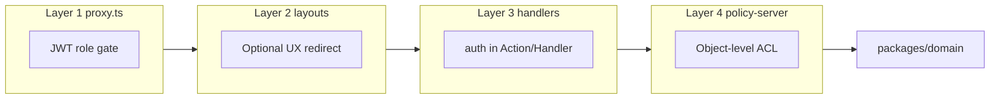

# Authorization & Privacy — Pulse

**Тип:** PRD  
**Статус:** Canonical  
**Версия:** 1.0  
**Дата:** 2026-05-23  
**Волна:** W5  
**Зависит от:** [`adr_003_auth_credentials_jwt_rbac.md`](../07_governance/adr_003_auth_credentials_jwt_rbac.md)  
**Связанные документы:** [`authorization_matrix.md`](./authorization_matrix.md), [`policy_enforcement_contract.md`](./policy_enforcement_contract.md), [`privacy_data_handling.md`](./privacy_data_handling.md)

---

## Purpose

Точка входа в слой **Authorization & Privacy** Pulse: кто может видеть и изменять какие ресурсы, где enforcement происходит в monorepo, и как privacy-правила связаны с schema. Читают backend-разработчики, security review и AI-агенты перед P01 auth scaffold и W8 contracts.

---

## Scope / Out of scope

**In scope:** MVP RBAC (`client` | `trainer` | `admin`), четырёхслойная модель защиты, object-level ACL, privacy классификация данных, ссылки на FM-xxx.

**Out of scope:** OAuth (post-MVP), GDPR legal text, penetration test reports, детали каждого use-case (→ [`use_cases_index.md`](../02_domain_model/use_cases_index.md)), implementation code (→ guidelines + W8).

---

## Definitions

| Term | Definition |
|------|------------|
| `UserRole` | `client` \| `trainer` \| `admin` — `@pulse/domain` |
| `PolicySessionContext` | Session snapshot для `@pulse/policy-server`; без `next-auth` типов в packages |
| Layer 1 | `proxy.ts` — JWT role gate, без Prisma |
| Layer 4 | `@pulse/policy-server` — ownership, IDOR, admin-only mutations |
| PII | Email, full name, phone (if added), trainer client notes |

---

## Layer overview

| Document | Responsibility |
|----------|----------------|
| [`authorization_matrix.md`](./authorization_matrix.md) | **Канон** role × route × resource × action |
| [`policy_enforcement_contract.md`](./policy_enforcement_contract.md) | Где и как вызывать policy; forbidden imports |
| [`privacy_data_handling.md`](./privacy_data_handling.md) | Классы данных, видимость, retention |
| [ADR-003](../07_governance/adr_003_auth_credentials_jwt_rbac.md) | Auth stack, JWT, split config |
| [`authorization_policy_contract.md`](../../implementation/mvp/contracts/authorization_policy_contract.md) | W8 — API policy functions |

---

## Requirements

1. **MUST** — каждая protected mutation проходит Layer 3 (`auth()`) + Layer 4 (`policy/server`) до вызова domain.
2. **MUST** — perimeter role gate только в `proxy.ts` через `auth.config.ts` + `@pulse/policy-edge` ([PKG-02](../02_domain_model/domain_invariants.md)).
3. **MUST** — IDOR-сценарии описаны в matrix и реализуются через policy ([`FM-004`](../02_domain_model/failure_modes_catalog.md#fm-004), [`FM-016`](../02_domain_model/failure_modes_catalog.md#fm-016)).
4. **MUST** — admin-only операции deny для client/trainer ([`FM-005`](../02_domain_model/failure_modes_catalog.md#fm-005)).
5. **MUST NOT** — доверять client-supplied `role`, `userId`, или ownership fields в POST body.
6. **SHOULD** — 404 вместо 403 для cross-user resource read, когда утечка существования недопустима (booking detail).
7. **MAY** — layout скрывает nav items; это не заменяет server enforcement.

---

## Happy paths

- Anonymous просматривает `/trainers`, `/trainers/[id]` (approved only).
- Client логин → JWT с `role=client` → `/client/*` + `/book/*` → создаёт booking только для себя.
- Trainer редактирует только свой `trainer_profile`, services, schedule.
- Admin approve trainer, moderate review, process complaint/refund.

---

## Negative paths

| Scenario | Expected |
|----------|----------|
| Guest на `/client/dashboard` | Redirect `/auth/login?callbackUrl=` |
| Client на `/trainer/dashboard` | Redirect login или role home |
| Trainer `pending` публикует catalog | Public queries exclude ([INV-04](../02_domain_model/domain_invariants.md)) |
| Invalid credentials | Generic error; no user enumeration ([ADR-003](../07_governance/adr_003_auth_credentials_jwt_rbac.md)) |

---

## Security paths

| Threat | Owner doc | FM |
|--------|-----------|-----|
| IDOR booking/profile | `authorization_matrix` + policy contract | FM-004 |
| Privilege escalation | Registration server-side role; admin seed only | FM-005 |
| Cross-trainer mutation | policy ownership | FM-016 |
| JWT tampering | `AUTH_SECRET`; Auth.js signed JWT | — |
| policy/server in proxy | PKG-02 forbidden import | — |

---

## Concurrency & races

Authorization checks **MUST** выполняться внутри той же transaction boundary, что и mutation, когда race возможен (approve/reject trainer — [`FM-010`](../02_domain_model/failure_modes_catalog.md#fm-010)). Perimeter JWT gate не защищает от concurrent IDOR — Layer 4 обязателен.

---

## Drift risks & guards

| Risk | Guard |
|------|-------|
| New route без matrix row | PR checklist: update `authorization_matrix.md` first |
| UI-only auth check | ESLint + code review Layer 3/4 |
| `Session` type in packages | PKG-03, typescript-monorepo-types |
| Matrix duplicated in specs | Specs link FM + matrix; no second full table |

---

## Acceptance criteria

- [ ] README links all W5 auth/privacy docs
- [ ] Four-layer model consistent with ADR-003
- [ ] Security FM-004, FM-005, FM-016 referenced
- [ ] No duplicate route list (→ `canonical_routes.md`)
- [ ] W8 contract linked (authorization_policy_contract)

---

## Related documents

| Document | Relationship |
|----------|--------------|
| [`authorization_matrix.md`](./authorization_matrix.md) | Role × resource canon |
| [`policy_enforcement_contract.md`](./policy_enforcement_contract.md) | Enforcement contract |
| [`privacy_data_handling.md`](./privacy_data_handling.md) | Data visibility |
| [`adr_003_auth_credentials_jwt_rbac.md`](../07_governance/adr_003_auth_credentials_jwt_rbac.md) | Auth ADR |
| [`../02_domain_model/failure_modes_catalog.md`](../02_domain_model/failure_modes_catalog.md) | FM index |
| [`../../design/canonical_routes.md`](../../design/canonical_routes.md) | Route inventory |
| [`../../implementation/mvp/contracts/authorization_policy_contract.md`](../../implementation/mvp/contracts/authorization_policy_contract.md) | W8 API |

**Registry:** [`documentation_creation_registry.md`](../../meta/documentation_creation_registry.md) — wave W5-01

---

## Agent notes

- Не добавлять OAuth provider «на будущее» без ADR amendment.
- Trainer registration **MUST** set `trainer_profile.status = pending` server-side.
- Context7: Auth.js JWT role callbacks — `/websites/authjs_dev`; proxy — `/vercel/next.js/v16.2.2`.

---

## Change log

| Date | Change |
|------|--------|
| 2026-05-23 | v1.0 — Authorization & Privacy layer entry |
