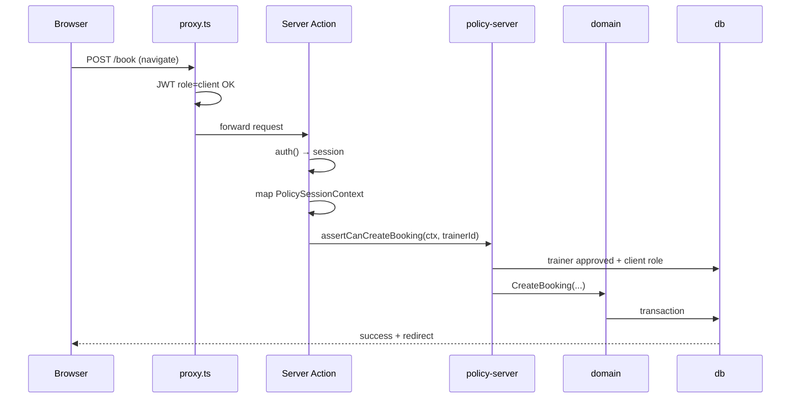

# Policy Enforcement Contract — Pulse MVP

**Тип:** Contract  
**Статус:** Canonical  
**Версия:** 1.0  
**Дата:** 2026-05-23  
**Волна:** W5  
**Зависит от:** [`authorization_matrix.md`](./authorization_matrix.md), [`adr_002_next162_vercel_runtime_policy.md`](../07_governance/adr_002_next162_vercel_runtime_policy.md)  
**Связанные документы:** [`adr_003_auth_credentials_jwt_rbac.md`](../07_governance/adr_003_auth_credentials_jwt_rbac.md), [`../02_domain_model/domain_invariants.md`](../02_domain_model/domain_invariants.md)

---

## Purpose

Контракт **между слоями** Pulse: где вызывается authorization, какие imports разрешены, как session маппится в `PolicySessionContext`, и что MUST происходить при deny. Читают implementers `apps/web`, `packages/policy/*`, и AI-агенты на P01–P03.

---

## Scope / Out of scope

**In scope:** Layer 1–4 touchpoints, `@pulse/policy-edge` vs `@pulse/policy-server`, error shapes, forbidden imports.

**Out of scope:** Конкретные функции `assertCan*` (→ W8 `authorization_policy_contract.md`), UI 403 pages (→ specs W9), OAuth.

---

## Definitions

| Package | Runtime | DB | Used in |
|---------|---------|-----|---------|
| `@pulse/policy-edge` | JWT/path only | ❌ | `proxy.ts` |
| `@pulse/policy-server` | Server | ✅ Prisma | Actions, Handlers, RSC loaders |
| `PolicySessionContext` | `{ userId, role, email? }` | — | policy-server input |

---

## Happy path

**Actor:** authenticated client creating a booking.

**Preconditions:** JWT valid; `role=client`; trainer `approved`.

**Sequence:**

**Postconditions:** Booking row owned by `session.userId`; audit optional.

**Side effects:** Cache tags per [`cache_revalidation_policy.md`](../05_runtime/cache_revalidation_policy.md).

---

## Negative paths (business)

| Condition | Layer | Response |
|-----------|-------|----------|
| Trainer not approved | policy-server / domain | `TRAINER_NOT_BOOKABLE`; validation toast |
| Slot unavailable | domain | `SLOT_UNAVAILABLE`; FM-001 |
| Cancel inside 24h (client) | domain | `CANCELLATION_WINDOW_CLOSED`; FM-002 |
| Upload asset not ready | domain | `INVALID_UPLOAD_STATE`; FM-012 |
| Entity already processed | domain | `ALREADY_PROCESSED`; FM-010/FM-013 |

Policy functions **MUST NOT** throw raw Prisma errors to UI — map to domain/`MutationResult`.

---

## Security paths

| Scenario | Layer | MUST behavior | FM |
|----------|-------|---------------|-----|
| No session on mutation | Action | Reject; redirect or `{ ok: false, code: 'UNAUTHORIZED' }` | — |
| Wrong role on route prefix | proxy | Redirect login / role home | FM-005 edge |
| Client reads other's booking | policy-server | Deny before query or empty 404 | FM-004 |
| Trainer mutates other's service | policy-server | Deny | FM-016 |
| Client invokes admin action | policy-server | Deny | FM-005 |
| Import policy-server in proxy | build | ESLint error PKG-02 | — |
| Trust client `userId` in body | — | **Forbidden** — use session only | — |

**N/A justification:** none — all MVP mutations have applicable security checks.

---

## Concurrency & idempotency

- Policy read (ownership) **SHOULD** use same transaction as domain write when status transition races exist (approve trainer, confirm booking).
- Perimeter JWT check is idempotent; does not prevent double-submit — domain UNIQUE + FM-001 handles booking overlap.
- Cron `/api/jobs/*` **MUST** validate `CRON_SECRET` or Vercel cron header — not user session.

---

## Drift & consistency notes

| Risk | Guard |
|------|-------|
| New Action without `auth()` | PR checklist; grep `use server` files |
| policy-server returns redirect | Forbidden — pure functions only |
| `Session` in packages | PKG-03; map in apps/web only |
| Matrix row missing for new resource | Update [`authorization_matrix.md`](./authorization_matrix.md) first |
| middleware.ts new logic | Migrate to proxy per ADR-002 |

---

## Policy & layer touchpoints

### Layer 1 — `apps/web/src/proxy.ts`

**MUST:**

- Export `function proxy(request: NextRequest)` (Context7 `/vercel/next.js/v16.2.2`).
- Import `auth.config.ts` + `@pulse/policy-edge` only.
- Matcher: `/client/:path*`, `/trainer/:path*`, `/admin/:path*`, `/book/:path*` (extend via matrix).

**MUST NOT:**

- Import `auth.ts` (full), `@pulse/db`, `@pulse/policy-server`.

### Layer 2 — layouts (optional)

- Hide nav links by role.
- **MUST NOT** be sole enforcement.

### Layer 3 — Server Actions / Route Handlers / RSC

**MUST:**

- Call `auth()` at start of every protected handler.
- Map to `PolicySessionContext` before policy-server.
- Return structured errors for client UX.

### Layer 4 — `@pulse/policy-server`

**MUST:**

- Accept `PolicySessionContext` + resource identifiers (from validated params, not body ownership fields).
- Call domain only after allow.
- No Next.js `redirect()`, `cookies()`, or React imports.

### `@pulse/policy-edge` (allowed helpers)

- `classifyPath(pathname): RoleRequirement | 'public'`
- `requiresAuth(matcher): boolean`
- JWT role comparison utilities without DB

---

## Error contract (policy → app)

| Code | HTTP (Route Handler) | Server Action |
|------|----------------------|---------------|
| `UNAUTHORIZED` | 401 | redirect login or error state |
| `FORBIDDEN` | 403 | toast.error + no mutation |
| `NOT_FOUND` | 404 | notFound() for IDOR reads |

---

## Requirements

1. **MUST** — four-layer model per [ADR-003](../07_governance/adr_003_auth_credentials_jwt_rbac.md).
2. **MUST** — policy-server pure functions ([`policy-packages.mdc`](../../../.cursor/rules/policy-packages.mdc)).
3. **MUST** — implements FM-004, FM-005, FM-016 at Layer 4.
4. **MUST NOT** — Prisma in proxy ([PKG-02](../02_domain_model/domain_invariants.md)).
5. **SHOULD** — central mapper `toPolicySessionContext(session)` in `apps/web`.

---

## Acceptance criteria

- [ ] Happy path sequence documents all four layers
- [ ] Minimum 1 negative business path documented
- [ ] Security paths include IDOR + role escalation + forbidden imports
- [ ] Concurrency notes reference FM-010/FM-001
- [ ] Drift guards for proxy vs middleware
- [ ] Links to authorization_matrix and ADR-002/003

---

## Related documents

| Document | Relationship |
|----------|--------------|
| [`authorization_matrix.md`](./authorization_matrix.md) | Permission canon |
| [`adr_002_next162_vercel_runtime_policy.md`](../07_governance/adr_002_next162_vercel_runtime_policy.md) | proxy.ts runtime |
| [`adr_003_auth_credentials_jwt_rbac.md`](../07_governance/adr_003_auth_credentials_jwt_rbac.md) | Auth layers |
| [`../02_domain_model/failure_modes_catalog.md`](../02_domain_model/failure_modes_catalog.md) | FM-004, FM-005, FM-016 |
| [`../05_runtime/auth_runtime_spec.md`](../05_runtime/auth_runtime_spec.md) | Auth UX/runtime |
| [`../../implementation/mvp/contracts/authorization_policy_contract.md`](../../implementation/mvp/contracts/authorization_policy_contract.md) | W8 function API |

**Registry:** [`documentation_creation_registry.md`](../../meta/documentation_creation_registry.md) — wave W5-03

---

## Agent notes

- Context7 verified: Next.js 16 `proxy.ts` uses **nodejs** runtime, not Edge.
- W8 contract adds named `assertCan*` — do not duplicate full matrix there.
- Reference lampto [`policy_enforcement_contract`](../../examples/lampto/docs/prds/04_authorization_privacy/policy_enforcement_contract.md) for structure only.

---

## Change log

| Date | Change |
|------|--------|
| 2026-05-23 | v1.0 — policy layer enforcement contract |
