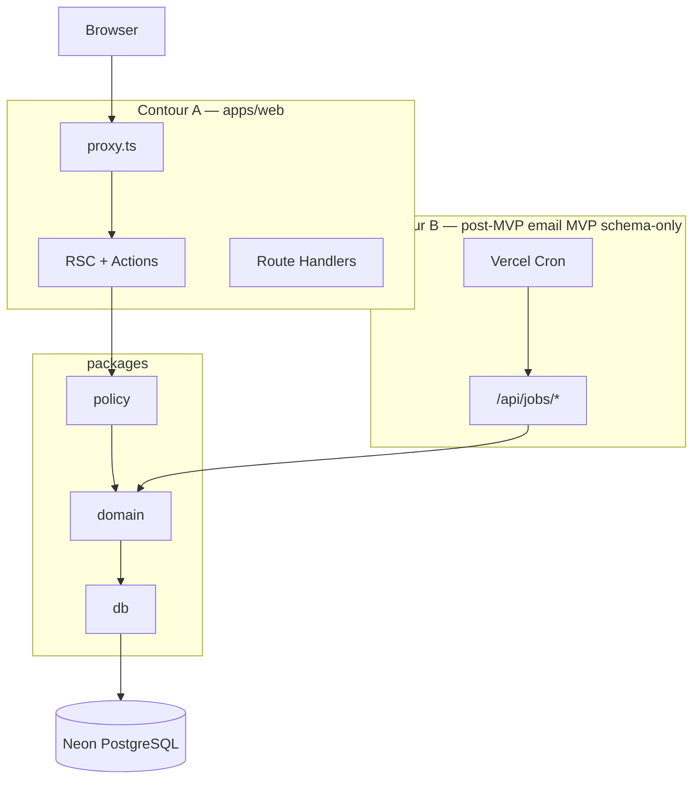

# Runtime Architecture — Pulse

**Тип:** PRD  
**Статус:** Canonical  
**Версия:** 1.0  
**Дата:** 2026-05-23  
**Волна:** W5  
**Зависит от:** [`adr_001_stack_and_runtime.md`](../07_governance/adr_001_stack_and_runtime.md), [`adr_002_next162_vercel_runtime_policy.md`](../07_governance/adr_002_next162_vercel_runtime_policy.md)  
**Связанные документы:** [`backend_requirements.md`](./backend_requirements.md), [`monorepo_packages.md`](./monorepo_packages.md), [`auth_runtime_spec.md`](./auth_runtime_spec.md), [`cache_revalidation_policy.md`](./cache_revalidation_policy.md)

---

## Purpose

Точка входа в слой **Runtime Architecture**: как Pulse выполняет HTTP-запросы, фоновые jobs, кэш и auth на Vercel + Next.js 16.3.0. Связывает ADR-001/002 с implementation guides и monorepo packages.

---

## Scope / Out of scope

**In scope:** двухконтурная модель Web + Jobs (MVP boundary), runtime docs W5, ссылки на Context7-verified Next.js/Auth patterns.

**Out of scope:** Neon ops runbook (W12), phase tasks (W11), AWS migration (post-MVP ADR).

---

## Two-contour model

| Contour | MVP | Post-MVP |
|---------|-----|----------|
| Web | Full UI + mutations | + email enqueue rows |
| Jobs | Tables only; no Cron sends | Resend + [ADR-006](../07_governance/adr_006_idempotent_email_delivery.md) |

**MUST NOT** — email batch, reminders, or long IO in request path ([INV-12](../02_domain_model/domain_invariants.md)).

---

## Runtime documents (this layer)

| Document | Purpose |
|----------|---------|
| [`backend_requirements.md`](./backend_requirements.md) | Web + jobs responsibilities, env, boundaries |
| [`monorepo_packages.md`](./monorepo_packages.md) | Workspaces, dependency graph, package APIs |
| [`auth_runtime_spec.md`](./auth_runtime_spec.md) | Auth flows, session, proxy integration |
| [`cache_revalidation_policy.md`](./cache_revalidation_policy.md) | `updateTag` / `revalidateTag` / `revalidatePath` |

---

## Stack summary (runtime)

| Component | Choice | ADR |
|-----------|--------|-----|
| Next.js | **16.3.0** pinned | ADR-002 |
| Interception | **`proxy.ts`** (nodejs) | ADR-002 |
| Auth | Auth.js v5, JWT, Credentials | ADR-003 |
| DB | Prisma v7 + Neon pool | ADR-001 |
| S3 | AWS S3 | ADR-007 |
| Email | Resend post-MVP | ADR-006 |

Context7 libraries: `/vercel/next.js`, `/websites/authjs_dev`, `/websites/prisma_io`.

---

## Requirements

1. **MUST** — business logic in `packages/domain`; apps remain thin adapters.
2. **MUST** — async Request APIs (`await cookies()`, `await params`) per ADR-002.
3. **MUST** — mutations declare cache invalidation per cache policy.
4. **MUST NOT** — `middleware.ts` as canonical interception (proxy only).
5. **SHOULD** — `apps/workers` scaffold before P06 email phase.

---

## Happy paths

- User request → proxy JWT gate → RSC/Action → policy → domain → Neon → response.
- Preview deploy on Vercel PR with env from project settings.
- Local dev: `apps/web` + Neon dev branch + `DATABASE_URL` pooled.

---

## Negative paths

| Failure | Handling |
|---------|----------|
| DB connection pool exhausted | Retry transient; surface 503 on read routes |
| Missing `AUTH_SECRET` | Fail fast at boot |
| Cron without secret | 401 on `/api/jobs/*` |
| Prisma migrate without `DIRECT_URL` | CLI error — see schema v1 |

---

## Security paths

- Secrets only in Vercel env — never client bundle.
- Cron routes not in public matcher.
- Auth split config — no Prisma in proxy.

---

## Concurrency & races

- Serverless: prefer transactional domain use-cases over app-level locks.
- Job idempotency post-MVP via `idempotency_key` ([FM-011](../02_domain_model/failure_modes_catalog.md#fm-011)).

---

## Drift risks & guards

| Risk | Guard |
|------|-------|
| Netlify patterns from lampto | ADR-001 checklist |
| Next 15 middleware docs | ADR-002 + Context7 v16.2.2 |
| Email in Action `await` | grep Resend; INV-12 |

---

## Acceptance criteria

- [ ] README indexes all W5 runtime docs
- [ ] Two-contour model matches architecture_learning_pack/01
- [ ] ADR-001/002 linked
- [ ] MVP jobs boundary explicit (schema-only)

---

## Related documents

| Document | Relationship |
|----------|--------------|
| [`backend_requirements.md`](./backend_requirements.md) | Detailed requirements |
| [`monorepo_packages.md`](./monorepo_packages.md) | Package boundaries |
| [`auth_runtime_spec.md`](./auth_runtime_spec.md) | Auth runtime |
| [`cache_revalidation_policy.md`](./cache_revalidation_policy.md) | Cache |
| [`../../architecture_learning_pack/01_architecture_overview.md`](../../architecture_learning_pack/01_architecture_overview.md) | Onboarding |
| [`../../AGENTS.md`](../../AGENTS.md) | Monorepo invariants |
| [`../06_operations/README.md`](../06_operations/README.md) | Ops layer (W12) |
| [`../07_governance/adr_001_stack_and_runtime.md`](../07_governance/adr_001_stack_and_runtime.md) | Stack ADR |

**Registry:** [`documentation_creation_registry.md`](../../meta/documentation_creation_registry.md) — wave W5-05

---

## Agent notes

- Read this README before W8 monorepo contract.
- Lampto `backend_stack_decision.md` — patterns; hosting differs (Vercel).

---

## Change log

| Date | Change |
|------|--------|
| 2026-05-23 | v1.0 — Runtime layer entry |
