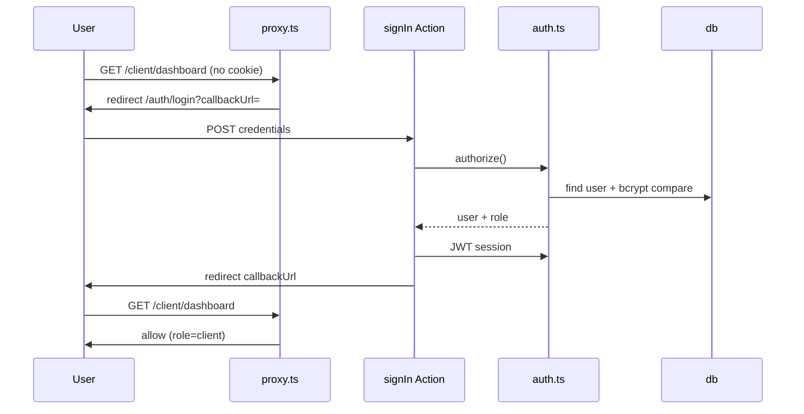

# Auth Runtime Spec — Pulse MVP

**Тип:** Spec  
**Статус:** Canonical  
**Версия:** 1.0  
**Дата:** 2026-05-23  
**Волна:** W5  
**Зависит от:** [`adr_003_auth_credentials_jwt_rbac.md`](../07_governance/adr_003_auth_credentials_jwt_rbac.md), [`authorization_matrix.md`](../04_authorization_privacy/authorization_matrix.md), [`adr_002_next162_vercel_runtime_policy.md`](../07_governance/adr_002_next162_vercel_runtime_policy.md)  
**Связанные документы:** [`../../guidelines/auth/ai_auth_implementation_guide.md`](../../guidelines/auth/ai_auth_implementation_guide.md)

---

## Purpose

Runtime-спецификация **auth flows** Pulse MVP: login, registration, session lifecycle, proxy integration, UX states. Связывает ADR-003 с экранами `/auth/*` и Server Actions. Implementation samples — в auth guideline; здесь — behavior contract.

---

## Scope / Out of scope

**In scope:** Credentials, JWT, three roles, split config, proxy matcher, registration flows, session sign-out.

**Out of scope:** OAuth Google, forgot-password email UI (post-MVP), password reset token consumption, admin user management UI.

---

## Definitions

| Flow | Routes | Result |
|------|--------|--------|
| Client register | `/auth/register` | `role=client` → `/client/dashboard` |
| Trainer register | `/auth/register/trainer` | `role=trainer`, profile `pending` → `/trainer/dashboard` |
| Login | `/auth/login` | JWT session → `callbackUrl` or role home |
| Sign out | profile/settings action | Clear session → `/` or `/auth/login` |

---

## Happy path

### Login (existing user)

1. User opens `/auth/login` (public).
2. Submits email + password via Server Action.
3. `authorize()` verifies bcrypt hash; returns user with `role`.
4. JWT callback persists `role`; session callback exposes to app.
5. Redirect to `callbackUrl` if valid same-origin path, else role dashboard.
6. Optional success toast if returning from protected route.

### Client registration

1. `/auth/register` — user selects client tile.
2. Form: email, name, password, confirm, terms checkbox.
3. Server Action: UNIQUE email check → create `user` with `role=client`.
4. Auto sign-in or redirect to login (product choice: **SHOULD** auto sign-in).
5. Redirect `/client/dashboard` with welcome empty state.

### Trainer registration

1. `/auth/register/trainer` — multi-step wizard (~5 steps).
2. Final submit: transaction creates `user` (`role=trainer`) + `trainer_profile` (`status=pending`, timezone required).
3. Redirect `/trainer/dashboard` with «Under review» banner.
4. Public listing **not** available until admin approve ([INV-03](../02_domain_model/domain_invariants.md)).



---

## Negative paths (UX)

| Scenario | UX | Message |
|----------|-----|---------|
| Invalid credentials | Stay on form; generic error | No «user not found» vs «wrong password» |
| Duplicate email register | Field error on email | From `@/lib/messages` |
| Validation (weak password) | Inline field errors | `border-destructive` |
| Terms not accepted | Submit blocked | Inline hint |
| `callbackUrl` external | Ignore; use role home | Open redirect prevention |
| Session expired mid-form | Redirect login on next protected nav | — |
| Trainer wizard incomplete | Save draft per step (planned P04) | — |

**MUST** — mutation pending: `disabled`, `aria-busy`, gerund label (ui-mutation-pending).

---

## Security paths

| Scenario | Behavior |
|----------|----------|
| Unauthenticated `/client/*` | proxy redirect login + callbackUrl |
| Client visits `/trainer/*` | Deny at proxy → login or client home |
| POST `role=admin` on register | Server ignores; only client/trainer tiles |
| Missing `auth()` on protected Action | Reject — code review + W8 tests |
| JWT tampering | Auth.js verification fails → unauthenticated |
| IDOR after login | policy-server — not auth layer alone |

Forgot password link: **MAY** show disabled «Coming soon» on MVP or hide entirely per [`mvp_scope.md`](../01_product_scope/mvp_scope.md).

---

## Concurrency notes

- Double registration same email: UNIQUE constraint → second submit fails cleanly ([ADR-003](../07_governance/adr_003_auth_credentials_jwt_rbac.md)).
- Parallel login from devices: independent sessions — acceptable MVP.
- Race: register + login same email — second operation fails UNIQUE.

Reference: [`failure_modes_catalog.md`](../02_domain_model/failure_modes_catalog.md) — no duplicate race resolution prose.

---

## UI states matrix

| Region | empty | loading | error | forbidden |
|--------|-------|---------|-------|-----------|
| Login form | — | submit pending | invalid credentials toast | — |
| Register client | — | submit pending | validation / duplicate email | — |
| Register trainer wizard | step empty fields | step save pending | step validation | — |
| Post-login dashboard | welcome empty (client) | RSC skeleton | error boundary | wrong role → proxy redirect |

---

## Wireframe & prototype

| Route | Wireframe (planned) | Prototype |
|-------|---------------------|-----------|
| `/auth/login` | W10-05 `auth_login.md` | [`prototype_route_mapping.md`](../../design/prototype_route_mapping.md) |
| `/auth/register` | W10-06 | same |
| `/auth/register/trainer` | W10-07 | same |

Visual: Warm Forest forms per [`visual_identity_contract.md`](../../design/visual_identity_contract.md).

---

## File layout (target)

| File | Role |
|------|------|
| `apps/web/src/auth.config.ts` | Providers, JWT/session callbacks — **proxy-safe** |
| `apps/web/src/auth.ts` | PrismaAdapter, Credentials `authorize()`, exports `auth`, `handlers` |
| `apps/web/src/proxy.ts` | Layer 1 — imports auth.config only |
| `apps/web/src/app/api/auth/[...nextauth]/route.ts` | `handlers` export |

Context7 verified (Auth.js v5):

```typescript
// auth.ts — server only
export const { auth, handlers, signIn, signOut } = NextAuth({
  adapter: PrismaAdapter(prisma),
  session: { strategy: "jwt" },
  ...authConfig,
});
```

JWT role persistence (Auth.js RBAC guide):

```typescript
callbacks: {
  jwt({ token, user }) {
    if (user) token.role = user.role
    return token
  },
  session({ session, token }) {
    session.user.role = token.role
    return session
  },
}
```

Context7 verified (Next.js 16.2): `export function proxy(request: NextRequest)` in `proxy.ts`, nodejs runtime.

---

## Environment

| Var | Required |
|-----|----------|
| `AUTH_SECRET` | ✅ |
| `AUTH_URL` | ✅ Vercel production |
| `DATABASE_URL` | ✅ for authorize |

---

## Requirements

1. **MUST** — split `auth.config.ts` / `auth.ts` ([ADR-003](../07_governance/adr_003_auth_credentials_jwt_rbac.md)).
2. **MUST** — bcrypt cost ≥ 10 on `password_hash`.
3. **MUST** — generic login failure message.
4. **MUST** — trainer registration creates pending profile in same transaction.
5. **MUST NOT** — database session strategy on MVP.
6. **MUST NOT** — import full `auth.ts` in proxy.

---

## Acceptance criteria

- [ ] Happy paths for login, client register, trainer register documented
- [ ] Negative UX includes duplicate email + invalid credentials
- [ ] Security: role escalation + proxy redirect + open redirect guard
- [ ] UI states matrix for auth screens
- [ ] Wireframe placeholders linked
- [ ] Context7 patterns cited for JWT + proxy

---

## Related documents

| Document | Relationship |
|----------|--------------|
| [`adr_003_auth_credentials_jwt_rbac.md`](../07_governance/adr_003_auth_credentials_jwt_rbac.md) | Auth ADR |
| [`authorization_matrix.md`](../04_authorization_privacy/authorization_matrix.md) | Route permissions |
| [`policy_enforcement_contract.md`](../04_authorization_privacy/policy_enforcement_contract.md) | Layers |
| [`../../guidelines/auth/ai_auth_implementation_guide.md`](../../guidelines/auth/ai_auth_implementation_guide.md) | Code guide |
| [`../01_product_scope/pages_functional_spec.md`](../01_product_scope/pages_functional_spec.md) | Auth pages |
| [`../../implementation/mvp/specs/password_reset_spec.md`](../../implementation/mvp/specs/password_reset_spec.md) | Post-MVP reset flow (W9) |

**Registry:** [`documentation_creation_registry.md`](../../meta/documentation_creation_registry.md) — wave W5-08

---

## Agent notes

- Module augmentation for `Session.user.role` — `apps/web` only.
- Admin users: seed script only on MVP — no self-register path.
- Do not implement Google OAuth «stub» in P01.

---

## Change log

| Date | Change |
|------|--------|
| 2026-05-23 | v1.0 — auth runtime spec MVP |
