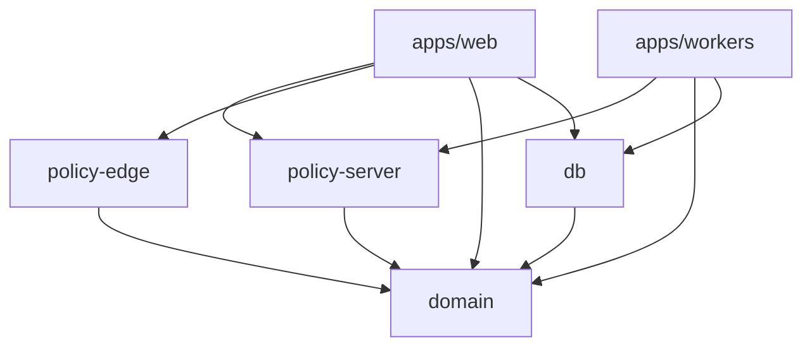

# Monorepo Packages — Pulse

**Тип:** PRD  
**Статус:** Canonical  
**Версия:** 1.0  
**Дата:** 2026-05-23  
**Волна:** W5  
**Зависит от:** [`adr_001_stack_and_runtime.md`](../07_governance/adr_001_stack_and_runtime.md), [`lampto_project_reference.md`](../../reference/lampto_project_reference.md)  
**Связанные документы:** [`backend_requirements.md`](./backend_requirements.md), [`../../AGENTS.md`](../../AGENTS.md)

---

## Purpose

Целевая структура monorepo Pulse: workspaces, границы пакетов, allowed dependency graph, planned public APIs. Наследует lampto layering; адаптирован под `@pulse/*` и Vercel deploy.

---

## Scope / Out of scope

**In scope:** `apps/*`, `packages/domain`, `packages/policy/{edge,server}`, `packages/db`.

**Out of scope:** ESLint config implementation (W8 contract), npm publish, `packages/integrations` (optional post-MVP).

---

## Repository layout (target)

```
fitapp/
├── apps/
│   ├── web/                 # Next.js 16.2.6 BFF
│   └── workers/             # Cron/job adapters (planned)
├── packages/
│   ├── domain/              # @pulse/domain
│   ├── policy/
│   │   ├── edge/            # @pulse/policy-edge
│   │   └── server/          # @pulse/policy-server
│   └── db/                  # @pulse/db
```

**Current status (P01):** `apps/web` shell; `packages/*` **not scaffolded** — rules apply at first package PR.

---

## Responsibility matrix

| Unit | Responsibility | MUST NOT |
|------|----------------|----------|
| `apps/web` | HTTP/UI adapter, Auth.js wiring, DTO mapping | Domain rules, raw SQL |
| `apps/workers` | Job adapter, cron auth | Duplicate domain logic |
| `@pulse/domain` | Use-cases, ports, pure rules, shared enums | Next.js, Prisma, Vercel SDK |
| `@pulse/policy-edge` | JWT/path helpers | DB, policy-server |
| `@pulse/policy-server` | Object ACL with Prisma | `proxy.ts`, client components |
| `@pulse/db` | Prisma schema, client, repositories | Business lifecycle rules |

---

## Dependency graph



### Allowed

- `apps/*` → any `@pulse/*` package
- `@pulse/policy-server` → `@pulse/domain`, `@pulse/db`
- `@pulse/policy-edge` → `@pulse/domain` only
- `@pulse/db` → `@pulse/domain` (types)

### Forbidden ([PKG rules](../02_domain_model/domain_invariants.md))

| Pattern | Rule |
|---------|------|
| `packages/*` → `apps/*` | Packages reusable; apps deployable |
| `domain` → `db` / Next / Vercel | PKG-01 |
| `policy-server` in `proxy.ts` | PKG-02 |
| `db` in `'use client'` | Server-only |
| Inline `"trainer"` status strings | PKG-03 — use `@pulse/domain` |

---

## Planned package APIs (indicative)

### `@pulse/domain`

| Export area | Examples |
|-------------|----------|
| Types | `UserRole`, `BookingStatus`, `TrainerStatus` |
| Errors | `MutationResult`, domain error codes |
| Use-cases | `CreateBooking`, `ApproveTrainer`, … — [`use_cases_index.md`](../02_domain_model/use_cases_index.md) |
| Ports | Repository interfaces for db adapters |

### `@pulse/policy-server`

| Export area | Examples |
|-------------|----------|
| Assertions | `assertCanReadBooking`, `assertCanUpdateTrainerService`, … |
| Context | `PolicySessionContext` mapper types |
| Matrix | Implements [`authorization_matrix.md`](../04_authorization_privacy/authorization_matrix.md) |

### `@pulse/policy-edge`

| Export area | Examples |
|-------------|----------|
| Path | `getRequiredRoleForPath(pathname)` |
| JWT | Role comparison without DB |

### `@pulse/db`

| Export area | Examples |
|-------------|----------|
| Client | `getPrisma()` singleton |
| Repos | Booking, trainer, user repositories |
| Migrations | Prisma schema per [`database_schema_v1.md`](../03_data_model/database_schema_v1.md) |

---

## Apps/web internal structure (target)

| Path | Purpose |
|------|---------|
| `src/proxy.ts` | Layer 1 interception |
| `src/auth.config.ts`, `src/auth.ts` | Split Auth.js |
| `src/app/` | Routes (thin pages) |
| `src/actions/` or colocated actions | Server Actions |
| `src/server/**/composition.ts` | Wire domain + db + policy |
| `src/lib/messages/` | User-visible strings |

Reference: lampto account-deletion composition pattern.

---

## Workspace configuration

Root `package.json` workspaces **MUST** include:

```json
"workspaces": ["apps/*", "packages/*", "packages/policy/*"]
```

`apps/web/next.config.ts` **SHOULD** set `transpilePackages: ['@pulse/domain', '@pulse/policy-edge', '@pulse/policy-server', '@pulse/db']` when packages exist.

Scripts (root):

- `npm run typecheck` — all workspaces
- `npm run lint -w web` — web app

---

## Happy paths

- New feature: domain use-case → policy assert → db repo → thin Action in web.
- Typecheck at root catches PKG-03 drift.
- Preview deploy bundles transpiled packages via Vercel monorepo support.

---

## Negative paths

| Mistake | Consequence |
|---------|-------------|
| Import `@pulse/db` in client component | Build/lint fail |
| Domain imports Prisma | ESLint PKG-01 error |
| Policy redirect() | Forbidden — app layer handles |

---

## Security paths

- Policy-server never exposed to browser bundle.
- Secrets only in apps env — not in packages.
- policy-edge safe for proxy (no secrets in JWT verification beyond Auth.js).

---

## Concurrency & races

Package boundaries do not change transaction requirements — domain + db own consistency.

---

## Drift risks & guards

| Risk | Guard |
|------|-------|
| Deep relative imports to packages | ESLint `@pulse/*` only |
| Scaffold package without workspace entry | Same PR updates root package.json |
| Copy lampto `@bsfy/*` names | Use `@pulse/*` |

---

## Requirements

1. **MUST** — first package PR adds workspace + transpilePackages together.
2. **MUST** — follow lampto layering pattern for first nontrivial flow (booking or verification).
3. **MUST NOT** — business logic only in apps without domain extraction plan.
4. **SHOULD** — `import "server-only"` in db/policy-server entrypoints.

---

## Acceptance criteria

- [ ] Layout matches AGENTS.md target tree
- [ ] Dependency graph matches PKG invariants
- [ ] Planned APIs reference use_cases_index
- [ ] Lampto reference cited as pattern not product rules
- [ ] P01 scaffold gap documented

---

## Related documents

| Document | Relationship |
|----------|--------------|
| [`../../AGENTS.md`](../../AGENTS.md) | Monorepo entry |
| [`backend_requirements.md`](./backend_requirements.md) | Runtime |
| [`../04_authorization_privacy/policy_enforcement_contract.md`](../04_authorization_privacy/policy_enforcement_contract.md) | Policy layers |
| [`../../reference/lampto_project_reference.md`](../../reference/lampto_project_reference.md) | Reference |
| [`../../implementation/mvp/contracts/monorepo_boundaries_contract.md`](../../implementation/mvp/contracts/monorepo_boundaries_contract.md) | W8 PKG enforcement |

**Registry:** [`documentation_creation_registry.md`](../../meta/documentation_creation_registry.md) — wave W5-07

---

## Agent notes

- Do not create `packages/` before P01 contract explicitly allows — but document target now.
- First domain module: booking or trainer verification per learning pack roadmap.

---

## Change log

| Date | Change |
|------|--------|
| 2026-05-23 | v1.0 — monorepo package boundaries |
