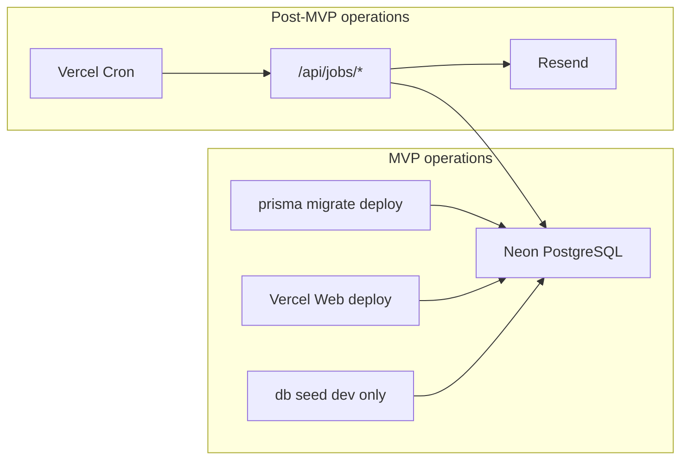

# Operations — Pulse

**Тип:** PRD  
**Статус:** Canonical  
**Версия:** 1.0  
**Дата:** 2026-05-23  
**Волна:** W12  
**Зависит от:** [`backend_requirements.md`](../05_runtime/backend_requirements.md)  
**Связанные документы:** [`migration_runbook.md`](./migration_runbook.md), [`observability_plan.md`](./observability_plan.md), [`cron_jobs_registry.md`](./cron_jobs_registry.md)

---

## Purpose

Точка входа в слой **Operations**: миграции БД, деплой, observability, фоновые jobs и local dev. Связывает runtime PRD (W5) с пошаговыми guides (W12) для разработчиков и AI-агентов при scaffold P01 и post-MVP P06.

**Аудитория:** инженеры, DevOps, AI-агенты на фазах P01 (Neon + Prisma) и P06 (email Cron).

---

## Scope / Out of scope

**In scope:** индекс ops-документов W12, границы MVP vs post-MVP для jobs/email, ссылки на implementation guides.

**Out of scope:** детали domain logic, product UX, CI YAML (добавляется при настройке репозитория), AWS migration (post-MVP ADR).

---

## Operations documents (this layer)

| Document | Purpose | Primary phase |
|----------|---------|---------------|
| [`migration_runbook.md`](./migration_runbook.md) | Безопасный цикл Prisma migrate на Neon (dev/preview/prod) | P01 |
| [`observability_plan.md`](./observability_plan.md) | Логи, ошибки, метрики MVP; расширение post-MVP | P01–P14 |
| [`cron_jobs_registry.md`](./cron_jobs_registry.md) | Реестр Cron jobs, auth, idempotency (schema-ready MVP) | P06 |
| [`../../implementation/mvp/guides/local_dev_setup.md`](../../implementation/mvp/guides/local_dev_setup.md) | Первый запуск monorepo локально | P01 |
| [`../../implementation/mvp/guides/vercel_deploy_guide.md`](../../implementation/mvp/guides/vercel_deploy_guide.md) | Vercel project, env, preview/prod | P01 |
| [`../../implementation/mvp/guides/neon_prisma_migrations_guide.md`](../../implementation/mvp/guides/neon_prisma_migrations_guide.md) | Neon branches + Prisma v7 CLI | P01 |
| [`../../implementation/mvp/guides/seed_and_fixtures_guide.md`](../../implementation/mvp/guides/seed_and_fixtures_guide.md) | Dev seed и smoke credentials | P01–P02 |
| [`../../implementation/mvp/guides/cron_jobs_setup_guide.md`](../../implementation/mvp/guides/cron_jobs_setup_guide.md) | Vercel Cron + `/api/jobs/*` (post-MVP) | P06 |

---

## Two-contour ops model

| Contour | MVP | Post-MVP |
|---------|-----|----------|
| Web deploy | ✅ Vercel preview + production | Same |
| DB migrations | ✅ `migrate deploy` via `DIRECT_URL` | Same |
| Dev seed | ✅ local/preview only | Same guard |
| Cron email jobs | ❌ tables empty | ✅ per [`cron_jobs_registry.md`](./cron_jobs_registry.md) |
| Resend | ❌ no `RESEND_API_KEY` | ✅ P06 |

**MUST NOT** — отправка email или запись в `delivery_log` на MVP ([**INV-12**](../02_domain_model/domain_invariants.md), [**FM-020**](../02_domain_model/failure_modes_catalog.md#fm-020)).

---

## Environment variables (ops view)

Сводка для ops; детали — [`backend_requirements.md`](../05_runtime/backend_requirements.md).

| Variable | MVP | Post-MVP | Set in |
|----------|-----|----------|--------|
| `DATABASE_URL` | ✅ pooled Neon | ✅ | Vercel + local `.env` |
| `DIRECT_URL` | ✅ non-pooled | ✅ | Vercel + local `.env` |
| `AUTH_SECRET` | ✅ | ✅ | Vercel |
| `AUTH_URL` | ✅ prod/preview URL | ✅ | Vercel |
| `AWS_IAM_USER_ACCESS_KEY` | ✅ when upload ships | ✅ | Vercel |
| `AWS_IAM_USER_SECRET_ACCESS_KEY` | ✅ when upload ships | ✅ | Vercel |
| `S3_BUCKET_REGION` | ✅ when upload ships | ✅ | Vercel |
| `S3_BUCKET_NAME` | ✅ when upload ships | ✅ | Vercel |
| `CRON_SECRET` | optional until P06 | ✅ | Vercel |
| `RESEND_API_KEY` | ❌ | ✅ | Vercel (P06) |

**Context7 verified (Prisma v7, May 2026):** CLI migrations use `DIRECT_URL` in `prisma.config.ts`; runtime client uses pooled `DATABASE_URL` via driver adapter.

---

## Requirements

1. **MUST** — все DDL changes через Prisma migrate + [`database_schema_v1.md`](../03_data_model/database_schema_v1.md) sync в том же PR.
2. **MUST** — production migrate только `prisma migrate deploy`, не `migrate dev`.
3. **MUST** — dev seed не запускается на production без `ALLOW_DEV_SEED=true` ([`seed_data_spec.md`](../03_data_model/seed_data_spec.md)).
4. **SHOULD** — preview deploy использует отдельную Neon branch или isolated DB.
5. **MUST NOT** — Netlify/AWS deploy patterns из lampto без ADR.

---

## Happy paths

1. Developer: clone → local dev guide → Neon dev branch → migrate → seed → smoke login.
2. PR: Vercel preview build → migrate deploy on preview DB → app loads.
3. Production release: merge main → Vercel prod deploy → migrate deploy on prod `DIRECT_URL`.
4. (Post-MVP P06) Enable Cron → jobs process queue → idempotent Resend sends.

---

## Negative paths

| Scenario | Expected handling |
|----------|-------------------|
| Migrate without `DIRECT_URL` | Prisma CLI fails fast — see migration runbook |
| Seed on production | Script throws unless explicit override |
| Cron endpoint without secret | 401 — no job execution |
| Resend down (post-MVP) | `delivery_log.status=failed`; retry per registry |
| Schema drift vs docs | Block merge — doc + migration same PR |

---

## Security paths

| Rule | Enforcement |
|------|-------------|
| Secrets never in git | `.env` gitignored; Vercel env only |
| `/api/jobs/*` public | Cron secret header required (P06) |
| Production DB credentials | Scoped Neon roles; rotate on leak |
| PII in logs | Mask emails — observability plan |

---

## Concurrency & races

- Migrate deploy: single writer — CI serializes prod migrations.
- Post-MVP Cron overlap: [**FM-011**](../02_domain_model/failure_modes_catalog.md#fm-011) — check `delivery_log` before send.
- Parallel preview deploys: each preview DB isolated — no cross-preview migrate races.

---

## Drift risks & guards

| Risk | Guard |
|------|-------|
| `schema.prisma` url block vs `prisma.config.ts` | Prisma v7: config file is canon |
| MVP Resend wired early | grep + INV-12 in P01–P05 DoD |
| Ops docs vs backend_requirements env table | Cross-link; update both on new env |
| Lampto Netlify migrate docs | ADR-001 Vercel path only |

---

## Acceptance criteria

- [ ] README indexes all W12 ops + guides
- [ ] MVP vs post-MVP jobs boundary explicit
- [ ] Links to migration runbook, observability, cron registry
- [ ] Prisma v7 DIRECT_URL pattern referenced (Context7)
- [ ] INV-12 / FM-020 guard for MVP

---

## Related documents

| Document | Relationship |
|----------|--------------|
| [`backend_requirements.md`](../05_runtime/backend_requirements.md) | Runtime env + contours |
| [`migration_runbook.md`](./migration_runbook.md) | DB migration procedures |
| [`observability_plan.md`](./observability_plan.md) | Monitoring |
| [`cron_jobs_registry.md`](./cron_jobs_registry.md) | Job catalog |
| [`../05_runtime/README.md`](../05_runtime/README.md) | Runtime layer sibling |
| [`../../implementation/mvp/guides/`](../../implementation/mvp/guides/) | How-to guides |
| [`../../architecture_learning_pack/01_architecture_overview.md`](../../architecture_learning_pack/01_architecture_overview.md) | Onboarding |

**Registry:** [`documentation_creation_registry.md`](../../meta/documentation_creation_registry.md) — wave W12-01

---

## Agent notes

- Read this README before writing migration or deploy code in P01.
- W12 guides are procedural; contracts/specs remain source for behavior.
- Do not add Cron to `vercel.json` until P06 unlock.

---

## Change log

| Date | Change |
|------|--------|
| 2026-05-23 | v1.0 — Operations layer entry (W12) |
