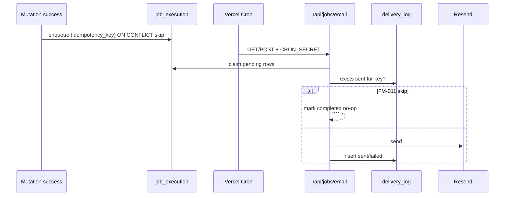

# Cron Jobs Registry — Pulse

**Тип:** PRD  
**Статус:** Canonical  
**Версия:** 1.0  
**Дата:** 2026-05-23  
**Волна:** W12  
**Зависит от:** [`email_notifications_contract.md`](../../implementation/mvp/contracts/email_notifications_contract.md), [`P06_phase_description.md`](../../implementation/mvp/phases_tasks_descriptions/P06_phase_description.md)  
**Связанные документы:** [`adr_006_idempotent_email_delivery.md`](../07_governance/adr_006_idempotent_email_delivery.md), [`email_notifications_matrix.md`](../01_product_scope/email_notifications_matrix.md)

---

## Purpose

Канонический **реестр фоновых jobs** Pulse: Vercel Cron schedules, HTTP entrypoints, auth, idempotency, MVP vs post-MVP status. Implements operational view of [ADR-006](../07_governance/adr_006_idempotent_email_delivery.md) and [`email_notifications_contract.md`](../../implementation/mvp/contracts/email_notifications_contract.md).

**Аудитория:** ops и AI-агенты на фазе P06; architects tracing E-01–E-09 to runtime.

---

## Scope / Out of scope

**In scope:** job catalog, cron expressions, secrets, retry policy, enqueue vs worker split, FM-011 behavior.

**Out of scope:** Resend template HTML, AWS EventBridge migration, MVP runtime (all jobs **disabled** until P06 unlock).

---

## Definitions

| Term | Definition |
|------|------------|
| **Job** | Unit of async work processed outside request path |
| **Enqueue** | INSERT into `job_execution` after domain success |
| **Worker** | Cron-triggered handler draining pending jobs |
| **CRON_SECRET** | Shared secret validating `Authorization` header on job routes |

---

## MVP vs post-MVP summary

| Aspect | MVP (P01–P05) | Post-MVP (P06+) |
|--------|---------------|-----------------|
| `vercel.json` crons | ❌ empty / absent | ✅ per table below |
| `/api/jobs/*` routes | ❌ not deployed | ✅ |
| `job_execution` writes | ❌ | ✅ enqueue |
| `delivery_log` writes | ❌ [**INV-12**](../02_domain_model/domain_invariants.md) | ✅ worker |
| Resend | ❌ | ✅ |

**MUST NOT** register Cron or write job rows on MVP without explicit P06 unlock ([**FM-020**](../02_domain_model/failure_modes_catalog.md#fm-020)).

---

## Architecture



---

## Job catalog

### Active jobs (post-MVP — P06)

| Job ID | Name | Schedule (UTC) | Route | job_type(s) | Events | Idempotency |
|--------|------|----------------|-------|-------------|--------|-------------|
| J-01 | Email batch processor | `*/5 * * * *` (every 5 min) | `/api/jobs/email` | all transactional | E-01–E-06, E-08, E-09 | per matrix key |
| J-02 | Booking reminder scanner | `*/15 * * * *` | `/api/jobs/reminders` | `booking_reminder_24h` | E-07 | `reminder_24h:{bookingId}` |

**SHOULD** start with J-01 only; add J-02 when reminder feature ships.

Event details — [`email_notifications_matrix.md`](../01_product_scope/email_notifications_matrix.md).

### Enqueue-only (no separate cron)

These are inserted by domain hooks after mutations; processed by J-01:

| Event | Enqueue trigger | idempotency_key pattern |
|-------|-----------------|-------------------------|
| E-03 | `ConfirmBooking` | `booking_confirmed:{bookingId}` |
| E-01 | `ApproveTrainer` | `trainer_approved:{trainerProfileId}` |
| E-09 | Password reset request | `reset:{tokenId}` |

Full mapping — [`email_notifications_contract.md`](../../implementation/mvp/contracts/email_notifications_contract.md) §Event mapping.

### Reserved / future (not scheduled)

| Job ID | Name | Notes |
|--------|------|-------|
| J-R01 | Stripe webhook reconciliation | Post-Stripe ADR |
| J-R02 | File asset orphan cleanup | [`adr_007`](../07_governance/adr_007_file_asset_blob_lifecycle.md) batch |
| J-R03 | Session completion auto-transition | If cron-based vs on-read |

---

## Authentication

**MUST** — all Cron routes verify secret before processing:

```typescript
// apps/web/src/app/api/jobs/email/route.ts (pattern)
const authHeader = request.headers.get("authorization");
if (authHeader !== `Bearer ${process.env.CRON_SECRET}`) {
  return new Response("Unauthorized", { status: 401 });
}
```

| Env | Purpose |
|-----|---------|
| `CRON_SECRET` | Vercel Cron `Authorization: Bearer …` header |

Vercel Cron automatically sends the `Authorization` header when `CRON_SECRET` is set in project env (verify against current Vercel docs at P06 implementation).

**MUST NOT** — expose job routes in public `proxy.ts` matcher without auth check inside handler.

---

## Retry & failure policy

| `delivery_log.status` | Action |
|-----------------------|--------|
| `sent` | Never resend same `idempotency_key` ([FM-011](../02_domain_model/failure_modes_catalog.md#fm-011)) |
| `failed` | Retry up to **3** attempts with exponential backoff (5m, 15m, 60m) via `job_execution` `attempt_count` |
| `pending` job > 1h | Alert in observability plan; manual inspect |

After max retries: mark job `failed`; ops may trigger manual replay with **new** admin-only tool — default same key blocks duplicate.

---

## Happy paths

1. Booking confirmed → enqueue E-03 → J-01 runs within 5 min → Resend send → `delivery_log.sent`.
2. Cron re-fire same window → FM-011 skip → no duplicate email.
3. J-02 finds booking T-24h in trainer TZ → enqueue E-07 → J-01 sends reminder.

---

## Negative paths

| Scenario | Expected |
|----------|----------|
| Enqueue without DB commit | **Forbidden** design — enqueue post-transaction only |
| Resend 5xx | `delivery_log.failed`; retry per policy |
| Invalid payload (missing user) | Job `failed`; log error; no send |
| Cron without secret | 401; no DB writes |
| MVP accidental Cron deploy | No-op handler or route absent; CI grep guard |

---

## Security paths

| Scenario | Mitigation |
|----------|------------|
| Public cron URL abuse | Bearer secret required |
| PII in `payload_json` | Store IDs only; resolve in worker |
| Client-triggered enqueue | **Forbidden** — server domain only |
| Cross-tenant email | Resolve recipient from DB by `user_id` in payload |

---

## Concurrency & idempotency

| Scenario | Resolution |
|----------|------------|
| Duplicate enqueue | UNIQUE `job_execution.idempotency_key` — treat conflict as success |
| Parallel cron invocations | Claim pattern + FM-011 delivery_log check |
| Worker crash mid-send | Retry; idempotency prevents double send if `sent` row exists |

---

## Drift risks & guards

| Risk | Guard |
|------|-------|
| Cron added in P01–P05 | Phase DoD + grep `vercel.json` crons |
| Schedule drift vs matrix | Update this registry when adding E-xx |
| Reminder TZ wrong | ADR-004 trainer timezone in J-02 query |
| lampto AWS cron patterns | Vercel Cron only until ADR for AWS |

---

## `vercel.json` template (post-MVP)

```json
{
  "crons": [
    {
      "path": "/api/jobs/email",
      "schedule": "*/5 * * * *"
    },
    {
      "path": "/api/jobs/reminders",
      "schedule": "*/15 * * * *"
    }
  ]
}
```

Deploy only when P06 unlocked. Setup steps — [`cron_jobs_setup_guide.md`](../../implementation/mvp/guides/cron_jobs_setup_guide.md).

---

## Requirements

1. **MUST** — every scheduled job listed in this registry before deploy.
2. **MUST** — deterministic `idempotency_key` per event (INV-13).
3. **MUST** — Cron auth via `CRON_SECRET`.
4. **MUST NOT** — MVP cron that writes `delivery_log` or calls Resend.
5. **SHOULD** — job handlers live in `apps/workers` or `apps/web/src/app/api/jobs/*` — not Server Actions.

---

## Acceptance criteria

- [ ] J-01/J-02 defined with schedule and routes
- [ ] MVP disabled state explicit
- [ ] FM-011 retry policy documented
- [ ] Auth pattern for job routes
- [ ] Event mapping references email contract + matrix
- [ ] vercel.json template included

---

## Related documents

| Document | Relationship |
|----------|--------------|
| [`email_notifications_contract.md`](../../implementation/mvp/contracts/email_notifications_contract.md) | Enqueue + worker contract |
| [`adr_006_idempotent_email_delivery.md`](../07_governance/adr_006_idempotent_email_delivery.md) | ADR |
| [`email_notifications_matrix.md`](../01_product_scope/email_notifications_matrix.md) | E-01–E-09 |
| [`P06_phase_description.md`](../../implementation/mvp/phases_tasks_descriptions/P06_phase_description.md) | Implementation phase |
| [`observability_plan.md`](./observability_plan.md) | Failed job alerts |
| [`cron_jobs_setup_guide.md`](../../implementation/mvp/guides/cron_jobs_setup_guide.md) | Setup how-to |
| [`../06_operations/README.md`](./README.md) | Ops index |

**Registry:** [`documentation_creation_registry.md`](../../meta/documentation_creation_registry.md) — wave W12-04

---

## Agent notes

- Default agent sessions: **do not** add crons — reference this doc only.
- When P06 starts, implement J-01 before J-02.
- Update registry row `Status` column when job moves documented → implemented → tested.

---

## Change log

| Date | Change |
|------|--------|
| 2026-05-23 | v1.0 — cron jobs registry (schema-ready MVP) |
