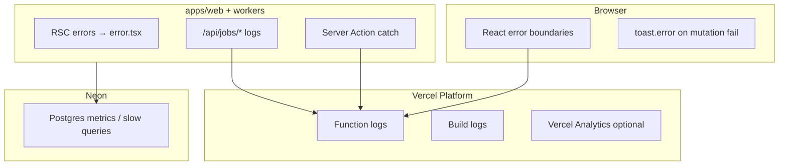

# Observability Plan — Pulse MVP

**Тип:** PRD  
**Статус:** Canonical  
**Версия:** 1.0  
**Дата:** 2026-05-23  
**Волна:** W12  
**Зависит от:** [`backend_requirements.md`](../05_runtime/backend_requirements.md)  
**Связанные документы:** [`cron_jobs_registry.md`](./cron_jobs_registry.md), [`migration_runbook.md`](./migration_runbook.md)

---

## Purpose

План **наблюдаемости** Pulse MVP: что логировать, как обнаруживать ошибки, минимальные метрики для Vercel + Neon, расширение post-MVP (email jobs, Sentry). Баланс между ops-реальностью MVP и guardrails для AI-агентов.

**Аудитория:** разработчики P01–P14, on-call (когда появится), AI-агенты при добавлении error boundaries и job handlers.

---

## Scope / Out of scope

**In scope:** Vercel logs, Next.js error boundaries, structured server logging conventions, Neon health signals, post-MVP job/delivery observability, PII redaction rules.

**Out of scope:** Full APM vendor selection ADR, custom metrics dashboard build, AWS CloudWatch (deferred), detailed Sentry setup YAML (integrate when adopted in P14+).

---

## Observability layers

| Layer | MVP | Post-MVP |
|-------|-----|----------|
| Vercel function logs | ✅ | ✅ |
| `error.tsx` / `global-error.tsx` | ✅ per route group | ✅ |
| Sentry (or equivalent) | SHOULD P14 | ✅ |
| Custom metrics | ❌ | MAY |
| Email delivery audit | ❌ runtime | ✅ `delivery_log` |
| Cron run audit | ❌ | ✅ `job_execution` |

---

## Logging conventions

### Server (apps/web, apps/workers)

**MUST** log structured JSON or prefixed lines:

| Field | Include | Example |
|-------|---------|---------|
| `level` | ✅ | `error`, `warn`, `info` |
| `message` | ✅ | Short action description |
| `requestId` | SHOULD | Vercel `x-vercel-id` when available |
| `userId` | MAY | UUID only — no email in info logs |
| `route` | SHOULD | `/api/jobs/email` |
| `jobType` | post-MVP | `booking_confirmed` |
| `idempotencyKey` | post-MVP | `booking_confirmed:{id}` |

**MUST NOT** log:

- Passwords, `AUTH_SECRET`, API keys
- Full email bodies or reset tokens
- bcrypt hashes

**SHOULD** mask emails in warn/error: `c***@pulse.dev`.

### Client

- User-visible errors via `@/lib/messages` + `toast.error` (ui-toast-mutations).
- **MUST NOT** `console.log` PII in production client bundles.

---

## Error handling surfaces

| Surface | File pattern | User sees |
|---------|--------------|-----------|
| Route segment error | `error.tsx` | Retry CTA + friendly copy |
| Global fatal | `global-error.tsx` | Generic failure |
| Not found | `not-found.tsx` | Zero Dead Ends navigation |
| Forbidden | dedicated UI or redirect | 403 message per ui_states_contract |
| Mutation failure | toast.error | Rollback optimistic UI |

Aligns with [`ui_states_contract.md`](../../design/ui_states_contract.md).

---

## Happy paths

1. **Deploy smoke:** Vercel build succeeds; no Prisma init errors in function logs.
2. **Runtime read:** Catalog page loads; no unhandled RSC throw in logs.
3. **Mutation fail:** Policy deny → structured warn log + user toast; no 500.
4. **Post-MVP job:** Cron completes → `job_execution.status=completed`; `delivery_log` row for each send.

---

## Negative paths

| Scenario | Detection | Response |
|----------|-----------|----------|
| Unhandled exception in Action | Vercel 500 + stack in logs | Fix + deploy; user sees toast/error boundary |
| Neon connection timeout | Prisma P1001 in logs | Retry transient; show error.tsx on reads |
| Missing env var at boot | Build/runtime fail fast | Vercel env audit |
| Prisma schema drift | Runtime query errors post-deploy | migrate deploy checklist |
| Resend API failure (P15) | `delivery_log.status=failed` | Retry policy in cron_jobs_registry |
| Log volume spike | Vercel log rate | Reduce debug logging in prod |

---

## Security paths

| Scenario | Mitigation |
|----------|------------|
| Stack traces to client | `NODE_ENV=production` — generic messages only |
| Secrets in build logs | Never echo env in CI scripts |
| Job endpoint enumeration | 401 without cron secret — minimal error body |
| Audit log tampering | `audit_log` append-only via domain (admin actions) |

---

## Concurrency & races

- Duplicate error reports from double-submit: acceptable; correlate by `requestId`.
- Post-MVP overlapping Cron ([**FM-011**](../02_domain_model/failure_modes_catalog.md#fm-011)): log `skipped_idempotent` at info level when send skipped.

---

## Drift risks & guards

| Risk | Guard |
|------|-------|
| Silent mutation failures (no toast) | ui-toast-mutations rule + P14 smoke |
| Email sent but no delivery_log (P15) | Contract test + FM-011 check |
| Debug `console.log` left in Actions | ESLint / review |
| Lampto Netlify log patterns | Vercel dashboard only for MVP |

---

## Metrics & alerts (MVP minimum)

| Signal | Source | MVP action |
|--------|--------|------------|
| Deploy failure | Vercel | Fix before merge to main |
| 5xx rate spike | Vercel logs filter | Investigate last deploy |
| DB connectivity | Neon dashboard | Check pool limits |
| Cron miss (P15) | Vercel Cron history | Alert when jobs enabled |

**SHOULD (P14):** integrate error tracking (e.g. Sentry) for unhandled server exceptions with release tagging.

---

## Post-MVP job observability

When P15 enables email ([`email_notifications_contract.md`](../../implementation/mvp/contracts/email_notifications_contract.md)):

| Query | Purpose |
|-------|---------|
| `delivery_log WHERE status='failed' AND created_at > now()-24h` | Failed sends |
| `job_execution WHERE status='pending' AND created_at < now()-1h` | Stuck queue |
| Count by `job_type` | Volume sanity |

Retry policy — [`cron_jobs_registry.md`](./cron_jobs_registry.md).

---

## Requirements

1. **MUST** — all user mutations surface failure via toast or inline error (not silent).
2. **MUST** — production logs exclude secrets and minimize PII.
3. **MUST** — `error.tsx` for async route segments with data fetching.
4. **SHOULD** — correlate job logs with `idempotency_key` post-MVP.
5. **MAY** — Vercel Analytics for Web Vitals (P14 alignment).

---

## Acceptance criteria

- [ ] Logging conventions table with PII rules
- [ ] Error surface matrix links ui_states_contract
- [ ] MVP vs post-MVP observability split
- [ ] FM-011 logging note for Cron skip
- [ ] Negative path for DB/Prisma failures
- [ ] Link from backend_requirements backlink updated

---

## Related documents

| Document | Relationship |
|----------|--------------|
| [`backend_requirements.md`](../05_runtime/backend_requirements.md) | Runtime contours |
| [`cron_jobs_registry.md`](./cron_jobs_registry.md) | Job retry + audit |
| [`email_notifications_contract.md`](../../implementation/mvp/contracts/email_notifications_contract.md) | delivery_log |
| [`ui_states_contract.md`](../../design/ui_states_contract.md) | Error UX |
| [`P14_phase_description.md`](../../implementation/mvp/phases_tasks_descriptions/P14_phase_description.md) | Hardening/a11y |
| [`../06_operations/README.md`](./README.md) | Ops index |

**Registry:** [`documentation_creation_registry.md`](../../meta/documentation_creation_registry.md) — wave W12-03

---

## Agent notes

- Do not add heavy APM SDK in P01 scaffold — start with Vercel logs + error boundaries.
- When adding `/api/jobs/*`, log start/end with job id and idempotency key only.
- grep production code for `console.log(email` before merge.

---

## Change log

| Date | Change |
|------|--------|
| 2026-05-23 | v1.0 — MVP observability plan |
