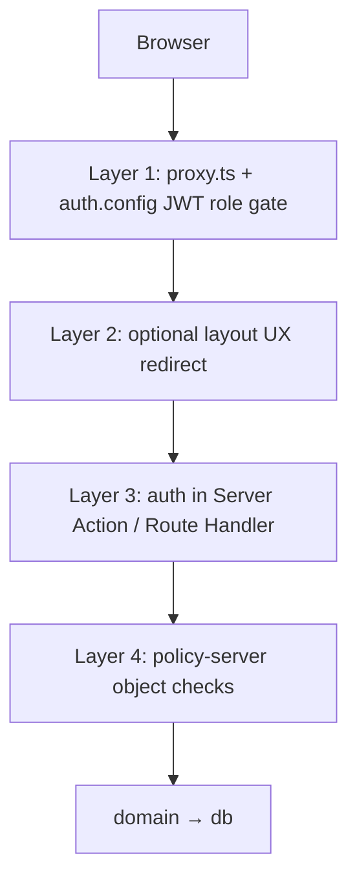

# ADR-003: Auth — Credentials, JWT Sessions, RBAC

**Тип:** ADR  
**Статус:** ACCEPTED  
**Версия:** 1.0  
**Дата:** 2026-05-23  
**Волна:** W4  
**Зависит от:** [`adr_001_stack_and_runtime.md`](./adr_001_stack_and_runtime.md), [`adr_002_next162_vercel_runtime_policy.md`](./adr_002_next162_vercel_runtime_policy.md), [`domain_invariants.md`](../02_domain_model/domain_invariants.md)  
**Связанные документы:** [`adr_index.md`](./adr_index.md), [`database_schema_v1.md`](../03_data_model/database_schema_v1.md), [`mvp_scope.md`](../01_product_scope/mvp_scope.md)

---

## Purpose

Зафиксировать **MVP-модель аутентификации и RBAC** Pulse: Auth.js v5, Credentials (email + password), JWT-сессии, роль в token, четырёхслойная защита маршрутов с **`proxy.ts`**. Читают backend-разработчики и AI-агенты перед P01 auth scaffold.

---

## Scope / Out of scope

**In scope:** провайдер Credentials, JWT `session.strategy`, роли `client` | `trainer` | `admin`, split `auth.config.ts` / `auth.ts`, perimeter в `proxy.ts`, типизация session → policy.

**Out of scope:** OAuth Google (post-MVP), password reset email flow (schema-ready, UX post-MVP), полная authorization matrix (→ W5), детали каждого use-case регистрации (→ W8/W9 specs).

---

## Definitions

| Term | Definition |
|------|------------|
| `UserRole` | `client` \| `trainer` \| `admin` — из `@pulse/domain` |
| `PolicySessionContext` | Тип для `@pulse/policy-server`; не `next-auth` `Session` в packages |
| Layer 1 | `proxy.ts` — JWT gate, без Prisma |
| Layer 3 | `auth()` в Server Actions / Route Handlers |

---

## Context

Pulse MVP ([`mvp_scope.md`](../01_product_scope/mvp_scope.md)) требует email/password без OAuth. ADR-001 выбрал Auth.js v5 + Credentials; ADR-002 — **`proxy.ts`** (Node runtime), запрет Prisma в interception layer. Domain invariant **PKG-02** запрещает `@pulse/policy-server` в `proxy.ts`.

Auth.js v5 (Context7 `/websites/authjs_dev`, verified 2026-05-23):

- Credentials `authorize()` возвращает user object или `null` при invalid credentials.
- JWT strategy: `session: { strategy: "jwt" }` с `jwt` / `session` callbacks для persistence `role`.
- Split config: `auth.config.ts` (edge-safe) + `auth.ts` (PrismaAdapter, bcrypt, full callbacks) — pattern из migration guide v5.

Три роли определяют route groups `/client/*`, `/trainer/*`, `/admin/*` ([`canonical_routes.md`](../../design/canonical_routes.md)).

---

## Decision

### 1. Provider & credentials storage

| Policy | Value |
|--------|-------|
| MVP provider | **Credentials only** (email + password) |
| Password storage | `User.passwordHash` — **bcrypt** (cost factor ≥ 10) |
| Registration | Server Action; role from registration tile; trainer → `trainer_profile.status = pending` |
| OAuth Google | **Post-MVP** — не добавлять provider без нового ADR |

### 2. Session strategy

| Policy | Value |
|--------|-------|
| Strategy | **`jwt`** — не database sessions для MVP |
| Adapter | `@auth/prisma-adapter` в `auth.ts` для User linkage; session data в JWT |
| Role in token | `jwt` callback: `if (user) token.role = user.role`; `session` callback: `session.user.role = token.role` |
| Env | `AUTH_SECRET`, `AUTH_URL` (Vercel) |

Context7 verified pattern:

```typescript
// auth.ts (server only)
export const { auth, handlers, signIn, signOut } = NextAuth({
  adapter: PrismaAdapter(prisma),
  session: { strategy: "jwt" },
  ...authConfig,
});
```

### 3. Split configuration (mandatory)

| File | Imports allowed | Used by |
|------|-----------------|---------|
| `auth.config.ts` | Providers, JWT/session callbacks (no DB) | `proxy.ts`, `auth.ts` |
| `auth.ts` | Prisma, bcrypt, `authorize()`, full NextAuth | Server Actions, RSC, Route Handlers |

**MUST NOT** import `auth.ts` (full) from `proxy.ts`.

### 4. Defense in depth (four layers)



| Layer | Responsibility |
|-------|----------------|
| **1 — `proxy.ts`** | Unauthenticated → `/auth/login`; wrong role → role home or 403 route |
| **2 — layouts** | Optional UX (hide nav items); **not** sole security |
| **3 — handlers** | **MUST** call `auth()` on every mutation and protected read |
| **4 — policy-server** | IDOR, ownership, trainer/admin object rules |

`proxy.ts` matcher (minimum): `/client/:path*`, `/trainer/:path*`, `/admin/:path*`.

Context7 Next.js 16.2 (`/vercel/next.js/v16.2.2`): export **`function proxy`**, not `middleware`; runtime **nodejs**.

### 5. RBAC model (MVP)

| Role | Route prefix | Registration |
|------|--------------|--------------|
| `client` | `/client/*` | Default tile |
| `trainer` | `/trainer/*` | `/auth/register/trainer` |
| `admin` | `/admin/*` | Seed / manual only on MVP |

**MUST NOT** allow client self-assign `admin` role. Role change only via admin tooling or seed (post-MVP admin user management).

### 6. Session typing & policy boundary

- Auth.js module augmentation (`Session.user.role`, `User.role`) — **only** `apps/web`.
- Before `@pulse/policy-server`: map session → **`PolicySessionContext`** ([`typescript-monorepo-types.mdc`](../../../.cursor/rules/typescript-monorepo-types.mdc)).
- **Forbidden in `packages/**`:** `import type { Session } from "next-auth"`.

### 7. Password reset (MVP boundary)

| MVP | Post-MVP |
|-----|----------|
| Table `password_reset_token` in DDL | ✅ |
| Public forgot-password UI + Resend | ❌ |
| E-09 email | ❌ |

Dev password change: seed / admin — not email flow.

---

## Rationale / Consequences

**Positive:**

- JWT in `proxy.ts` без Prisma — совместимо с ADR-002 Node proxy.
- Credentials — минимальная зависимость для launch; OAuth отложен без schema churn.
- Четырёхслойная модель согласована с lampto, адаптирована под Pulse routes.

**Trade-offs:**

- JWT revocation — только short TTL + logout; no instant global revoke without blocklist (acceptable MVP).
- Split config — два файла для поддержки; обязательно для Next 16 proxy.

**Downstream:**

- W5: `authorization_matrix.md`, `auth_runtime_spec.md`
- W8: `authorization_policy_contract.md`

---

## Rejected alternatives

| Alternative | Why rejected |
|-------------|--------------|
| Database sessions | JWT + proxy gate проще без session table reads на каждый request в interception |
| OAuth-only (Google) | MVP spec + offline admin seed; adds Google Cloud dependency |
| Single `auth.ts` in proxy | Prisma/bcrypt in proxy forbidden by ADR-002 performance & boundary |
| Role only in DB, not JWT | Extra DB read in proxy; violates Layer 1 design |
| Supabase Auth | ADR-001 — Auth.js v5 required |
| Edge `middleware.ts` as canon | ADR-002 — `proxy.ts` + nodejs |

---

## Security paths

| Threat | Mitigation |
|--------|------------|
| Invalid credentials | `authorize()` → `null`; generic error message (no user enumeration) |
| Role escalation via form tampering | Role set server-side on registration; never trust client POST for `admin` |
| IDOR on bookings/profiles | Layer 4 policy-server — not proxy alone |
| JWT tampering | `AUTH_SECRET`; Auth.js signed JWT |
| Missing `auth()` on mutation | Code review + W8 contract tests |
| Session in packages | ESLint boundary PKG-01/PKG-03 |

---

## Concurrency & races

- Double registration same email: UNIQUE on `user.email` → second request fails cleanly.
- Parallel login: idempotent; last JWT wins per device — acceptable MVP.

---

## Drift risks & guards

| Risk | Guard |
|------|-------|
| New logic in `middleware.ts` | ADR-002 checklist; codemod to `proxy.ts` |
| `Session` type in packages | typecheck + typescript-monorepo-types rule |
| Password reset shipped on MVP | grep Resend + reset routes; [`FM-020`](../02_domain_model/failure_modes_catalog.md#fm-020) scope |
| auth guideline says reset on MVP | Guideline subordinate to this ADR + `mvp_scope.md` |

---

## Acceptance criteria

- [ ] Credentials + JWT + role callbacks documented with Context7 reference
- [ ] Four-layer model and split config explicit
- [ ] MVP excludes OAuth and password-reset email
- [ ] Links to ADR-001/002 and domain PKG-02
- [ ] Security paths include role escalation and IDOR layering
- [ ] `adr_index.md` updated to ACCEPTED

---

## Related documents

| Document | Relationship |
|----------|--------------|
| [`adr_001_stack_and_runtime.md`](./adr_001_stack_and_runtime.md) | Stack choice Auth.js |
| [`adr_002_next162_vercel_runtime_policy.md`](./adr_002_next162_vercel_runtime_policy.md) | proxy.ts canon |
| [`domain_invariants.md`](../02_domain_model/domain_invariants.md) | PKG-02, PKG-03 |
| [`mvp_scope.md`](../01_product_scope/mvp_scope.md) | MVP auth MUST |
| [`ai_auth_implementation_guide.md`](../../guidelines/auth/ai_auth_implementation_guide.md) | Implementation guide |
| [`../04_authorization_privacy/authorization_matrix.md`](../04_authorization_privacy/authorization_matrix.md) | W5 runtime spec |
| [`../04_authorization_privacy/policy_enforcement_contract.md`](../04_authorization_privacy/policy_enforcement_contract.md) | Enforcement layers |
| [`../05_runtime/auth_runtime_spec.md`](../05_runtime/auth_runtime_spec.md) | W5 runtime spec |
| [`../../implementation/mvp/contracts/authorization_policy_contract.md`](../../implementation/mvp/contracts/authorization_policy_contract.md) | W8 |

**Registry:** [`documentation_creation_registry.md`](../../meta/documentation_creation_registry.md) — wave W4-01

---

## Agent notes

- Context7: `/websites/authjs_dev` — Credentials authorize, JWT callbacks, split auth.config.
- Context7: `/vercel/next.js/v16.2.2` — `export function proxy`, not middleware.
- Do not implement Google provider «for later» in P01 without ADR amendment.
- Trainer registration **MUST** create `trainer_profile` with `status = pending` in same transaction as User.

---

## Change log

| Date | Change |
|------|--------|
| 2026-05-23 | v1.0 — ACCEPTED; Credentials JWT RBAC + four-layer model |
