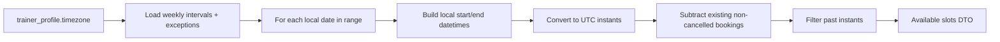

# ADR-004: Timezone & Scheduling Model

**Тип:** ADR  
**Статус:** ACCEPTED  
**Версия:** 1.0  
**Дата:** 2026-05-23  
**Волна:** W4  
**Зависит от:** [`domain_invariants.md`](../02_domain_model/domain_invariants.md), [`lifecycle_models.md`](../02_domain_model/lifecycle_models.md), [`database_schema_v1.md`](../03_data_model/database_schema_v1.md)  
**Связанные документы:** [`adr_index.md`](./adr_index.md), [`failure_modes_catalog.md`](../02_domain_model/failure_modes_catalog.md)

---

## Purpose

Зафиксировать **модель времени и расписания** Pulse: IANA timezone тренера как единственный источник истины для слотов, хранение `timestamptz` в UTC, правила отображения клиенту. Предотвращает класс багов [`FM-009`](../02_domain_model/failure_modes_catalog.md#fm-009).

---

## Scope / Out of scope

**In scope:** `TrainerProfile.timezone`, weekly intervals, schedule exceptions, slot generation, booking `starts_at`, display rules, domain library choice.

**Out of scope:** post-MVP reminder cron TZ details (→ ADR-006 + email matrix), client profile timezone preference (post-MVP), DST edge-case test suite location (→ W8 contract).

---

## Definitions

| Term | Definition |
|------|------------|
| **Trainer local time** | Wall-clock in `trainer_profile.timezone` (IANA, e.g. `Europe/Moscow`) |
| **Instant** | Absolute moment — stored as `timestamptz` UTC in PostgreSQL |
| **Slot** | Bookable interval `[starts_at, starts_at + duration)` in UTC |
| **ISO weekday** | `day_of_week` 0 = Monday … 6 = Sunday (schema convention) |

---

## Context

Domain invariant **INV-01**: `TrainerProfile.timezone` — единственный источник истины для weekly schedule, slot generation, reminders (post-MVP), display клиенту. Schema ([`database_schema_v1.md`](../03_data_model/database_schema_v1.md) §0.2, §4.1):

- `trainer_weekly_interval.start_time` / `end_time` — **local** `time` без TZ suffix.
- `booking.starts_at` — **`timestamptz`** (UTC storage).
- Vercel/server default TZ (**UTC**) **MUST NOT** использоваться для бизнес-логики слотов.

[`lifecycle_models.md`](../02_domain_model/lifecycle_models.md) defines `GenerateAvailableSlots` as pure domain + TZ library.

---

## Decision

### 1. Source of truth

| Data | Canonical TZ | Storage |
|------|--------------|---------|
| Weekly schedule | Trainer IANA | Local `time` + profile timezone |
| Schedule exceptions | Trainer local **date** | `date` column |
| Booking start | Trainer slot selection → instant | `timestamptz` UTC |
| Reminder E-07 (post-MVP) | Trainer TZ for T-24h window | Computed from `starts_at` + profile |

**MUST** validate timezone string on profile save (valid IANA via allowlist or `Intl` / TZ DB lookup in domain).

### 2. Slot generation algorithm (conceptual)

**MUST:**

1. Generate candidate slots in **trainer local calendar**.
2. Convert each slot start to UTC before persistence/compare.
3. Exclude intervals overlapping non-`cancelled` bookings ([`FM-001`](../02_domain_model/failure_modes_catalog.md#fm-001)).
4. Exclude past slots (`starts_at <= now()`).

**MUST NOT:** add server TZ offset to local times; use proper TZ library conversion.

### 3. Domain library

| Policy | Value |
|--------|-------|
| Location | `@pulse/domain` scheduling module only |
| Library | **`@js-temporal/polyfill`** or **`date-fns-tz`** — pick one at scaffold; **MUST NOT** mix two in same flow |
| Recommendation | **Temporal** for explicit `ZonedDateTime` semantics (agent chooses at P03 with ADR note in contract) |

Apps/web **MUST NOT** embed TZ math — call domain `GenerateAvailableSlots` / formatters.

### 4. Display rules (UX)

| Surface | Display TZ | Notes |
|---------|------------|-------|
| Trainer schedule editor | Trainer local | Labels «Your time (Europe/Moscow)» |
| Client slot picker on trainer profile | **Trainer local** + optional hint «Times in trainer's timezone» | Avoid client assuming own TZ silently |
| Client booking list `/client/bookings` | **Client device local** (browser `Intl`) | Show trainer TZ abbreviation in detail |
| Admin views | UTC or trainer local (explicit toggle post-MVP); MVP: trainer local in detail |

**SHOULD** store only UTC in DB; never store «floating» local timestamps for bookings.

### 5. Booking write path

On `CreateBooking`:

1. Client selects slot from DTO where `starts_at` is already UTC instant from domain.
2. **MUST** re-validate slot still available in transaction (overlap check).
3. **MUST NOT** accept raw local datetime string from client without server-side TZ context.

### 6. Profile timezone changes

| Policy | Value |
|--------|-------|
| MVP | Allow trainer to change timezone in profile settings |
| Effect | Future slot generation uses new TZ; **existing** `booking.starts_at` unchanged (absolute instants) |
| **SHOULD** | Warn trainer that change affects displayed schedule, not past bookings |

---

## Rationale / Consequences

**Positive:**

- Single invariant INV-01 traceable from ADR → schema → domain → contract.
- UTC storage enables correct overlap detection and global scaling.

**Trade-offs:**

- Client UX requires explicit «trainer timezone» copy — W7 microcopy.
- DST transitions: weekly `time` + IANA rules handled by library; **MUST** unit-test spring forward / fall back for one TZ.

**Downstream:** W8 `schedule_slots_contract.md`, W9 `trainer_schedule_spec.md`, `booking_wizard_spec.md`.

---

## Rejected alternatives

| Alternative | Why rejected |
|-------------|--------------|
| Store bookings in trainer local without TZ | Ambiguous on DST; breaks overlap with UTC |
| Server (Vercel) UTC for slot math | Violates INV-01 / FM-009 |
| Client sends timezone per request | Spoofable; trainer profile is canon |
| Separate `schedule_timezone` column | Duplicates profile; drift risk |
| Integer offset instead of IANA | DST incorrect |

---

## Security paths

| Scenario | Response |
|----------|----------|
| Tampered `starts_at` in POST | Server recomputes from allowed slot list; reject if not in generated set |
| Book slot in past | Domain deny |

Timezone choice is not a security boundary; validation prevents logic bypass.

---

## Concurrency & races

- Two clients same slot → transaction + overlap — [`FM-001`](../02_domain_model/failure_modes_catalog.md#fm-001).
- Trainer edits weekly schedule while client books → booking transaction uses current rules; losing race returns error + UI refresh.

Prisma: overlap SELECT inside `$transaction` (Context7 `/websites/prisma_io` interactive transactions).

---

## Drift risks & guards

| Risk | Detection | Prevention |
|------|-----------|------------|
| FM-009 UTC bug | Golden fixture tests `Europe/Moscow` vs `America/New_York` | CI in `@pulse/domain` |
| `new Date()` local in server slot code | ESLint ban in apps for slot generation | Logic only in domain |
| Schema vs domain weekday convention | Document 0=Monday in both | Shared constant in `@pulse/domain` |
| Display without TZ label | UX review W7 | Copy contract |

---

## Acceptance criteria

- [ ] INV-01 referenced as governing invariant
- [ ] Local weekly times + UTC instants documented
- [ ] Display rules for trainer vs client surfaces
- [ ] FM-001 and FM-009 linked
- [ ] Rejected alternatives include server UTC approach
- [ ] Library lives in `@pulse/domain` only

---

## Related documents

| Document | Relationship |
|----------|--------------|
| [`domain_invariants.md`](../02_domain_model/domain_invariants.md) | INV-01, INV-02 |
| [`lifecycle_models.md`](../02_domain_model/lifecycle_models.md) | Schedule derived state |
| [`database_schema_v1.md`](../03_data_model/database_schema_v1.md) | DDL §4, §5 |
| [`failure_modes_catalog.md`](../02_domain_model/failure_modes_catalog.md) | FM-001, FM-009 |
| [`../../implementation/mvp/contracts/schedule_slots_contract.md`](../../implementation/mvp/contracts/schedule_slots_contract.md) | W8 |
| *(planned)* [`adr_006_idempotent_email_delivery.md`](./adr_006_idempotent_email_delivery.md) | Reminder TZ |

**Registry:** [`documentation_creation_registry.md`](../../meta/documentation_creation_registry.md) — wave W4-02

---

## Agent notes

- Never use `process.env.TZ` or Vercel region for business scheduling.
- `trainer_schedule_exception.date` is **local calendar date** in trainer TZ, not UTC date.
- When implementing, add at least one DST transition fixture per chosen TZ library.

---

## Change log

| Date | Change |
|------|--------|
| 2026-05-23 | v1.0 — ACCEPTED; IANA trainer TZ + UTC instants |
