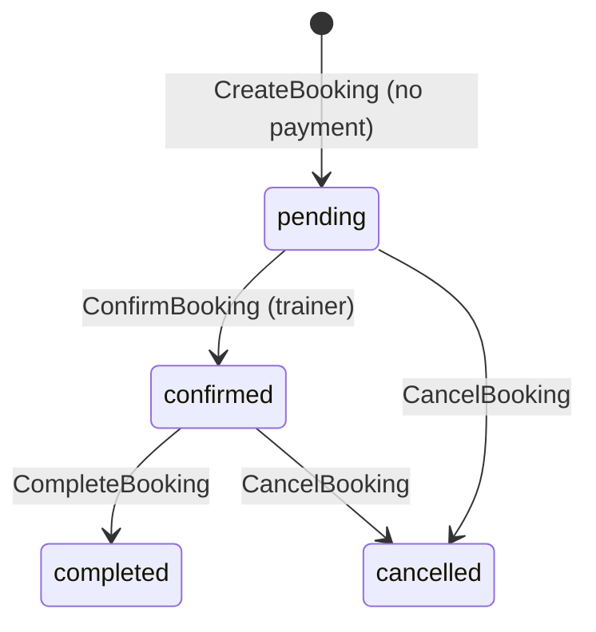

# ADR-005: MVP Booking Without Payment

**Тип:** ADR  
**Статус:** ACCEPTED  
**Версия:** 1.0  
**Дата:** 2026-05-23  
**Волна:** W4  
**Зависит от:** [`lifecycle_models.md`](../02_domain_model/lifecycle_models.md), [`mvp_scope.md`](../01_product_scope/mvp_scope.md), [`domain_invariants.md`](../02_domain_model/domain_invariants.md)  
**Связанные документы:** [`adr_index.md`](./adr_index.md), [`post_mvp_deferrals.md`](../01_product_scope/post_mvp_deferrals.md), [`database_schema_v1.md`](../03_data_model/database_schema_v1.md)

---

## Purpose

Зафиксировать продуктово-техническое решение: **MVP-бронирование без онлайн-оплаты** — клиент резервирует слот, booking создаётся в `pending`, тренер подтверждает вручную; Stripe и payment intents **не** участвуют в MVP runtime.

---

## Scope / Out of scope

**In scope:** create-booking flow, initial status, price snapshot, trainer confirm/complete, post-MVP payment boundary, UX copy implications.

**Out of scope:** Stripe Connect integration (post-MVP), refund automation via Stripe API (MVP admin manual), video session room creation.

---

## Definitions

| Term | MVP meaning |
|------|-------------|
| **Booking confirmed (product copy)** | Often means «запись создана» (`pending`) — см. Agent notes |
| **Payment** | Online charge at booking time — **absent** on MVP |
| **Service snapshot** | Copied `name`, `duration_minutes`, `price_cents`, `currency` on booking row |

---

## Context

[`mvp_scope.md`](../01_product_scope/mvp_scope.md) explicitly excludes Stripe Connect and payment UI. Schema includes nullable `stripe_payment_intent_id`, `stripe_refund_id` for post-MVP ([`post_mvp_deferrals.md`](../01_product_scope/post_mvp_deferrals.md), **INV-14**).

[`lifecycle_models.md`](../02_domain_model/lifecycle_models.md) booking SM:

- Create → **`pending`** (no payment gate)
- Trainer → **`confirmed`**
- Trainer → **`completed`** → review

User flow: 3-step wizard Service → Time → Confirm; toast + redirect after create.

---

## Decision

### 1. Booking creation (MVP)

| Step | Behavior |
|------|----------|
| Preconditions | Trainer `approved`; service `is_active`; slot free |
| Payment step | **None** — wizard ends at Confirm |
| Initial status | **`pending`** always |
| Side effects | Snapshot service fields (**INV-07**); overlap check (**INV-06**); audit log |
| UX | `toast.success` + redirect `/client/bookings/[id]` — **in-app**, not email E-06 |

**MUST NOT** on MVP:

- Create Stripe PaymentIntent / Checkout Session
- Block booking on payment failure
- Set status `confirmed` automatically on create
- Write `stripe_*` columns

### 2. Price & duration

| Policy | Value |
|--------|-------|
| Display price | From `trainer_service` at browse time |
| Persisted price | **Snapshot** on booking at create — historical truth |
| Currency | From service; MVP default `USD` in schema |
| Income / trainer dashboard | Show snapshot amounts; **no payout** integration |

Price is **informational** on MVP — no money movement.

### 3. Trainer confirmation workflow

**MUST** — trainer **ConfirmBooking** action on MVP (no auto-confirm).

**MAY** (future ADR) — auto-confirm if product changes; not MVP.

### 4. Cancellation & refunds (MVP)

| Actor | Rule |
|-------|------|
| Client | Cancel if > 24h before `starts_at` — **INV-08**, [`FM-002`](../02_domain_model/failure_modes_catalog.md#fm-002) |
| Trainer / Admin | Broader cancel per lifecycle |
| Refund | **`refund_request`** manual admin workflow — no Stripe API |

### 5. Post-MVP payment integration (reserved)

When Stripe ships (new ADR amendment):

1. Payment **MAY** gate transition `pending` → `confirmed` or create paid-then-pending flow.
2. Use existing nullable columns; backfill not required for old rows.
3. **MUST NOT** break MVP bookings without `stripe_payment_intent_id`.

Until then columns remain **NULL**.

### 6. Session / video placeholder

Route `/sessions/[sessionId]` — placeholder per MVP scope. **MUST NOT** create Daily.co rooms on booking create. Nullable `daily_room_*` dormant.

---

## Rationale / Consequences

**Positive:**

- Fastest path to marketplace validation without payment compliance scope.
- Lifecycle and schema already model manual trainer confirm — aligns with trust-based MVP.
- Snapshot rule protects history when trainer changes service price.

**Trade-offs:**

- No-show / payment dispute handling manual — admin complaints/refunds only.
- Product copy «Booking confirmed» vs status `pending` — must align in W7 microcopy.

**Downstream:** W8 `booking_lifecycle_contract.md`, W9 `booking_wizard_spec.md`.

---

## Rejected alternatives

| Alternative | Why rejected |
|-------------|--------------|
| Stripe on MVP | Explicitly out of [`mvp_scope.md`](../01_product_scope/mvp_scope.md) |
| Auto-confirm on create | Removes trainer acceptance step; changes moderation model |
| `confirmed` without payment flag column | Would confuse lifecycle; use `pending` + confirm action |
| Cash payment field on MVP | No schema/product requirement; defer |
| Skip price snapshot | Violates INV-07 |

---

## Security paths

| Scenario | Mitigation |
|----------|------------|
| Book unapproved trainer | Deny — [`FM-003`](../02_domain_model/failure_modes_catalog.md#fm-003) |
| Client manipulates `price_cents` in POST | Server snapshots from DB service row |
| Free booking spam | Rate limits post-MVP; MVP: policy + audit |

Payment fraud N/A on MVP (no charges).

---

## Concurrency & races

- Double book same slot — [`FM-001`](../02_domain_model/failure_modes_catalog.md#fm-001): transaction + overlap.
- Confirm vs cancel race — last transaction wins; other actor gets domain error.

---

## Drift risks & guards

| Risk | Guard |
|------|-------|
| Stripe UI appears on wizard | PR review; grep `stripe` in apps/web |
| Auto-confirm sneaked in | Lifecycle tests require trainer action |
| INV-14 violation | No payment routes in `canonical_routes.md` MVP set |
| Copy says «paid» | W7 content contract |

---

## Acceptance criteria

- [ ] MVP create → `pending` without payment documented
- [ ] Snapshot and confirm workflow linked to lifecycle
- [ ] Post-MVP Stripe boundary explicit (nullable columns)
- [ ] FM-001, FM-002, FM-003 referenced
- [ ] Rejects Stripe-on-MVP alternative
- [ ] Aligns with `mvp_scope.md` MUST NOT list

---

## Related documents

| Document | Relationship |
|----------|--------------|
| [`mvp_scope.md`](../01_product_scope/mvp_scope.md) | MVP booking scope |
| [`lifecycle_models.md`](../02_domain_model/lifecycle_models.md) | Booking SM |
| [`domain_invariants.md`](../02_domain_model/domain_invariants.md) | INV-06–08, INV-14 |
| [`post_mvp_deferrals.md`](../01_product_scope/post_mvp_deferrals.md) | Stripe deferral |
| [`email_notifications_matrix.md`](../01_product_scope/email_notifications_matrix.md) | E-06 post-MVP |
| [`../../implementation/mvp/contracts/booking_lifecycle_contract.md`](../../implementation/mvp/contracts/booking_lifecycle_contract.md) | W8 |

**Registry:** [`documentation_creation_registry.md`](../../meta/documentation_creation_registry.md) — wave W4-03

---

## Agent notes

- Client flow toast «Booking confirmed» on MVP = **booking created** (`pending`), not trainer `confirmed` — fix copy in W7, not status hack.
- Do not add «Pay later» or invoice fields without PRD update.
- Wizard **Primary CTA** = Confirm booking — no second payment CTA.

---

## Change log

| Date | Change |
|------|--------|
| 2026-05-23 | v1.0 — ACCEPTED; no-payment MVP booking + manual confirm |
