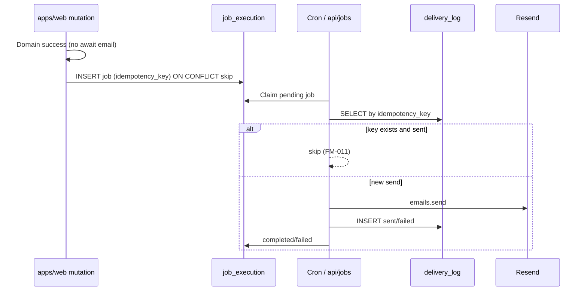

# ADR-006: Idempotent Email Delivery (Post-MVP Runtime)

**Тип:** ADR  
**Статус:** ACCEPTED  
**Версия:** 1.0  
**Дата:** 2026-05-23  
**Волна:** W4  
**Зависит от:** [`email_notifications_matrix.md`](../01_product_scope/email_notifications_matrix.md), [`domain_invariants.md`](../02_domain_model/domain_invariants.md), [`adr_001_stack_and_runtime.md`](./adr_001_stack_and_runtime.md)  
**Связанные документы:** [`adr_index.md`](./adr_index.md), [`mvp_scope.md`](../01_product_scope/mvp_scope.md), [`database_schema_v1.md`](../03_data_model/database_schema_v1.md)

---

## Purpose

Зафиксировать **архитектуру доставки транзакционных email после MVP**: асинхронные jobs, **уникальный `idempotency_key`**, таблицы `job_execution` + `delivery_log`, провайдер Resend, **запрет** отправки из request path. DDL готов на MVP; runtime — post-MVP ([**INV-12**](../02_domain_model/domain_invariants.md), [**FM-020**](../02_domain_model/failure_modes_catalog.md#fm-020)).

---

## Scope / Out of scope

**In scope:** job enqueue pattern, idempotency, retry, Cron overlap, Resend integration boundary, MVP vs post-MVP split.

**Out of scope:** email template HTML design, marketing newsletters, MVP in-app substitutes (already in email matrix), P06 phase tasks (W11).

---

## Definitions

| Term | Definition |
|------|------------|
| **Request path** | Server Action / Route Handler serving user HTTP request |
| **Jobs path** | Vercel Cron or `/api/jobs/*` worker routes |
| **idempotency_key** | Deterministic string; UNIQUE in `job_execution` and `delivery_log` |
| **E-xx** | Event IDs from [`email_notifications_matrix.md`](../01_product_scope/email_notifications_matrix.md) |

---

## Context

ADR-001: Resend + Vercel Cron for post-MVP email; `idempotency_key` + `delivery_log` on MVP **DDL only**. [`email_notifications_matrix.md`](../01_product_scope/email_notifications_matrix.md) catalogs E-01–E-09 with key patterns.

Invariants:

- **INV-12** — MVP **MUST NOT** write `delivery_log` or invoke Resend.
- **INV-13** — Post-MVP: each send **MUST** have UNIQUE `idempotency_key`.
- **FM-011** — duplicate cron retry **MUST** skip send if key exists.
- **FM-020** — MVP code sending email = scope violation.

ADR-002: **MUST NOT** use `unstable_after` for email — use Cron/jobs contour.

---

## Decision

### 1. MVP vs post-MVP boundary

| Layer | MVP | Post-MVP |
|-------|-----|----------|
| Tables `job_execution`, `delivery_log` | Migrate ✅ | Use ✅ |
| App writes to tables | ❌ | ✅ |
| Resend SDK / `RESEND_API_KEY` | ❌ | ✅ |
| Vercel Cron email jobs | ❌ | ✅ |
| In-app toast/banner | ✅ substitute | + email |

### 2. Two-table model

| Table | Role |
|-------|------|
| `job_execution` | Work queue metadata: `job_type`, `payload_json`, run status |
| `delivery_log` | Per-recipient delivery audit: `template_key`, `target`, `provider_message_id`, `status` |

**MUST** use **same deterministic `idempotency_key`** for job enqueue and delivery row (per E-xx pattern in matrix).

### 3. Idempotency key rules

| Requirement | Detail |
|-------------|--------|
| Deterministic | Same domain event → same key (e.g. `booking_confirmed:{bookingId}`) |
| UNIQUE | DB constraints on both tables |
| Cron overlap | Second run **MUST** no-op if `delivery_log` has `status = sent` for key |
| Partial failure | `failed` row **MAY** allow manual retry with new key suffix only via admin tool — default: same key blocks duplicate |

Examples — full table in [`email_notifications_matrix.md`](../01_product_scope/email_notifications_matrix.md).

### 4. Execution contour

| Component | Choice |
|-----------|--------|
| Scheduler | **Vercel Cron** (e.g. reminders E-07 every 15 min) |
| Worker | `apps/workers` or dedicated Route Handlers — **outside** user request |
| Provider | **Resend** ([ADR-001](./adr_001_stack_and_runtime.md)) |
| Enqueue trigger | After domain mutation success — **async** insert job row, not `await resend.send()` |

**MUST NOT:**

- Call Resend inside Server Action awaiting user response
- Send email synchronously on registration/booking confirm on MVP **or** post-MVP

### 5. Reminder job (E-07) timezone

When implemented, compute T-24h window using **`TrainerProfile.timezone`** ([ADR-004](./adr_004_timezone_scheduling_model.md)) relative to `booking.starts_at` UTC instant.

### 6. Password reset (E-09)

Post-MVP only with [`adr_003_auth_credentials_jwt_rbac.md`](./adr_003_auth_credentials_jwt_rbac.md) reset flow. Key: `reset:{tokenId}`.

### 7. Observability

- Log `job_type`, `idempotency_key`, `delivery_log.status` — mask email PII in logs.
- Failed sends: `delivery_log.status = failed` + `error`; retry policy in W12 ops runbook.

---

## Rationale / Consequences

**Positive:**

- Lampto-proven idempotency pattern adapted to Vercel Cron.
- Schema-ready MVP avoids migration shock when enabling email.
- Clear FM-020 guard for agents.

**Trade-offs:**

- Two tables vs single — clearer audit vs queue concerns.
- Empty tables on MVP may confuse — documented as expected.

**Downstream:** W8 `email_notifications_contract.md`, W11 P06 phase, W12 [`cron_jobs_registry.md`](../06_operations/cron_jobs_registry.md), [`cron_jobs_setup_guide.md`](../../implementation/mvp/guides/cron_jobs_setup_guide.md).

---

## Rejected alternatives

| Alternative | Why rejected |
|-------------|--------------|
| Send email in Server Action | Blocks UX; violates ADR-002 jobs policy |
| Resend on MVP «just E-06» | Violates [`mvp_scope.md`](../01_product_scope/mvp_scope.md) v1.1+ |
| No idempotency keys | FM-011 duplicate emails on retry |
| AWS SES on day one | ADR-001 — Resend for team size |
| `delivery_log` only (no job_execution) | Loses batch/cron run tracking |
| UUID random keys per retry | Breaks deduplication |

---

## Security paths

| Scenario | Mitigation |
|----------|------------|
| Job endpoint public | Cron secret / Vercel auth header; no public `/api/jobs` without auth |
| PII in `payload_json` | Minimize; prefer IDs; encrypt at rest if sensitive |
| Password reset token leak | Short TTL; single-use; E-09 template |
| Email to wrong user | Validate `user_id` from domain event, not client input |

---

## Concurrency & races

| Scenario | Resolution |
|----------|------------|
| Duplicate enqueue same event | UNIQUE on `job_execution.idempotency_key` — second INSERT fails → treat as success |
| Cron overlap same reminder | Check `delivery_log` before Resend — **FM-011** |
| Parallel workers same job | Claim pattern: UPDATE `job_execution` status `pending`→`running` WHERE id + status |

---

## Drift risks & guards

| Risk | Guard |
|------|-------|
| FM-020 MVP Resend | grep `resend`, `delivery_log.create` in CI |
| Interim docs say email MVP | `mvp_scope.md` wins |
| Missing key in new event | PR must update matrix + contract |
| Reminder in UTC not trainer TZ | ADR-004 cross-link |

---

## Acceptance criteria

- [ ] MVP explicitly forbids runtime email (INV-12, FM-020)
- [ ] idempotency_key UNIQUE on both tables documented
- [ ] Request path vs jobs path separated
- [ ] E-01–E-09 trace to email matrix
- [ ] Resend + Vercel Cron aligned with ADR-001
- [ ] FM-011 concurrency documented

---

## Related documents

| Document | Relationship |
|----------|--------------|
| [`adr_001_stack_and_runtime.md`](./adr_001_stack_and_runtime.md) | Resend, Cron, DDL |
| [`adr_004_timezone_scheduling_model.md`](./adr_004_timezone_scheduling_model.md) | E-07 TZ |
| [`email_notifications_matrix.md`](../01_product_scope/email_notifications_matrix.md) | Event catalog |
| [`domain_invariants.md`](../02_domain_model/domain_invariants.md) | INV-12, INV-13 |
| [`failure_modes_catalog.md`](../02_domain_model/failure_modes_catalog.md) | FM-011, FM-020 |
| [`../../implementation/mvp/contracts/email_notifications_contract.md`](../../implementation/mvp/contracts/email_notifications_contract.md) | W8 |

**Registry:** [`documentation_creation_registry.md`](../../meta/documentation_creation_registry.md) — wave W4-04

---

## Agent notes

- P06 in registry is post-MVP email phase — do not schedule Resend in P01–P05.
- MVP product feedback for E-06 = toast + redirect only.
- When enabling post-MVP, add `RESEND_API_KEY` to Vercel — not in MVP env templates.

---

## Change log

| Date | Change |
|------|--------|
| 2026-05-23 | v1.0 — ACCEPTED; idempotent jobs + delivery_log; MVP runtime off |
