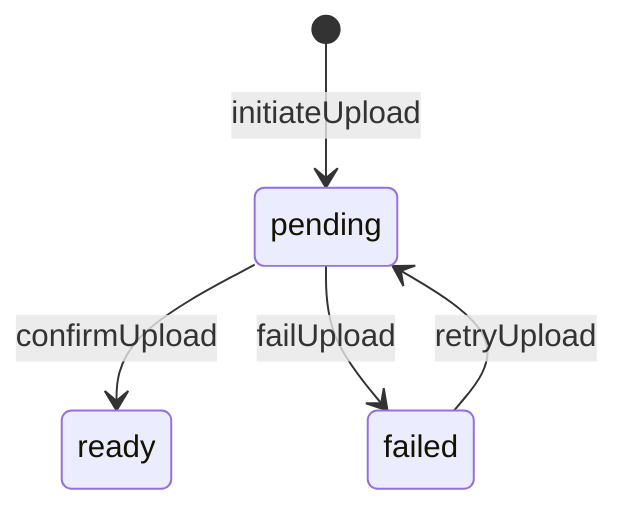

# ADR-007: File Asset & Vercel Blob Lifecycle

**Тип:** ADR  
**Статус:** ACCEPTED  
**Версия:** 1.0  
**Дата:** 2026-05-23  
**Волна:** W4  
**Зависит от:** [`adr_001_stack_and_runtime.md`](./adr_001_stack_and_runtime.md), [`lifecycle_models.md`](../02_domain_model/lifecycle_models.md), [`domain_invariants.md`](../02_domain_model/domain_invariants.md)  
**Связанные документы:** [`adr_index.md`](./adr_index.md), [`database_schema_v1.md`](../03_data_model/database_schema_v1.md), [`blob-upload-agent-instruction.md`](../../guidelines/nextjs/blob-upload-agent-instruction.md)

---

## Purpose

Зафиксировать **модель медиа-файлов Pulse**: единый реестр `file_asset`, хранение в **Vercel Blob**, lifecycle `pending` → `ready` → `failed`, политика привязки FK только после `ready`. Реализует **INV-11** и [`FM-012`](../02_domain_model/failure_modes_catalog.md#fm-012).

---

## Scope / Out of scope

**In scope:** profile photos, trainer certificates (public), verification documents (admin), upload auth, Blob pathname strategy, MVP cleanup.

**Out of scope:** image CDN transforms, virus scanning service (post-MVP hardening), S3 migration (would require new ADR).

---

## Definitions

| Term | Definition |
|------|------------|
| `FileAsset` | Prisma model / `file_asset` table — single registry |
| `blob_pathname` | Server-chosen canonical path in Blob store |
| `upload_status` | `pending` \| `ready` \| `failed` |
| Client upload | Browser → Blob via token from server |

---

## Context

ADR-001 selects **Vercel Blob** (not S3). Schema §9 defines `file_asset` with FKs from `trainer_certificate`, `verification_document`, profile `photo_url` pattern.

[`lifecycle_models.md`](../02_domain_model/lifecycle_models.md): File upload SM — **MUST NOT** attach verification docs until `ready`.

Context7 `/vercel/storage` (verified 2026-05-23): client upload via `@vercel/blob/client` `upload()` + server `handleUpload()` with `onBeforeGenerateToken` / `onUploadCompleted`; server-only `BLOB_READ_WRITE_TOKEN`.

---

## Decision

### 1. Single registry

**MUST** — all binary uploads flow through **`file_asset`** only.

**MUST NOT** — parallel tables, direct Blob URLs without row, or `photo_url` string without asset row for new uploads (legacy nullable `photo_url` on profile may hold derived URL from ready asset at MVP).

### 2. Lifecycle



| Phase | Action |
|-------|--------|
| **initiateUpload** | Server Action: `auth()` + policy → validate mime/size → INSERT `file_asset` `pending` + server `blob_pathname` |
| **client upload** | Browser `upload()` to Route Handler with `handleUpload` |
| **confirmUpload** | Server verifies Blob exists + size/mime → UPDATE `ready`, set `blob_url` |
| **failUpload** | Error/timeout → `failed` |
| **link FK** | Certificate / verification / profile — **only** when `ready` (**INV-11**) |

### 3. Vercel Blob integration

| Policy | Value |
|--------|-------|
| SDK | `@vercel/blob` + `@vercel/blob/client` |
| Env | `BLOB_READ_WRITE_TOKEN` — **server-only**, never `NEXT_PUBLIC_*` |
| Pathname pattern | `{ownerUserId}/{purpose}/{uuid}` — e.g. `trainers/{profileId}/certs/{uuid}.pdf` |
| Access | `public` for catalog photos/certs; **`private`** for verification docs — enforce via Blob access + app auth on read |
| Token generation | `handleUpload` `onBeforeGenerateToken`: allowedContentTypes, maximumSizeInBytes, short `validUntil` |

Context7 pattern:

```typescript
// Route Handler — server only
import { handleUpload } from '@vercel/blob/client';

await handleUpload({
  body,
  request,
  onBeforeGenerateToken: async () => ({
    allowedContentTypes: ['image/jpeg', 'image/png', 'application/pdf'],
    maximumSizeInBytes: 10 * 1024 * 1024,
    addRandomSuffix: true,
  }),
  onUploadCompleted: async ({ blob, tokenPayload }) => {
    // Mark FileAsset ready — after policy re-check
  },
});
```

### 4. Authorization

Every initiate/confirm/delete **MUST**:

1. `auth()` from `@/auth`
2. `@pulse/policy-server` — owner trainer, or admin for moderation reads

**MUST NOT** expose read-write token to client except short-lived client token from `handleUpload`.

### 5. Validation limits (MVP defaults)

| Type | Max size | MIME |
|------|----------|------|
| Profile photo | 5 MB | `image/jpeg`, `image/png`, `image/webp` |
| Certificate | 10 MB | `image/*`, `application/pdf` |
| Verification doc | 10 MB | `image/*`, `application/pdf` |

Adjust in W8 contract with product sign-off.

### 6. Reads & URLs

- Serve public assets via stable `blob_url` when `ready`.
- **MUST NOT** persist expiring signed URLs as canonical — use `blob_pathname` as source of truth ([`blob-upload-agent-instruction.md`](../../guidelines/nextjs/blob-upload-agent-instruction.md)).
- Private docs: signed read or authenticated Route Handler proxy.

### 7. Deletion & orphans

| Scenario | MVP | Post-MVP |
|----------|-----|----------|
| User deletes certificate | Unlink FK; **MAY** leave Blob (GC later) | Cron delete orphaned Blob |
| `pending` stale > 24h | Manual/admin | Scheduled cleanup job |
| Replace profile photo | New asset row; old orphan acceptable MVP | GC old pathname |

### 8. Cache invalidation

After confirm → `updateTag` / `revalidatePath` per [ADR-002](./adr_002_next162_vercel_runtime_policy.md) for trainer profile routes.

---

## Rationale / Consequences

**Positive:**

- Aligns with lampto FileAsset pattern (S3 → Blob swap only at storage layer).
- pending/ready gate prevents broken certificate links on partial upload.
- Context7-verified client upload reduces server bandwidth.

**Trade-offs:**

- Two-step upload complexity vs direct server `put()` — needed for large PDFs and progress UI.
- Orphan `pending` rows without cron on MVP — acceptable with manual cleanup.

**Downstream:** W8 `file_upload_contract.md`, W9 trainer onboarding spec.

---

## Rejected alternatives

| Alternative | Why rejected |
|-------------|--------------|
| Direct `put()` from Server Action only | Poor UX for large files; no client progress |
| S3 (lampto default) | ADR-001 Vercel Blob |
| Store files in PostgreSQL bytea | Not scalable; contradicts schema |
| Link FK at `pending` | FM-012 / INV-11 violation |
| Multiple file tables per feature | Drift; duplicate policy |
| Public Blob for verification docs | Privacy leak |

---

## Security paths

| Threat | Mitigation |
|--------|------------|
| Upload without auth | Reject at initiate + `onBeforeGenerateToken` |
| MIME bypass | Server allowlist; verify magic bytes on confirm (SHOULD) |
| Path traversal in pathname | Server generates pathname; ignore client path |
| IDOR read private doc | policy-server on read handler |
| Leaked RW token | Short TTL; server-only env |

---

## Concurrency & races

- Double confirm same asset: idempotent UPDATE to `ready`.
- Two uploads same purpose: latest wins in UI; old `pending` may orphan — cleanup policy above.
- Certificate link race: transaction — check `upload_status = ready` before FK INSERT.

---

## Drift risks & guards

| Risk | Guard |
|------|-------|
| FM-012 pending FK | Domain validator on link use-cases |
| Duplicate registries | grep new `*upload*` tables |
| S3 SDK in repo | grep `@aws-sdk/client-s3` |
| Missing toast/pending UI | ui-mutation-pending rule on upload components |

---

## Acceptance criteria

- [ ] Single `file_asset` registry documented
- [ ] pending → ready → failed with Context7 Blob pattern
- [ ] INV-11 / FM-012 enforced at link time
- [ ] Auth + policy on all mutations
- [ ] Public vs private access for certs vs verification
- [ ] ADR-001 Blob choice referenced

---

## Related documents

| Document | Relationship |
|----------|--------------|
| [`adr_001_stack_and_runtime.md`](./adr_001_stack_and_runtime.md) | Vercel Blob |
| [`adr_002_next162_vercel_runtime_policy.md`](./adr_002_next162_vercel_runtime_policy.md) | Cache after upload |
| [`lifecycle_models.md`](../02_domain_model/lifecycle_models.md) | File upload SM |
| [`domain_invariants.md`](../02_domain_model/domain_invariants.md) | INV-11 |
| [`blob-upload-agent-instruction.md`](../../guidelines/nextjs/blob-upload-agent-instruction.md) | Agent guide |
| [`.cursor/rules/vercel-blob-uploads.mdc`](../../../.cursor/rules/vercel-blob-uploads.mdc) | Cursor enforcement |
| [`../../implementation/mvp/contracts/file_upload_contract.md`](../../implementation/mvp/contracts/file_upload_contract.md) | W8 |

**Registry:** [`documentation_creation_registry.md`](../../meta/documentation_creation_registry.md) — wave W4-05

---

## Agent notes

- Context7: `/vercel/storage` — `handleUpload`, `upload`, `generateClientTokenFromReadWriteToken`.
- Create `FileAsset` row **before** bytes hit Blob.
- Verification documents: **`private`** access + admin/trainer policy on download.
- Do not copy lampto S3 presign code verbatim — use Vercel APIs.

---

## Change log

| Date | Change |
|------|--------|
| 2026-05-23 | v1.0 — ACCEPTED; FileAsset + Vercel Blob lifecycle |
