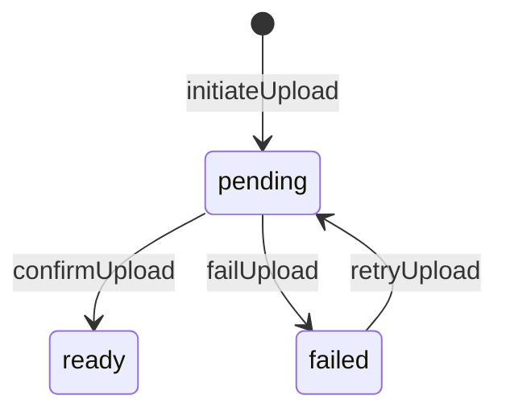

# ADR-007: File Asset & S3 Object Lifecycle

**Тип:** ADR  
**Статус:** ACCEPTED  
**Версия:** 1.1  
**Дата:** 2026-05-24  
**Волна:** W4  
**Зависит от:** [`adr_001_stack_and_runtime.md`](./adr_001_stack_and_runtime.md), [`lifecycle_models.md`](../02_domain_model/lifecycle_models.md), [`domain_invariants.md`](../02_domain_model/domain_invariants.md)  
**Связанные документы:** [`adr_index.md`](./adr_index.md), [`database_schema_v1.md`](../03_data_model/database_schema_v1.md), [`s3-upload-agent-instruction.md`](../../guidelines/nextjs/s3-upload-agent-instruction.md)

---

## Purpose

Зафиксировать **модель медиа-файлов Pulse**: единый реестр `file_asset`, хранение в **AWS S3**, lifecycle `pending` → `ready` → `failed`, политика привязки FK только после `ready`. Реализует **INV-11** и [`FM-012`](../02_domain_model/failure_modes_catalog.md#fm-012).

---

## Scope / Out of scope

**In scope:** profile photos, trainer certificates (public read), verification documents (private), upload auth, S3 object key strategy with project prefix, MVP cleanup.

**Out of scope:** image CDN transforms, virus scanning service (post-MVP hardening), multi-bucket sharding.

---

## Definitions

| Term | Definition |
|------|------------|
| `FileAsset` | Prisma model / `file_asset` table — single registry |
| `blob_pathname` | Canonical **S3 object key** (legacy column name; not Vercel Blob) |
| `FILE_UPLOAD_OBJECT_KEY_PREFIX` | Domain constant (`pulse/`) — root prefix for every object key |
| `upload_status` | `pending` \| `ready` \| `failed` |
| Client upload | Browser → S3 via presigned **PUT** URL from server |

---

## Context

ADR-001 selects **AWS S3** for user-uploaded media. Schema §9 defines `file_asset` with FKs from `trainer_certificate`, `verification_document`, profile `photo_url` pattern.

[`lifecycle_models.md`](../02_domain_model/lifecycle_models.md): File upload SM — **MUST NOT** attach verification docs until `ready`.

Upload pattern: presigned PUT + HeadObject confirm — aligned with lampto FileAsset S3 flow ([`s3-upload-agent-instruction.md`](../../guidelines/nextjs/s3-upload-agent-instruction.md)).

---

## Decision

### 1. Single registry

**MUST** — all binary uploads flow through **`file_asset`** only.

**MUST NOT** — parallel tables, direct S3 URLs without row, or `photo_url` string without asset row for new uploads.

### 2. Lifecycle



| Phase | Action |
|-------|--------|
| **initiateUpload** | Server Action: `auth()` + policy → validate mime/size → INSERT `file_asset` `pending` + server `blob_pathname` via `buildFileUploadObjectKey()` |
| **presign PUT** | Server generates presigned PUT for `blob_pathname` (TTL 300s) |
| **client upload** | Browser PUT bytes to S3 (XHR progress) |
| **confirmUpload** | Server **HeadObject** → verify size → UPDATE `ready` (or `failed`) |
| **link FK** | Certificate / verification / profile — **only** when `ready` (**INV-11**) |

### 3. S3 integration

| Policy | Value |
|--------|-------|
| SDK | `@aws-sdk/client-s3` + `@aws-sdk/s3-request-presigner` |
| Env | `AWS_IAM_USER_ACCESS_KEY`, `AWS_IAM_USER_SECRET_ACCESS_KEY`, `S3_BUCKET_REGION`, `S3_BUCKET_NAME` — **server-only** |
| Object key pattern | `{FILE_UPLOAD_OBJECT_KEY_PREFIX}{ownerUserId}/{purpose}/{uuid}` — e.g. `pulse/{userId}/certificate/{uuid}` |
| Prefix constant | `@pulse/domain` → `FILE_UPLOAD_OBJECT_KEY_PREFIX` = `pulse/` |
| Bucket access | **Private**; Block Public Access; reads via presigned GET |
| Upload TTL | Presigned PUT: **300s** |
| Read TTL | Presigned GET: **7200s** — not persisted in DB |

Key builder (domain):

```typescript
import { buildFileUploadObjectKey, FILE_UPLOAD_OBJECT_KEY_PREFIX } from "@pulse/domain";

const objectKey = buildFileUploadObjectKey(ownerUserId, purpose, randomUUID());
// → "pulse/{ownerUserId}/{purpose}/{uuid}"
```

### 4. Authorization

Every initiate/confirm/read **MUST**:

1. `auth()` from `@/auth`
2. `@pulse/policy-server` — owner trainer, or admin for moderation reads

**MUST NOT** expose AWS credentials to the client — only short-lived presigned URLs.

### 5. Validation limits (MVP defaults)

| Type | Max size | MIME |
|------|----------|------|
| Profile photo | 5 MB | `image/jpeg`, `image/png`, `image/webp` |
| Certificate | 10 MB | `image/*`, `application/pdf` |
| Verification doc | 10 MB | `image/*`, `application/pdf` |

Canonical source: `@pulse/domain` → `validateUploadRequest`.

### 6. Reads & URLs

- **`blob_pathname`** — source of truth (S3 object key with `pulse/` prefix).
- **`blob_url`** — optional stable public URL post-MVP; **MUST NOT** store expiring presigned URLs.
- Private docs: presigned GET or authenticated Route Handler proxy + policy.

### 7. Deletion & orphans

| Scenario | MVP | Post-MVP |
|----------|-----|----------|
| User deletes certificate | Unlink FK; **MAY** leave S3 object (GC later) | Cron delete orphaned keys under `pulse/` |
| `pending` stale > 24h | Manual/admin | S3 Lifecycle + scheduled DB cleanup |
| Replace profile photo | New asset row; old orphan acceptable MVP | GC old key |

### 8. Cache invalidation

After confirm → `updateTag` / `revalidatePath` per [ADR-002](./adr_002_next162_vercel_runtime_policy.md) for trainer profile routes.

---

## Rationale / Consequences

**Positive:**

- Aligns with lampto FileAsset S3 pattern — same lifecycle, portable storage.
- Project prefix (`pulse/`) isolates keys in shared or multi-app buckets.
- pending/ready gate prevents broken certificate links on partial upload.
- Presigned client upload reduces server bandwidth on Vercel functions.

**Trade-offs:**

- Three-step upload (initiate → PUT → confirm) vs direct server `put()` — needed for large PDFs and progress UI.
- Orphan `pending` rows without cron on MVP — acceptable with S3 Lifecycle on prefix.

**Downstream:** W8 `file_upload_contract.md`, trainer onboarding (P10), profile & services (P11).

---

## Rejected alternatives

| Alternative | Why rejected |
|-------------|--------------|
| Direct `put()` from Server Action only | Poor UX for large files; no client progress |
| Vercel Blob (v1.0 ADR-007) | Superseded v1.1 — S3 chosen for portability and lampto parity |
| Store files in PostgreSQL bytea | Not scalable; contradicts schema |
| Link FK at `pending` | FM-012 / INV-11 violation |
| Multiple file tables per feature | Drift; duplicate policy |
| Public bucket ACL for verification docs | Privacy leak |
| Client-supplied object keys | Path traversal / IDOR risk |

---

## Security paths

| Threat | Mitigation |
|--------|------------|
| Upload without auth | Reject at initiate + presign |
| MIME bypass | Server allowlist via `@pulse/domain`; SHOULD verify magic bytes on confirm |
| Path traversal in key | Server generates key with `buildFileUploadObjectKey()`; `isFileUploadObjectKey()` guard |
| IDOR read private doc | policy-server on read handler |
| Leaked AWS credentials | Server-only env; presigned URLs short TTL |
| Keys without project prefix | Reject in confirm/read if prefix mismatch |

---

## Concurrency & races

- Double confirm same asset: idempotent UPDATE to `ready`.
- Two uploads same purpose: latest wins in UI; old `pending` may orphan — cleanup policy above.
- Certificate link race: transaction — check `upload_status = ready` before FK INSERT.

---

## Drift risks & guards

| Risk | Guard |
|------|-------|
| FM-012 pending FK | Domain validator `validateFileAssetReadyForLink` |
| Duplicate registries | grep new `*upload*` tables |
| Vercel Blob SDK in new code | grep `@vercel/blob` |
| Missing prefix on keys | `isFileUploadObjectKey()` in confirm/read |
| Missing toast/pending UI | ui-mutation-pending rule on upload components |

---

## Acceptance criteria

- [x] Single `file_asset` registry documented
- [x] pending → ready → failed with S3 presigned pattern
- [x] INV-11 / FM-012 enforced at link time
- [x] Auth + policy on all mutations
- [x] Public vs private access for certs vs verification
- [x] `FILE_UPLOAD_OBJECT_KEY_PREFIX` in `@pulse/domain`

---

## Related documents

| Document | Relationship |
|----------|--------------|
| [`adr_001_stack_and_runtime.md`](./adr_001_stack_and_runtime.md) | S3 storage |
| [`adr_002_next162_vercel_runtime_policy.md`](./adr_002_next162_vercel_runtime_policy.md) | Cache after upload |
| [`lifecycle_models.md`](../02_domain_model/lifecycle_models.md) | File upload SM |
| [`domain_invariants.md`](../02_domain_model/domain_invariants.md) | INV-11 |
| [`s3-upload-agent-instruction.md`](../../guidelines/nextjs/s3-upload-agent-instruction.md) | Agent guide |
| [`.cursor/rules/s3-file-asset-uploads.mdc`](../../../.cursor/rules/s3-file-asset-uploads.mdc) | Cursor enforcement |
| [`../../implementation/mvp/contracts/file_upload_contract.md`](../../implementation/mvp/contracts/file_upload_contract.md) | W8 |

**Registry:** [`documentation_creation_registry.md`](../../meta/documentation_creation_registry.md) — wave W4-05

---

## Agent notes

- Object key prefix: **`FILE_UPLOAD_OBJECT_KEY_PREFIX`** in `@pulse/domain` — never inline `"pulse/"` in actions/DAL.
- Create `FileAsset` row **before** bytes hit S3.
- Verification documents: **private** bucket + presigned GET + admin/trainer policy on download.
- Migrate legacy `/api/upload` (`@vercel/blob`) to S3 presigned flow per S3 guide — do not extend Blob handler.

---

## Change log

| Date | Change |
|------|--------|
| 2026-05-23 | v1.0 — ACCEPTED; FileAsset + Vercel Blob lifecycle |
| 2026-05-24 | v1.1 — **S3** presigned PUT/GET; `FILE_UPLOAD_OBJECT_KEY_PREFIX`; Blob guide deprecated |
