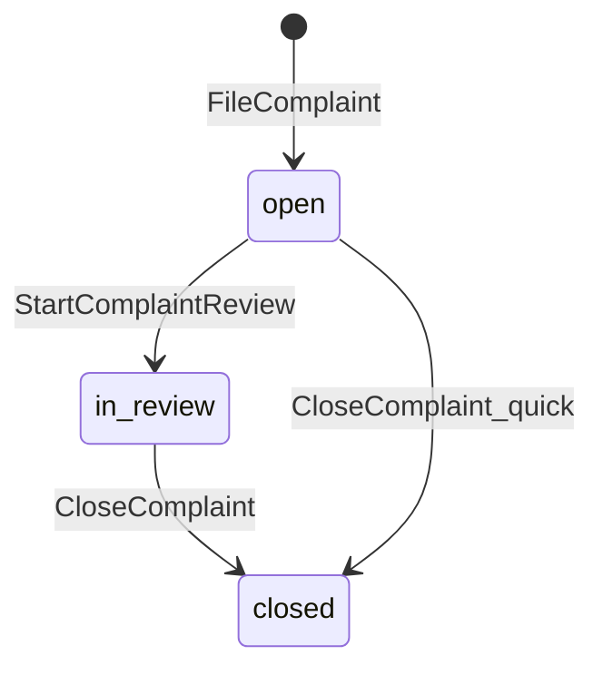

# ADR-008: Complaint Resolution Model (P20)

**Тип:** ADR  
**Статус:** ACCEPTED  
**Версия:** 1.0  
**Дата:** 2026-05-25  
**Волна:** W17  
**Зависит от:** [`lifecycle_models.md`](../02_domain_model/lifecycle_models.md), [`complaint_refund_spec.md`](../../implementation/mvp/specs/complaint_refund_spec.md), [`adr_005_mvp_booking_without_payment.md`](./adr_005_mvp_booking_without_payment.md)  
**Связанные документы:** [`adr_index.md`](./adr_index.md), [`database_schema_v1.md`](../03_data_model/database_schema_v1.md), [`P20_phase_description.md`](../../implementation/mvp/phases_tasks_descriptions/P20_phase_description.md)

---

## Purpose

Зафиксировать продуктово-техническое решение **Complaint Resolution v2**: при закрытии жалобы админ фиксирует **исход (`resolution`)** и **внутреннюю заметку**, не расширяя status machine `open | in_review | closed`. Реализация — implementation phase **P20** (после P14 quality gate).

---

## Scope / Out of scope

**In scope:** `complaint.resolution` enum; обязательность полей при `CloseComplaint`; разделение complaint vs refund; assignee из audit log; admin detail UX (context, timeline, resolve dialog).

**Out of scope:** новые complaint statuses; auto-create RefundRequest; email клиенту (P15, E-08); reopen complaint; Stripe refund API; `assigned_to_id` FK на complaint.

---

## Definitions

| Term | Meaning |
|------|---------|
| **Complaint status** | Workflow queue state: `open`, `in_review`, `closed` — unchanged |
| **Complaint resolution** | Outcome attribute set **only** when status becomes `closed` |
| **Quick close** | `CloseComplaint` from `open` without `StartComplaintReview` — allowed for spam/duplicate |
| **Assignee** | Admin who started review — derived from latest `audit_log.action = complaint.review_started` |

### Resolution enum (P20)

| Value | Product meaning |
|-------|-----------------|
| `no_action` | Reviewed; no platform action required |
| `warning_to_trainer` | Internal note; trainer moderation follow-up (manual MVP) |
| `refund_recommended` | Admin recommends refund — separate RefundRequest workflow |
| `duplicate` | Duplicate of existing complaint |
| `spam` | Invalid / abusive report |

---

## Context

P13 shipped minimal admin complaint flow: `StartComplaintReview` → banner «в работу» → neutral **Close** without outcome or notes UI. Domain already accepts optional `adminNotes` on close; wireframe W10-27 and product review identified a **decision gap** after `in_review`.

Complaint and RefundRequest remain independent lifecycles per ADR-005 (manual refunds, no Stripe on MVP).

---

## Decision

### D1 — Status machine unchanged

**MUST NOT** add statuses (`resolved`, `escalated`, etc.). Transitions remain per [`lifecycle_models.md`](../02_domain_model/lifecycle_models.md):

### D2 — Resolution required on close

On every successful `CloseComplaint`, persist non-null **`resolution`** (`complaint_resolution` enum). UI **MUST** collect resolution in resolve/close dialog (P20).

### D3 — Admin notes validation

| Resolution | `adminNotes` |
|------------|--------------|
| `duplicate`, `spam` | Optional (MAY be empty) |
| All other values | **Required**, min 10 chars, max 2000 |

Notes are **internal** (admin-only display on detail).

### D4 — Complaint ≠ Refund

- Closing with `refund_recommended` **MUST NOT** create or approve `refund_request`.
- UI **MAY** show CTA link to `/admin/refunds` when related refund exists or admin should create one manually (client flow).

### D5 — Assignee without FK

**MUST NOT** add `assigned_to_id` on `complaint` for P20. Assignee display reads **`audit_log`** where `action = complaint.review_started`. Concurrent admins: last audit entry wins for display; domain close still uses optimistic `updateMany` on status.

### D6 — Email deferred

Transactional email on close (E-08) remains **P15** post-MVP. P20 **MUST NOT** block on Resend.

### D7 — Implementation phase

Schema + UX ship in **P20** after P14 DoD. ADR-008 is prerequisite; P20 does **not** depend on P15.

---

## Rationale / Consequences

**Positive:**

- Minimal migration: one nullable-until-close column + enum type.
- Clear admin accountability: outcome + notes + existing `resolved_by_id` / `resolved_at`.
- Aligns wireframe W10-27 without over-engineering legal workflows.

**Trade-offs:**

- No structured trainer warning entity — `warning_to_trainer` is outcome label + notes only.
- Assignee race if two admins start review — acceptable MVP; document in ops.

**Downstream:** [`complaint_refund_spec.md`](../../implementation/mvp/specs/complaint_refund_spec.md) v2.0, P20 tasks, `database_schema_v1.md` §8.2.

---

## Rejected alternatives

| Alternative | Why rejected |
|-------------|--------------|
| New statuses (`resolved`, `rejected`, `escalated`) | Breaks P13 lifecycle; duplicates resolution semantics |
| Outcome only in free-text `adminNotes` | Not filterable/reportable; weak UX validation |
| Auto-approve refund on `refund_recommended` | Violates separate refund lifecycle; no Stripe on MVP |
| `assigned_to_id` FK on complaint | Extra migration + reassignment rules; audit log sufficient for P20 |
| Reopen `closed → open` | Post-MVP; needs new use-case and client notification |

---

## Security paths

| Scenario | Mitigation |
|----------|------------|
| Non-admin closes complaint | `@pulse/policy-server` `assertCanManageComplaint` |
| Client sets resolution | Server-only mutation; admin routes proxy-gated |
| PII in admin notes | Admin-only read; not exposed on public routes |

---

## Concurrency notes

- Two admins close same complaint: second gets `ALREADY_PROCESSED` — existing pattern.
- Two admins start review: both may audit; status `in_review` idempotent; assignee display = latest audit.

---

## Acceptance criteria

- [ ] D1–D7 documented and linked from spec v2 + P20
- [ ] `complaint_resolution` enum in DDL canon
- [ ] CloseComplaint requires resolution in domain schema
- [ ] Rejected alternatives recorded
- [ ] adr_index updated

---

## Related documents

| Document | Relationship |
|----------|--------------|
| [`complaint_refund_spec.md`](../../implementation/mvp/specs/complaint_refund_spec.md) | UX + actions v2 |
| [`lifecycle_models.md`](../02_domain_model/lifecycle_models.md) | Complaint SM |
| [`database_schema_v1.md`](../03_data_model/database_schema_v1.md) | DDL |
| [`email_notifications_contract.md`](../../implementation/mvp/contracts/email_notifications_contract.md) | E-08 hook (P15) |
| [`P20_tasks.md`](../../implementation/mvp/tasks/P20_tasks.md) | Implementation checklist |

**Registry:** [`documentation_creation_registry.md`](../../meta/documentation_creation_registry.md) — wave W17

---

## Agent notes

- Resolution labels from `@/lib/messages`; API values from `@pulse/domain` `COMPLAINT_RESOLUTION`.
- Do not conflate badge «На рассмотрении» (`in_review`) with closed outcome badges.
- Context panel on detail: read-only booking/refund snippets — no new admin booking route on P20.

---

## Change log

| Date | Change |
|------|--------|
| 2026-05-25 | v1.0 — ACCEPTED; resolution attribute + P20 scope |
