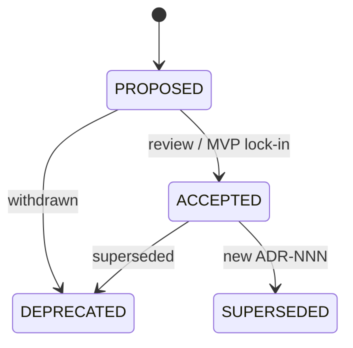

# Architecture Decision Process — Pulse

**Тип:** Guide  
**Статус:** Canonical  
**Версия:** 1.0  
**Дата:** 2026-05-23  
**Волна:** W1  
**Зависит от:** [`adr_index.md`](./adr_index.md), [`ai_first_project_methodology.md`](../../meta/ai_first_project_methodology.md)  
**Связанные документы:** [`documentation_creation_registry.md`](../../meta/documentation_creation_registry.md), [`architecture_master_index.md`](../architecture_master_index.md)

---

## Purpose

Фиксирует **когда** и **как** команда и AI-агенты создают, обновляют и принимают ADR в Pulse. Цель — предотвратить «тихие» архитектурные изменения в коде без записи решения и без учёта ADR-001/002 и реестра документации.

---

## Scope / Out of scope

**In scope:** триггеры ADR, шаблон документа, статусы, связь с contracts/PRD, процесс backlinks, верификация Context7 для runtime/auth/data.

**Out of scope:** code review policy, sprint planning, выбор продуктовых фич (см. PRD `mvp_scope.md`).

---

## When to write an ADR

| Trigger | Example | Action |
|---------|---------|--------|
| Новый внешний сервис | Замена Resend на SES | Новый ADR + update ADR-001 consequences |
| Изменение границ пакетов | Policy в `proxy.ts` | ADR или правка ADR-002 + contract |
| Auth/session model | OAuth вместо Credentials | Новый ADR; deprecate prior auth ADR section |
| Booking/payment boundary | Stripe на MVP | ADR-005 amendment — **отклонено** для MVP |
| Jobs / idempotency | Очередь вместо Cron | ADR-001 amendment + ADR-006 |
| Pin major framework | Next 17 | Новый ADR; supersede ADR-002 |

**MAY** — локальное решение в одном модуле без cross-package impact — достаточно contract или guideline, без ADR.

**MUST NOT** — менять ACCEPTED ADR «молча» в коде; либо новый ADR с supersede, либо bump ADR version + Change log.

---

## ADR document template

Каждый ADR **MUST** использовать структуру:

```markdown
# ADR-NNN: Title

**Дата:** YYYY-MM-DD
**Статус:** PROPOSED | ACCEPTED | DEPRECATED | SUPERSEDED
**Проект:** Pulse (fitapp)

## Context
## Decision
## Rationale / Consequences
## Rejected alternatives
## Related documents
## Agent checklist
```

Для security/auth ADR **MUST** включать rejected alternatives и agent checklist (см. registry §2.3.3).

---

## Status lifecycle



| Status | Meaning for agents |
|--------|-------------------|
| **PROPOSED** | Не блокировать эксперимент в ветке, но **не** считать каноном для production checklist |
| **ACCEPTED** | Обязателен к соблюдению; конфликт с кодом = баг |
| **DEPRECATED** | Не применять; ссылка на замену |
| **SUPERSEDED** | Читать только исторический контекст; follow replacement ADR |

MVP lock-in (ADR-001, ADR-002) — сразу **ACCEPTED** без ожидания post-MVP review.

---

## Workflow (agent + human)

1. **READ** [`adr_index.md`](./adr_index.md) и зависимые ADR.
2. **CHECK** lampto analog — [`lampto_project_reference.md`](../../reference/lampto_project_reference.md); адаптировать под Vercel/ADR-001.
3. **Context7** (обязательно для runtime/auth/db ADR): Next.js `/vercel/next.js/v16.2.2`, Auth.js `/websites/authjs_dev`, Prisma `/websites/prisma_io` — см. registry §2.7.
4. **DRAFT** `adr_NNN_*.md` в `docs/prds/07_governance/`.
5. **UPDATE** [`adr_index.md`](./adr_index.md) — строка в registry + Change log.
6. **BACKLINKS** — `architecture_master_index.md`, затронутые PRD/contracts (planned → link).
7. **VERIFY** checklist § Acceptance criteria.

Одна сессия: **один ADR** или правка одного ACCEPTED ADR (не пакет из W4 без запроса).

---

## Relationship to other document types

| Type | When ADR wins | When contract/PRD wins |
|------|---------------|------------------------|
| **ADR** | Stack, hosting, framework pin, cross-cutting policy | — |
| **Contract** | — | Module I/O, idempotency, policy touchpoints |
| **PRD** | — | User-visible behavior, MVP scope |
| **Cursor Rules** | — | Enforcement в коде; не дублировать ADR текстом |

Иерархия при конфликте: Cursor Rules → AGENTS.md → Contracts → PRD → … → ADR (см. methodology §3.2). **ADR выше interim `default_docs/`**, ниже contracts для module behavior.

---

## Requirements

1. **MUST** — после создания ADR обновить `adr_index.md` в той же сессии.
2. **MUST** — material change: bump **Версия** в front matter ADR + Change log.
3. **SHOULD** — PROPOSED ADR помечать в phase description как blocker, если фаза зависит от решения.
4. **MUST NOT** — принимать решение против ACCEPTED ADR без нового ADR или explicit user override в задаче.

---

## Acceptance criteria

- [ ] Триггеры ADR перечислены и однозначны
- [ ] Шаблон и статусы согласованы с существующими ADR-001/002
- [ ] Указана интеграция с registry waves и Context7
- [ ] `adr_index.md` и methodology ссылаются на этот процесс

---

## Related documents

| Document | Relationship |
|----------|--------------|
| [`adr_index.md`](./adr_index.md) | ADR registry |
| [`ai_first_project_methodology.md`](../../meta/ai_first_project_methodology.md) | AI-first cycle; doc hierarchy |
| [`documentation_creation_registry.md`](../../meta/documentation_creation_registry.md) | Planned ADR waves W4 |
| [`adr_001_stack_and_runtime.md`](./adr_001_stack_and_runtime.md) | Example ACCEPTED ADR |
| [`adr_002_next162_vercel_runtime_policy.md`](./adr_002_next162_vercel_runtime_policy.md) | Example ACCEPTED ADR |

**Registry:** [`documentation_creation_registry.md`](../../meta/documentation_creation_registry.md) — wave W1-02

---

## Agent notes

- Ошибка «скопировал lampto Netlify config» — нет ADR; исправление = ADR-001, не правка PRD.
- `middleware.ts` в новом коде без migration ticket — нарушение ADR-002, не повод для нового ADR если можно исправить код.
- Post-MVP фичи (Stripe, Daily.co) — **не** новый ADR на MVP без явного scope change; см. [`post_mvp_deferrals.md`](../01_product_scope/post_mvp_deferrals.md).

---

## Change log

| Date | Change |
|------|--------|
| 2026-05-23 | v1.0 — initial decision process |
